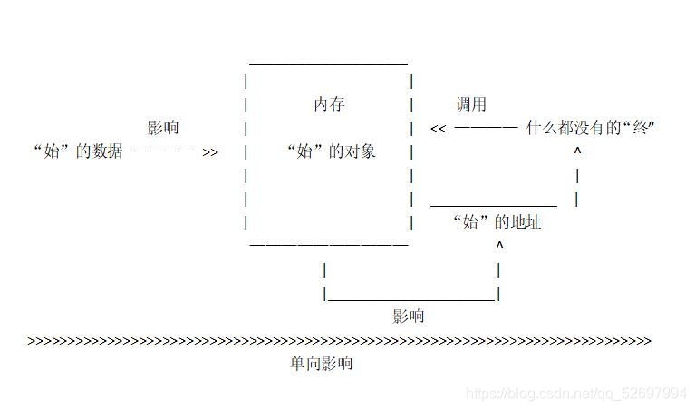

# JavaScript数据类型

@[TOC](文章目录)

<hr style=" border:solid; width:100px; height:1px;" color=#000000 size=1">

## 前言、数据分类的重要性
不同类型的数据占用的存储空间不同，为方便将数据按所需内存大小分类，以充分利用存储空间，定义出了各种数据类型。
JS是一种弱类型语言，在不需要提前声明变量的数据类型，在程序运行过程中，数据的类型会被自动确定，相同的变量在使用时也能被当作不同的类型使用。数据类型的分类方法多样，这里我用 简单数据类型 和 复杂数据类型 来分类说明。

# 一、简单数据类型
这里我把简单数据类型分为基本的类型和特殊类型。
## 基本类型
接下来就是给最基础的数据分类：数字型、字符串型、布尔型
### 1.数字型
数字型数据的值有两种——整型值、浮点型值
整型值顾名思义就是整数作值，这里补充一下各种进制下整型值的写法：
在书写八进制数时，应该在书写的整型数前加“0”以表示该数值为八进制数。
八进制数序列范围为0-7，书写时：

```javascript
num3 = 03  //对应十进制数3
num6 = 06  //对应十进制数6
```

在书写16进制数时，应该在书写的整型数前加“0x”以表示该数值为十六进制数。十六进制数序列范围0-9和A-F

```javascript
num1 = 0xB  //对应十进制数11
num2 = 0x6  //对应十进制数6
```
在浏览器里输出这些数值时默认转换为10进制输出。

浮点型值，就是带小数点的数字了。

数字型值里的最大值Number.MAX_VALUE
除无穷大"Infinity"，任何一个数字型的值都将小于它
数字型值里的最大值Number.MIN_VALUE
除无穷小"-Infinity"，任何一个数字型中的值都将大于它
判断某变量输出的值是否为数字：

```javascript
console.log(inNaN(变量))
```
输出值为true则为非数字型，false则为数字型
### 2.字符串型
这一类型的值全部都要加引号，单双引号皆可，可以反复嵌套，数字型的值加上引号也将变为字符串型（弱类型语言）。这里最好使用单引号，因为HTML结构中多使用双引号，各种转义符在引号中不能生效，会被直接判定为内容来直接输出。
字符串之间可使用加号来进行拼接。

### 3.布尔型
布尔型值有两个：true和false。
经常跟判定语句用在一起的值....
## 特殊类型
我把undefined和unll单独作为一组，因其较为特殊
undefined：变量已被声明，但是未赋值，无值。
null：有值，但是值为空。
# 二、复杂数据类型
也叫引用数据类型，包括对象型、数组型、函数型。
先简单说一下他们的基本结构，不多扩展了....
## 1.对象型
JS对象，是一组自定义属性与其值的集合。
使用对象字面量来创建

```javascript
var xxx ={
       name:xxx,
       age:120,
       hobby:xx
       }
```
使用 对象名.属性名 的形式或 对象名['属性名']来调用里面的自定义属性，在php中会用到。
或使用“new Object()”

```javascript
var xxx = new Object();
xxx.属性 = '值';
xxx.属性 = '值';
xxx.属性 = '值';
xxx.自定义方法名 = function() {
    //函数体
    }
```
使用xxx.方法名()来调用方法，其他属性的调用同上。
## 2.数组型
一组数据的集合，每个数据被称为元素，这些元素可以是任意类型的数据。与对象相同的是可以用字面量和New方式来创建。

```javascript
var xxx = [1 , 'my' , true]
var xxx = new Array(1 , 'my' , true)
```
数组中的元素由左向右有着0123...这样的索引号，提取元素时可以使用：数组名[索引号]，也因此不能只在数组里写一个元素。
## 3.函数型
可将一部分代码封装并支持在需要时直接调用，不调用不会执行。

```javascript
function 自定义名(形参) {
          //函数体
       }
    自定义名(实参)  //调用
```

## 三、简单和复杂数据类型的区别
### 简单数据类型
占用空间固定，存储在栈里，有各自开辟的栈内存，方法一结束就销毁自己的那块内存。操作的是值本身。
简单(基本)数据类型是按值访问的，因为可以直接操作保存在变量中的实际值，单看有些难理解。
常见的例子就是用一个变量a给变量b赋值

```javascript
var a = 4
var b = a
b = 0
console.log(b);  //输出0，a依然为4
```

我觉得这有些类似于JQuery对象拷贝里的浅拷贝方式，这是JQuery进行对象拷贝时对于复杂数据类型的处理办法，仅copy一个“始”的地址给“终”（方便分清拷贝的双方，我引入了始和终、内存的内和外）。
“始”在内存外的数据会在内存中开辟一个空间来存放“始”的对象，两者关系是仅内存外影响内存内；“终”会请求调用“始”内存内的对象，但是“始”的对象不给看，仅拿出一个地址，这个地址会实时的更新，因为它连接着“始”内存内的对象，但是这个地址就只能看看，它没法对内存内“始”的对象做任何事，整个就是个单向影响的关系。见下图...


换成数据类型的话复制出去的不是一个“始”的地址，而是变量“始”值的复制品。两个变量分别存储在各自的内存里，所以不会互相影响。
### 复杂数据类型
占用空间不固定，保存在堆中。堆内存中的对象使用完后不会被立刻销毁而是保留待用，直到没有任何变量引用这个对象才会被销毁。操作的是指向对象的指针。
（是对值的操作会影响内存里的对象，“牵一发而动全身”，共存于堆中，变量之间存在相互影响的关系）
让我想到JQuery里的深拷贝，但是这些数据之间即使有复制操作，完成后也是同步改变的，而深拷贝完成后便不再有联系，相同点是都对内存里的对象进行了操作。
以下是栗子：

```javascript
var a = [m , u , i];
var b = a;
b[2] = 0;
console.log(a) //[m , u ,0]
```

# 总结
简单数据类型（值类型）直接赋值不影响原数据，复杂数据类型（引用类型）直接赋值会导致原数据同步改变。