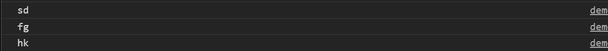
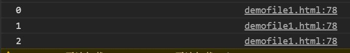

## 一、for in遍历
这个方法还可以遍历数组，就放在一起写了。
在遍历对象时：
```javascript
      var file = {
        sd:"dskdn",
        fg:"dadfc",
        hk:"iel"
      }
        for (var k in file) {
          console.log(k);//得到属性名、方法名
          console.log(file[k]);
        }
```
下面是遍历对象时输出k的结果，输出属性名：


但在遍历数组时，输出结果有所不同：
```javascript
    var file = [na="www", hobby="ggg", bf="ddd"]
      for (var k in file) {
        console.log(k);//得到数组中属性的索引号0、1、2
        console.log(file[k]);//得到属性值、方法值www等
```
下图是遍历数组时输出k的结果，仅仅输出了索引号：

