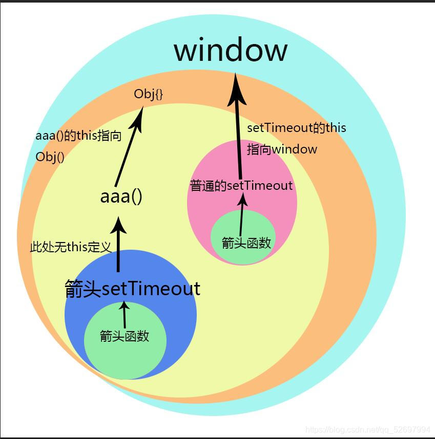

@[TOC](文章目录)

<hr style=" border:solid; width:100px; height:1px;" color=#000000 size=1">

# 一、熟悉箭头函数
箭头函数是ES6新增的语法,当准备把函数作为参数传递时,用箭头函数看起来会比较简洁,简洁,但是可读性略差(尤其是它被省略的根本不像个函数的时候).
## 1.传一个参数

```javascript
  const 函数名 = 参数 => {
    xxx函数体
    xxx函数体
  }
```
或

```javascript
  const 函数名 = (参数) => {
    xxx函数体
    xxx函数体
  }
```

## 2.传多个参数

```javascript
const 函数名 = (参1,参2) => {
xxx函数体
xxx函数体
}
```
<hr style=" border:solid; width:100px; height:1px;" color=#000000 size=1">

更离谱的是如果函数体只有一行,你可以不写大括号.
导致有时候会写出来一些看着不太像函数的函数:

```javascript
aaa = num => num * num
```

```javascript
render: h => h(App)
```

# 二、this指向问题
箭头函数的this指向与用其他写法的函数不同

<strong>
箭头函数中的this引用的是距离最近的作用域中的this,从this的所在处向外层层寻找,直到有this的定义.
</strong>

```javascript
        const obj = {
            aaa() {
                setTimeout(function () {
                    console.log(this);
                })
                setTimeout(() => {
   /* 由自身所在的作用域向外寻找最近的作用域,
      是aaa(),其中的this指向obj{}; */
                    console.log(this);
                })
            }
        }
```

```javascript
        const obj2 = {
            aaa() {
            //aaa(),它的this指向obj2;
                setTimeout(function () {
                //setTimeout内部的this永远指向window;
                    setTimeout(function () {
                        console.log(this);//window
                    })
                    setTimeout(() => {
                        console.log(this);
/* window,向外寻找,最先找到的setTimeout的作用域,
而这个作用域里的this永远指向window. */
                    })
                })

                setTimeout(() => {
                    setTimeout(function () {
                        console.log(this);//window
                    })
                    setTimeout(() => {
                        console.log(this);
/* obj,向外找到setTimeout,但是是一个箭头函数,
其中没有this,再向外寻找,aaa()的this,即obj */
                    })
                })
            }
        }
```
为了方便大家看懂最后一个栗子,我拿PS画了个图.....
渣技术力,问就是PS课都拿来写代码了.....
图中左右两个箭头分别对应第2和4个箭头函数


<hr style=" border:solid; width:100px; height:1px;" color=#000000 size=1">

# 总结
