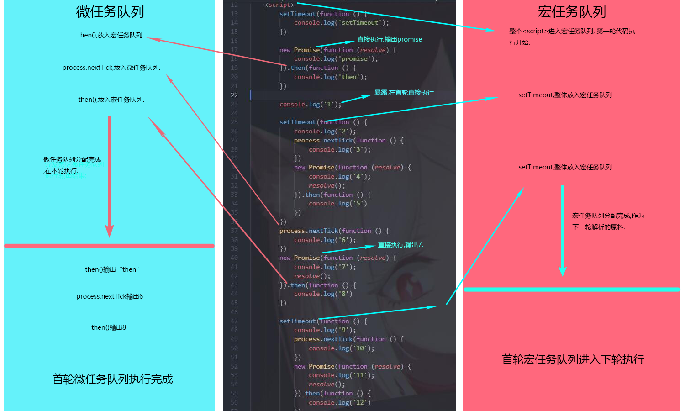

# 尝试理解JavaScript中的宏任务与微任务

@[TOC](文章目录)

# 前言
JS是一门单线程语言,这意味着正常执行的话所有任务堆在一起需要排队,当然,也就像细水管里的小球一样,一个流不出去,后面的都得等着.
这未免不太不合理.
主线程完全可以把目前无法执行或者不必执行的任务先挂起,就像堵车的时候把最前面那个慢吞吞的车给掀了,让大家先过.

等到这个被挂起的程序能执行了也该执行了,再把它放下来.
这是同步任务和异步任务,但其实异步任务还可以细分为宏任务和微任务.

JavaScript中的诸多异步任务在执行时会被分拣入两条队列,即宏任务队列和微任务队列,分配到这两条队列中的各个任务会依照自己在队列中的顺序被依次执行,直到队列中的任务被拣取完成.

# 一、分拣原则
| 异步操作 | 分配队列 |
|--|--|
| setTimeout | 微任务 |
| setInterval | 微任务 |
| setImmediate | 微任务 |
| Ajax | 微任务 |
| DOM事件 | 微任务 |
| < script> | 微任务 |
| process.nextTick | 宏任务 |
| MutationObserver | 宏任务 |
| Promise | 宏任务,异步编程解决方案,本身是同步,会被立即执行,但它的回调函数是异步. |
| then  | 宏任务,Promise的回调函数 |
| catch  | 宏任务,Promise的回调函数 |
| finally | 宏任务,Promise的回调函数 |
| async await | 宏任务,await后的语句会等待拿到结果. |

# 一、图文示例
我做了个图,或许能更加直观一些...?
(我后面看了一下,图里有些表达不明确的地方,如果你看的时候文本和图例发生冲突,你还是以我的文本为主,好吧?)

正常任务(也就是本文中宏任务,其实宏任务和正常的任务队列并不是下图中挑选的关系.)放到下一轮事件循环，微任务追加到本轮事件循环,能立即执行的任务就立即执行.

基本流程就是首次执行先遇到< script>这么个宏任务;

然后把整段代码走一遍,遇到被方法包着的代码就先把最外层剥除剩下的扔给下一轮.

然后微任务放到微任务队列,能立即执行就立即执行.

剩下的放到宏任务队列等第二轮执行,这样第一轮的宏任务就做完了.

之后开始第一轮的微任务,把分拣出来的微任务都执行完.

这是首轮执行:

到了第二轮之后会开始执行上一轮剩下的代码,这里其实首轮剩下的所有代码在第二轮都会作为第二轮的宏任务素材,
图上表达的不够明确,这图算是有利有弊吧.

第一轮执行就是从所有代码里挑微任务和能立即执行的任务出来执行,然后剩下不能立即执行的就都(加入宏任务队列)剥掉一层放到下一轮,必须要剥一层,不然永远也执行不完的.

这样都扔到下一轮了,就可以完美的重复第一轮的操作了:
再从头执行一次,把剥完一层壳之后露出来的微任务放到微任务队列,可立即执行任务马上办掉,剩下的剥一层壳再扔给下一轮.
然后把这一轮的微任务处理掉.

这是第二轮执行:

不过这个图例就只有两轮,就没有第二轮剥壳扔下一轮这一步了...

# 总结
努力尝试理解大佬的高深思维中...
这是我最近的一点成果,如果帮到了你,我很高兴. 
如果你发现这篇文章存在错误,也欢迎在评论区告诉我.