@[TOC](文章目录)

---

# 前言
经常被坑, 但是我人又傻, 记不住 唉.
还是花点时间整理一下吧.

最后总结部分我总结了两句话, 懒得看例子的话你可以直接去看那两句总结;

# 规划方案
考虑到某些时候表达式中两值互换位置会发生结果不同的情况, 所以轮流使用单一类型与不同类型进行运算, 确保能覆盖到两值相同, 位置不同的情况.
复杂数据类型我觉得应该分为空和非空来进行测试, 比如空对象和非空对象这样.
字符串类型应该分为数字类型字符串(比如"3")和字符类型字符串(比如"text");
然后函数字符串布尔字符串之类的测试过了都是直接拼接, 我觉得没必要了.

使用该函数进行结果输出;
```javascript
function comput(par1, par2) {
  console.log(par1 + "和" + par2 + "的运算:")
  console.log("加: " + (par1 + par2));
  console.log("减: " + (par1 - par2));
  console.log("乘: " + (par1 * par2));
  console.log("余: " + (par1 % par2));
  console.log("双等: " + (par1 == par2));
  console.log("_______________________________")
}
```
---
# String
字符串和其他类型进行运算;
可能是最容易出现的吧, 我个人经常遇到字符串和各种奇葩的东西放在一起运算的情况.

### Number
字符串和数字

我们先不看加法, JS中加法运算符具有特殊性, 因为JS里拼接字符串使用"+"进行, 可以看到的是, 不论数字加字符串还是字符串加数字(即便是"4"那种字符串型数字), 结果都会是按照字符串来处理, 以字符串拼接处理的优先级太高.
就其他运算符来看, 不论如何运算, 表达式里的String都会尝试向Number类型转换, 然后再完成运算, 即便String不能转换为Number, 它也不能再以原本姿态参与运算, 而是以转换Number失败的形态——NaN来参与运算.

```javascript
comput("string", 3);
```
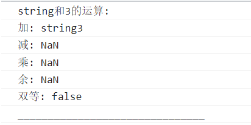
而对于能够转换为Number的字符串, 就可以成功转为Number参与运算得到Number.
```javascript
comput("6", 3);
```
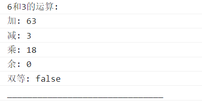

---

### Boolean
可以看出Boolean类型也会优先转换自身为Number类型再参与运算, 但是加法依然会优先执行字符串拼接操作, 将两者都转为字符串然后拼接.

对于其他运算方法, 在String不能转换为Number的情况下, Boolean又必能转为数字, 所以将会得到NaN.
```javascript
comput("string", true);
```
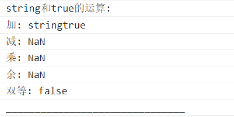
而对于其他运算方法, 在String可以转换为Number的情况下, 由于true会转换为1, false会转换为0, 所以会得到Number.
```javascript
comput("6", true);
```
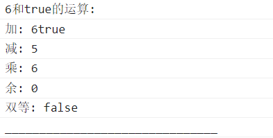

---

### undefined
加法依旧是特殊的, 在其他运算符情况下, undefined也会先尝试将自己转换为Number, 但是很遗憾它自己被Number()完之后就是个NaN.
所以碰谁谁NaN.

```javascript
comput("string", undefined);
```
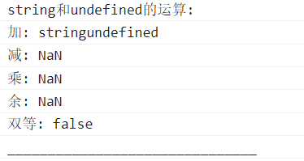
对于可以转为Number的String, 也会优先进行类型的转换, 但是由于undefined会稳定的转为NaN, 所以依旧是无济于事的NaN了.

```javascript
comput("6", undefined);
```
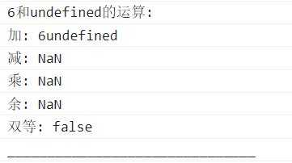

---

### null
String和null
String当然还是分为可转换为Number和不可转换Number的类型, 并且也会向Number类型转换可预计的分为Number和NaN, 但是null, 现在不知道会怎么转换, 或许是String类型的"null", 或许是Number类型的0.

```javascript
comput("string", null);
```

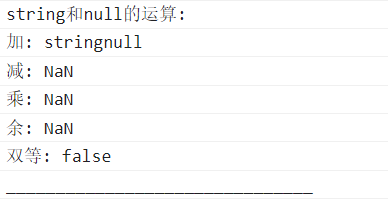

```javascript
comput("6", null);
```
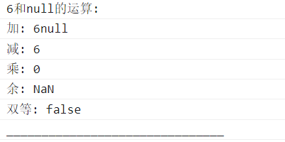

---

### Array
String和Array,
空Array会被转换为空字符串, 而非空数组会被去掉括号转换成字符串, 这样实际进行的其实是两个String的运算.

```javascript
comput("string", []);
```
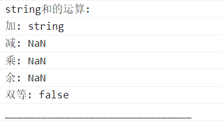

这种情况下String可以转换为Number, 根据乘法和减法的区别来看, 空字符串在运算时转换为了Number类型值0;

```javascript
comput("6", []);
```
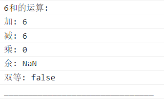

排除加法, 这种情况下String无法成功转为Number, 结果会是NaN和String的运算. 

```javascript
comput("string", [1, 2, 3]);
```
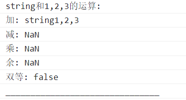
对于可转为Number类型的String, 
```javascript
comput("6", [1, 2, 3]);
```
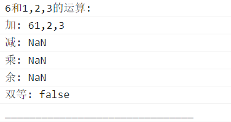

---

### Object

```javascript
comput("string", {});
comput("6", {});
```


```javascript
comput("string", { name: "baiX" });
comput("6", { name: "baiX" });
```
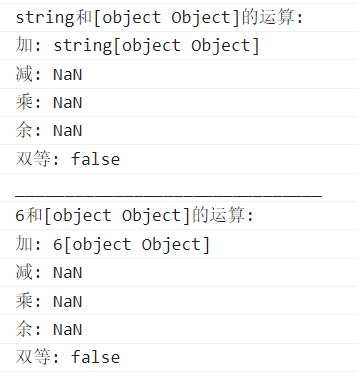

---

### Function

```javascript
comput("string", function () { });
comput("6", function () { });
```
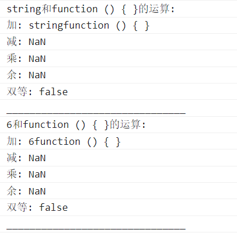
工程量略大啊...
感觉做了一个错误的选择哈哈...

---

# Number
数字和其他类型进行运算;
### String
数字和字符串
字符串和数字运算时, 数字在前会被判定为要拼接字符串
```javascript
comput(3, "string");
comput(3, "3");
```
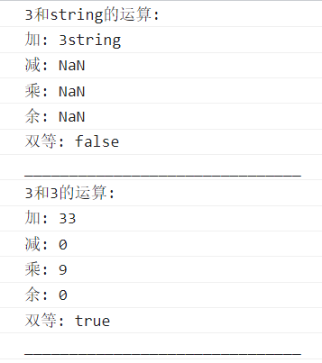

---

### Boolean
```javascript
comput(3, true);
comput(3, true);
```
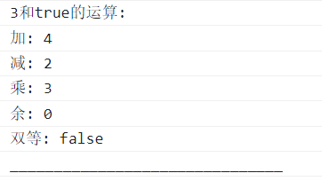

---

### undefined
```javascript
comput(3, undefined);
comput(3, undefined);
```
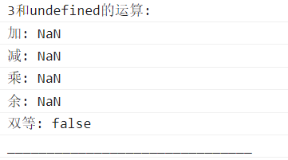

---

### null
```javascript
comput(3, null);
comput(3, null);
```
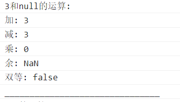

---

### Array

```javascript
comput(3, []);
```
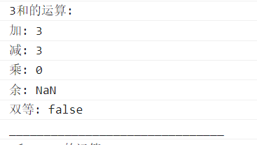
```javascript
comput(3, [1, 2, 3]);
```
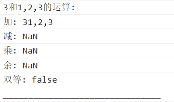

---


### Object
```javascript
comput(3, {});
comput(3, { name: "baiX" });
```
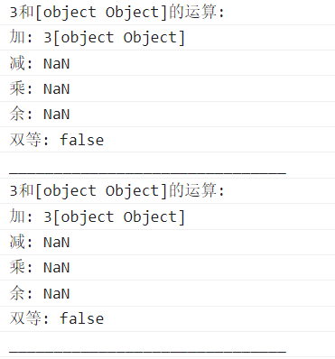

---

### Function

```javascript
comput(3, function () { });
```
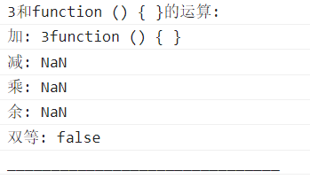

---

# Boolean
布尔值和其他类型进行运算;

### String
布尔值和字符串;
```javascript
comput(true, "string");
comput(true, "3");
```
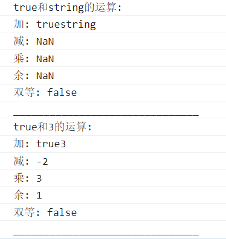

---

### Number
布尔值和数字
```javascript
comput(true, 33);
```
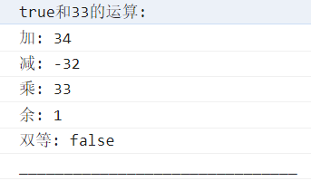
undefined, null, Boolean在和Number类型进行运算时, 加法运算不会进行拼接字符串操作.

---

### undefined
布尔值和undefined;

```javascript
comput(true, undefined);
```
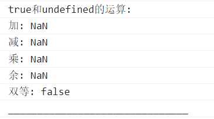
### null
布尔值和null;

```javascript
comput(true, null);
```
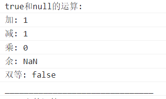

---

### Array
布尔值和Array
```javascript
comput(true, []);
comput(true, [1, 2, 3]);
```
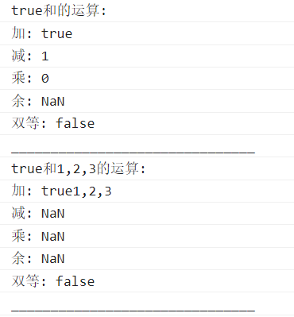

---

### Object
布尔值和对象;
```javascript
comput(true, {});
comput(true, { name: "baiX" });
```
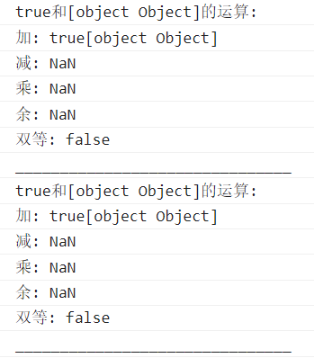

---

### Function
布尔值和函数;
```javascript
comput(true, function () { });
```
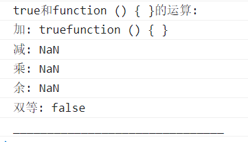

---

# null
null和其他类型;

### String
null和字符串


```javascript
comput(null, "string");
comput(null, "3");
```
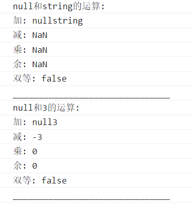

---

### Boolean
null和布尔值
Null进行Number类型转换为0, true进行Number类型转换为1.
```javascript
comput(null, true);
```
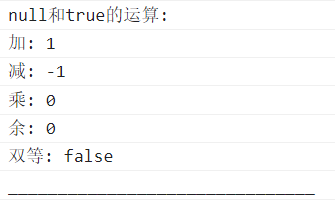

---

### undefined
null和undefined

```javascript
comput(null, undefined);
```
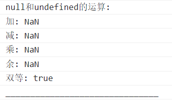

---

### Number
null和数字
加法不搞特殊了, null会向Number类型转换.

```javascript
comput(null, 33);
```
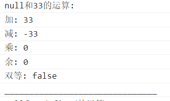

### Array
null和数组

```javascript
comput(null, []);
comput(null, [1, 2, 3]);
```
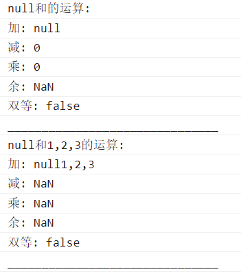

---

### Object
null和对象

```javascript
comput(null, {});
comput(null, { name: "baiX" });
```
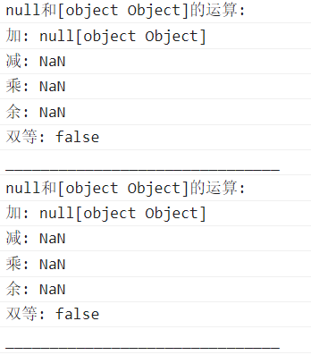

---

### Function
null和函数
加法依旧优先执行字符串拼接运算.
对于其他运算符, null会优先向Number方向转换为0, 根据官方说明, Function会优先转换为NaN;
而Number类型的0无法影响到NaN, 最终结果仍旧只能为NaN.

```javascript
comput(null, function () {});
```
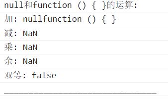

---

# undefined
undefined和其他类型
我有一个猜想, undefined会不会是自动转换为和自己运算的值的类型, 比如和Boolean算就转换为Number(不大对啊, 那和String加不就该NaN?要不先不看String).

### String
加法特殊.
与 String 一起执行加法时undefined优先转换为String, 而不是Number.
所以加法会得到完好的String"undefined".
而对于其他运算方法, undefined依旧优先转为Number.
```javascript
comput(undefined, "string");
comput(undefined, "3");
```

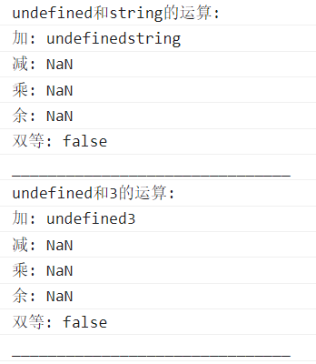

---

### Boolean
根据结果来看, undefined和布尔值运算的时候, 无论何种运算, 都会优先尝试将自己转换为Number(结果会是NaN). 而true也会优先尝试把自己转换成Number.
所以下面都是NaN.

```javascript
comput(undefined, true);
```

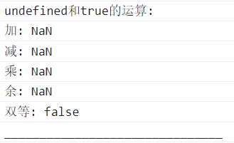

---

### Number
undefined和数字运算, undefined优先将自己转为Number, 而Number类型本身不发生转换, 所以将会得到NaN.
PS: 加法运算: 因为NaN属于Number类型, 所以加法运算实质上是Number与Number的运算, 不会发生字符串拼接的情况.

```javascript
comput(undefined, 33);
```

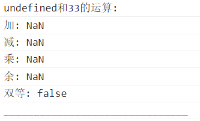

---

### null
undefined和null运算, 根据结果来看双方至少有一方被转换为NaN, null如果向Number转换将会得到Number类型0:

```javascript
console.log(Number(null))
```
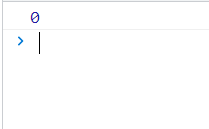

那么仅有可能是undefined的转换产生了NaN.
而NaN + "null"的结果又为"NaNnull":
所以null必不可能转为了String.

```javascript
console.log(NaN + "null");
```
那么测试一下可以发现, 得到NaN无非两种情况: null不转换, 或者null转为Number, 但是已知undefined会转换为Number类型的NaN, NaN拿来测试总是不太好用的, 我们可以用同为Number类型的其他值与null相加进行测试:

```javascript
//就用9吧
console.log(null + 9) //9
```
结果会是9, 那么也就是说null进行了向Number类型的转换, 成为了Number类型的值0;
 
那么我觉得这可以证明, null与undefined运算时, 两者都会进行向Number类型的转换.
 
```javascript
comput(undefined, null);
```
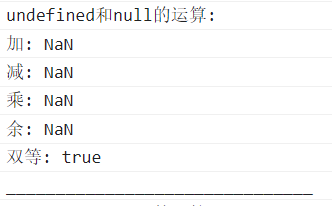
这样的话结果也说得通.

---

### Array
undefined和数组
运算中, 数组会被转换为字符串, 而空数组将会被转换为空字符串:
加法依旧被识别为拼接字符串.

```javascript
console.log(typeof String([]));
console.log(String([]));
```

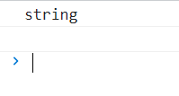

```javascript
comput(undefined, []);
comput(undefined, [1, 2, 3]);
```
而undefined依旧会向Number转换成为NaN, String与NaN的运算除了被识别为拼接字符串的加法, 其他都将被计算为NaN, 这样结果就说的通了.

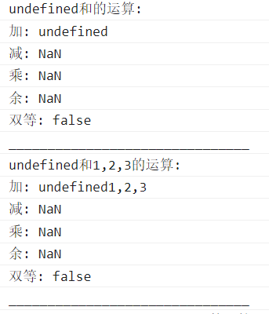

---

### Object
undefined和对象
对象会向着String方向转换, 那么其实到了这里也可以发现一个规律: "undefined只要与字符串进行加法运算, 那么必是以拼接字符串的方式得出结果.", 你可以往上回顾一下前面几个undefined与其他类型加法的示例.

```javascript
comput(undefined, {});
comput(undefined, { name: "baiX" });
```
可见的是, 不论Object是否为空, 解析出的字符串都是一样的(话说从后端拿到的Object直接输出也是这样的, 有时候不太方便.).
那么就相当于是进行Number类型的NaN和普通String的运算了, 结果也可以预计.
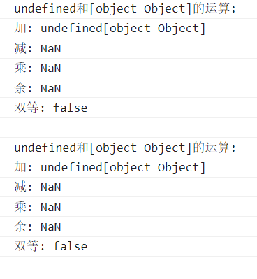

---

### Function
undefined和函数
加法情况下Function肯定会转换为String了.
但是Function在除加法以外的运算中将进行何种转换是不好预计的, undefined会转换为NaN, 那么Function不论向Number方向还是String方向转换都不会干扰得出NaN的结果.
官方给的Function隐式转换方向是Number方向, 也就是会将自身转换为NaN.

```javascript
comput(undefined, function () { });
```

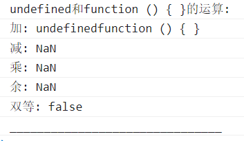
还是不太理解为何加法不会发生Number类型转换, 如果底层本就如此....

---

# Array
数组和其他类型之间的运算;

### String
数组和字符串
空数组和数组都将向String转换并且去除括号, String会向Number方向转换, 额, 这一切依旧是建立在非加法的基础上.
在加法情况下, Array依旧会向String方向转换, 空Array会被转换为空字符串, 并且String即便可转换为Number, 在加法中也将仅仅进行拼接字符串操作, 即String + Number = String.

```javascript
comput([], "string");
comput([1, 2, 3], "string");
comput([], "3");
comput([1, 2, 3], "3");
```
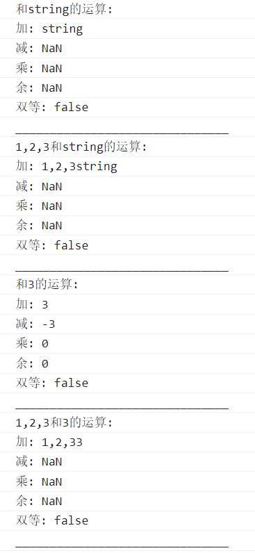

---

### Boolean
数组和布尔值
加法依旧特殊.
非加法情况下, 数组将优先转换为字符串, Boolean优先转为Number.
```javascript
comput([], true);
comput([1, 2, 3], true);
```
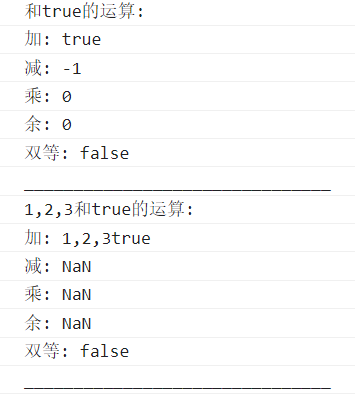

---

### Number
数组和数字

```javascript
comput([], 33);
comput([1, 2, 3], 33);
```
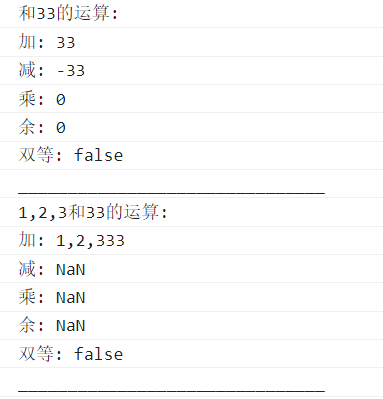

---

### null
数组和null

```javascript
comput([], null);
comput([1, 2, 3], null);
```
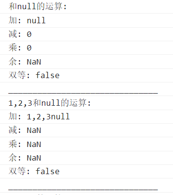

---

### undefined
数组和undefined
数组向String方向转换, undefined向Number方向转换, 加法例外, 都以字符串形式进行.
```javascript
comput([], undefined);
comput([1, 2, 3], undefined);
```
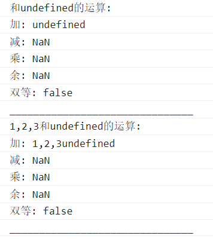

---

### Object
数组和对象
这个没什么好说的, 和对象一起运算就相当于和一个String运算.

```javascript
comput([], { name: "baiX" });
comput([1, 2, 3], { name: "baiX" });
```


---

### Function
数组和函数

```javascript
comput([], function () { });
comput([1, 2, 3], function () { });
```


---


# Function
函数和其他类型
这个真的没什么好说的了, 我觉得从上面的测试也可以预计到结果:


# 总结一些规律
String和所有类型执行加法都是直接将对方转化为字符串后拼接, 执行其他运算法时会在自身进行Number类型转换后参加运算.
 
Number和复杂数据类型进行的加法以及与String进行的加法会直接拼接字符串, 除此之外,  会在对方进行Number类型转换后运算.

Boolean和String进行的加法及与复杂数据类型进行的加法会直接拼接字符串, 除此之外, 会在自身进行Number类型转换后参加运算.

null和String进行的加法及与复杂数据类型进行的加法会直接拼接字符串, 除此之外, 会在自身进行Number类型转换后参加运算.

undefined和String进行的加法及与复杂数据类型进行的加法会直接拼接字符串, 除此之外, 会在自身进行Number类型转换后参加运算.

复杂数据类型和其他数据类型进行的加法会直接拼接字符串, 除此之外, 会在自身进行Number类型转换后参加运算.

---

# 整合规律
所有数据类型与String进行的加法都直接拼接字符串.
除Number外, 其他数据类型之间的非加法运算都会在双方完成Number类型转换后进行.