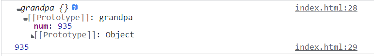

@[TOC](文章目录)

---

# 前言
2024年补充：
[【JavaScript 构造函数、原型和原型链 - CSDN App】](http://t.csdnimg.cn/cFsSs)

部分理论参考《JavaScript权威指南》
每一个对象都有与之相关的原型(prototype), 原型是在实例创建之初就设定好的, 作用是继承属性. 
使用new调用构造函数会自动创建一个新对象, 因此构造函数本身只需要初始化这个新对象的状态即可. 调用构造函数的一个重要特征是构造函数的`prototype`属性将会作为新对象的原型`__proto__`.
通过new表达式创建的对象通常会继承一个constructor属性, 这个属性指代创建这个对象的构造函数, 因此一个对象的`原型`应该为它的`constructor.prototype`, 即其构造函数的原型(原型属性), 但对于由Object.create()创建的对象往往不是如此.

# 一、何时出现继承情况?
在JavaScript中, 只有在`查询属性`时才能体会到继承的存在, 而设置属性(赋值和加入新属性)和继承无关, 这是JavaScript的一个重要特性, 该特性让编程者得以有选择性的覆盖继承来的属性.

举例一个设置属性的操作， 说明一下设置值过程中无法体现继承: 
1. 向对象内设置属性和赋值, 也总是只在原始对象里创建一个属性或者赋值已有的属性, 而不会对原型链进行操作.
```javascript
function A() {
  this.do = function() { return 'foo'; }
}

A.prototype = function() {
  this.do = function() { return 'bar'; }
}

var x = new A().do();
```
new A(), 构造出原型指向function A的对象, 对象上有个`do`方法;
"调用时优先去自身实例上寻找方法, 如果找到将不再去原型上寻找."按照这个规则来, 不需要看`A.prototype`赋值这步即可得出`foo`的答案.

算上A.prototype赋值这步的话, `A.prototype`赋值只是改变`A.prototype`的值为一个表达式, 这并没有向原型上绑定任何方法(绑的话一般`A.prototype.do=xxx`格式).

但是哪怕只是在赋值, 这步也算在`重写原型`了, 重写原型后, 新原型与已存在的实例的联系遭到切断, 而已存在的实例仍旧会选择引用以前的原型(而以前的原型又不在了, 所以会找不到). 
放在这里, 如果"优先去实例上寻找"这条规则已经无法解决问题, 实例上已经无法找到, 直接去原型`A.prototyp`e寻找`do方法`的话, 会发现`A.prototype`已经被赋值为函数, 无法找到而导致报错.

所以调用`do()`方法调用的实际上还是第一步在原型上的`do`方法, 那么结果就为`foo`;

---

# 二、继承的体现&原型链的形成
对比一个查找属性的操作:

1. 现在要在对象中查找属性x, 如果对象中不存在x, 那么将会去这个对象的原型对象中继续寻找x;
2. 如果原型对象里也没有x, 但是这个原型对象还有它自己的原型, 那么就再去这个原型对象的原型上寻找x;
3. 就这样一级一级的往上找, 直到找到x或者查找到一个原型是null的原型为止;
4. 由这一条也可以看出原型对象一级一级构成了一种链状结构, 即常说的`原型链`, 属性的`继承`即是通过原型链来实现的.

如果两个对象继承自同一个原型, 往往意味着他们是由同一个构造函数创建并初始化的.

一个简单的原型链, 从grandpa到son, son寻找num沿着原型链一路向上找, 最后在grandpa的原型里找到, 作为自己原型中的num.

```javascript
function grandpa() {
  this.num = 935;
}
//此时new grandpa()会构造出对象"{ num: 935 }"

var vardad = function dad() { }
vardad.prototype = new grandpa();  //第一段链

var varson = function son() { };
varson.prototype = new vardad();  //第二段链

console.log(varson.prototype.num);
```



---

# 三、例-求以下代码的输出
```javascript
function father() {
  this.num = 935;
  this.work = [ 'read', 'write', 'listen' ];
}

function son() { }
son.prototype = new father();
let son1 = new son();
let son2 = new son();
son1.num = 117;
son1.work.pop();
console.log(son2.num);
console.log(son2.work);
```
son.prototype本该为空对象, 现在被赋值为father构造的对象`{num: 935, work: [ 'read', 'write', 'listen' ]}`;
let son1和son2以function son()为原型构造的仍旧都是空对象, 此时son1被加入num属性赋值为117(对象是可以直接这样加属性的, 所以不用去实例或者原型上找num);
但是work加入后没有值直接被执行了方法, 对于work如果依旧在实例上直接找那么完全不行, son1实例上本来就是空的, 现在只有个num, 那么必须从初始赋值了father构造对象的son原型上寻找work, 得到work为`[ 'read', 'write', 'listen' ]`, 执行pop(), 直接把function son()原型的work改成了[ 'read', 'write' ];

然后做完发现和son1没有半毛钱关系, 他输出的son2.

那就只能num, work全去原型上找了, 得到结果935, 和被son1 `pop()`过的`work`: [ 'read', 'write' ]

---

# 总结
复习点理论.