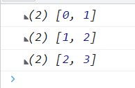

@[TOC](文章目录)

---

# 前言
补全了一下ES6的数组方法, 对于前篇的提到一些方法, 记一些新的认识.
前篇:[《学习JavaScript数据结构与算法》第三章 数组](https://blog.csdn.net/qq_52697994/article/details/120845432)

---

# 一、...数组扩展运算符
将一个数组转为以逗号分隔的数组元素序列.

1. 只有在对`函数参数`使用时才能出现在小括弧中, 否则会飘红.

```javascript
var arr = [4, 5, 6];

function fun1(fir, sec, thi) {

   return {
     fir, sec, thi
   };
   
}

console.log(...[1, 2, 3]);  //1 2 3
console.log(fun1(...arr));  //{ "fir": 4, "sec": 5, "thi": 6 }
```

---

2. 在数组中使用, 作为一种合并数组的高效手段.

```javascript
let arr = [ 1, 2, ...[3, 4], 5 ];
console.log(arr);
//[1, 2, 3, 4, 5];
```

```javascript
let arrA = [ 3, 4 ];
let arrB = [ 1, 2, ...arrA, 5 ];
console.log(arrB);
```

---

3. 实现数组&对象深拷贝
扩展运算符提供一种实现数组深拷贝的简化手法.
不再指向内存中的同一份数据, 完全克隆一份自己的数据, 实现分离存储互不影响.

```javascript
//数组深拷贝
let arrA = [ 1, 2, 3, 4 ];
let arrB = [...arrA];

arrB[0] = 2;
console.log(arrA);  //[ 1, 2, 3, 4 ];
console.log(arrB);  //[ 2, 2 ,3 ,4 ];
```

```javascript
//对象深拷贝
let objA = { fir: 1, sec: 2, thi: 3, dor: 4 };
let objB = { ...objA };

objB.fir = 2;
console.log(objA);  //{ "fir": 1, "sec": 2, "thi": 3, "dor": 4 };
console.log(objB);  //{ "fir": 2, "sec": 2, "thi": 3, "dor": 4 };
```

---

4. 字符串转字符数组

```javascript
let greet = "hello";

console.log([...'hello']);
console.log([greet]);
//扩展运算符拆解字符串生成的字符序列被中括弧隐式转换为数组类型;
```

---

5. Iterator
扩展运算符内部调用`Iterator`接口来完成自己的事情, 所以扩展运算符只能操作可遍历对象,  `Iterator`接口的统一访问机制主要表现为遍历操作, 只要一种数据结构具备该接口拥有`Symbol.Iterator`属性(其实是个函数), 就可以接受遍历.只要一个对象具有`Iterator`接口, 它就可以使用扩展运算符.

我初次接触到`Iterator`还是在对`yield`的学习过程中, 当时配合`next()`反复调用生成器, 生成器的`yield`依次返回.
调用生成器并不会先逐步执行生成器(Generator)函数的函数体, 而是先返回一种迭代器(Iterator)对象, 我的理解是生成器与迭代器并非相互控制.
生成器内部往往包含迭代算法, 每次调用生成器先返回一个迭代器, 迭代器在本次对生成器的调用内(截止到返回)起作用, 生成器内发生值消耗时都会执行迭代器, 在生成器的本轮执行结束后, 下次调用时生成器会返回一个新的迭代器重复这个过程.

```javascript
function* Generator(num) {
  for (let i = 0; i < num; i += 1) {
    yield console.log(i);
  }
}

const generat = Generator(4); //这里generat其实一直都是保存的迭代器, 因为执行最先返回的都是迭代器, 而也只有迭代器拥有next方法()

generat.next();  //0
generat.next();  //1
generat.next();  //2
generat.next();  //3
```
额, 我想有点说偏了? 
不过这意味着 Generator 函数也可以使用扩展运算符.

---

`Symbol.iterator`函数一般定义于可迭代对象的原型(prototype)中, 可以用一些手段访问到这个接口并且自定义`Symbol.iterator`方法, 把迭代器接口用起来.
对于不可迭代不拥有`iterator`接口的对象, 可以手动定义`Symbol.iterator`方法让不可迭代对象转变为可迭代对象, JavaScript迭代器是专门为遍历行为定义的, 所以自定义的迭代器方法里至少应该有一个`next()`方法返回当前元素并将迭代器指向下一个元素(虽然我这个没有). 

这里举例为Number类型定义`Symbol.iterator`方法:
```javascript
Number.prototype[Symbol.iterator] = function* () {
  for (let i = 0; i <= this.valueOf(); i++) {    // i <= 6;
    yield i;
  }
}
console.log([...6]) // [0, 1, 2, 3, 4, 5, 6];
```
你可以看到`Number`类型转换为可迭代对象后, 数字类型`5`也可以被迭代, 而去掉定义`Symbol.iterator`方法这一步后, 对数字类型值`5`直接使用扩展运算符将会报错:
```
Uncaught TypeError: 5 is not iterable
"5是一个不可迭代对象"
```
---

# 二、Array.from()
1. `Array.from`用于将可遍历对象(具有`Symbol.iterator`的对象, 不只obj类型)和类数组对象(使用从0开始自然增长的整数作为键名的对象)两类对象转为数组.

---

2. 对于自己的第二个参数,`Array.from`接受传入回调函数, 并为生成的数组中的每一个元素执行这个函数, 单看有些像`Array.map()`.

```javascript
Array.from(
  { 
    0: "fir",
    1: "sec", 
    2: "thi", 
    3: "for" 
  }, 
  (item) => {
    item * 2;
  }
);
```

---

3. 对于数组, `Array.from`会返回一个一模一样的数组:

```javascript
console.log(Array.from([1, 2, 3]))  //[1, 2, 3];
```

---

4. 另外也具备与扩展运算符相仿的字符串转字符数组功能:

```javascript
function change(str) {
  let numArr = Array.from(str);
    return numArr;
}

console.log(change("shfhuhih"));
// ["s", "h", "f", "h", "u", "h", "i", "h"]
```

---

# 三、Array.of()
用于将一组值转换为数组, 用于弥补Array()数组的缺陷, 比如打算只生成含有一个元素的数组, Array()做不到, 因为会被判定为在设定数组长度:
```javascript
console.log(Array(5));
//[空 ã5]
```
那么这种情况下使用`Array.of()`: 

```javascript
console.log(Array.of(5));
// [5];
```
这个方法的行为十分稳定:

```javascript
console.log(Array.of(undefined));  //[undefined]
console.log(Array.of());  // [];
```

---

# 四、copyWithin()
复制数组一段区域内的所有元素作为模板, 移动到本数组的另一个位置, 会覆盖掉该位置原有的元素.
参数说明:
start默认0, end默认为数组长度, 所以两者均为可选参数.
```javascript
Array.prototype.copyWithin(target, start, end);
```
从start下标开始读取, end下标结束读取, 读取到的这段会被拿到target对应的下标处开始替换: 
```javascript
console.log([5, 8, 9, 15, 89].copyWithin(2, 0, 4));
//截取下标01234替换23456, 输出[ 5, 8, 5, 8 ,9 ];
```

---

# 五、find() & findIndex() & findLast() & findLastIndex()
`find()`由下标0向后检查, `findLast()`由后向0检查, 其他两者相同. 返回`找到的第一個滿足回调函數條件的值`, 其接受一个回调函数和任意对象(这个二参传入后, 作为回调函数的this)作为参数, 但可以向回调函数传三个值. 
`value`当前值
`index`当前下标
`arr` 正在检索的数组
```javascript
待检数组.find(
function(value, index, arr) {
//函数体, 你可以在里面使用这三个参数
console.log(this);  //参数2
},
参数2
)
```

---

`findIndex()`和find()一样的用法从下标0向后检查, findLastIndex()也是反着检查. 从只不过返回的是滿足條件值的下标(見示例末行), 另外在未能找到的情况下会返回`-1`.
参数说明:
```javascript
待检数组.find(
function(value, index, arr) {
//函数体, 你可以在里面使用这三个参数
console.log(this);  //参数2
},
参数2
)
```
示例: 
```javascript
let baiX = 2;
[1, 2, 3, 4].find(
  function (value, index, arr) {
    //函数体, 你可以在里面使用这三个参数
    console.log(this > index);  //参数2
  },
  baiX
)
```

# 六、entries() & keys() & values()
## 1.entries（）
在上面的表中我提到了这个entries(), 其返回包含数组所有键值对的`@@iterator`.
```javascript
let number = [1, 2, 3, 4];
let aEntries = number.entries();
console.log(aEntries.next().value);
console.log(aEntries.next().value);
console.log(aEntries.next().value);
```
等同于:
```javascript
let arr = [1, 2, 3, 4];
aEntries = arr.entries();
for(const n of aEntries) {
  console.log(n);
}
```
等同于:

```javascript
let arr = [1, 2, 3, 4];
aEntries = arr.entries();
for(const [index, item] of aEntries) {
  console.log(index, item);
}
```




---

## 2.keys()
keys返回包含數組索引號的@@iterator:

```javascript
let number = [1, 2, 3, 4];
let aKeys = number.keys();
for (let i = 0; i <= number.length-1; i++) {
  console.log(aKeys.next());
}
```
等同于:
```javascript
let arr = [1, 2, 3, 4];
aEntries = arr.keys();
for(const key of aEntries) {
  console.log(key);
}
```


至於後面那個done,它在英文中有"已完成"的意思,放在這裏即"是否已完成", 
如果它的值為false説明這個數組還沒被迭代完成, 你可以看到, 儅數組迭代到了末尾,done變爲true;
"一旦沒有可迭代的值, aKeys.next()就會返回一個value屬性為undedined, done屬性為true的對象";
<hr style=" border:solid; width:100px; height:1px;" color=#000000 size=1">

## 3.values()
 values()與keys()則是截然相反, 它不返回索引號而是返回元素的值:
 
 示例:
```javascript
let array = [5, 4, 3, 2, 1];
const aValues = array.values();
for (let i = 0; i <= array.length; i++) {
   console.log(aValues.next());
}
```


done的作用同keys(), 用以判定當前數組是否迭代完成;

---

# 七、flat() & flatMap()
## 1.flat()
数组降维, 允许自定义降几个维度.
不传参默认降一个维度.
```javascript
let Arr2D= [1, 2, 3, [4, 5], 6];
function down(arr, dimension) {
  return arr.flat(dimension);
}
console.log(down(Arr2D, 1));
```

```javascript
let Arr4D = [1, 2, 3, [4, [5, 6, [7]], 8, 9], 10];
function down(arr, dimension) {
  return arr.flat(dimension);
}
console.log(down(Arr4D, 3));
```

## 2.flatMap()
`flatMap()`方法对原数组的每个数组元素执行一个处理函数(就像map()那样), 然后对处理函数的返回值组成的新数组执行`flat()`方法, `flat()`前面说过.
```javascript
let arr = [1, 2, 3, 4];
arr.flatMap((item) => {
  return item *2;  // [2, 6 ,4, 8];
})
```
```javascript
console.log(
  [1, 2, 3, 4].flatMap(
    (item) => item * 2
  )
)
// [2, 6 ,4, 8];
```

---

# 八、toReversed() & toSorted() & toSpliced() & with()
这些方法与去掉`to`之后的原方法对数组的操作相同, 区别是原方法在本数组上直接进行操作, 这几种方法会拷贝一个数组进行操作并返回, 不对原数组开刀.

---

# 总结
学点ES6...