@[TOC](文章目录)

---

# 前言
摸爬滚打了这么长时间...总结了一些排查错误的经验, 总的来说, 这是一篇`JavaScript`新手向文章.
里面会有些不那么系统性的, 呃, 知识?

---

# 一、报错类型
报错信息该怎么看, 怎么根据信息快速的追查错误.

## 1.控制台报错
一般的报错信息格式:
```
xxxx Error: xxxxx报错信息xxxxx                  最终报错文件:行编号 
  at 最终报错方法名 (最终报错文件名: 致错行编号: 致错列编号) 
  at 第4执行方法名 (文件名: 致错行编号: 致错列编号)
  at 第3执行方法名 (文件名: 致错行编号: 致错列编号)
  at 第2执行方法名 (文件名: 致错行编号: 致错列编号)
  at 首个执行方法名 (文件名: 致错行编号: 致错列编号) 
```
首行报错信息下方的是位置信息, 对代码熟悉的话基本只看第一行就够了, 但是不熟悉的话需要定位错误就可以依据这个.

这些小字应当从下向上浏览, 它们描述以什么样的执行顺序遇到了这个错误, 以及最终错误发生于何处, 我会在下面做一个演示. 

不过使用开发框架的话, 这些位置信息并不会全部有用, 一般最靠上的几条是有价值的信息, 是你自己写的代码, 其他的都是框架内的执行错误, 如果没有研究过框架那么就是没用的信息了.


---

## 2.终端报错
比较严重的报错会出现在控制台, 可能会导致项目故障无法运行或者功能下线.
项目配置问题报错直接百度.
如果是自己代码的问题, 先看报错信息第一句大写开头的人话, 大体了解一下错误原因, 之后需要定位错误, 中间部分通常展示该错误导致了哪些地方出现了其他错误, 这并不是我们需要的, 直接去报错信息最下面往上看.
如果少了东西, 那么你能操作的, 或者说, 真正因为你的操作出错的那个地方, 通常显示在倒数几个路径, 检查看看有没有自己熟悉的路径.
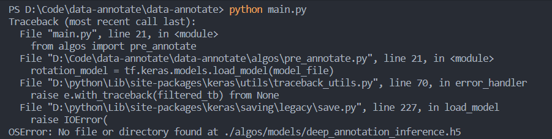
参考最后一行, 缺少文件于`./algos/models`, 缺少文件`deep_annotation_interface.h5`

---

# 二、错误追查
这里用最常见的TypeError错误做演示(尝试证明第一章)...
引起原因是执行至某处后, 某些值的类型发生错误(TypeError), 而某些方法或者操作无法对该类型正常执行, 比如发生用for去遍历`undefined`的情况.
```
Uncaught (in promise) TypeError: Cannot read properties of undefined (reading 'xxxx')
```
常见如`undefined`错误, `undefined`在`JavaScirpt`执行过程中基本要做特殊判定和处理来过滤出去, 这种类型表示这个变量在内存里有开辟空间但是空间里什么都没有, 别人能用的方法和操作它不能用, 和其他类型一起加入运算会出错.

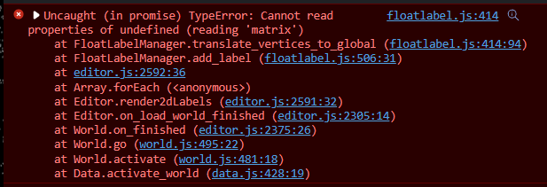

可以来验证一下:
从最后一行开始:


`data.js--active_world, 428行第19字`:

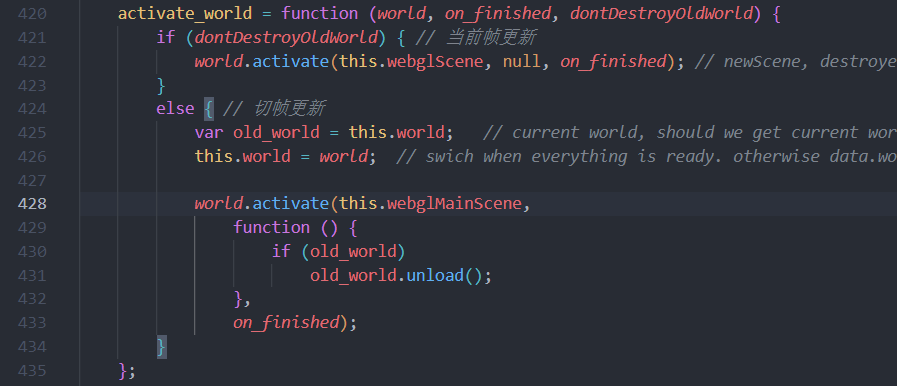
428行, 4格缩进, `a`在第19列.

428行`world`是引入的`world.js`的`world`类原型有`activate`方法, 看倒数第二行报错:

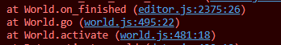

去`world.js`寻找`active`方法, 致错位置行481列18:

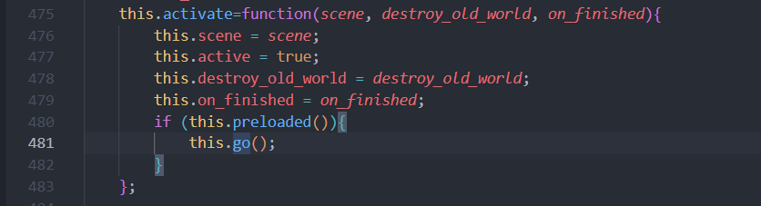
之后下一个报错在`world.go`, 此处也调用了`world.go`.
寻找`world.go`, 错误位置应当在`world.go`内部, 行495列22:

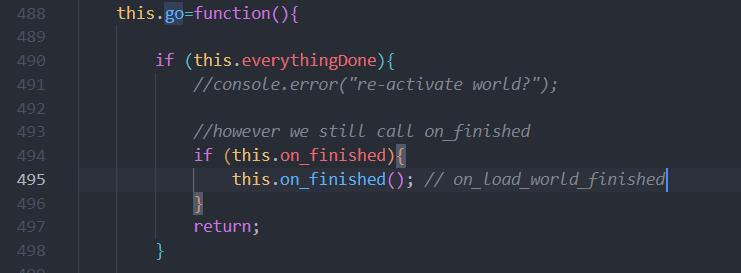
`on_finished`由`world.active`作为参数接收, 来到下一个报错位置:


`editor.js` `on_finished`2375行26列
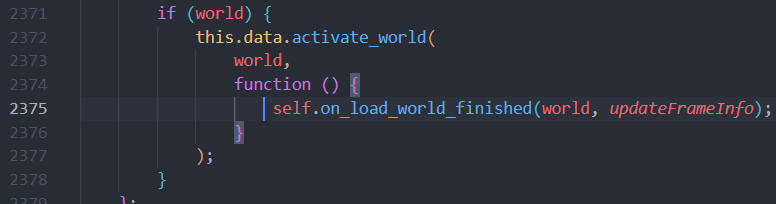
 发现报错函数作为参数传入`this.data.active_world`, 去`data.js`寻找`active_world`:

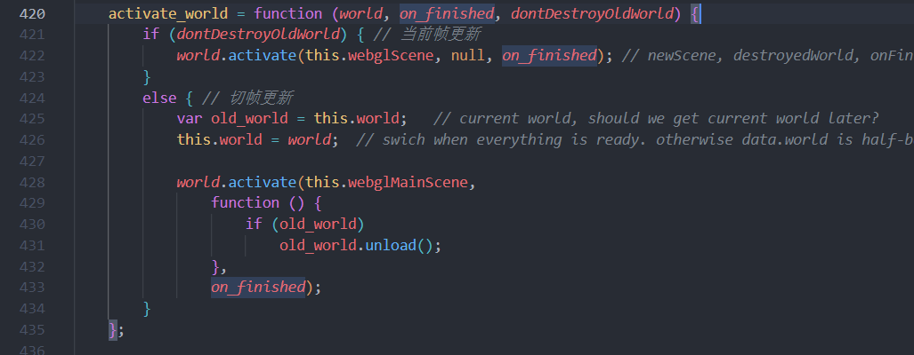
发现`world.active`的`on_finished`参数也由此传入, 即调用`on_finished`相当于调用`editor.js`的`on_load_world_finished`, 这时候去看报错信息寻找下一处执行位置:

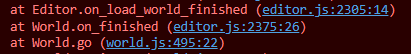
`on_load_world_finished`, 下一处报错位置:


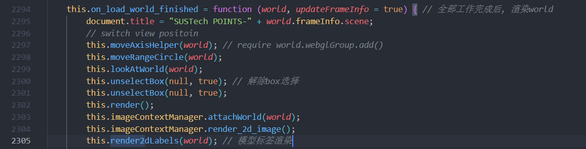
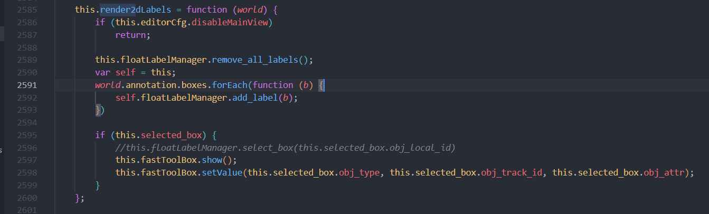
行2591列32, 输出一下b, 没问题, forEach会有问题? 该是`add_label`的问题, `floatLabelManager`引入自`floatLabel.js`.

中间两行看不懂(估计是forEach的影响), 直接往上看:

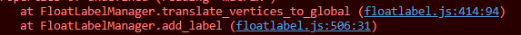

定位最终报错位置:

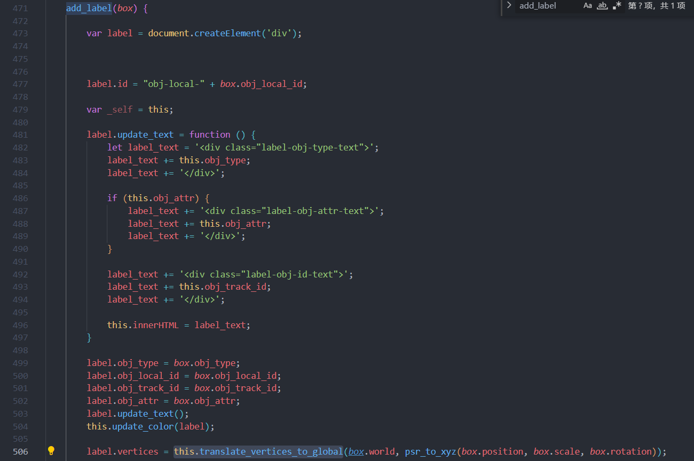

---

# 总结
我以前并不会去过多的关注详细的报错信息, 项目结束后, 近期一直在做原生开发, 也发现详细的报错信息其实也有利用价值.

当然, 这在你看来可能会是一些很蠢的, 早该知道的知识吧)