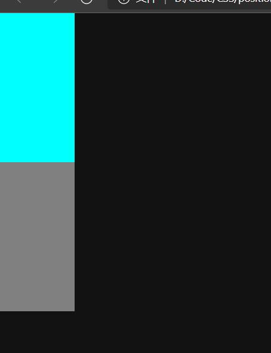

<hr style=" border:solid; width:100px; height:1px;" color=#000000 size=1">

# CSS中定位属性的使用
网页元素默认占用文档流，插入或生成元素后，其将默认按照从左到右的顺序依次排列，这将导致页面中的各种元素因空间占用问题难以被设计至目标效果。
若将整个页面看做一个二层透明，底层白色的双层结构的俯视，那我们可以简单的理解为『大部分元素默认占用底层空间』，但是各种元素共处一层，每个个体都占有一部分空间，不能重叠的情况下将导致我们无法把操作的元素放置到俯视视角的目标位置。

为了摆脱底层的空间占用限制，有效利用二层空间帮我们达到目标效果，可以使用CSS中的定位属性，添加了定位属性的元素将拥有"浮动"效果，会脱离文档流（可简单理解为脱离上面说的白色底层)，进入漂浮状态，即可以使用"二层空间"，可达到这样漂浮效果的还有display:float、z-index等，本篇主要讲position属性（定位属性）。

position属性用于为目标元素确定位置（确定漂浮态位置），其后可以跟从6种定位方法（其中position:static、position:relative无法使目标元素脱离文档流):

    position:static
    position:fixed
    position:relative
    position:absolute
    position:inherit
    position:sticky

接下来我会按照使用频率依次阐述
<hr style=" border:solid; width:100px; height:1px;" color=#000000 size=1">

# position：absolute
脱离文档流, 虽然定位不一定子绝父相,但是八成有子绝, 也是页面布局主力.

这种方法被称为“绝对定位”，会选取与受定位元素辈分最近的、已经 受到定位的、父级元素 进行定位，前提是这个父级元素受到的定位不是position:static。
跟从上方所说，这种定位方法设置了“子绝父相”结构的组成部分——子元素部分 的位置，利用“受到absolute定位的元素会选取距离自己最近的受到定位的父元素进行定位”的特点，可以将受到absolute影响的元素放入受到relative定位的元素中作为其子元素，这样在后面调整某个模块时仅调节relative定位的父元素即可让整个模块完好的移动。

```html
  <style>
    .父级元素 {
      position: relative;
      top: 10px;
      left: 10px;
    }

    .子级元素 {
      position: absolute;
      top: 10px;
      left: 20px;
    }
  </style>
</head>

<body>
  <div class="父级元素">
    <span class="子级元素"></span>
  </div>

</body>
```
<hr style=" border:solid; width:100px; height:1px;" color=#000000 size=1">

# position:relative
用的第二多,页面布局主力.
这种定位方法被称为“相对定位”，所谓“相对”即是相对定位前其在正常文档流中的位置（的左上角为坐标原点）进行定位.
移动受relative影响的元素时,这个元素原本所占的空间依然会在原处不改变.可以对其设置right,left,top,bottom进行目标元素位置的调整。

另外[受这种定位影响的元素]可以被[受position：absolute影响的元素]选中为“包含者”来作为自身absolute定位的参照物，absolute会以就近原则选择距离自己最近的受定位的父元素作参照，这个特点便是“子绝父相”（这种叫法并不严谨），在编写时可以父元素使用相对定位，子元素使用绝对定位，避免调整元素时导致其他元素错位。
不能脱离文档流,验证:不会出现页面塌陷:

```css
.a {
    position: relative;
    top: 0;
    left: 0;
    height: 200px;
    width: 100px;
    background-color: aqua;
}

.b {
    height: 200px;
    width: 100px;
    background-color: grey;
}
```

```html
    <div class="a"></div>
    <div class="b"></div>
```


如果页面塌陷,蓝色应当遮住灰色,灰色会塌陷到浏览器上缘.
<hr style=" border:solid; width:100px; height:1px;" color=#000000 size=1">

# position:fixed
用的第三多,我们经常拿这个来做导航条.
这种定位方法被称为“固定定位”，这种方法以浏览器边框作为参照，注意这里的 参照 不受浏览器边框尺寸变化影响，其以可视窗口作为参照物，改变浏览器可视窗口显示尺寸后目标元素与浏览器边框的距离不会改变.
如此定位的元素也不受上下左右滚动条的影响，其会随着底层和漂浮层移动，与其保持相对静止，常看到跟随屏幕滚动的“回到顶部”就是利用JS和该定位制作。
可以使目标元素脱离文档流进入漂浮状态。后面添加left,right,top,bottom来对位置进行调整,浏览器的坐标系坐标原点在左上角，依据此来进行调整（建议用截图工具测量）

```html
  <style>
    .固定定位 {
      position: fixed;
      top: 10px;
      left: 10px;
    }
  </style>
```
<hr style=" border:solid; width:100px; height:1px;" color=#000000 size=1">

# position:sticky
使用率第四,经常拿来做"返回顶部". 
这种方法被称为“粘性定位”，受粘性定位的元素依据页面滚动，在position:relative与position:fixed两定位方法之间进行切换。

在页面的滚动不超出目标区域时，它的表现更加偏向position:relative; 而当页面滚动超出目标区域时，它的表现更加偏向position:fixed它会将目标元素固定在目标位置。

其定位表现是：在跨越特定阈值前为相对定位的定位方法，超过阈值之后为固定定位的定位方法（可以拿这个来做“回到顶部”）。这个特定阈值指的是 top, right, bottom 或 left 之一，也就是仅指定 top, right, bottom 或 left 四个之一作为阈值，才可使粘性定位生效，否则其行为与相对定位相同。

```html
  <style>
    div.sticky {
      position: sticky;
      top: 10px;
    }
  </style>
```
在对页面上的元素进行设计时，优先设置主体（页面主体）元素作为页面中心，以其作为原点进行其他元素的定位，可以防止中途定位某个元素时其他元素跟着动的尴尬情况，减少不必要的工作量，方便后期修改。

<hr style=" border:solid; width:100px; height:1px;" color=#000000 size=1">

# position:static
脱离文档流
定位属性的默认值，即『无定位』，目标元素将依然存在于正常文档流中，使用此种定位与不对目标元素施加定位将会是同种效果，对受static影响的元素设置right,bottom,top,left将无效，同样的其他元素若相对受static影响的元素设置left,bottom,right,top也将无效。对其设置margin和padding有效。
<hr style=" border:solid; width:100px; height:1px;" color=#000000 size=1">

# position:inherit
基本没用过.
我一直觉得这种定位方法很特殊......inherit也可以作为其他属性的值来使用，这里我只说它跟在position后时的情况.
“inherit"这个单词的意思为“继承”，它在定位中的用途也一如它的汉意：受inherit影响的元素将会使用与其父元素相同的定位方式，注意是仅继承定位方式，而不一定会以父元素作为参照来定位。可以对其设置right,bottom,left,top来进行定位，具体定位规则依据继承来的不同的定位而不同。因为其与上级元素两元素间有父子关系，所以被称作 定位：继承；

```html
  <style>
    .父级元素 {
      position: fixed;
      top: 20px;
      right: 30px;
    }

    .子级元素 {
      position: inherit;
      /*此处子级元素继承父级元素，定位方式为fixed固定定位*/
      top: 100px;
      right: 150px;
    }
  </style>
```
<hr style=" border:solid; width:100px; height:1px;" color=#000000 size=1">


# 20211013补充 - 了解文档流
你就把这白色的页面看成一条牛奶河好吧?
它是从左往右流的,然后放进去的div之类的块级元素都是独占一路的,行内元素是可以同走一路的.
然后浮动的脱离文档流, 意思就是在河上架上了一层玻璃,把这些浮动的元素抬出了河面,这就脱离文档流了.

# 20211013补充 - 注意事项:浮动塌陷
前面说了加定位属性会让元素浮动起来,那你要想着,这下层的空间本来就是不够用的,你跑了别人就占下了.
比如现在有两个div,这俩一人一行,都没浮动,都泡在牛奶河里.
这下面的div,它的margin-top就是参照头顶的div来的,margin-top:3px,就是距离头顶这div 有3px.
突然有一天这头顶的div跑了,楼下那个一看我去头上这石头终于是没了,嘤雄的人民站起来了! 啪,直接给你顶到浏览器上边框了,它现在距离浏览器上边框3px,这就是浮动塌陷,指的是某元素浮动导致的其他未浮动元素抢占其空间的行为.
这一个元素塌了还好,下面要是有一整个页面,你让上面的一个div浮起来玩去了,这一整个页面塌下来那简直是地狱绘图.
一定要注意.
<hr style=" border:solid; width:100px; height:1px;" color=#000000 size=1">

# 总结
以上是我据本阶段的学习得出的一些经验与心得，如果对您起到帮助，在下十分荣幸；若是您发现了我的不足，恳请您的指点！