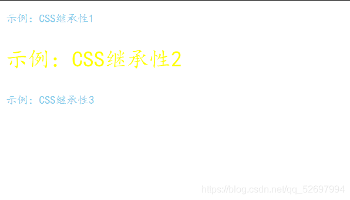
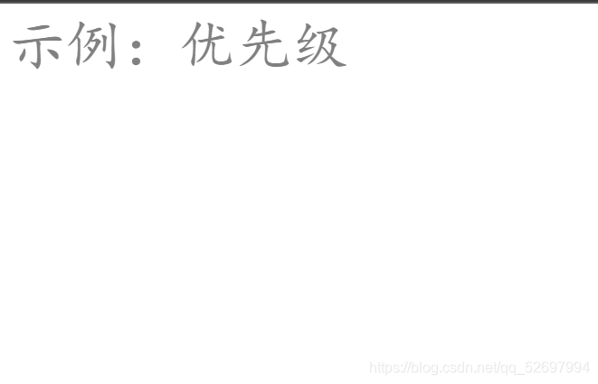

# CSS的三大特性

<hr style=" border:solid; width:100px; height:1px;" color=#000000 size=1">

 

<hr style=" border:solid; width:100px; height:1px;" color=#000000 size=1">

<font color=#999AAA >下面我会依次阐述这三种特性使用时的注意事项与方法。

# 一、CSS层叠性
在对一个元素所设置的多个不同选择器 或者 一个选择器内，对同一样式不同的值，会造成样式冲突，此时需要考虑CSS的层叠性，CSS将根据层叠特性来决定使用哪种样式。

特性简述：当出现上述情况时，CSS将会采用距离目标元素的代码最近的样式，就近原则。
如下所示：

```css
  <style>
    div {
      background-color: yellow;
      background-color: skyblue;
    }
  </style>
```

```html
<body>
  <div>示例：CSS层叠性</div>

</body>
```
依据上述，以上代码显示出盒子的颜色应当为天蓝色。
以下为另一种情况：

```css
  <style>
    div {
      background-color: skyblue;
    }
    div {
      background-color: yellow;
    }
  </style>
```
这段代码的运行结果为黄色，下方控制黄色的选择器距离目标元素更近。
# 二、CSS继承性
在对子级标签的样式进行设置时需要注意，其会继承其父标签中部分能被其自身继承的样式，而且“继承父元素样式”被使用的优先级低于“使用该元素被直接设定的样式”，恰当的利用这一特性可以缩减代码量，例如对多个同父子元素内字体与背景色的设置，就可以直接为其父元素设置样式，使所有子标签样式相同。

```css
  <style>
    div {
      color: skyblue;
      font-size: 15px;
    }

    #继承性2 {
      color: yellow;
      font-size: 30px;
    }
  </style>
```
```html
<body>
  <div>
    <p>示例：CSS继承性1</p>
    <p id="继承性2">示例：CSS继承性2</p>
    <p>示例：CSS继承性3</p>
  </div>

</body>
```
这段代码运行后，显示效果如下

可以看到的是子级元素继承了父级元素的样式，但出现针对自己的样式时依然会优先使用自己专属的样式（跟能叫外卖就不会去食堂吃大锅菜是一样的）。
# 三、CSS优先级
前面在说到CSS选择器的时候我说到了CSS的权重、优先级相关，这里也算是对那节内容的补充吧。在选择器相同的时候将需要考虑我们前面说的“层叠性”特性，而当选择器不同时，将需要考虑CSS的“优先级“特性。“选择器权重”这一概念是被“优先级”这一概念包含在内的。
|选择器|选择器权重  |
|--|--|
| 继承或 *全选 |  0，0，0，0|
|元素选择器|0，0，0，1 |
|类选择器、伪类选择器|0，0，1，0
|ID选择器|0，1，0，0|
| 继承或 *全选 |  0，0，0，0|
|行内样式style=" "|1，0，0，0 |
|!important 重要|无穷大|

这些权重值基本可以看作数学数值个十百千，理所当然的是占位越高权重越大，在多个可选的选择器内，权重大的选择器将会被优先采用，而若是在样式后跟上!important，则选择器必定被采用，因其权重为“无限大”。
下面请看一个示例：

```css
  <style>
    div {
      color: grey;
      font-size: 15px;
    }

    #优先级 {
      color: yellow;
      font-size: 30px;
    }

    .示例 {
      background-color: skyblue;
    }
  </style>
```

```html
<body>
  <div class="示例" id="优先级">示例：优先级</div>
</body>
```
若是按照“层叠性”的就近原则，此处应当采用class="示例"设置的样式，但此处的选择器众多，应当参照“优先级”特性而非“层叠性”特性；
ID选择器因为在所示三种选择器中为权重最高(0,1,0,0)的一种，所以即便在中间放置也依然被优先采用了。
看下!important的用法：

```css
  <style>
    div {
      color: grey!important;
      font-size: 30px;
    }

    #优先级 {
      color: yellow;
      font-size: 50px;
    }

  </style>
```

```html
<body>
  <div class="示例" id="优先级">示例：优先级</div>
</body>
```
还是刚才的HTML代码，这次我为标签选择器中的颜色样式添加了!important，那么是否整个标签选择器的样式都会被采用？

并没有，标签选择器中的颜色样式因为加大权重被使用，而标签选择器中的其他属性（比如设置的字号）并不能被采用，!important仅能加强某个样式属性的权重，并不能加强整个选择器的权重。

# 总结
<font color=#999AAA >
以上便是CSS三大特性的相关，在下独自整理，可能并不全面，如果有帮助到您，在下荣幸之至，如果您发现了我的错误与缺陷，在下恳请您的指点，多谢！