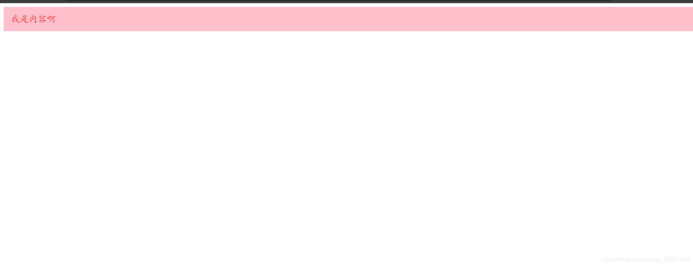
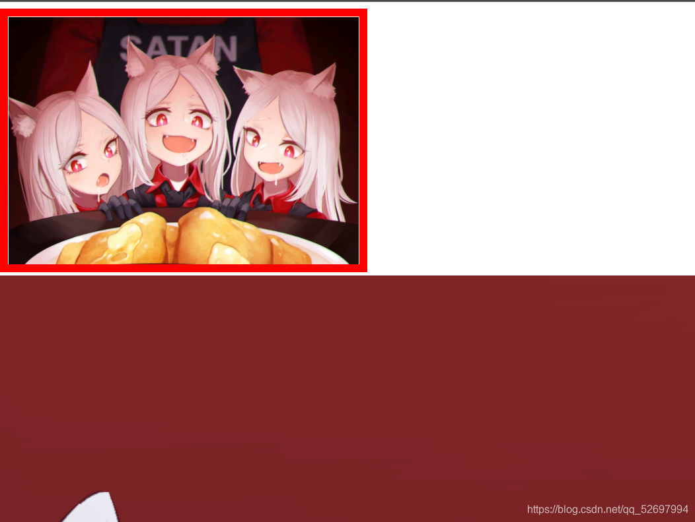
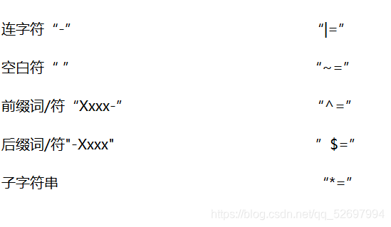

# CSS选择器的种类&使用
@[TOC](文章目录)


<hr style=" border:solid; width:100px; height:1px;" color=#000000 size=1">

## 甚麽是CSS选择器
CSS选择器
在CSS中，选择器是一种模式，用于选择需要添加样式的元素，这一模式的存在使CSS得以与HTML、Javascript结合。CSS选择器可分为三大类:

简单选择器

复合选择器

CSS3新增的选择器
## 一、简单选择器
简单选择器又可称为“基本选择器”，其它类型的选择器都是在其基础上组合而成，其为为网页添加CSS效果的基础，其种类有以下三种：

***标签选择器***
***类选择器***
***ID选择器***

下面依次说说这三种选择器的用法：

## 1.标签选择器
其以标签种类为判定标准来决定是否选取该标签，可以方便的从HTML部分的代码中选取出所有与其种类相同的标签。

```css
 div {
      font-size:12px; 
      color:red;
}
```
这是CSS选择器中使用率较高的一种，其与网页元素同名对应，也比较容易管理，但需要也有较大局限性，例如要将同种标签设计为不同效果时无法使用。

## 2.类选择器
其以标签的类（名）作为判定标准来决定是否选取这些标签，可以从HTML部分的代码中选出与作选择符的类名相同类名的标签，使用前需要为HTML中的标签添加class类名，并且在选择符前加“.”。一个HTML元素可以对应使用多个类选择器，但遇到重复设定的某项则会选择优先级高的项采用，这部分涉及到CSS的权重，我将在下面的博客中涉及；多个HTML元素也可以共用一个CSS类选择器。类选择器中还包括一种“指定类选择器”，在被class直接命名的标签生成的选择符前加入一个此标签的父级标签，来在选择前限制选择范围为“在这个父级标签内选择”，这个父级选择符可以为类名或标签。

```css
  <style>
    .SSS {
      background-color: pink;
      padding:15px;
    }
    .SSS{
      font-size:20px;
      color:red;
    }
  </style>
```
```html
<body>
  <div class="SSS">演示：类选择器</div>
  </body>

```
上面这段代码运行的结果就会是这样：

可以看到我们设定的字体颜色和div颜色分列两个类选择器内，但都被采用了。
class类名选择器相对标签选择器来说就更加灵活了，选择的精确度达到了单个标签。

```css
  <style>
    div.指定类选择器 {
      background-color: pink;
      padding:15px;
    }
  </style>
```
```html
<body>
  <div class="指定类选择器">演示：指定类选择器</div>
  <p class="指定类选择器">演示：指定类选择器</p>
</body>

```
这样便可以达到只选择<div>标签的效果。
## 3.ID选择器
其以标签的ID（IDentity）作为判定标准来判定是否要选取该标签，仅能从HTML部分的代码中选取出 id名 与 自身的选择符 文本相同 的标签，而ID就像身份证，每个人都独一无二，所以也就意味着选择的结果只能是一个标签，使用时需要为待选标签添加 id名。id选择器也可以实现多个选择器对应一个标签，同样需要注意权重的问题，也可以实现多个标签对应一个选择器，将上方的class选择器演示代码中的“class”替换为“id”即可进行。

```css
  <style>
     #SSS {
      background-color: pink;
      padding:15px;
    }
  </style>
```
```html
<body>
  <div id="SSS">我是内容啊</div>
</body>
```
注意使用时要为选择符添加 “#” 。我们同样也可以为ID选择器界定选择范围使其成为“指定ID选择器”，设置方法与class选择器相同，选择符格式为“范围标签#选择符{   }
# 二、复合选择器
简单选择器是CSS选择器的地基，但他们显然不足以协助我们。
## 1.子选择器
其以选择符中的父元素的标签种类/类名/id界定选择范围，以一代子元素的标签种类/类名/id判定确切选择目标，与我们前面说的指定类选择器十分相似（个人认为可能就是它演化来的），我们依然需要在受到class/id命名的子/父元素对应的选择符前加上他们的选择符前缀，即
”父元素选择符前缀（无空格）父元素>一代子元素选择符前缀（无空格）子元素名”
的写入格式 ，当需要选择的对象/范围没有使用id/class命名时我们使用标签选择器的标准，直接写需要被选为对象/范围的标签种类，中间用>隔开即可，当未命名标签与已命名标签需要一起使用时各自遵循各自的规则即可。

```css
  <style>
    .SS {
      background-color: red;
    }

    .SS>#SSS {
      background-color: green;
      padding: 15px;
    }
  </style>
```

```html
<body>
  <div class="SS"><span id="SSS">demo：id与class</span></div>
</body>
```
如上是一个父元素为class类名，子元素为id命名的例子。
## 2.相邻选择器
其以与目标元素同级的兄弟元素为判定标准来选择，会选择与兄弟元素相邻的下一个元素作为目标元素。HTML元素间的关系除去包含关系基本就可以确定是同级关系。此处说的“与兄弟元素相邻的下一个元素指的是在代码里相邻（不是在可视页面里看着相邻）。基本格式为：
“兄弟元素选择符（无空格）兄弟元素id/class名+目标元素选择符（无空格）目标元素id/class名
当然还是没有命名的就直接写标签种类就可以。

```css
  <style type="text/css">
    p +.demo {
      font-size:100px;
    }
    .demo+#S {
      font-size:100px;
    }

  </style>
```
```html
<body>
  <p>乱写的东西</p>
  <span class="demo">我是内容啊</span>
  <div id ="S" >我也是内容啊</div>
</body>
```
如上。
## 3.包含选择器
其根据包含元素间的包含关系来判定是否对该标签进行选择，很多情况下我们用前面提到的子选择器完全可以替代它，因为两者除了标识符部分基本是一模一样（当然如果喜欢打空格多一点也可以用这来替代子选择器），但是如果页面很复杂，被包含的元素不仅仅有这个父元素所属的一代子元素而是还有其他子元素需要选择，那么此时子选择器将无法再替代包含选择器的作用（这点下面会举例），因为包含选择器的作用范围是这个父元素的所有子代元素，它的基本格式为：
“包含者选择符名（空格）被包含者选择符名{  }”。
关于选择符的使用同前面所说。下面是一个必须使用包含选择器的例子：

```html
  <div id="demo">

    <div id="header">
      <h2>
        <p>今天</p>
      </h2>
      <p>早上</p>
      <p>晚上</P>
      <p>裂开</p>
    </div>
    
    <div id="好耶">
      <div>
        <p>好耶</p>
        <p>不戳</p>
      </div>
      <p>下雨了</p>
    </div>
    
  </div>

```
那如果我们要把这几句吐槽选出来连在一起使用一种风格的话，使用子选择器我们无法选择一代子元素外的子元素，可能要进行不止一次的选择才能将需要部分全部选出，比较麻烦，多次的选择也将加大出错的风险。这是子选择器无法替代包含选择器的情况。
## 4.属性选择器
这一选择器又是分为3个种类（用法），罗列分说

一、匹配属性名选择器
二、匹配属性值选择器
三、模糊匹配属性值选择器

一、匹配属性名选择器
这种选择器格式能够把选择范围内所有具有某一属性（比如具有class名的）的元素全部选出来（是对属性所在的元素选取），不止能选类名和命名，alt 、id 等均可。举例：

```css
  <style type="text/css">
    img[alt] {
      border: solid 10px red;
      height: 300px;
    }
  </style>
```
```html
<body>
  <div class="demo">
    
    
    </div>
</body>
```
这个例子为第一张引入的图片添加了匹配属性名选择器，被选中后我给它添加了红色10px的实线边框，效果如下：

证明第一张图片确实被选中了，其实我们甚至可以更加精确的选择一次，添加两个条件，那么指令将被理解为“同时满足两个条件者才能被选中”。但若是每个条件被分占：

```css
  <style type="text/css">
    img[alt][id] {
      border: solid 10px red;
      height: 300px;
    }
  </style>
```
```html
<body>
  <div class="demo">
    
    
  </div>
</body>
```
则两张图片都不会受选。

二、匹配属性值选择器
可以说是匹配属性名选择器的升级版，能在属性名的基础上把属性值也写上去了，这进一步增大了选择的精确度，没有太多需要说的，此处我们结合匹配属性名选择器举个栗子：

```css
  <style type="text/css">
    img[alt="ggggaaaa"][class] {
      border: solid 10px red;
      height: 300px;
    }
  </style>
```
```html
<body>
  <div class="demo">
    
    
  </div>
</body>
```

效果是一样的，虽然因为懒没有再截图（doge
我们同时给两张图片都添加了alt=”ggggaaaa"属性，然后是可以再使用匹配属性名选择器来结合筛选的。

## 三、模糊匹配属性值选择器
属性选择器中功能最强大的一部分，它不仅可以匹配到属性名和属性值，而且可以对属性值的一部分作出判定来决定是否需要选择，可以说是匹配属性值选择器的升级版。
当属性 值 中出现以下 以汉字说明的特征 时，我们可以在模糊匹配属性选择器中使用右侧列出的、与这个特征对应的运算符，来对 拥有这个特征的值  进行匹配，以选中其所在的标签。特征只是用来判断使用何种运算符，特征我会列在左侧，右侧为与特征对应的运算符()表格不支持用竖线字符...只能截图了）。


使用模糊属性值选择器时不要在中括号[]外为其界定选择范围，应在括号内写入一个类似于类名选择器的选择符进行范围界定：
对于|连字符|空白格|这两种特征类型则应为：
[class(标签种类) |= "完整值的有字符部分"]{  }
举个栗子：

```css
  <style>
    [class^="Glory"] {         
      font-size: 100px;
      color: red;
    }

    [class|="glory"] {
      font-size: 50px;
      color: pink;
    }

    [class~="Of"] {
      font-size: 10px;
      color: green;
    }
  </style>
```
```html
<body>
  <div class="Glory of mankind">demo：前缀</div>
  <div class="glory-of-mankind">demo：连字符</div>
  <div class="GlOry Of mankind">demo:空白符</div>
</body>
```


经过尝试，|前缀|特征选取的只能为值的前部分；同样的|后缀|选取的部分值也只能为值的后半部分；而|连字符|选区的部分值中只能包含一个连字符；方便的是|子字符串|类型可以带有符号，只要是可识别的值部分随便选取均可识别：

```css
  <style>
    [class*="blue-p"] {
      font-size: 50px;
      color: pink;
    }
  </style>
```
```html
<body>
  <div class="red blue-pink">demo：连字符</div>
</body>
```
运行后显示粉色“demo:连字符”大小50px。
以上为属性选择器部分。
## 5.伪选择器&伪元素选择器
伪类和伪元素是一类特殊的选择器，它定义了一些特殊区域或者特殊状态下元素的样式。这些特殊的区域或者状态是无法通过标签、ID或者class类名等进行准确的控制的，最好使用伪类&伪元素选择器，这些选择器都有自己的独特前缀——一个“:”。
因为经常用于超链接上，所以在说明时常常在其前加“a”（这点误导我许久，那时我一直以为这种选择器的基本格式就是前面有个“a”，还纳闷这样该怎么进行选择。）这类选择器可以使目标元素对用户的鼠标操作做出可视的反应，常用的有以下四种：

:link{  }
:visited{  }
:hover{  }
:active{  }

四种分别对应不同的选择标准，:link将选择未被click的、:visited选择已被click的、:hover，鼠标一旦悬停在该元素，其就会被hover选中、：active选择被激活/活动的链接，hover的巧妙使用可以做出很多鼠标互动的动态效果，伪类选择器的用法有些类似于Javascript函数与for循环，在生成选择器或者函数后都可以直接在小括号内添加激活后需要出现的效果，但函数多了调用一步，伪类选择器在使用时最为稳妥的方法是在选择器前指定一个确切的标签名，以下将举例说明：

```css
  <style>
    a:nth-child(1) {
      transition-delay: 0.05s;
    }
    .B1:hover a {
      left: 50px;
    }
    a:nth-child(2) {
      transition-delay: 0.1s;
    }
    .B2:hover a {
      left: 50px;
    }
  </style>
```
```html
  <div class="select">
    <div align="left" class="B1">
      <a href="#"></a>
    </div>
    <div align="left" class="B2">
      <a href="#"></a>
    </div>
```
## 三、CSS3新增选择器-预告
此部分我将在今后的文章中为您说明......
# CSS选择器种类&使用总结
基本格式都是高度相似，即以各种相似但不同的方式界定选择界限与选择标准，然后在其后加小括号囊括需要为受选目标添加的效果，在使用时各种选择器除小括号前不同外，小括号后囊括的一律均为需要选择的元素。

以上是我据本阶段的学习得出的一些经验与心得，如果对您起到帮助，在下十分荣幸；若是您发现了我的不足，恳请您的指点。