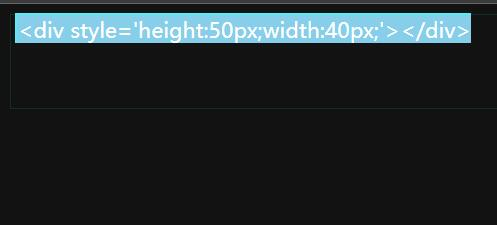
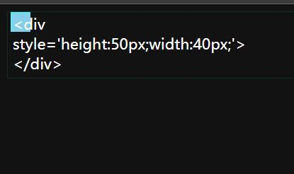
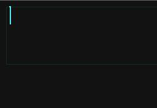
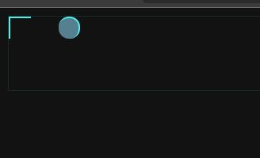
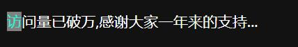
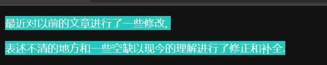

@[TOC](文章目录)

<hr style=" border:solid; width:100px; height:1px;" color=#000000 size=1">

# 前言
CSS3新增的伪元素要求使用双冒号了,但对于以前的伪元素则是单双皆可.
本文中除了::selection ,都是单双皆可的.
<hr style=" border:solid; width:100px; height:1px;" color=#000000 size=1">

# 一、::before
 before初始位置于元素左上(但并不是紧贴左上,有一段很小的距离);
 
初始无大小(加颜色也看不见).由于具备行内元素特质(默认displal:inline),直接添加尺寸无效,但可以使用css的content属性向其内部添加内容(不能解析HTML)以使其具备大小:


要更加精确美观的规定尺寸,还是要设法施予其块级元素特质:
 
 可以选择使用绝对定位,在规定其位置的同时也让尺寸能被规定,我更推荐这种方法.
 当然,直接display:block也是一种办法.
           
```css
        .box::before {
            position: absolute;
            top: 0;
            left: 0;
            /* display: block;*/
            content: "<div style='height:50px;width:40px;'></div>";
            width: 20px;
            height: 20px;
            background-color:skyblue;
            border-top: 2px solid #4feff5;
            border-left: 2px solid #4feff5;
        }
```


但,无论你使用何种方法转变其为块级,请务必保留content属性,否则无论给何种尺寸都将无法显示.

<hr style=" border:solid; width:100px; height:1px;" color=#000000 size=1">

# 二、::after
 before初始位置也位于元素左上(对,我没说错)但也不是紧贴左上,有一段很小的距离.
 

```css
        .box::after {
            content: "";
            width: 10px;
            height: 10px;
            border-top: 2px solid #4feff5;
            border-right: 2px solid #4feff5;
        }
```


其他特性同::before;
<hr style=" border:solid; width:100px; height:1px;" color=#000000 size=1">

你可以用他们来给元素镶嵌上一些小玩意儿,就像这样:

这可以节省两个DOM节点,也不用多写这两个小东西的代码了.
<hr style=" border:solid; width:100px; height:1px;" color=#000000 size=1">

# 三、::first-letter
对第一个文字所占有的区域进行样式规划;

```css
.text::first-letter {
            color: rgb(27, 245, 216);
            background-color: grey;
        }
```

```html
<p class="text">访问量已破万,感谢大家一年来的支持...</p>
```


<hr style=" border:solid; width:100px; height:1px;" color=#000000 size=1">

# 四、::selection
CSS3新增, 这个伪元素在使用时必须双引号,单引号不会生效.
规定遭到拖拽选取的元素,文字的样式,比如规定受选文字的底色vv;

```css
p::selection {
            background-color: #24ffedf5;
        }
```


<hr style=" border:solid; width:100px; height:1px;" color=#000000 size=1">

# 总结
复习一下伪元素~
早上起床看到访问量破万,高兴了一天,感觉这一年的付出都值得了,哈哈.

记得是20年9月末来到CSDN的,那时候我还是个HTML都不会的高三毕业生,每天愁眉苦脸的看着一大堆书本,和我那让人看不明白的舍友和同学.

时间过得好快,转眼我已是那年的大二学长, 不知不觉也已经在CSDN呆了这么久, 这一年在CSDN收到了许多善意的帮助, 我也如愿以偿为社区尽了一份绵薄之力, 最重要的收获是, 我认识到世界上还有这样一群人, 这样一群每天加班到深夜, 每天面对铺天盖地的字符和BUG, 却依旧乐观向上的人, 他们把我拖出了自己的泥潭.

