@[TOC](文章目录)

<hr style=" border:solid; width:100px; height:1px;" color=#000000 size=1">

# 前言
本文包括数组操作方法、ES6新增数组功能、JS矩阵、类型化数组等；

<hr style=" border:solid; width:100px; height:1px;" color=#000000 size=1">

# 一、创建 & 初始化数组
使用JavaScript声明， 创建和初始化数组；

使用new关键字，来声明并初始化一个数组, 不过不推荐, 需要执行构造函数和原型操作, 执行起来性能低、写起来也麻烦.

```javascript
daysOfweek = new Array(数组长度，数字型);
daysOfweek1 = new Array(7);
```

或者直接使用中括号形式:

```javascript
let daysOfweek = [];
let daysOfweek1 = ['one', 'two', 'three'];
```

get数组长度:

```javascript
console.log(数组名.length);
```

# 二、操作数组
## push() - 添加元素于末尾
直接将要添加的数组元素赋值给数组的最后一位,但这种方法一次性只能添加一个元素:

```javascript
let array = ["one", "two", "three"];
array[array.length] = 新数组元素;
console.log(array);
```

我们在实战中更多使用的方法是push(),这是一个专用于处理数组的方法:

```javascript
let array = ["one", "two", "three"];
array.push(要添加的元素1, 要添加的元素2, ...);
array.push(array2[3]);
```
可以一次性将多个元素依次加入数组的末尾.
<hr style=" border:solid; width:100px; height:1px;" color=#000000 size=1">

## unshift() - 添加元素于开头
将新的数组元素直接添加至数组开头, 实操一般会使用unshift方法:

```javascript
let numbers = [3, 4, 55];
numbers.unshift(-2);
unmbers.unshift(-2, 3);
console.log(numbers);
```
<hr style=" border:solid; width:100px; height:1px;" color=#000000 size=1">

## pop() - 从数组末尾开始删除元素
使用pop()方法来从末尾删除数组中的元素, 要注意的是pop()返回的是被删除的那个元素, 而不是处理完的数组.
书上并没有详细阐述这一方法, 只给了一个实例, 只好跑一下试试,
```javascript
let numbers = [1, 2, 3, 4, 5];
numbers.pop();
console.log(numbers);
```
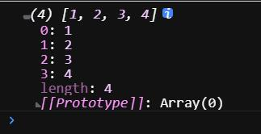
pop()方法固定只移除最后一个元素, 给参数也没用...
<hr style=" border:solid; width:100px; height:1px;" color=#000000 size=1">

## shift() - 从数组开头开始删除元素

```javascript
for(let i = 0; i < numbers.length; i++) {
  numbers[i] = numbers[i + 1];
}
```

这相当于在数组序列号不变的情况下将所有数组元素整体左移了一个单位,
但在这种情况下输出数组会发现数组的长度依旧未被改变,这说明数组中必然有一个元素的值为undefined:
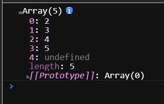
可以看到, 我们只是把数组第一位的值用第二位进行了覆盖, 第一位并未被删除.

但在实战中我们一般使用shift方法:

```javascript
let num = [1, 2, 3];
numbers.shift();
```
这种方法会直接导致数组长度减小.

<hr style=" border:solid; width:100px; height:1px;" color=#000000 size=1">

## splice() - 在数组任意位置添加或删除元素
删除和添加操作均可使用splice()来完成;
使用splice()方法, 通过指定起始位置和删除个数来完成删除操作;

```javascript
//注意是从左往右删;
numbers.splice(起始序列号, 删除数量);
```

使用splice()方法, 通过指定起始位置和传入要添加的元素来完成添加:

```javascript
//执行添加操作, 第二个参数请传0;
number.splice(起始序列号, 删除数量, 元素1, 元素2, 元素3, ...)
```
也就是给第二个, 那个控制删除个数的参数传0, 删0个.
<hr style=" border:solid; width:100px; height:1px;" color=#000000 size=1">

## slice() - 截取一部分作为新数组返回
从数组里截取?元素到??元素之间的部分, 生成一个新数组然后返回;
```javascript
arr.slice(start, end);
```
这里拿微信小程序的一个demo来演示:

```javascript
//datalist: [111, 222, 333, 444]
//只要点击触发handleDelete, 就删除最后一个元素并拿到新数组
handleDelete() {
  this.setData({
    datalist: [...this.data.datalist].slice(0, this.data.datalist.length - 1)
  })
},
```

不传参数默认返回原数组.

## concat() - 数组拼数组
对两个数组进行拼接, 这个方法在原书中未经讲述.
另外该方法可以用于解决数组作为复杂数据类型深浅拷贝的问题.

```javascript
const 数组1 = [ 1, 2, 3, 4 ];
const 数组2 = [ 5, 6, 7, 8 ];
数组1.concat(数组2)  //[1, 2, 3, 4, 5, 6, 7, 8];
```
```javascript
const 数组1 = [1, 2, 3];
const 数组2 = 数组1.concat();

//这样相当于克隆了一份数组1指针指向的数据到数组2, 对数组2内具体值的设定不会再导致两数组同下标值同步变化.
```

## sort() - 数组排序
有一套默认的排序方式(字母排序同时升序排序), 但是也支持传入函数自定义排序方式, 这个传入的函数需要有两个参数, 并且你需要在函数体中说明这两个值以何种标准进行比较, 在甚麽情况下该`return`;

```javascript
let arr = [1, 2, 3, 4];
arr.sort();
```

自定义排序方法会根据返回值的正负以及是否为0来判定如何排序, 而并非直接操作表达式结果:
```javascript
var points = [40, 100, 1, 5, 25, 10];
console.log(
  points.sort(
    function (a, b) {
      return a - b;
    }
  )
);
```

---

# 三、二维 多维数组
矩阵, 指包含二维数组在内的数组含有数组的结构;

JavaScript只支持一维数组并不支持矩阵,但是可以用如下数组嵌套的方法来实现矩阵.

## 1.构建二维数组
一维数组看作流水线, 把数组元素看作流水线上的一个个商品 ,那么二维数组就是流水线上一组组堆出了高度
的商品:

就像这样:
```javascript
     ︹  ︹     ︹
     6   4      3
     3   5      9
     2   1      0
[ 3, ︺, ︺, 5, ︺, 6 ]
```
进行了一个维度的跨升, 但肯定是不能直接在代码里写这么个流水线的, 還是得這麽寫:

```javascript
[
3, 
[6, 3, 2],
[4, 5, 1],
5,
[3, 9, 0],
6,
]
```
<hr style=" border:solid; width:100px; height:1px;" color=#000000 size=1">

## 2.迭代二维数组
用双层for来进行迭代, 同样的, 三维数组可以使用三层for迭代:

```javascript
function printMatrix(myMatrix) {
  for(let i = 0; i < myMatrix.length; i++) {
    for(let j = 0; j < myMatrix[i].length; j++) {
      console.log(myMatrix[i][j]);
    }
  }
}
```
要取到某个元素,可直接使用如下方式:
```javascript
array[2][1]
```

---

# 四、JavaScript数组方法参考
| 方法 | 说明 |
|--|--|
| concat | 连接两个或者更多数组 |
| foreach | 对数组中每个元素执行函数,无返回值 |
| every | 对数组中每个元素执行函数, 如果每个元素的执行都返回true,every()返回true; |
| filter | 对数组中每个元素执行函数, 返回由所有执行时返回true的元素组成的数组 |
| map | 对数组中每个元素执行函数, 返回所有执行结果组成的数组 |
| some | 对数组中每个元素执行函数, 只要有一个元素返回true,some()就返回true |
| join | 将所有数组元素链接为一个字符串 |
| indexOf | 返回找到的第一个与给定参数相等的数组元素的索引号 |
| lastIndexOf | 返回找到的所有与给定参数相等的数组元素中索引号最大的那个, 即返回所有与参数相等的元素中最靠右的那个 |
| reverse | 颠倒数组元素的顺序,索引号不变 |
| slice | 依据传入的索引值将将索引范围内的元素作为新数组返回 |
| sort | 按照英文字母顺序对数组进行排序, 支持传入【指定排序方法的函数】作为参数 |
| toString | 将数组转换为字符串返回 |
| valueOf | 将数组转换为字符串返回, 与toSting相似 |
这其中的一些方法在函数式编程中十分有用;
这些我就不多记了, 都能查到.

---

## reverse() - 數組反排序
對數組使用reverse()方法可以獲得一個數組的反序形態, 這個沒什麽好説的, 
但是書上在對數組使用了reverse()之後還進行了一次sort排序, 我先去查了一下sort的特性,如果调用 sort() 方法时没有传递参数, 则按字母顺序对数组中的元素进行排序(就是按abcde這種順序);
但是書上給的示例是數字數組啊 ,這?

```javascript
let numbers = [1, 2, 3, 4, 5, 6, 7, 8, 9, 10];
numbers.reverse();
console.log(numbers);
numbers.sort()
console.log(numbers);
```
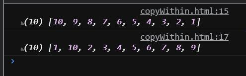
你可以看到用sort排序後又變成了亂七八糟的樣子, 因爲sort()進行排序時, 發現元素不是字符串, 它會试图把数组元素转换成字符串再进行比较.
那就不用它默認的排序方式了, 反正sort支持傳入compareFunction比較函數,:

```javascript
//比較函數使用了箭頭函數: (a, b) => {}

let numbers = [1, 2, 3, 4, 5, 6, 7, 8, 9, 10];
numbers.reverse();
numbers.sort();
console.log(numbers.sort((a, b) => a - b));

/////////////////////////////////////////////////////////
//sort()會根據返回值的正負來判讀值之間的大小關係,相當於如下;

function compare() {
  if (a < b) {
    return -1;
  }
  if (a > b) {
    return 1;
  }
return 0;
}
numbers.sort(compare);  //向sort傳入比較函數作參;
```
這樣即實現了將反序數組重新撥正的目的;
<hr style=" border:solid; width:100px; height:1px;" color=#000000 size=1">

## indexOf() & lastIndexOf() - 依据值返回索引
先來看indexOf吧:
indexOf() 返回與參數匹配的第一個元素的索引.
```javascript
console.log(numbers.indexOf(10)); //返回9, 因爲值10所在的索引為9;
console.log(numbers.indexOf(100)); //返回-1, 因爲數組裏壓根沒有100;
```
對於 indexOf() 就是能找到的就會輸出目標數組元素的索引號, 找不到不存在的就輸出-1;

再來看lastIndexOf():
lastIndexOf返回與參數匹配的最後一個元素的索引.
意思就是:如果針對一個數組進行的查找產生了多個滿足條件的結果,豈會需選取最靠右的結果的索引號作爲返回值;
```javascript
numbers.push(10);
console.log(numbers.lastIndexOf(10));  //10
console.log(numbers.lastIndexOf(100));  //-1
```
<hr style=" border:solid; width:100px; height:1px;" color=#000000 size=1">

## toString() & join() - 數組转字符串
兩個方法都可以將數組轉換爲字符串, 但是...還是有點區別,那就是
toString是直接將數組元素硬性轉換為字符串, 説白了就是直接把外面的中括號去掉直接讓裏面的數組元素和逗號暴露出來;

```javascript
let numbers = [1, 2, 3, 4, 5, 6, 7, 8, 9, 10];
console.log(numbers.toString());
```
然後就直接變成這樣了, 這樣一般都沒法直接用, 還得拆吧拆吧之類的處理一下...
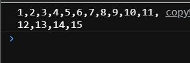
然後就是join了, 這個方法特點就是你可以指定各個數組元素拆分後以什麽東西進行連接(原本在數組裏不是逗號嘛), 然後拆開之後你可以把它變成"1QAQ2QAQ3QAQ4"或者"1@2@3"之類的這種 (這其實有點像PHP裏的那個implode方法)...
示例:

```javascript
const numberString = numbers.join("QAQ");
console.log(numbersString);
```
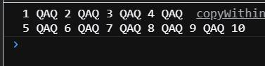
<hr style=" border:solid; width:100px; height:1px;" color=#000000 size=1">

# 五、ES6数组的新功能
|新增方法| 说明 |
|--|--|
| @@iterator | 返回一个包含数组键值对的迭代器对象,可以通过数组同步调用来得到数组元素的键值对 |
| copyWithin | 复制数组中一系列元素到同一数组指定的起始位置 |
| entries | 返回包含数组所有键值对的@@iterator(即索引號與值的键值对) |
| keys | 返回包含数组所有索引号的@@iterator(即包含索引號的對象) |
| values | 返回包含数组中所有值的@@iterator(即包含值的對象) |
| includes | 速查, 数组中是否包含某个元素,返回布尔值(這是出自ECMAS7的方法) |
| find | 可以注册回调函数, 其会根据回调函数规定的条件从数组中查找元素, 如果找到该元素则会返回. |
| findIndex | 可以注册回调函数, 其会根据回调函数规定的条件从数组中查找元素, 找到后会返回其索引号 |
| fill | 使用静态值填充数组 |
| from | 根据已有数组创建一个新数组 |
| of | 根据传入的参数创建一个新数组 |
<hr style=" border:solid; width:100px; height:1px;" color=#000000 size=1">

## for...of - 遍历数组
for...of 對可迭代对象(包括 Array, Map, Set, String, TypedArray, arguments等)執行循环, 为每个不同属性的值执行语句
```javascript
let numbers = [3, 4, 7, 6];
for (const n of numbers) {
  console.log(n);
}
```
公式:
```javascript
let 數組名 = [元素1, 元素2, 元素3, 元素4];
for (const key名稱 of 數組名) {
  console.log(key名稱);
}
```
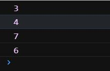
你可以看到在for...of語句中,key不再是for中的索引號, 而是各個數組元素;
<hr style=" border:solid; width:100px; height:1px;" color=#000000 size=1">

## @@iterator对象
ES6为Array类增加了一个`@@iterator`属性, 需要通过`Symbol.iterator`来访问.
2022-8-3补充:`Symbol.iterator`是存在于可遍历对象中的属性, 其为函数类型.`Symbol.iterator`函数一般定义于可迭代对象的原型(prototype)中, 可以用一些手段访问到这个接口并且自定义`Symbol.iterator`方法, 把迭代器接口用起来.
对于不可迭代不拥有`iterator`接口的对象, 可以手动定义`Symbol.iterator`方法让不可迭代对象转变为可迭代对象, JavaScript迭代器是专门为遍历行为定义的, 所以自定义的迭代器方法里至少应该有一个`next()`方法返回当前元素并将迭代器指向下一个元素.

这里举例为Number类型定义`Symbol.iterator`方法:
```javascript
Number.prototype[Symbol.iterator] = function* () {
  let i = 0;
  let num = this.valueOf();
  while (i < num) {
    yield i++;
  }
}

console.log([...5]) // [0, 1, 2, 3, 4]
```
<hr style=" border:solid; width:100px; height:1px;" color=#000000 size=1">

## entries() - 取出成对的下标与值
在上面的表中我提到了这个entries(), 其返回包含数组所有键值对的`@@iterator`.
```javascript
let number = [1, 2, 3, 4];
let aEntries = number.entries();
console.log(aEntries.next().value);
console.log(aEntries.next().value);
console.log(aEntries.next().value);
```
等同于:
```javascript
let arr = [1, 2, 3, 4];
aEntries = arr.entries();
for(const n of aEntries) {
  console.log(n);
}
```
等同于:

```javascript
let arr = [1, 2, 3, 4];
aEntries = arr.entries();
for(const [index, item] of aEntries) {
  console.log(index, item);
}
```


---

## keys() - 返回包含索引號的對象
keys返回包含數組索引號的@@iterator:

```javascript
let number = [1, 2, 3, 4];
let aKeys = number.keys();
for (let i = 0; i <= number.length-1; i++) {
  console.log(aKeys.next());
}
```
等同于:
```javascript
let arr = [1, 2, 3, 4];
aEntries = arr.keys();
for(const key of aEntries) {
  console.log(key);
}
```
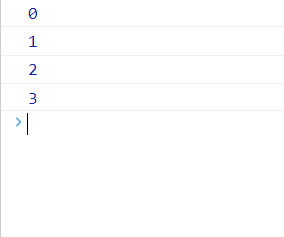

至於後面那個done,它在英文中有"已完成"的意思,放在這裏即"是否已完成", 
如果它的值為false説明這個數組還沒被迭代完成, 你可以看到, 儅數組迭代到了末尾,done變爲true;
"一旦沒有可迭代的值, aKeys.next()就會返回一個value屬性為undedined, done屬性為true的對象";
<hr style=" border:solid; width:100px; height:1px;" color=#000000 size=1">

## values() - 返回包含数组元素的對象:
 values()與keys()則是截然相反, 它不返回索引號而是返回元素的值:
 
 示例:
```javascript
let array = [5, 4, 3, 2, 1];
const aValues = array.values();
for (let i = 0; i <= array.length; i++) {
   console.log(aValues.next());
}
```
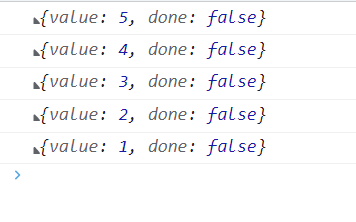

done的作用同keys(), 用以判定當前數組是否迭代完成;

---

## find() & findIndex() & findLast() & findLastIndex() - 返回滿足條件的值
這四种方法都能接收回調函數, 作用是去搜索能滿足回調函數條件的值,并且返回這些值.

`find()`由下标0向后检查, `findLast()`由后向0检查, 其他两者相同. 返回`找到的第一個滿足回调函數條件的值`, 其接受一个回调函数和任意对象(这个二参传入后, 作为回调函数的this)作为参数, 但可以向回调函数传三个值. 
`value`当前值
`index`当前下标
`arr` 正在检索的数组
```javascript
待检数组.find(
function(value, index, arr) {
//函数体, 你可以在里面使用这三个参数
console.log(this);  //参数2
},
参数2
)
```

---

`findIndex()`和find()一样的用法从下标0向后检查, findLastIndex()也是反着检查. 从只不过返回的是滿足條件值的下标(見示例末行), 另外在未能找到的情况下会返回`-1`.
参数说明:
```javascript
待检数组.find(
function(value, index, arr) {
//函数体, 你可以在里面使用这三个参数
console.log(this);  //参数2
},
参数2
)
```
示例: 
```javascript
let baiX = 2;
[1, 2, 3, 4].find(
  function (value, index, arr) {
    //函数体, 你可以在里面使用这三个参数
    console.log(this > index);  //参数2
  },
  baiX
)
```

---

## from() - 根據已有數組創建新數組: 
from()方法根據已有的數組創建一個新的數組, 比如要複製numbers數組如下:

```javascript
let numbers = [5, 4, 3, 2, 1];
let numbers2 = Array.from(numbers);  
//from()利用numbers數組生成新數組numbers2
console.log(numbers2);
```
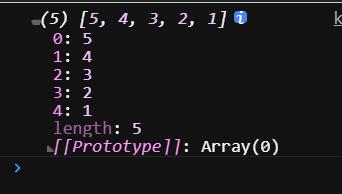
但這樣直接全盤搬過來似乎意義不大, 大多數時候我們需要進行篩選來創建新的數組, 這下第二個參數位就能派上用場了, 它支持傳入一個用於過濾值的函數:

```javascript
let evens = Array.from(numbers, i => (i % 2 == 0));
//from()利用numbers數組生成新數組evens;
//並根據數組元素的奇偶來決定填充的布爾值;
console.log(evens);
```
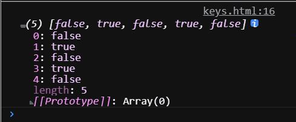

<hr style=" border:solid; width:100px; height:1px;" color=#000000 size=1">

## Array.of() - 依據傳入的參數創建新數組
Array.of 方法根據傳入的參數創建一個新的數組:
2022-8-3:可以弥补`Array()`无法生成单个元素数组的缺点, 并且这个方法可以用来将字符串转换为字符数组.

```javascript
let numbers3 = Array.of(1);
let numbers4 = Array.of(1, 2, 3, 4, 5);
//相當於let numbers4 = [1, 2, 3, 4, 5];
console.log(numbers3);
console.log(numbers4);
```

你也可以向其内部傳入數組作爲參數, 会原封不动的返回数组.
還記得前面説到的展開運算符嗎? 你可以用Array.of再把他们转化为数组, 不过很有病.

```javascript
let numbers4 = [1, 2, 3, 4];
let numbersCopy = Array.of(...numbers4);
//相當於let numbersCopy = Array.of(1, 2, 3, 4);
console.log(numbersCopy);
```
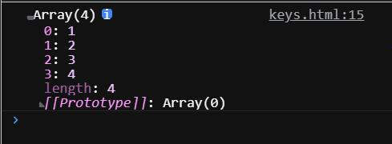
<hr style=" border:solid; width:100px; height:1px;" color=#000000 size=1">

## fill() - 使用靜態值來填充數組: 
fill()可以讓你的數組充滿某個值, 你也可以用索引號界定範圍, 讓某個範圍的元素全部爲某個值;
`value`作填充物的元素
`start`开始处下标
`end`结束处下标
```javascript
数组名.fill(value, start, end);
```
不過要記著開始索引號對應的值會遭到填充, 但是結束処對應的值不會遭到填充, 比如開始処3, 結束処5, 那被填充的索引只有3,4.

```javascript
let numbersCopy = Array.of(1, 2, 3, 4, 5, 6);
numbersCopy.fill(0, 2, 4);
console.log(numbersCopy);
```
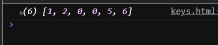
<hr style=" border:solid; width:100px; height:1px;" color=#000000 size=1">

## copyWithin() - 令數組某一段與另一段相同: 

复制数组一段区域内的所有元素作为模板, 移动到本数组的另一个位置, 会覆盖掉该位置原有的元素.
参数说明:
start默认0, end默认为数组长度, 所以两者均为可选参数.
```javascript
Array.prototype.copyWithin(target, start, end);
```
从start下标开始读取, end下标结束读取, 读取到的这段会被拿到target对应的下标处开始替换: 
```javascript
console.log([5, 8, 9, 15, 89].copyWithin(2, 0, 4));
//截取下标01234替换23456, 输出[ 5, 8, 5, 8 ,9 ];
```

---

## includes() - 檢測數組中是否存在某元素
只能檢測有還是沒有, 返回布爾值.
`target`: 检索目标
`start`:  开始检索的下标, 如果为负数则表示倒数的位置, 负数且超出范围则重置到0下标开始查找.

公式:
```javascript
數組名.includes(target, start);
```

示例:
```javascript
let numbers = [1, 2, 3, 4, 5];
console.log(numbers.includes(15));  //false
console.log(numbers.includes(3, -8));  //true, 从0开始查找
```

---

## map() - 对数组每一项执行函数并返回新数组
map对数组中每一项执行规定的回调函数
| 参数 | 说明 |
|--|--|
| currentValue | 必需参数, 把它当成数组遍历的item就行, 当前操作到的数组元素 |
| index | 也就是数组遍历的index, 当前操作到的数组元素的index下标 |
| arr | 当前正在操作的数组 |

格式:
```javascript
数组名.map(currentValue, index, arr);
```
实操:
先准备一个数组
```javascript
var arr = [
  { name: 'baiX', sex: "male", hobby: "coding" },
  { name: 'baiX', sex: "male", hobby: "coding" },
  { name: 'baiX', sex: "male", hobby: "coding" },
  { name: 'baiX', sex: "male", hobby: "coding" }
]
```

输出一下map操作返回的值(新数组): 
map里使用键值对形式进行更改, 你可以在值那边进行直接赋值或者赋值一个变量, 函数, 都可以, 亲测函数得是立即执行函数, 不然return了也没用.
```javascript
console.log(

  arr.map(
    (item, index) => ({
       ...item,              //这里用一下ES6扩展运算符, 不用也不会干扰后面操作
       text: "新增text",     //新增每个对象里没有的text属性;
       type: 1,              //新增每个对象里没有的type属性;
       name: (function () {  //使用函数类型对name属性进行复杂操作
         return "baiY";
       })(),
       type: (() => {        //使用函数类型对type属性进行复杂操作
         return 2;
       })()
     })
   )
   
)
```

# 六、类型化数组
ES6的一大壯舉是給JavaScript這種弱類型語言加上了類型這一概念并且付諸實踐, 而類型數組即是這次技術革命的結晶之一...

"類型數組用於存儲單一類型的數據, 它的語法是let myArray = new TypedArray(length), 其中TypedArray需要替換爲下表所列之一."

不过，我去查了很多资料，这个东西现在跟前端的关联也有但说实话个人认为它应该是在数据处理方面，在进制和字节层面上使用，就平常写个页面之类的是用不上了。
而且涉及的知识面比较广，这里我不过于深究防止误导，只说一下相关的一些概念和名词（这些书上都没写）

公式:
```javascript
let [自定義名] = new [數組類型]Array([數組長度]);
```
示例:

```javascript
let length = 5;
let int16 = new Int16Array(length);
```

不説這麽多了, 上面説要看表, 那我先把表放下吧:
| 類型數組 | 數據類型 |
|--|--|
| Int8Array | 8位二進制補碼整數 |
| Uint8Array | 8位無符號整數 |
| Uint8ClampedArray | 8位無符號整數(對, 沒寫錯) |
| Int16Array | 16位二進制補碼整數 |
| Uint16Array | 16位無符號整數 |
| Int32Array | 32位二進制補碼整數 |
| Uint32Array | 32位無符號整數 |
| Float32Array | 32位IEEE浮點數 |
| Float64Array | 64位IEEE浮點數 |

注意你不能再使用new Array()的那种方式填充类型数组：

```javascript
//错误示范, 这样是填不进去的, 括号里最多写一个参数来规定length;
 let int16 = new Int16Array(5, 4, 3, 2, 1);
 
```
而是应该:

```javascript
let f64a = new Float64Array(8);
f64a[0] = 10;
f64a[1] = 20;
f64a[2] = f64a[0] + f64a[1];
console.log(f64a);
```

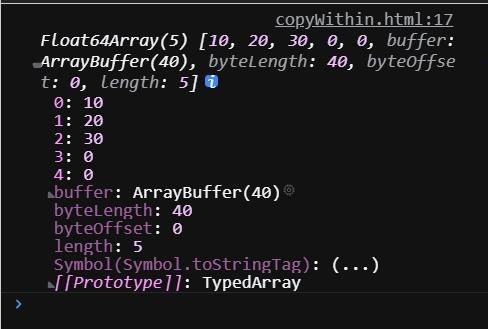

"使用WebGL API、进行位操作、处理文件和图象时， 类型数组都可以大展拳脚。 它用起来和普通数组毫无二致，本章所学的数组方法和功能都可以用于类型数组。" 其实出自书中的这句话有错误。

首先在类型数组上调用  Array.isArray()  会返回false。此外，并不是所有可用于正常数组的方法都能被类型化数组所支持（如 push 和 pop），我也亲手试了下确实不能用，MDN尤其强调不要把普通数组和类型数组混为一谈。

DataView：
是一种底层接口，它提供可以操作ArrayBuffer中任意数据的API。这对操作不同类型数据的场景很有帮助，例如：类型化数组视图都是运行在本地字节序模式，可以通过使用 DataView 来控制字节序。

ArrayBuffer 对象： 
用来表示通用的、固定长度的原始二进制存储空间（或者说...二进制数据缓冲区? ), 它是一个字节数组(在某些语言中称作byte array)。我们不能直接操作 ArrayBuffer 中的内容，<strong>而是要通过 类型数组 或 DataView 对象来操作,这两种方法我会各举一个例子</strong>，它们会将ArrayBuffer中的数据表示为特定的格式，由此来读写缓冲区的内容。
前端方面只要是处理大数据或者想提高数据处理性能，一定少不了 ArrayBuffer.

看下这个ArrayBuffer, 他后面那个小括号里的数字就是指生成出了一个多少字节的存储空间：

```javascript
var buffer = new ArrayBuffer(16);
```
为了读写这段内容，需要为它创建一个视图，视图将把 ArrayBuffer 这个二进制存储空间内的数据格式化为一个(就本例来说)32位的有符号整数数组：
这里使用类型数组方式进行读取:
```javascript
var int32View = new Int32Array(buffer);
```
现在即可以访问普通数组的形式进行访问：
```javascript
for (var i = 0; i < int32View.length; i++) {
  int32View[i] = i * 2;
}
```
或者
使用DataView的方式进行读取:
```javascript
var buf = new ArrayBuffer(32);
//DataView的创建,需要提供ArrayBuffer实例作为参数：
var dataView = new DataView(buf);
//然后以不带符号的8位整数格式读取第一个元素:
dataView.getUint8(0) // 0
```
以不带符号的8位整数格式，读取第一个元素得到0，因为ArrayBuffer对象内默认所有位都是0:
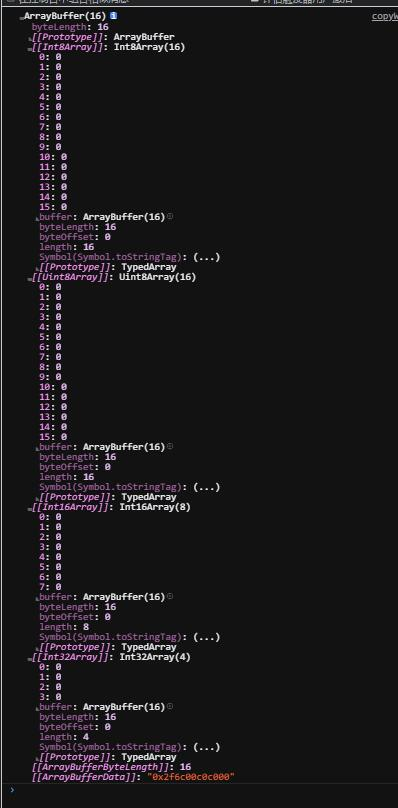
[可以点这看看大佬写的](https://www.jianshu.com/p/5a841d6d7cc3)

---

# 总结 & 续篇
我寫了14000個字, 14000個字啊(震声)! 
你看我这么耐心的整理(雖然寫了很多廢話), 它现在比原作都長! 
這很累人的! 

所以, 所以給它点個贊好嗎？
