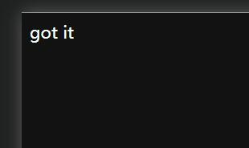
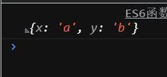

# 第二章 ECMAScript和TypeScript概述
@[TOC](文章目录)

<hr style=" border:solid; width:100px; height:1px;" color=#000000 size=1">

# 前言
第一章是JS基础, 我就先不记录了.
我看到前面这两章跟数据结构关系不大,反倒有很多ES6的新知识.
打算先把这些集中记录下来,到后面的数据结构章节会开篇单独记录.

<hr style=" border:solid; width:100px; height:1px;" color=#000000 size=1">

# 一、let const
这个以前写过了, 我回头看了看, 完善了一下..

<hr style=" border:solid; width:100px; height:1px;" color=#000000 size=1">

# 二、模板字面量
## 支持换行
一种针对字符串的书写方法,以前我们用被引号括住的字符来表示字符串,但是每到换行就得用特殊的处理方法,这并不符合常规的书写习惯,在ES6中引入的模板字面量写法很好的解决了这个问题.
将引号替换为``,这将使得浏览器能够将代码中字符串的换行正确的解析出来,而不是直接忽略:

```javascript
console.log(`
我
不
知
道
`)
```

但是不要把它放在innerHTML里使用,那是无效的:

```javascript
var div = document.querySelector("div");
div.innerHTML = `got
                 it`
```


大多使用在JS中需要提供字符串的时候,使用双引号来书写就无法支持换行.使用模板字面量则可以很好的解决这个问题.

## 拼接方式
模板字面量有自己的一种字符串拼接方式,而不是像以前那样直接使用加号来把字符串和变量拼接在一起.
例:

```javascript
`字符串前段${变量名}字符串后段`
```

```javascript
const name = "瓜";
    console.log(`你**劈我${name}是吧!
                 我!
                 唉! 好哇!`);
```


<hr style=" border:solid; width:100px; height:1px;" color=#000000 size=1">


# 三、函数的默认参数
定义默认参数后, 若实参未能接收到参数,将使用默认参数以保证函数继续执行.
公式:

```javascript
function sum(参数1 = 默认参数值1, 参数2 = 默认参数值2, 参数3 = 默认参数值3) {
    //函数体;
}
sum();
```
例:

```javascript
function sum(x = 1, y = 2, z = 3) {
    console.log(x + y + z);
}
sum();
```

<hr style=" border:solid; width:100px; height:1px;" color=#000000 size=1">

# 四、展开运算符
将数组展开为单个的数组元素,每个元素之间相隔一个字符距离;
可以让你免于在函数上亲手写上一大堆难看的参数的垃圾体验;
公式:
```javascript
let 数组名 = [元素1, 元素2, 元素3];
console.log(...数组名);
```

你可以用它来直接将一整个数组内的元素作为参数传入一个函数,各个分离出的数组元素也会刚好对应到各个参数上:

```javascript
let params = [3, 4, 5];
console.log(sum(...params));
//相当于写了console.log(sum(3,4,5));
function sum(x = 1, y = 2, z = 3) {
    return x + y + z;
}
```


<hr style=" border:solid; width:100px; height:1px;" color=#000000 size=1">

# 五、增强的对象属性

## 1.数组解构
可用于一次性声明多个变量, 通过左右数组中元素的对应关系来实现;

```javascript
let [x, y] = ['a', 'b'];  //相当于写了 let x = 'a';let y = 'b';
console.log(x);
console.log(y);
```
<hr style=" border:solid; width:100px; height:1px;" color=#000000 size=1">

可用于进行对变量值的互换, 而不需要创建第三个变量,是的,现在当你的C语言老师问你"我要把一瓶酱油和一瓶醋对调,一共需要几个瓶子"的时候你可以自信的跟他说:"两个".

```javascript
let var1 = 'a';
let var2 = 'b';
[var1, var2] = [var2, var1];
console.log(var1, var2);  //b  a;
```

## 2.属性简写
感觉实用性不高,其实这个方法 是基于数组解构实现的:

```javascript
let [x, y] = ['a', 'b'];
let obj = {x, y};
console.log(obj);
```


## 3.简写方法名
使用更加简单的方式来声明一个方法,其实我们经常在Vue项目里见到这两种写法:

```javascript
方法名() {
//函数体;
}
```

```javascript
方法名: function 函数名() {
//函数体;
}
```
<hr style=" border:solid; width:100px; height:1px;" color=#000000 size=1">

# 六、乘方运算符
在以前的版本中要进行乘方运算, 只能一个个累乘或者使用数学函数Math.pow()来完成,而在ES6出现的"**"乘方运算符使你不用再受此等折磨:
公式:

```javascript
(底数 ** 次方数);
```

例:
```javascript
const area = 3.14 * (r ** 2);
```

# 总结
这是第二章的记录.
下张就正式开始数据类型部分了,到时候我也会同步上传笔记.