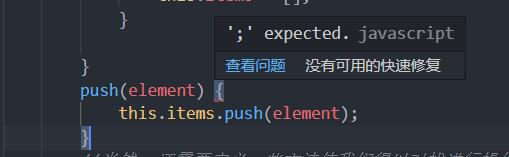
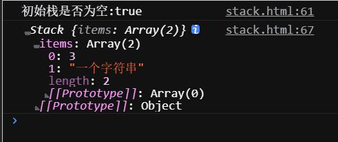
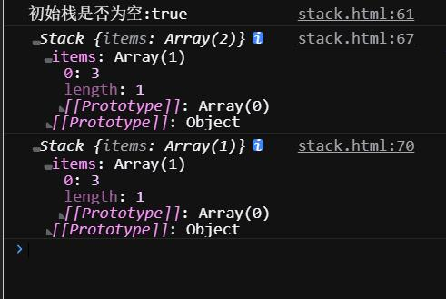
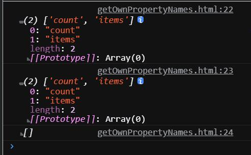
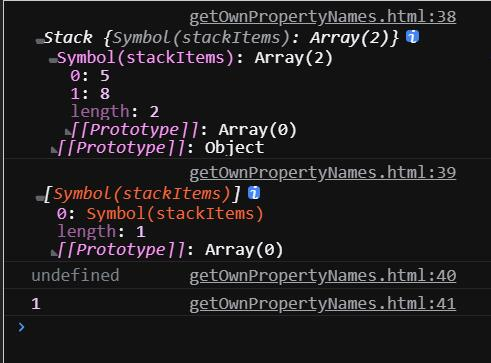
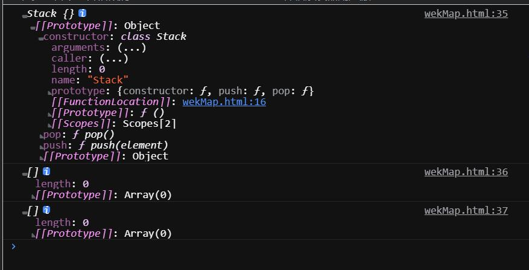
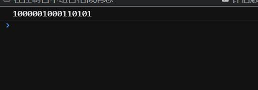

@[TOC](文章目录)

<hr style=" border:solid; width:100px; height:1px;" color=#000000 size=1">

# 前言
食用方法:请着重看下创建数组栈的步骤, 由于创建方便, 下半篇的例子大都基于数组栈来说明.
三四章看不懂请回来看第二章
请至少在看完前三章后再去看第五章...
<hr style=" border:solid; width:100px; height:1px;" color=#000000 size=1">

# 一、栈？
栈，英文Stack（这个洋名很重要），下文会多次提及；

是一种遵从先进后出原则（LIFO）的有序结合，新添加或者待删除的元素都保存在栈的同一端即栈顶，那另一端自然就是栈底。
栈也可以用于在编译器和内存中保存变量和方法，另外，浏览器的历史记录和路由也和栈有关。
<hr style=" border:solid; width:100px; height:1px;" color=#000000 size=1">

# 二、构建两种栈的大致步骤
书上讲述了两种栈的创建方式，两者之间存在大量的相似之处。

 1. 都要先声明一个Stack类:
 
```javascript
class Stack {
  constructor() {
  //constructor方法内有不同
  }
}
```

2. 都要定义一系列方法来预备对栈进行的操作(如存入和取出),但针对数组和对象构建的栈, 定义的方法自然不能相同;

3. 在使用之前都要初始化Stack类:

```javascript
const 自定义名 = new Stack();
```
<hr style=" border:solid; width:100px; height:1px;" color=#000000 size=1">

# 三、创建基于数组的栈
创建一个Stack类最简单的方式是使用数组. 

## 创建class Stack
```javascript
class Stack {
  constructor() {
    this.items = [];
    //需要一种数据结构来存储栈中的元素, 这里选择了数组items.
  }
}
```

## 定义用于操作栈的方法
既然是基于数组的栈, 那我们就使用与数组方法同名的自定义方法吧...
考虑到函数同名的问题,个人不推荐把这些自定义方法写在class Stack外面;
举例:写了push之后JS会马上判定为数组的push方法并且报错你没加分号而不是判定它为一个自定义方法:

但是写在类里面你就不用担心这种奇怪的问题, 那我就直接展示在类里面的写法:

```javascript
        class Stack {
            constructor() {
                this.items = [];
            }
            
            push(element) {  
            //向栈顶添加一个元素
                this.items.push(element);
            }

            pop() {  
            //从栈顶移除一个元素
                return this.items.pop();
            }

            peek() {  
            //查看栈顶元素,由于使用数组存储,最新加入的处于栈顶的元素可使用length-1取到;
                return this.items[this.items.length - 1];
            }

            isEmpty() {
            //检测当前栈是否为空;
                return this.items.length === 0;
            }

            size() {
            //返回栈的长度;
                return this.items.length;
            }

            clear() {
            //清空栈, 也可以多次调用pop来解决;
                this.items = [];
            }

        }
```

## 使用栈
第二节说了我们需要先初始化Stack类才能使用它, 一个不错的习惯是先初始化然后再验证一下其是否为空:

```javascript
const myStack = new Stack();  //初始化;
console.log(myStack.isEmpty());  //true;
```
我这里使用的myStack是基于上面的Stack类存在的, 这部是在初始化上面声明的Stack类, 来去掉Stack类看看:
    
```Uncaught ReferenceError: Stack is not defined```

嗯, 然后这个栈就建完了, 来试一下吧:

```javascript
let arr = [3, 5, 6];
myStack.push(...arr); 
myStack.push("一个字符串");
console.log(myStack);
```
相当于myStack.push(3, 5, 6), 但是定义push方法时定义了只能传一个参;
故只有第一个参数3会被传入class Stack数组items里的第0位


另外在测试pop方法的时候发现栈似乎有些特性...
先push两个元素进去, 输出得到结果A.
然后pop移除栈顶的一个元素,刷新页面再次输出,两个结果都会是删除栈顶元素后的栈
即便第一次输出的代码排在pop之前:

```javascript
console.log("初始栈是否为空:" + myStack.isEmpty()); 
let arr = [3, 5];
myStack.push(...arr);
myStack.push("一个字符串");
console.log(myStack);   //67行;
myStack.pop();
console.log(myStack); //70行;
```



<hr style=" border:solid; width:100px; height:1px;" color=#000000 size=1">

# 四、创建基于对象的栈
与创建数组型栈的步骤很相似, 不做细说了.
即便十分方便, 用数组来创建栈依然存在诸多缺点, 若用n代表数组的长度，大部分方法访问数组时的时间复杂度是O(n), 这个公式的意思是我们需要迭代数组直到找到目标元素，甚至需要迭代整个数组。
此外,数组有序化的存储方式会占用更多的内存空间。

## 创建class Stack
```javascript
        class Stack {
            constructor() {
                this.count = 0;
                this.items = {}
    //需要一种数据结构来存储栈中的元素, 这里选择了数组items.
            }
```

## 定义用于操作栈的方法
```javascript
        class Stack {
            constructor() {
                this.count = 0;
                this.items = {}
            }

            push(element) {
                this.items[this.count] = element;
                this.count++;
            }

            pop(element) {
                if (this.isEmpty()) {
                    return undefined;
                }
                this.count--;
                const result = this.items[this.count];  
                //将被删除的元素赋值给result;
                delete this.items[this.count];
                //delete操作符用于删除对象中的某个属性;
                return result;  
                //返回被删除的元素;
            }

            peek(element) {
                if (this.isEmpty()) {
                    return undefined;
                }
                return this.items[this.count - 1]; 
                 //length-1取到栈顶值;
            }

            isEmpty(element) {
                return this.count === 0;
            }

            size() {
                return this.count;
            }

            toString () {
            //对象型栈无法使用toString数组方法,需要自定义方法来对栈内容进行打印;
                if(this.isEmpty()) {
                    return '';
                }
                let objString = `${this.items[0]}`;  
                //使用最底部字符串作为初始值
                for(let i = 1; i < this.count; i++) {
                //遍历整个栈内的键直到栈顶;
                    objString = `${objString}, ${this.items[i]}`;
                }
                return objString;
            }

            //这样下来除了toString方法, 其他几个方法的时间复杂度均为O(1), 也就是说都不用进行遍历.
        }
```
## 使用栈
```javascript
const mystack = new Stack();
console.log(peek);
stack.push(5);
stack.push(8);
```
<hr style=" border:solid; width:100px; height:1px;" color=#000000 size=1">

# 五、保护数据结构内部元素
"在创建别的开发者也可以使用的数据结构或对象时, 我们希望保护内部的元素,只有我们暴露出的方法才能修改其内部结构. 要确保元素只会被添加到栈顶, 而不是栈底或者其他什么地方, 不幸的是上面所举的栈并没有得到保护."

"本章使用ES2015语法创建了Stack类, ES2015的类是基于原型的, 尽管基于原型的类可以节省内存空间而且在扩展方面优于基于函数的类, 但这种方式不能声明私有属性或方法."

简而言之, 我们不希望栈内部的东西能被外面看到或者改写, 只允许人们从栈顶用我们定义好的方法进行操作, 将这一摞书外面套一层水泥管.

## 演示:暴露的栈模型
就常规的栈而言, 使用Object.getOwnPropertyNames()方法可以get到指定对象的所有属性名组成的数组, keys()也可, 就算直接输出都可以:

```javascript
class Stack {
  constructor() {
    this.count = 0,  //count不能是字符串;
    this.items = [];
  }
}

const stack = new Stack();
console.log(Object.getOwnPropertyNames(stack));
console.log(Object.keys(stack));
```



## 基于ES6 Symbol实现的半私有类
书中先尝试使用ES6 Symbol类型实现类, 来达到保护栈内元素不受损伤的目的.
Symbol是ES6新增的一种数据类型, 它是不可变的, 可用作对象的属性.
但是ES6对应的也伴生了getOwnPropertySymbols()方法可以破解这一保护措施:
"该种方法创建了一个假的私有属性, 因为ES6新增的Object.getOwnPropertySymbols方法能访问目标类里面所有的Symbols属性"

不论如何, 先看下这个例子(构建栈的方法还是没有做出改变的):

```javascript
const _items = Symbol('stackItems');
//创建class Stack;
class Stack {
  constructor() {
    this[_items] = [];
  }

//构建自定义方法push;
  push(element) {
    this[_items].push(element);
  }

}

//初始化Stack类, 准备进行操作;
const myStack = new Stack();
myStack.push(5);  //操作:压入元素5;
myStack.push(8);  //操作:压入元素8;

let objectSymbols = Object.getOwnPropertySymbols(myStack);

//此处相当于是把myStack这个类砸开了一个叫objectSymbols的缺口
//经由objectSymbols这个缺口我们可以访问到myStack类中的各种属性;
```
对比未执行getOwnPropertySymbols()的结果输出一下:
```javascript
console.log(myStack);  //直接输出myStack
console.log(objectSymbols);   //输出经过处理的myStack
console.log(myStack.length);  //直接输出长度
console.log(objectSymbols.length);  //输出经过处理后的长度
```

经过处理后的myStack返回的是symbol属性stackItems, 由于处理后只能返回symbol属性, 最终结果的详细程度反倒不如直接输出myStack高;

## 基于ES6 weakMap实现的私有类
weakMap类型可以确保属性是私有的, weakMap可以存储键值对, 其中键是对象, 值可以是任意数据类型.

```javascript
const items = new WeakMap();  //weakMap型变量items;
//将一个变量转换为WeakMap类与将其转换为Symbol类的方法很像吧?
class Stack {
  constructor() {
    items.set(this, []);  //将代表栈的数组存入items;
  }

//定义用于操作栈的方法
  push(element) {
    const s = items.get(this);
    s.push(element);
  }

  pop() {
    const s = items.get(this);
    const r = s.pop();
    return r;
  }
}

//初始化Stack类, 准备使用栈
const myStack = new Stack();
myStack.push(3);  //操作:压入3;
myStack.push(6);  //操作:压入6;
```
这是受保护的栈了, 我们输出一下看看大概就可以证明:

```javascript
console.log(myStack);
console.log(Object.getOwnPropertyNames(myStack));
console.log(Object.keys(myStack));
```

依靠这种简单的手段, 我们几乎不能获取到任何栈内部的数据和构造信息, 不能直接访问.


<hr style=" border:solid; width:100px; height:1px;" color=#000000 size=1">

# 六、用栈解决问题
栈的实际应用十分广泛.
在有回溯需求的问题上, 它可以存储访问过的任务或路径、撤销的操作. 
Java和C#用栈来存储变量和方法调用.

书上举的例子是一个十进制转二进制的进制转换问题.

```javascript
//创建基于数组的栈
class Stack {
  constructor() {
    this.count = 0;
    this.items = [];
  }
  //定义用于操作数组的各项方法;
  push(element) {
    this.items.push(element);
  }

  pop() {
    return this.items.pop();
  }

  peek() {
    return this.items[this.items.length - 1];
  }

  isEmpty() {
    return this.items.length === 0;
  }
}

function decimalToBinary(decNumber) {
  const remStack = new Stack();
  //在哪里使用栈就在哪里初始化栈;
  let number = decNumber;
  let rem;
  let binaryString = '';

  while (number > 0) {
    rem = Math.floor(number % 2);  //除法结果不为0时就将取整后的余数入栈
    remStack.push(rem);
    number = Math.floor(number / 2);  //除完一次取整继续除
  }

  while (!remStack.isEmpty()) {
    //二进制字符
    binaryString += remStack.pop().toString();  //将可出栈的元素链接为字符串, 清栈;
  }

  return binaryString;  //return出二进制数值 
}

console.log(decimalToBinary(33333));
```


# 总结
下篇将是第四章《队列和双端队列》，可能会咕一段时间了，最近出了好多事情，有点累了。