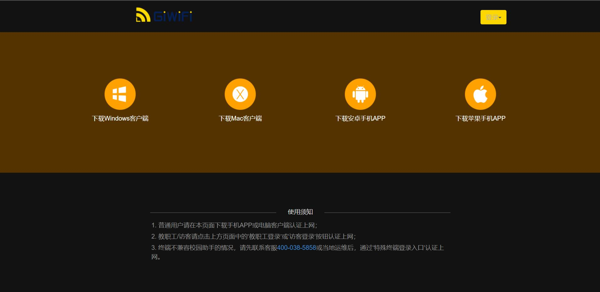
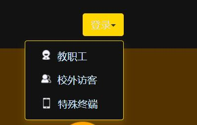
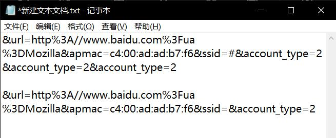
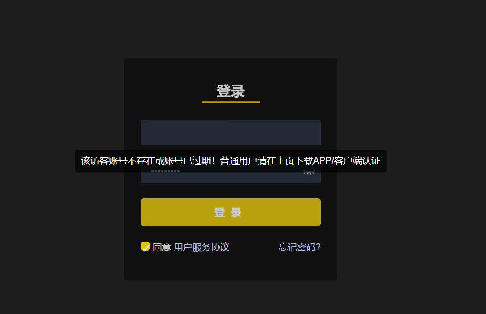
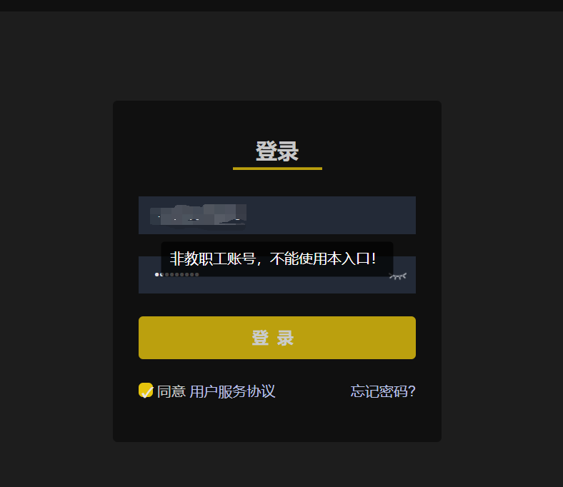
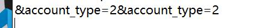
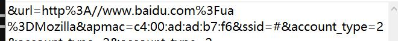

@[TOC](文章目录)

# 前言
学校在用GiWFi...
今下午用的好好的突然就掉线了, 然后重连就提示我必须下载他们的PC客户端, 不然就不让用.
每天早上来这么一遍也就算了, 现在欺负到头上来了, 哈, 就不下.

# 一、寻找方法ing...
平时,每天都要登录一次GiWiFi, 观察过, 一般是会跳到Mozilla, 然后这时候就连接了,直接关掉就能上网了.
还有一种情况是周期性发生的(啊,其实也不是很周期性), 就是普通用户需要输入密码来完成登录.
不过最近出现的最多的还是这种主页:

你如果点击右上角登录,它会弹出一个下拉列表:

但我只是一个臭学生.
这三个登录途径都不是为普通用户提供的, 特殊终端途径貌似是最近新增的.

我先观察了一下各个登录途径的URL, 然后我发现每条登录途径都有一个后缀:accout-type,这个词组甚麽意思就不用说了,我推测他应该是依据当前的用户级别来进行判断,判断页面的强制跳转, 而我发现它的主页后缀额外带了一小段数据(主页是上面那段):

"账户类型-2"
如果去掉这段那么会直接跳转到"特殊终端"用户等级的登录渠道
那基本可以确定2级用户是特殊终端用户了.
我想按照顺序那么校外访客应该是1级而教职工是0级,那普通用户会不会是3级?

将后面的尾缀改为"3"发现是校外访客级:

 改为1发现是教职工:
 

然后改到0发现是普通用户登录渠道:

(别看了,登上去了,图也没截到)

# 二、直接登录
将URL的最后一段去掉:

此时末端URL应当为:

将最后的2修改为0即可进入普通用户登录渠道,无需下载PC客户端.

# 总结
应该会有时效性的吧...