@[TOC](文章目录)

<hr style=" border:solid; width:100px; height:1px;" color=#000000 size=1">

## 文章导读
`这是导读部分, 你可以停下来看看它, 说不定可以节约下更多的时间.`

这篇文章...很长(所以它是很长的文章), 我想如果你已经对flex布局有一定程度的了解的话, 你可以拣选章节来看, 用目录来进行锚点传送.

前面两章可能会有些无趣, 到后面就好了.

全篇代码格式都是一样的, vessel是容器, flex-item代指代码里的box;

<hr style=" border:solid; width:100px; height:1px;" color=#000000 size=1">

# 一、justify-content
规定flex-Item在主轴上的对齐方式, 主轴在默认情况下是横向的.
### center
在主轴(main axis)方向居中对齐, flex-Item们会挤在主轴的中央, 如果你没有设置任何能说服它们分开的属性:

```css
/* vessel即灰色部分的flex容器 */
.vessel {
  display: flex;
  height:600px;
  width:600px;
  background-color: rgb(197, 204, 202);
  
  justify-content: center; 
}
```

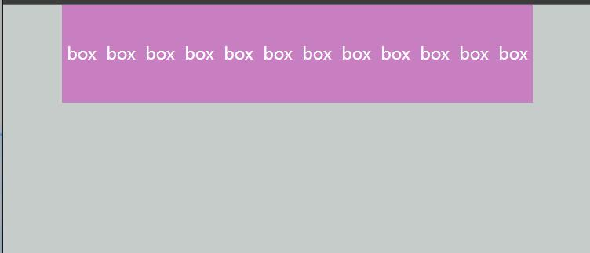
### flex-start
对齐主轴开始方向,也就是一股脑的挤在主轴开始的一端:
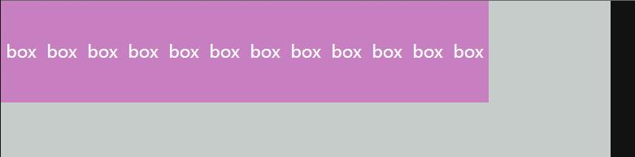
### flex-end
对齐主轴结束方向, 集中挤在主轴结束的一端:
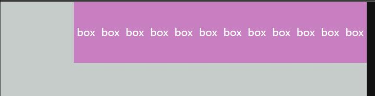

### space-around
令所有flex-Item的左右`margin`相同,但这意味着flex-Item之间的距离将会为2 * `margin`, 而主轴首末的flex-item与容器的距离为1 * `margin`:

```css
/* vessel即灰色部分的flex容器 */
.vessel {
  display: flex;
  height:600px;
  width:600px;
  background-color: rgb(197, 204, 202);
  
  justify-content: space-around;
}
```
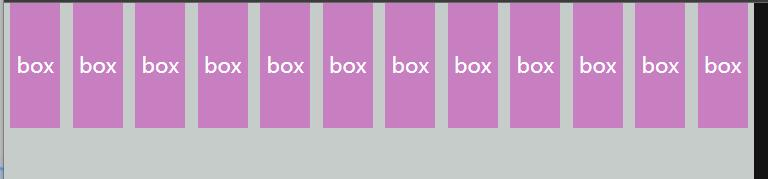
时常会...不那么漂亮.

### space-evenly
可能是我们认识的真正意义上的"均匀分布", 不论是flex-Item之间的边距还是与容器之间的边距都是相等的:

```css
.vessel {
  display: flex;
  height:600px;
  width:600px;
  background-color: rgb(197, 204, 202);
  
  justify-content: space-evenly;
}
```
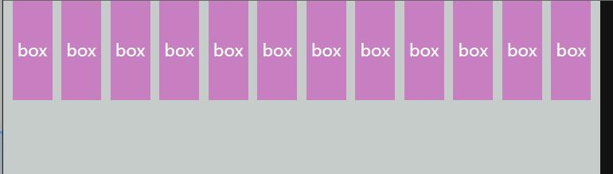

### space-between
两端对齐,中间均匀分布,跟`space-evenly`的效果是一样的, 就是这个的首末会贴边.

```css
.vessel {
  display: flex;
  height:600px;
  width:600px;
  background-color: rgb(197, 204, 202);
  
  justify-content: space-between;
}
```
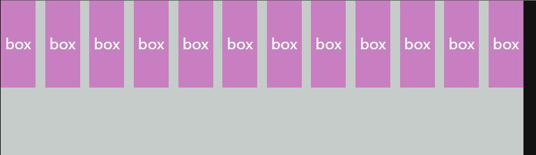

<hr style=" border:solid; width:100px; height:1px;" color=#000000 size=1">

# 二、align-items
决定`flex-Item`在交叉轴(Cross axis)方向的对齐方式, 交叉轴在默认情况下是纵向的.
你可以把它和`justify-content`放在一起使用.
### center
```css
/* 此时box未被规定高度 */
.vessel {
  height: 200px;
  width: 200px;
  background-color: rgb(197, 204, 202);
  display: flex;
  justify-content: center;
  
  align-items: center;
}
```
在交叉轴方向居中对齐, 也就是默认情况下的纵向居中对齐:
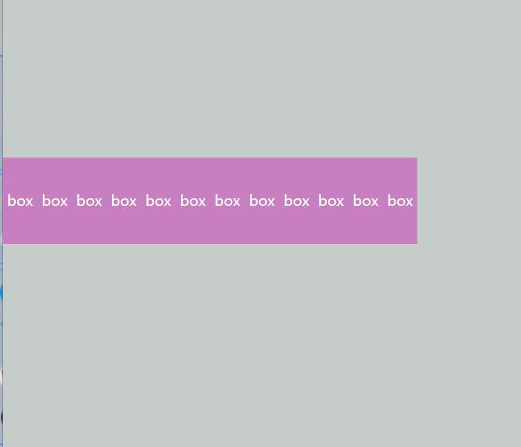
在`justify-content:center`的情况下使用这个属性来达到横纵居中的效果, 就像这样:
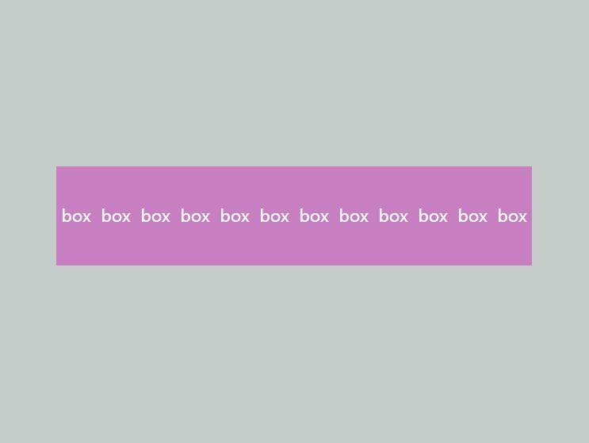
<hr style=" border:solid; width:100px; height:1px;" color=#000000 size=1">

### flex-start
```css
/* 此时box未被规定高度 */
.vessel {
  height: 200px;
  width: 200px;
  background-color: rgb(197, 204, 202);
  display: flex;
  justify-content: center;
  
  align-items: flex-start;
}
```
在交叉轴方向  向交叉轴开始处对齐,默认情况下也就是对齐上部:
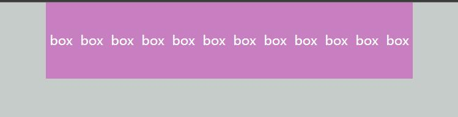
<hr style=" border:solid; width:100px; height:1px;" color=#000000 size=1">

### flex-end

```css
/* 此时box未被规定高度 */
.vessel {
  height: 200px;
  width: 200px;
  background-color: rgb(197, 204, 202);
  display: flex;
  justify-content: center;
  
  align-items: flex-end;
}
```
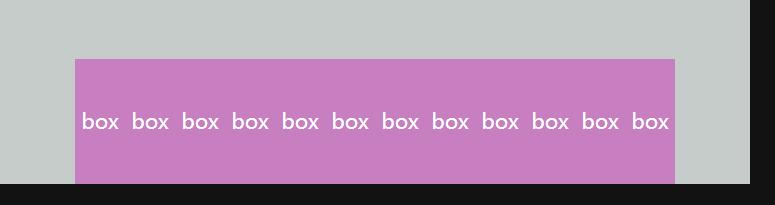
<hr style=" border:solid; width:100px; height:1px;" color=#000000 size=1">

### stretch
使用前提是flex-item在交叉轴方向不能规定长度(`height`, `width`等),否则该属性将无法生效.
在交叉轴方向不进行对齐, 会直接将[`flex-item`在交叉轴方向的尺寸]拉伸至与 [容器在该方向的尺寸] 相同.

```css
/* 此时box未被规定高度 */
.vessel {
  height: 200px;
  width: 200px;
  background-color: rgb(197, 204, 202);
  display: flex;
  justify-content: center;
  
  align-items: stretch;
}
```
你可以看到它是直接将flex-item在交叉轴方向拉长, 而不是进行对齐.
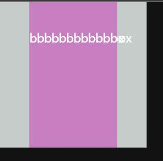

<hr style=" border:solid; width:100px; height:1px;" color=#000000 size=1">

# 三、align-content
在flex-item出现多行的情况(比如一行空间不够不得不动用下一行)时, 该属性提供交叉轴方向更合理的对齐方式.

我看到有人说`align-content`不能在非多行情况下对齐flex-item, 而我做的时候却可以(见下面代码), 发现是因为我添加了`flex-wrap:wrap`, 允许了有多行情况出现(`flex-wrap`这个属性默认情况下是"nowrap"也就是不准换行).

```css
.vessel {
  height: 400px;
  width: 400px;
  background-color: rgb(78, 228, 175);
  display: flex;
  justify-content: center;
    
  flex-wrap: wrap;
  align-content:center;
}
```
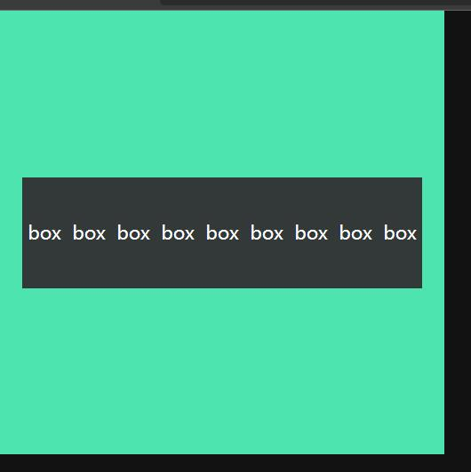

你可以看到顺利的完成了对齐, 即便没有多行情况出现.
所以我有端猜想这个属性与`flex-wrap`的值挂钩, wrap允许换行后, 即便不实际出现换行, `align-content`属性也可以被启用;

我前面说到了"该属性提供交叉轴方向更合理的对齐方式"为什么是 "更合理" 呢, 因为其实`align-items`属性也可以对齐多行的flex-item, 但是两者的对齐方式略有区别(见下方比对).

举例: 现在有10个box, 一行排不下的情况下它们去到了第二行.
这是`align-items:center`提供的对齐方式, 你可以看到中间莫名的多了空白区域, 两行沿中线对称了.
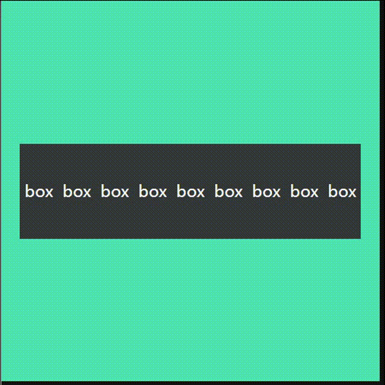

这是`align-content:center`的对齐方式:
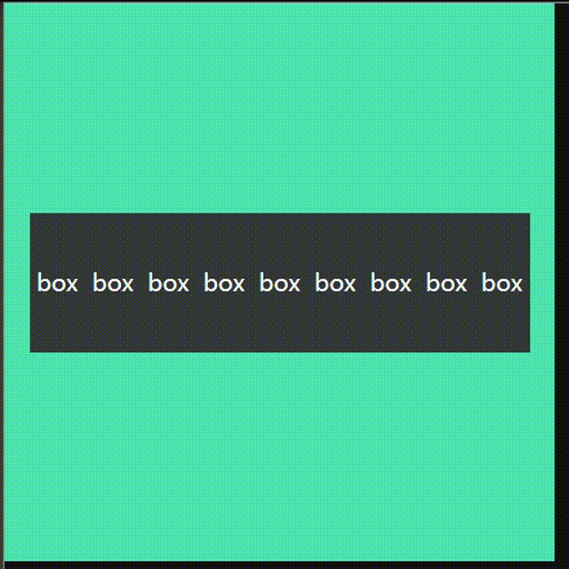
就是这样了, 它的优先级始终是比`align-items`要高的, 参考下方示例, 不论单行还是多行情况, 对齐方式在`align-items: flex-start;`和`align-content:center;`中都选择了center居中对齐.

所以我觉得需要媒体查询或者别的甚麽来改变对齐方式的话,最好不要把两者放在一起使用,在大屏单行下使用`align-items`,在小屏多行环境下选择`align-content`.
但如果不论视口怎么变化都只需要一种排列方式, 建议在添加`flex-wrap:wrap`属性后只使用`align-content`进行规定, 毕竟它在不分行环境下也可以很好的完成工作.

<hr style=" border:solid; width:100px; height:1px;" color=#000000 size=1">

### center
规定在主轴方向出现多行情况时, 所有flex-Item在交叉轴方向实行中心对齐:

```css
.vessel {
  height: 400px;
  width: 400px;
  background-color: rgb(78, 228, 175);
  display: flex;
  flex-wrap: wrap;
  justify-content: center;
  
  align-content:center;  
}
```

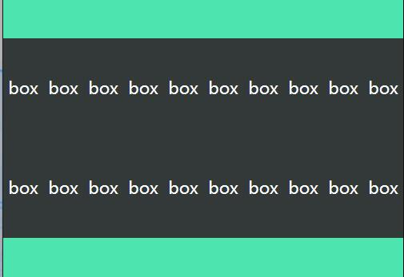
center前面已经展示过两次啦...

<hr style=" border:solid; width:100px; height:1px;" color=#000000 size=1">

### space-around
在出现多行情况时, 令每行的上下`margin`相同, 这也意味着行与行之间的间距会为2 * `margin`, 而行与容器间的距离将为1*`margin`.
```css
.vessel {
  height: 600px;
  width: 600px;
  background-color: rgb(78, 228, 175);
  display: flex;
  flex-wrap: wrap;
  justify-content: center;
  
  align-content: space-around; 
}
```
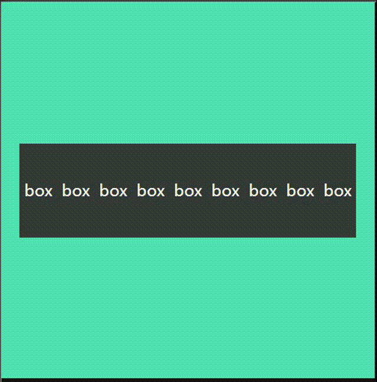
看起来有点像直接使用`align-items:center`.......是吧?

<hr style=" border:solid; width:100px; height:1px;" color=#000000 size=1">

### space-evenly
在出现分行情况时, 令各行完成真正意义上的(可能是吧, 我觉得是)均匀分布.

```css
.vessel {
  height: 600px;
  width: 600px;
  background-color: rgb(78, 228, 175);
  display: flex;
  flex-wrap: wrap;
  justify-content: center;
  
  align-content: space-evenly; 
}
```
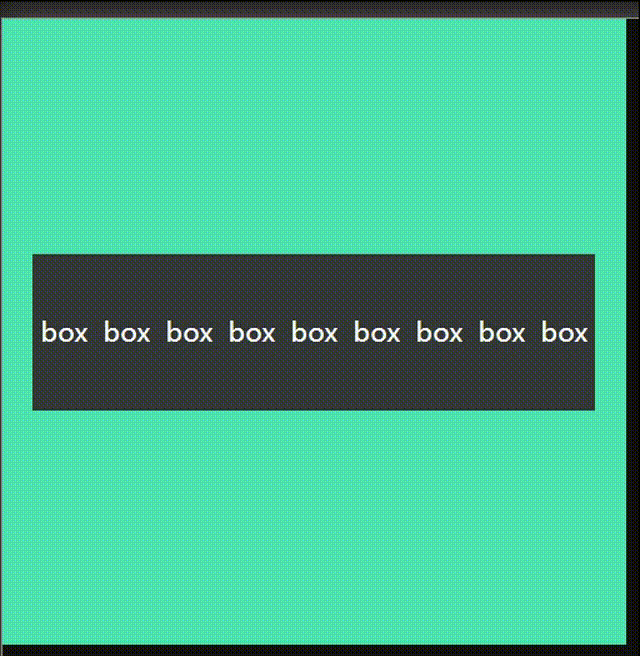
你可以看到图中所有的间距都是相等的, 而不是像`align-content: space-around`中那样, 中间大两边小.

<hr style=" border:solid; width:100px; height:1px;" color=#000000 size=1">

# 四、flex-wrap
决定在有换行需求时,是否允许换行.
常见于缩小窗口时决定是将一整行的边距和宽度均缩小还是直接另起一行.
### nowrap
"no""wrap" 不要换行.
在容器缩小到不再能容纳下flex-item们时, 它们之间的距离首先会遭受压缩,最后距离也压缩到极限, 便开始压缩自己.

```css
.vessel {
  height: 300px;
  width: 300px;
  background-color: rgb(197, 204, 202);
  display: flex;
  justify-content: space-evenly;
            
  flex-wrap: nowrap;
}
```

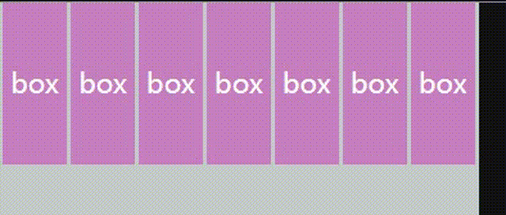

<hr style=" border:solid; width:100px; height:1px;" color=#000000 size=1">

### wrap
在主轴方向空间不足时允许进行换行,你可以看到换行的规则是先压缩掉所有空间,如果还不够才会换行.

换行之后两行之间会有很大的一段空隙, 你需要设置`align-content`属性来规定换行后在交叉轴方向的对齐方式.
```css
.vessel {
  height: 300px;
  width: 300px;
  background-color: rgb(197, 204, 202);
  display: flex;
  justify-content: space-evenly;
            
  flex-wrap: wrap;
}
```
以下是未经`align-content`处理过的换行:

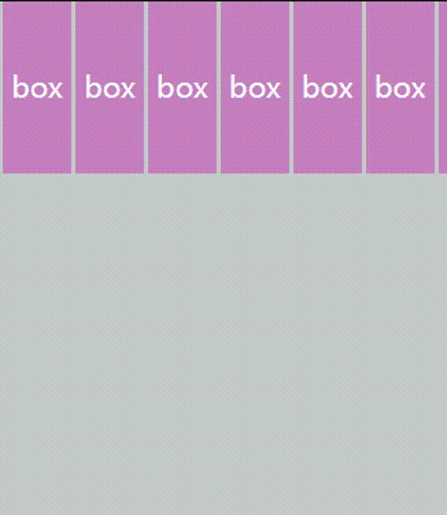

<hr style=" border:solid; width:100px; height:1px;" color=#000000 size=1">

# 五、flex-shrink
决定在空间不足时以何种比例压缩flex-Item来创造空间, 你可以给它一个数字类型的值.
比较常见的就是在容器遭到压缩, 各个flex-Item之间的距离压缩殆尽的时候, 依据何种比例来压缩各个flex-Item的问题.

与`flex-grow`属性值默认为0不同, `flex-shrink`属性值默认为1,这便是为什么容器内的元素默认可以随着容器压缩而缩小.

注意事项: 若该属性添加后main axis向仍有剩余空间, 该属性不会生效.

```css
/* 
  为了对比出felx-shirink的值对flex-Item的影响,
  我为各个box的flex-shirink属性赋予不同的值, 
  现在一起来看看变化吧.
*/
  
.box {
  height: 100px;
  width: 50px;
  text-align: center;
  line-height: 100px;
  background-color: rgb(61, 88, 88);
}

.box1 {
  flex-shrink: 3;
  background-color: rgb(255, 144, 144);
}

.box5 {
  flex-shrink: 5;
  background-color: rgb(75, 189, 255);
}

.box10 {
  flex-shrink: 0.7;
  background-color: rgb(74, 155, 74);        }  
```
这里所有box的宽度都是一样的,所以我们用 [触碰到文字基线] 来判定一个box被压缩的速度, 首先碰到基线的(即横向尺寸不再改变的)就是被压缩的最狠的.
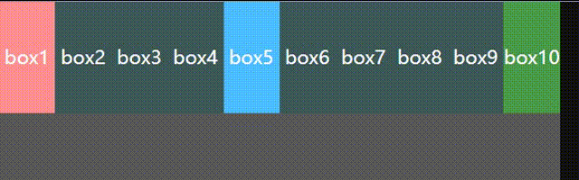

肉眼可见的是`flex-shrink`的值越大被压缩的速度就越快, 比如这里box5最先碰到基线.

flex-Items能收缩到的最小尺寸为你设定的 `min-width` & `min-height`.
目前观察到即使不规定`min-width`, 最小也只能到文字基线, 如果此时还有缩小需求的话会直接戳破容器顶出来, 而不会压缩或遮盖文字.

<hr style=" border:solid; width:100px; height:1px;" color=#000000 size=1">

# 六、flex-grow
决定在flex容器增大时flex-item会以何种比例增大.
当用户以拉伸窗口等方式将flex容器拉伸时, 内部的flex-item不改变就显得很空旷, 我们需要内部的flex-item以一定的拉伸比例跟着容器增大.

它的默认值为0, 即在规定前不会生效.
与flex-shrink用法相似, 你可以给它一个数字值, 只不过它是控制增大比例的...

```css
.box {
  height: 100px;
  width: 50px;
  text-align: center;
  line-height: 100px;
  background-color: rgb(85, 223, 223);
}

.box1 {
  flex-grow: 3;
  background-color: rgb(229, 154, 231);
}

.box12 {
  flex-grow: 4;
  background-color: rgb(229, 154, 231);
}
```
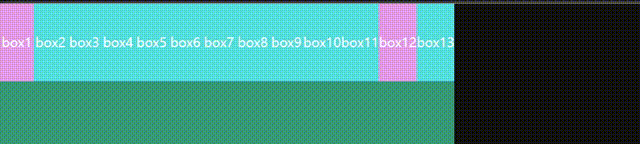

在主轴上没有剩余空间时, `flex-grow`属性不会生效, 当然, 你可以提前把它添加上.
上面这个图...向右扩张就有剩余空间了, 所以会生效的.

<hr style=" border:solid; width:100px; height:1px;" color=#000000 size=1">

# 七、flex-basis
规定元素在成为flex-items之前的大小, 也就是不受flex布局影响时的大小.
并非实际大小, 实际大小指的是受到flex布局影响后的大小.

在flex布局中使用该属性设置主轴向尺寸不会出现超出容器的情况, 即便你的flex-item合在一起早就足以超出容器一大截, 它们也只是会被压缩到容器刚好能盛下.
比如5个flex-item的横向尺寸均为60px, 但是依旧不会超出500px的flex容器, 与之相反的是如果使用`width`来规定flex-Item的话主轴向尺寸会超出.

我想你可以认为它是我们给浏览器的一个预想吧, 一个美好的预想, 让浏览器觉得它有flex-basis说的那么那么的——大(或者小)! 好让浏览器根据这个标准给它独家定制一套伸缩方案，虽然flex-Item现在只有那么一丁点儿.

为什么要给浏览器一个预想呢?

浏览器会根据这个属性的值来判定主轴方向是否还有剩余空间，比如现在你的容器只有300px, 而且它看起来已经是塞得满满的了, 但你的10个flex-item每个都是flex-basis：60px; 
浏览器一看：“这个容器应该刚好能塞下10个, 共600px宽的item, 所以容器应该是可以拉到600px宽的, 但现在只用了300px, 所以容器在主轴方向应该还有600-300=300px的空间可以使用.” 
然后你就可以一直增大flex-item直到它们的总长达到600px才会超出容器, 我们可以来验证一下是不是这样:

```css
.vessel {
  display: flex;
  height: 600px;
  width: 300px;   /* 容器只有300px宽 */
  background-color: rgb(55, 153, 119);
}

.box {
  height: 100px;
  width: 20px;
  flex-basis: 60px;  /* 我现在定义10个共600px的box */
  text-align: center;
  line-height: 100px;
  background-color: rgb(85, 223, 223);
}

.box1 {
  background-color: #fff;
}

.box10 {
  background-color: rgb(218, 95, 95);
}
```
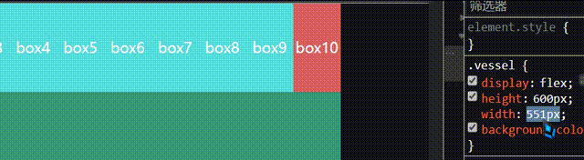
可以看到600px的时候刚刚好能够到达容器的极限尺寸:
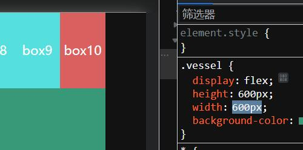
写flex布局的时候偶尔遇到主轴方向不能设置大小的情况, 这个属性应该也能帮得上忙.


它的定位多少跟width属性有些冲突, 我试了一下, 两个属性都存在的情况下width属性其实还会生效,但在Edge这边的话:

如果flex-Item主轴向尺寸小于flex-item的内容尺寸(或者小于baseline), 那就是谁值大按谁的来(前提是没被压缩).
比如width:10px, flex-basis:20px 和 width:20px 和 basis10, 这时候box已经完全容纳不下文字了,  所以这两种组合下, box都会是20px:

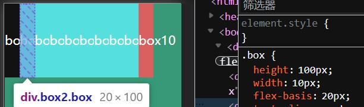

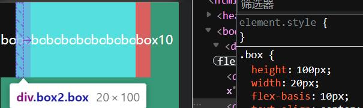

但只要是flex-item主轴向尺寸大于flex-item中内容的尺寸, `flex-basis`的优先级就明显要高,无论width大于还是小于`flex-basis`, 尺寸都以`flex-basis`为准(前提是flex-item没被压缩):
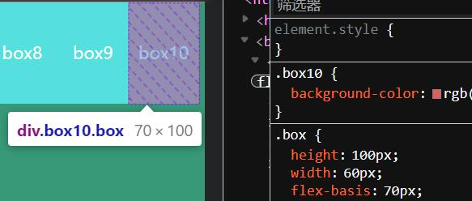
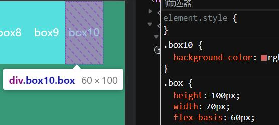
那至于在flex布局中使用`width`还是`flex-basis`还是你自己斟酌喽...

<hr style=" border:solid; width:100px; height:1px;" color=#000000 size=1">

# 八、order
规定同处一个flex容器中的flex-item的排列顺序, "order"本身也有"顺序"的意思.
是的, 就是你想的那个阿拉伯数字的顺序...
没有添加order属性的flex-item默认`order: 0`, 也就是说全部拥有`order`属性的flex-item都会排在非拥有者的后面.

```css
.box {
  height:100px;
  width:40px;
  text-align: center;
  line-height: 100px;
  margin-left:10px;
  background-color: rgb(85, 223, 223);
}

.box1 {
  order:3
}

.box2 {
  order:1
}

.box3 {
  order:2
}
```
下面是效果:
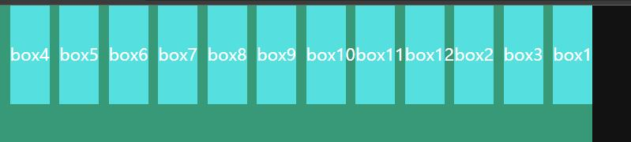
可见添加了`order`属性的box1, box2, box3都依照顺序排列到了未添加`order`的元素的后面.

<hr style=" border:solid; width:100px; height:1px;" color=#000000 size=1">

# 九、轴操作
好吧我刚想起来还有这个, 虽然现在有点晚了, 但也还好, 至少不是在我终于决定要躺下睡一会的时候...
或许我应该把它放到前面去.
我们现在知道在flex布局中有主轴(`Main Axis`)和交叉轴(`Cross Axis`, 我喜欢管它叫副轴)这种概念, 在默认情况下(也就是你没有进行任何轴操作的情况下):

`Main Axis`是沿着flex容器的横向进行分布的, 起始点为左侧, 终止于右侧.

`Cross Axis`与之垂直, 呈现纵向分布, 起始点为上部, 终止于下部.

我们可以利用Flex布局提供的轴操作语法来对轴进行反转和变化等操作, 来实现排列在不同方向的flex布局.

操作轴的属性主要就是`flex-direction`,这个属性可以规定主轴的方向, 它的值可以为4个, 即:

 1. 横向正向  `row`即主轴从右到左(默认)
 2. 横向反转  `row-reverse`
 3. 纵向正向  `column` 即主轴从上到下
 4. 纵向反转  `column-reverse`


`我们只要操作主轴就好了, 交叉轴会根据主轴的改变来做出相应的变化.`
<hr style=" border:solid; width:100px; height:1px;" color=#000000 size=1">

# 总结
aaaaaa~ 
我墨迹了好久, 写前面对齐方式的时候感觉有些枯燥, 我写的不太舒服(你看的估计也不太舒服)...
然后我既不想把文章写的太枯燥也不知道该跟你们聊点甚麽, 就, 就进展比较慢...
我想尽量把它写的有意思一点, 嗯.

好吧, 后面我可能还会回来修改和增添它, 如果它帮到你的话, 荣幸之至.
