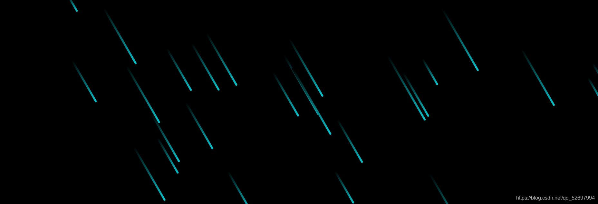

# CSS动画特效的基本构成
@[TOC](文章目录)

# CSS动画效果
  自制定和发布以来，CSS规范便颇受世人青睐。特别是对于专业网页设计者来说，CSS无疑是给他们的设计者带来了新的希望······运用CSS，不仅能设计出精美的网页效果，而且还能提高网页的可访问性，可维护性，从而为网页设计节省大量的时间和精力。
                             ————《CSS权威指南》
                             
  人类居住在一颗美丽的星球上，这是一颗飘泊于太阳系中的蓝色行星，它与太阳系中的其他几颗行星一同围绕太阳系的中心——太阳，无休无止的旋转着。
# 一、动画轨迹,运动路径
我们知道地球约每24小时就会自转一圈，每约一年围绕太阳公转一次，那么无论是自转还是公转，完成后地球必然又会回到那时她开始自转或公转的位置。
地球的转动是按照一定的轨迹进行的，她自然不会随心所欲地围着太阳乱转，地球的运动轨迹是由太空中各种力互相作用最终趋于稳定形成的，这些各种各样来自四面八方的“力属性”最终规定了这颗加了“border-radius:50%;”的巨大的< div >的运动轨迹——“你得从这走，到那去，还得慢一点。”

## 1.规定目标样式
### 属性transfrom：
当我们为某个元素添加了这么个属性后，就确定了我们要让这个“大星球”动弹动弹了，无论是让它自转还是公转，都离不开transform，它的众多属性可以支持我们能想到的各种动弹的方式，在进行一些不太正当的挪动时，还可以通过组合各种transfrom属性的组合使用来调整方位。以下是transform的部分常用属性：
|  属性名  | 效果 |
| -- | -- |
|  translateX(x)  | 执行X轴向的横向移动。 |
|  translateY(y)  | 执行Y轴向的纵向移动。 |
|  translateZ(z)  | 执行Z轴向的远近移动。（在非3D条件下无效） |
|  translate3d(x,y,z) |  以上三个translate属性的集合写法，效果相同。 |
|  rotateX(xx)  |  执行以X轴为轴心的旋转。（在非3D条件下效果仅类似缩放）|
|  rotateY(xx)  |  执行以Y轴为轴心的旋转。（在非3D条件下效果仅类似缩放） |
|  rotateZ(xx)  |  执行以Z轴为轴心的旋转。（在非3D条件下效果仅类似缩放） |
|  scale3d(x,y,z)  |  以上三个rotate属性的集合写法，效果相同。  |
|  scaleX(x)  |  执行X轴向的横向缩放,受元素当前朝向影响。 |
|  scaleY(y)  |  执行Y轴向的纵向缩放,受元素当前朝向影响。 |
|  scaleZ(z)  |  执行Z轴向的缩放,非3D变化条件下就是大小尺寸缩放,受元素当前朝向影响。 |
|  scale3d(x,y,z)  |  以上三个scale属性的集合写法，效果相同。  |
|  perspective |  景深,数字值,让页面从平面变为向内部扩充的空间, 并不是制作3D效果的必需属性(对,不是), 原理是设定显示屏距离页面（即由transform-origin设置的3D元素的参考系原点）的距离.该属性添加到父元素上对子元素生效. |
|  transfrom-style |  规定过渡维度,默认值flat，元素在2D平面中呈现; 当赋值preserve-3d元素在3D空间中呈现;这个属性是3D效果的必须属性,规定该元素中的变换效果以何种方式执行) |
|  transfrom:none |  不执行变换  |
|  transfrom:origin |  设置元素执行旋转、位移、缩放等操作时的原点，常见用于调整旋转元素的半径,可以传入两个值,中间空格隔开,规定由当前元素左上角开始横纵多少为旋转原点  |


这里面的perspective属性当时花的时间比较长，感觉有点难理解，多说两句也方便以后查阅：
perspective属性是设定3D效果的必需属性，将浏览器平面转换为立体空间。设定显示屏距离浏览器版面的距离，相对来说为施加了3D变换的元素设定|其需要参考的坐标系|距离屏幕的远近，不添加此属性，效果中不会出现远近的概念。比如设置了perspective为200px;那么transformZ的值越接近200，与屏幕的距离便越近，看上去也就越大（近大远小嘛...），超过200就跑到头里甚至身后，自然就看不到。

# 二、控制运动路径
上面说到给这个“border-radius:50%;”的巨型<div>添加了动作，但是你会发现它一闪就完成了，地球如果如此运作，后果是不堪设想的。效果上来看也很不自然，这种不自然的感觉，源于“过程”的缺少，添加运动属性的元素在受到影响后会马上执行——这也就意味着我们马上就能看到执行完后的样子，这种速度有时候不会带来好的结果。
关于对这段过程进行限速，常用的方法有两种：

过渡属性transition

动画函数调用属性animation


### transition

先说transition属性，一种相对简单的方法，但在过程控制的精细度方面不如可以调用动画函数来控制的animation属性，在书写的时候我们可以单写一个transition属性，然后在它后面隔一个空格仅写一个子属性的值（就像写border时那样）；也可以把它的子属性一个个罗列出来分别为他们写值，我先列出transition的四个子属性：
| 子属性 | 控制目标 |
|--|--|
| transition-property | 	要添加过渡效果的 CSS 属性 的名称（比如width\background-color） |
| transition-duration | 	规定完成过渡效果需要的秒数或毫秒数。  |
| transition-timing-function | 	规定速度效果的速度曲线。  |
| transition-delay  | 	定义过渡效果开始前的延时。  |

| 子属性 | 可用值 |
|--|--|
| transition-property | 	all  或  众多CSS属性 |
| transition-duration | 	时间（秒或毫秒）  |
| transition-timing-function | 	匀速linear、快到慢ease、持续加速ease-in、减速至停ease-out、先加速后减速ease-in-out、自定义贝塞尔曲线cubic-bezier(n,n,n,n)、分步完成，每步瞬间完成steps  |
| transition-delay  | 		时间（秒或毫秒，负值当即开始）或 initial 或 inherit  |

transition支持同时制定多个目标的过渡效果，但各目标的效果之间需要使用英文逗号隔开，比如：

```css
  .container:hover {
    cursor: pointer;
    transform: rotate(0deg) scale(1) translateY(10px);
    transition: background 1s linear 2s,border-radius 2s ease-in 3s;  //此条中，英文逗号隔开了两个CSS属性的变化
    z-index: 400;
  }

```
### animation
接下来是animation属性，这一属性支持在值中写动画函数的名字以完成对动画函数的调用，动画函数的存在使其对动画过程的控制更加的精确。与transition相同的一点是你也可以选择分写子属性或者直接写一个animation属性然后罗列各个子属性的值，我们先来看一下animation的子属性都有哪些：
|子属性| 作用 |
|--|--|
| animation-name | 规定需要调用的keyframes动画函数的名称。 |
| animation-duration | 规定动画持续的总时间。 |
| animation-timing-function | 规定动画效果的速度曲线。 |
| animation-delay | 	设定动画开始前的延时。 |
| animation-iteration-count | 设定动画需要播放的次数。 |
| animation-direction | 	设定是否需要反向和循环播放动画。 |

|子属性| 可用值 |
|--|--|
| animation-name | 已有的keyframes动画函数名 |
| animation-duration | 时间（秒或毫秒） |
| animation-timing-function | 匀速linear、快到慢ease、持续加速ease-in、减速至停ease-out、先加速后减速ease-in-out、自定义贝塞尔曲线cubic-bezier(n,n,n,n)、分步完成，每步瞬间完成steps  |
| animation-delay | 	时间（秒或毫秒，负值当即开始）或 initial 或 inherit |
| animation-iteration-count |  次数（数字）  |
| animation-direction | 	布尔值（true 或 false） |


## @keyframes
上面说到了“动画函数”一词，我这样说仅仅是为了便于理解，这种“动画函数”其实是由“@keyframes” 进行创建的一种通过控制关键帧（keyframes）来达到控制动画过程这一目的的一种规则（但是它真的很像一种函数不是吗...），不管那么多了，下面来介绍一下“@keyframes”规则的写法：

```css
  @keyframes 动画名称 {
    from {
      CSS属性: CSS值 或 CSS属性:子属性(子属性值);
    }

    to {
      CSS属性: CSS值 或 CSS属性:子属性(子属性值);
    }
  }
```
您大可把关键帧界定的更加细致，就像这样：

```css
  @keyframes 动画名称 {
    50% {
      CSS属性: CSS值 或 CSS属性:子属性(子属性值);
    }

    100% {
      CSS属性: CSS值 或 CSS属性:子属性(子属性值);
    }
  }
```
甚至这样：

```css
 @keyframes 动画名称 {
    0% {
      CSS属性: CSS值 或 CSS属性:子属性(子属性值);
     }
    50% {
      CSS属性: CSS值 或 CSS属性:子属性(子属性值);
     }
    70% {
      CSS属性: CSS值 或 CSS属性:子属性(子属性值);
     }
    80% {
      CSS属性: CSS值 或 CSS属性:子属性(子属性值);
     }
    100% {
      CSS属性: CSS值 或 CSS属性:子属性(子属性值);
     }
  }

```
# 三.基本构成
## 起始状态 + 过程 + 目标状态 = 完整动画

# 四、依据路径执行动画
最后一步就是生成您的动画了，依据CSS动画的基本构成原理，把控制元素目标状态的动作属性和控制过程的关键帧规定结合起来，也就是在transition属性里规定过渡效果或者在animation属性里调用您规定的关键帧@keyframes规则。
下面是一个实例，关于在animation属性里调用@keyframes关键帧规则名：
```css
  .row1 div {
    animation: keyname 15s linear infinite; //关键帧函数名keyname
  }

  .row2 div {
    animation: keyname 20s linear infinite;
  }

  .row3 div {
    animation: keyname 40s linear infinite;
  }

  @keyframes keyname {
    from {
      transform: translateX(500px);
    }

    to {
      transform: translateX(-100px);
    }
  }
```

# 总结
这次总结了一些比较基础的CSS特效的构成模式，当然并不是所有的CSS特效都是这样的构造，如果您对这方面感兴趣的话，还是要去更多的搜集资料和各种属性、写法，但上面介绍的这些，通过与CSS和JS的结合，已经能构建出比较可观的特效，以下便是基于上述知识构建出的纯CSS特效。

如果这篇文章帮到了您，我很荣幸，也期待您的指点：· ）