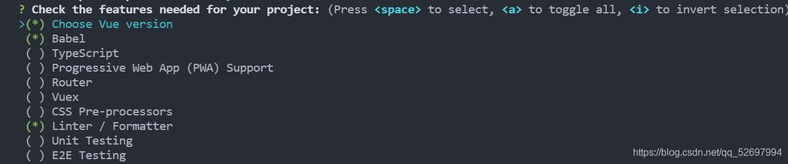
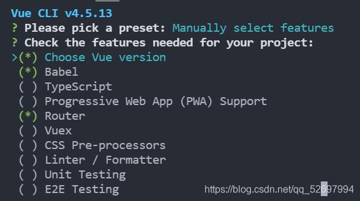
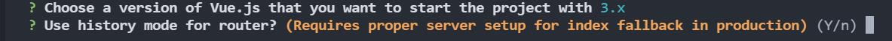
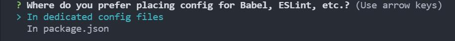
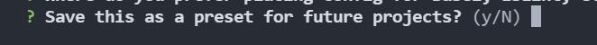
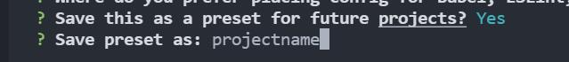
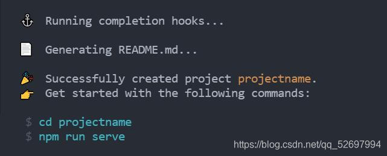
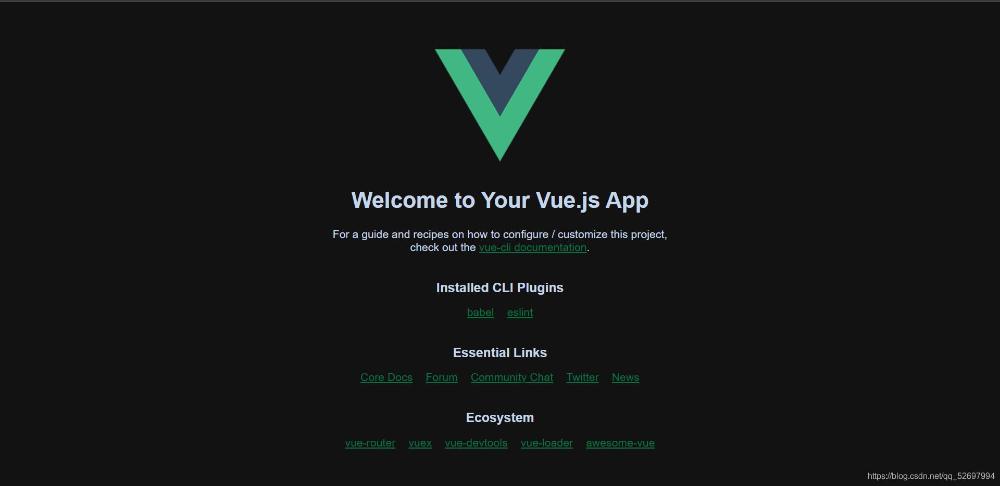
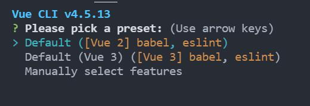
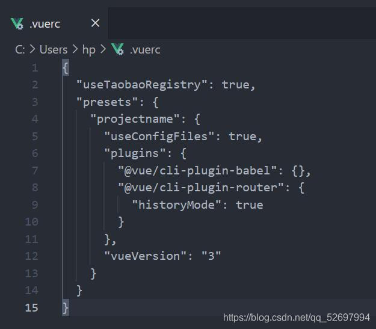

@[TOC](目录)

<hr style=" border:solid; width:100px; height:1px;" color=#000000 size=1">

# 一、安装vue-cli

```javascript
npm i @vue/cli -g
```

# 二、创建项目
vue-cli会创建一个完整的项目文件夹,内部包含src等,我们仅需要cd进打算放置这个项目文件的文件夹内执行如下代码即可;
## 1.生成项目文件;
终端输入:
```javascript
vue create projectname
```
## 2.选择生成配置方式
此处选择最下面一项进行手动配置
(你要是喜欢用eslint就直接选vue3那项就好)

## 3.插件选择
选择你需要的插件,上下箭头移动,空格切换选取状态,全部选择完成后,敲下回车开始下一步.

选错或漏选?没事,构建完毕后你依然可以通过Vue UI来修改插件配置(下面会说到)
<hr style=" border:solid; width:100px; height:1px;" color=#000000 size=1">

我不太适应ESLint,我这里就不逞能了......
记得第一项选择一下Vue版本.
最下的单元测试(unit Testing)和端到端测试(E to E Testing),有需求的话就开;


## 4.单项配置
是否为允许vue-router启用HTML5的history模式?

这个推荐启用,会让你的url更加整洁好看,可读性更高,在SPA页面中,不少方法会依赖于HTML5的history模式;
使用这个模式的代价是服务端需要进行特殊配置,否则会因为服务器无法识别URL而出现页面404;

不过在这里仅仅是"允许使用",你依然可以在index.js里切换路由模式.


<hr style=" border:solid; width:100px; height:1px;" color=#000000 size=1">

你打算怎么存放这些babel&eslint之类的东西的配置文件?


这里我推荐第一项吧......生成单独的配置文件,这样修改的时候你只需要找到对应的配置文件即可修改对应的配置;
<hr style=" border:solid; width:100px; height:1px;" color=#000000 size=1">

好的,你打算把这次构建项目的配置沿用到今后嘛?

这个你自己决定喽......
选择是的话,下次在执行第一步时就会出现第四个选项,那就是你自定义的配置方法.

<hr style=" border:solid; width:100px; height:1px;" color=#000000 size=1">

给你自己这套配置取个名字:projectname

<hr style=" border:solid; width:100px; height:1px;" color=#000000 size=1">

## 5.选择包管理工具
会让你选择是用npm还是yarn,我这里没有显示直接用了npm ,奇奇怪怪;
选自己想用的就好.


至此创建完成.
<hr style=" border:solid; width:100px; height:1px;" color=#000000 size=1">
那我们就运行下看看吧!

```javascript
npm run serve
```
进入相应的端口,即可看到Vue的初始界面.


# 三.VueUI修改配置
打开cmd,输入"vue ui"等待GUI服务启动,就会自动打开一个基于本地服务的UI界面

导入你的项目文件,即可在左侧插件等分类下对项目进行快捷运行&插件安装&插件卸载等等等等操作.

# 附-删除已保存的配置选项
如果你保存了配置,那么下次用的时候会在这里多一项你自己的配置,太多的话可能会有点眼花缭乱?

这些配置会保存在C盘Administrator下的".vuerc"文件中

删除相应的对象即可.

# 总结
