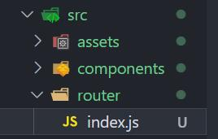
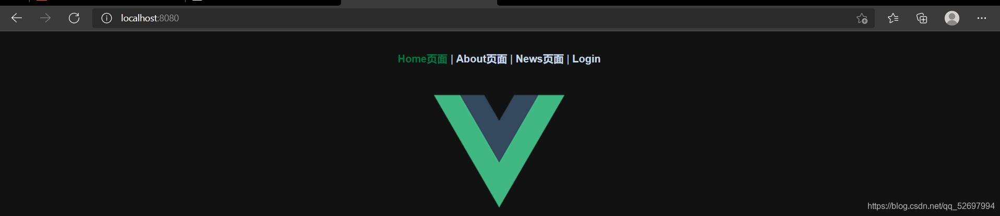
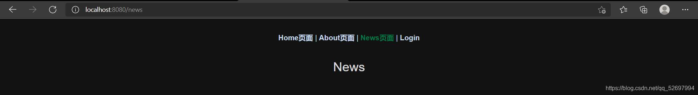
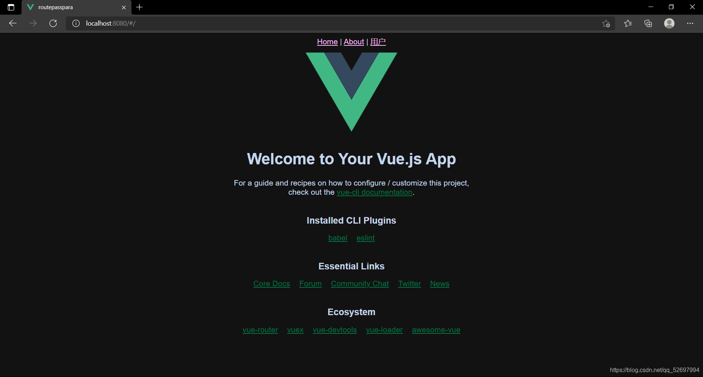
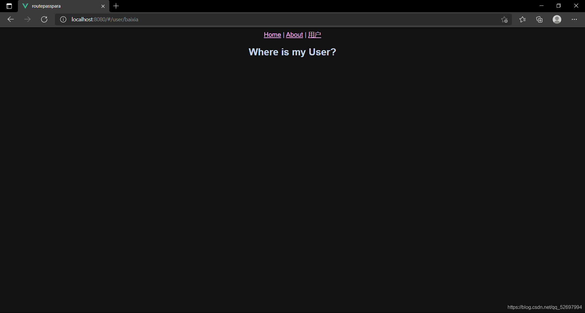

# vue-cli4 路由配置

@[TOC](文章目录)


<hr style=" border:solid; width:100px; height:1px;" color=#000000 size=1">

# 前言-vue路由
Vue-router是Vue官方的路由插件,与Vue.js深度集成.
在使用了vue-router的单页面应用中,url的改变会引起组件的切换,从而达到页面切换的效果,所以如何让URL按照我们的意愿去改变和URL改变后页面去向何处是配置vue-router的两大问题.

<strong>[SPA网页]</strong>前端渲染使得单页面富应用的SPA页面得以实现,整个网页只有一个HTML页面,静态资源服务器里只有一套HTML & CSS,甚至只有一套JS.

<strong>[富应用]</strong> 得以实现依赖于发送至服务端的一个新的请求URL从服务器中获取到资源后,前端路由会负责分配资源给页面的相应组件;

<strong>[单页面]</strong> 的实现需要url在前端改变,前端路由出现后,前端路由会根据router的监听,从映射关系里找到需要改变的部分,抽取分配新的资源,并仅仅重新渲染需要改变的部分;


# 一、基本路由配置
首先得安装vue-router,怎么装就不说了......
在我们安装vue-router成功后,项目文件的src内会出现一个"router"文件夹,这个文件夹内会有一个index.js,对router的配置就主要在这里完成了.

打开它,然后在 routes 数组中进行配置,一个页面的路由在这个数组里被集合为一个对象,其内部包括path和component等属性,对应着URL怎么样改变会做出怎样的反应;
## 1.配置router/index.js

```typescript
//这是在index.js;
import { createRouter, createWebHistory } from 'vue-router'
import Home from '../views/Home.vue'

const routes = [
   //在此处配置路由;
]
//在router4中使用createRouter替代了new VueRouter;
const router = createRouter({ 
  history: createWebHistory(process.env.BASE_URL),
  routes
  //在此处引入所有页面的路由配置数组routes;
})

export default router   
//导出包含着所有路由配置的router对象,
//在main.js中注入后供全局使用;
```
component属性:值为一个页面,这个页面需要提前import引入.

path属性:规定URL内出现什么时跳转到component属性对应的页面.
```typescript
//这是在router/index.js,末尾部分略去;
import { createRouter, createWebHistory } from 'vue-router'
import Home from '../views/Home.vue'
import About from '../views/About.vue'
import News from '../views/News.vue'
//引入3个页面控件;
const routes = [
    {
        path: '/',  /* 规定初始URL对应的默认的页面 */
        name: 'Home',
        component: Home   /* 规定默认在Home页面 */
   },
   {
        path: '/about',/* 规定URL新增段为/about时跳转 */
        name: 'About',
        component: About  /* 跳转至About */
   },
   {
        path: '/news', /* 规定URL新增段为/news时跳转 */
        name: "News",
        component: News  /* 跳转至News */
   },
]
```
## 2.让路由改变
前面规定好了url改变为不同字符时会怎样进行跳转,现在得想想怎么才能让URL改变了,以我们的方式改变.
我们需要使用router-link标签,其自带的to属性可以帮我们完成这一操作,
认识两种新的标签,他们已经在全局注册过了.

```typescript
  <router-link to="要在URL上添加的字符">XXX</router-link>
  //<router-link>默认会被渲染成为<a>;
  <router-view />
  //这俩不需要组合使用,但是要组合也可以;
```
< router-view>是一个占位标签,它规定了router-link标签需要显示在什么位置
,总之你删了它,router-link渲染出来的标签就显示不了了(那都不重要,我们先说路由吧......).

```html
<template>
  <div id="nav">
  <!-- to属性规定如何改变URL; -->
  <!-- Tag属性规定router-link标签需要被渲染成什么HTML元素; -->
    <router-link to="/" Tag="a">Home页面</router-link> |
    <router-link to="/about" Tag="a">About页面</router-link> |
    <router-link to="/news" Tag="a">News页面</router-link> |
    <router-link to="/login" Tag="a">Login</router-link>
  </div>
</template>
```
然后你就可以`npm run serve`跑起你的项目来看看了;

可以看到依据Tag属性的规定是多了4个a标签的,我们点进去News看下,

URL依据router-link的to属性的值改变了,页面正确的跳转.
到此基本的路由配置就完成了.

另外你也看到router-link还有一个tag属性,你可以使用这个属性来规定router-link标签被渲染成什么元素.
<hr style=" border:solid; width:100px; height:1px;" color=#000000 size=1">

# 二、路由懒加载技术
把不同的路由对应的组件分离,仅当某路由被触发时才会加载对应组件,会更加高效,并且第三方  &  底层支撑  &  公共App 除外, 其他的Vue页面组件都在服务器,随用随请求,确保对页面的影响最小.

其实就是改变一下router/index.js里对各个组件的引入方法啦......
通过箭头函数的方法进行.
```typescript
const routes = [
  {
    path: '/about',
    name: 'About',
    component: () => import('../views/About.vue')
    //直接在这里引入了About并且赋值给了component;
  },
  {
    path: '/news',
    name: "News",
    component: () => import("../views/News.vue")
        //直接在这里引入了About并且赋值给了component;
  },
  {
    path: '/login',
    name: 'Login',
    component: () => import('../views/Login.vue')
        //直接在这里引入了About并且赋值给了component;
  },
]

```
<hr style=" border:solid; width:100px; height:1px;" color=#000000 size=1">

# 三、路由嵌套
我们的子页面在运作时可能会需要点击替换某个部分? 用户通过App.vue进入了一个子页面,点击了查看详情我们可能会需要把某个部分替换为详情界面,改变页面某个部分的内容,这时候会需要路由嵌套技术.

说简单些,就是在父页面的路由里规定子页面的路由,比如在News.vue的路由里规定NewsChild-1.vue的路由.

```typescript
//这是缩减过的router/index.js;
const routes = [
  {
    path: '/news',
    name: "News",
    component: () => import("../views/News.vue"),
    children: [
      {
        path: 'NewsChild-1', 
        //子路由不用在前面写"/"和上一层路径,
        //但其实解析是是会加上的;
        //规定URL出现/News/NewsChild-1时,
        //跳转至component对应的页面;
        component: () => import("../views/NewsChild-1"),
      }
    ]
  },
]
```
这样就规定了在News页面出现URL改变后应当进行的操作.
自然,我们还得规定News页面下要怎样改变URL,进入News.vue进行操作.

```html
<!-- 这是News.vue; -->
<template>
  <h1>News</h1>
  //规定在被触发时URL增加/News/NewsChild-1;
  <router-link to="/News/NewsChild-1">NewsChild-1</router-link>
  <router-view></router-view>
</template>
```
然后来看下渲染出的页面吧:

点击链接NewsChild-1:

URL变为/News/NewsChild-1,依据router-link的to属性值.
大可再在children数组里多嵌套几个页面组件,如法炮制即可.
<hr style=" border:solid; width:100px; height:1px;" color=#000000 size=1">

#  四、动态路由
很多时候页面需要跳转到哪里是不能由我们写程序的来确定的,这就需要程序按照需求去自己决定,让路由得以动态改变.
## 1.动态路由配置
说简单些,我们不把[to需要增加的URL]和[path判定跳转的URL]写死就好了,把URL里需要经常变化的部分,利用v-bind与export default中的data数据互通起来,让URL跟随数据变动.

```typescript
//这是在router/index.js
import { createRouter, createWebHistory } from 'vue-router';

const routes = [
  {
    path: '/',
    name: 'Home',
    component: () => import('../views/Home.vue'),
  },
  {
  //我们在此处也不要把path的值写死;
    path: '/user/:userId',
    name: 'User',
    component: () => import('../views/User.vue'),
  }
];
```

```html
<!-- 这是在App.vue里 -->
<template>
  <div id="app">
    <router-link to="/">Home</router-link> |
    <router-link to="/about">About</router-link> |
    <!-- 在此处使用v-bind将userId数据调用; -->
    <!-- 将/user/作为字符串拼接给userId -->
    <router-link v-bind:to="'/user/' + userId">用户</router-link>
  </div>
  <router-view />
</template>
<script>
export default {
  name: "app",
  data() {
    return {
    //在此处设定userId的数据为baixia;
      userId: "baixia",
    };
  },
};
</script>

```
来看下效果:

接下来点击用户:

URL成功拼接了了data里的数据UserId,即baixia.

## 2.动态路由传参
动态路由也是Vue传递数据的方式之一,利用$route来进行Vue页面组件(即vue文件)间的通信.
先来认识两个变量:
<strong> $router</strong>: index.js末尾利用createRouter创建的路由对象
<strong> $route</strong>: 当前正处于活跃状态下的路由对象,其中有一个params属性,全称parameters,利用它,可以取到我们URL里使用v-bind传的值.

比如User.vue需要获取App.vue的data中的userId数据:

```html
<!-- 在App.vue中(发方) -->
<template>
  <div id="app">
    <router-link v-bind:to="'/user/' + userId">用户</router-link>
  </div>
  <router-view />
</template>
<script>
export default {
  name: "app",
  data() {
    return {
      userId: "baixia",
    };
  },
};
</script>
```

```typescript
//在user.vue中(收方)
export default {
    name:"user",
    computed: {
        userId() {
            return this.$router.params.userId
//将this.$router.param.userId的值,
//即App.vue的router-link里传入的userId返回,
//以作为计算属性userID()的值
        }
    }
}
```

User.vue里为了获取用户信息而使用的params,其获取哪个属性依赖于index.js里的path,的如果path:'/user/:abc',那么User.vue的< script>里应当为:

```typescript
export default {
    name:"user",
        computed: {
            userId() {
            //这里也应为获取abc属性;
                return this.$router.params.abc
           }
        }
}
```

<hr style=" border:solid; width:100px; height:1px;" color=#000000 size=1">

# 2021.9.22补档-路由模式:
忘记说路由模式了,现在用的有三种模式:HTML5history模式,hash模式和abstract模式,前两种用的格外多一点,我就多说前面两种了:
## 1.VUE3.0history模式

```javascript
import { createRouter, createWebHistory} from 'vue-router';
const router = createRouter({
  history: createWebHistory(process.env.BASE_URL),
  routes
});
```
你可以在这个地方使用history属性来规定路由使用的模式,使用history模式和hash模式并不会对你的其他组件什么的造成影响,你可以规定一种模式并做完项目后再改动路由模式,不会出现什么进不去页面之类的乱七八糟的情况.

那这俩模式有什么不同呢?

history模式的使用会使得在浏览器上方的路由更加的美观,不会有什么"%""#"之类乱七八糟的东西掺杂在里面,而且页面的SEO会得到提高.

但是这样的路由发到服务器就不太好了,服务器一看,笑死, 根本看不懂.

所以是请求不到东西的,会返回404, 其实你只要使用非Hash模式的路由都会出现这种问题. 这种情况需要服务端做一些配置来解决(时间紧就直接换回hash模式吧,不会有什么后遗症的).

# 总结
以上是我据本阶段的学习得出的一些经验，如果帮到了您，我很高兴；
若是您发现了不足，您可以在评论区指出, 我会感谢您的指点!