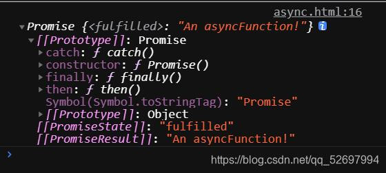

# async&await异步请求处理办法
@[TOC](目录)

<hr style=" border:solid; width:100px; height:1px;" color=#000000 size=1">

# async&await
async函数&await规定于ES2017.它们是基于promises的语法糖,使我们得以以更简洁的方式完成异步代码编写,并提高了异步代码可读性.使用它们的异步代码看起来更像是老式的同步代码并且避免了链式调用Promise.


<hr style=" border:solid; width:100px; height:1px;" color=#000000 size=1">

因为await在没说完async的情况下不好进行,我打算先说async,当然,我会在不影响正常浏览的情况下在async部分里加入一些与await牵连的部分;
# 一、async
## 1、async函数
async函数:使用async关键字声明的函数,是AsyncFunction构造函数的实例， 内部可以使用await关键字。
将async作为一个关键词放到函数前面,这个函数会变为一个async函数,

```javascript
//你可以看到我在函数前面加了"async"吧;

async function asyncFunction1() {
    return 'An asyncFunction!'
}

//那asyncFunction1现在就是一个async函数了;
```
async函数调用后会返回一个Promise对象,调用async函数和调用普通函数在方法上没有区别,你可以直接:

```javascript
//我们顺带输出一下看看返回的Promise对象
console.log(asyncFunction1());
```

你可以看到Promise对象里的"PromiseState"为" fulfilled "这代表Promise已经成功完成.
Promise对象代表一个异步操作,其带有属性PromiseState(Promise执行状态)值共有三个: pending进行中,fulfilled已成功和rejected失败.

Promisez自身带有三个两个方法: all, resolve和reject,其中resolve和reject分别负责接收Promise异步操作执行成功后返回的正常结果和执行出错时返回的错误报告.

我们的async函数如果出错,就会对其内部的Promise操作产生阻碍,那么返回的结果将会是内部Promise调用reject方法产生的错误报告,让async函数处理这种东西还是太难为它了.当返回的是错误报告时,PromiseState的值将会是"rejected",伴随着让人摸不着头脑的报错信息.

## 2、回调async函数以获取结果
<strong>async基于Promise,返回Promise对象,那么要获取到async函数的执行结果,使用Promise自带的方法也当然是可以的,即then()和catch()来回调.</strong>
then()方法可以确保在Promise执行成功(fulfilled)之后马上接收resolve方法返回的数据以供使用.
catch()可以确保在Promise出现错误的时候(rejected)不会直接终止运行而是先收集reject方法返回的错误信息来执行catch();

```javascript
async function asyncFunction1() {
    return 'callback asyncFunction1'
}
//使用then注册回调函数;
asyncFunction1().then(res => {
    console.log(res);
}).catch(function(error){
		console.log('catch到rejected失败回调');
		console.log('catch失败执行回调抛出失败原因：',error);
	});	

```

如果没有为async函数注册回调函数,在async函数被调用并执行完成后...
效果就只是完成了作为普通函数的功能,并且返回一个Promise对象;

而注册了回调函数,那么执行完成后,注册的回调函数会放入异步队列中等待执行.

# 二、await
<strong>等待 .vt [书面语]</strong>

await关键字只能放到async函数里面,后面可以加函数体或者任何表达式,
但<strong>更多情况下会在后面放一个会返回Promise对象的表达式(比如一次需要时间响应并且还返回Promise对象的axios请求)</strong>来让await的等待变得有意义,因为产生Promise对象的操作一般都需要时间,如果是一个简单的操作一瞬间完成,那这个await岂不是等个寂寞...

<strong>程序执行到await的时候受await的影响,会停下进行等待(在这空挡跑去请求数据),等到await后面的表达式执行完成(请求的数据发过来)并且await拿到值后才会解除等待.</strong>这是一个异步操作,等待期间JavaScript引擎并不会止步于此,它会先执行下面的程序,等到async里的await表达式执行完把值拿出来了,它再回来拿值执行;
比如你在async函数下面输出await的值,那必然是拿不到,因为这空当await还在等代着属于自己的值...
下面是利用await等待一个axios请求的栗子:

```javascript
const http = axios.create({
    baseURL: "http://xxx.xx.xx.x:3000/api",
})

    async asyncFunction2() {
    //等待axios对象http使用post发起请求;
      const res = await this.http.post("/upload", formdata);
     //等到await的值被赋给res,说明await拿到了表达式的值;
    },

```

<hr style=" border:solid; width:100px; height:1px;" color=#000000 size=1">

# 总结
<strong>感谢你读到这里 !</strong>
async&await的组合只是一种异步请求的处理方式,你不仅可以在Vue框架或者axios请求方法的情况下使用它,就本文第一个栗子来说,在原生JS的环境下运行它也是可以的.

这是我本阶段对async异步请求的一些理解,如果帮到了您,我很荣幸! 