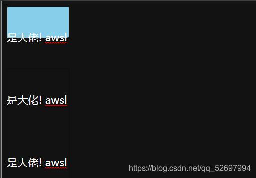

前端实现文本自动换行
@[TOC](文章目录)
<hr style=" border:solid; width:100px; height:1px;" color=#000000 size=1">


<hr style=" border:solid; width:100px; height:1px;" color=#000000 size=1">

# 一、解决方案
看到有老哥说用textarea来写入文字可以换行, 没什么好办法了,眼下似乎这个"textarea"就是能做出目标效果的方法,硬着头皮用吧,下午就要交了.

<hr style=" border:solid; width:100px; height:1px;" color=#000000 size=1">

其实我还打算做个限制输入字数的功能的,但是现在还没有想那个的余地,亟待解决的问题是怎么在某一行达到指定字数的时候换行.
那其实有两种办法,
一种是直接限制textarea的height和width尺寸来进行限制,但是对于精确到每行每列多少个字这种需求就不太友好,你随便给个尺寸还得调一调看看这个字能不能盛的下.
|属性| 作用 |
|--|--|
| height | 纵向限制文字,文字超出限制范围会出现纵向滚动条 |
| width | 横向限制文字,文字超出限制范围会出现横向滚动条 |

还有一种是使用textarea自带的属性, cols 和 rows 属性:

|属性| 作用 |
|--|--|
| cols | 文本列数 |
| rows | 文本行数 |
| maxlength | 字符数量上限 |
然后出现了滚动条,这必然是不能要的:
| 属性 | 作用 |
|--|--|
| overflow-y:hidden | 隐藏纵向滚动条 |
| overflow-x:hidden | 隐藏横向滚动条 |
大体上是能用了,然后细节上的一个问题是牛皮纸背景的最后一行比上面的都要短,再输入那么多文字看着不合适.然后当时也不知道有maxlength属性,就JS获取了textarea的文本长度textarea.value.length,加了判断最后返回false来阻止继续输入:

```typescript
textArea.onkeydown = () => {
    var rest = 140 - textArea.value.length;
    restText.innerText = "你还能输入" + rest + "字..."
    if (textArea.value.length >= 140) {
        restText.innerText = "盛不下啦喂!"
        restText.style.color = "red";
        return false;
    }
}
```
这方法也挺不完善的,一旦返回false之后就是直接把textarea给锁了,对,连删除字符都不能进行的.

说实话这里走了个弯路,我今天上午测试了一下textarea里能不能用placeholder属性,结果是不能用(别问,我也不知道我咋测出来的不能用),于是乎只能在textarea下面写了个span加上默认文字,再监听onfocus和onblur:

```typescript
function defaultValue() {
    textArea.onfocus = () => {
        defaultText.style.opacity = 0;
    }
    textArea.onblur = () => {
        if (textArea.value.length == 0) {
            defaultText.style.opacity = 1;
        }
    }
}
```
说实话确实写的麻烦了,就因为觉得这个placeholder属性不能用.
(其实是可以正常使用的,而且就像input里那样)
|属性| 作用 |
|--|--|
| placeholder | 默认内容,onfocus时默认内容不消失,输入时消失,onblur重现 |

现在回头看看一个是placeholder属性增添了麻烦,一个是maxlength属性增添了麻烦;
## 补全一些textarea相关
|相关| 作用 |
|--|--|
| readonly属性 | 是否只读不可编辑? |
| 换行 | /n |
| resize属性 | 如何处置textarea自带的可缩放属性:none彻底不允许缩放,限定max-height,max-width和长宽:限定缩放范围 |

另外要说一点是textarea是没有value属性的,不要给标签上添加这个属性,但是textarea.value确实能获取到东西,但值是夹在textarea始末标签间的字符;

<hr style=" border:solid; width:100px; height:1px;" color=#000000 size=1">

# 二、其他方法实现文本换行
# 1.div可编辑模式
我今天才知道div有个属性叫contenteditable,这个属性的值为true时允许你在这个div上输入文字,这个文字也是夹在始末标签之间的字符;
而且加上这个属性之后,输入的文字依然受到line-height和font系列属性的支持,

```html
    <div 
        contenteditable="true" 
        style=`
        line-height:100px;
        height:50px; 
        width:100px;
        background-color:skyblue
    `>
        wddw
    </div>
```

maxlength和placeholder属性无效;
然后你可以看到目前是只能根据宽度width来决定是不是要换行,但是HTML有专门一套规定换行规则的属性,这在input里不能用,可这关我div什么事儿呢 ?
|属性| 可用值 |
|--|--|
| word-break | break-all, normal, keep-all |
| word-wrap | break-word, normal |

|属性| 作用 |
|--|--|
| word-break:break-all | 不管怎么样,到了最大宽度就是要换行! |
| word-break:normal | 	使用浏览器默认的换行规则 |
| word-break:keep-all | 只能在半角空格或连字符处换行。|
| word-wrap:break-word | 检索英文单词,如果强制换行面临拆词,那么会保留完整词并在其后换行 |
| word-wrap:normal | 只在允许的断字点换行（浏览器保持默认处理）。 |
<hr style=" border:solid; width:100px; height:1px;" color=#000000 size=1">

# 2.消减onfocus时的边框

```css
        textarea:focus {
            outline: none;
        }
```

# 总结
就是记录一下,没用过textarea,没甚麽好说的...
你被骗进来了 哈哈(啊别打我)
