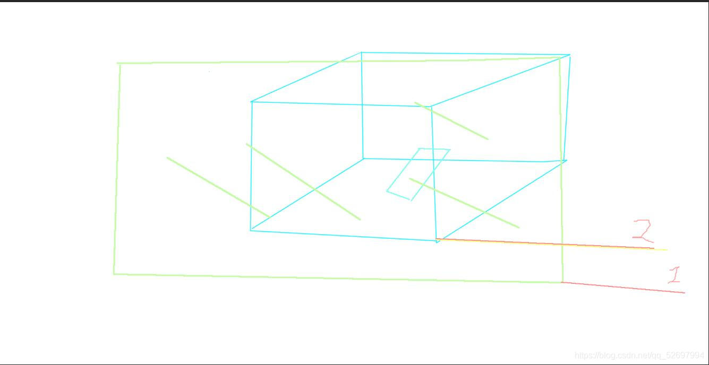
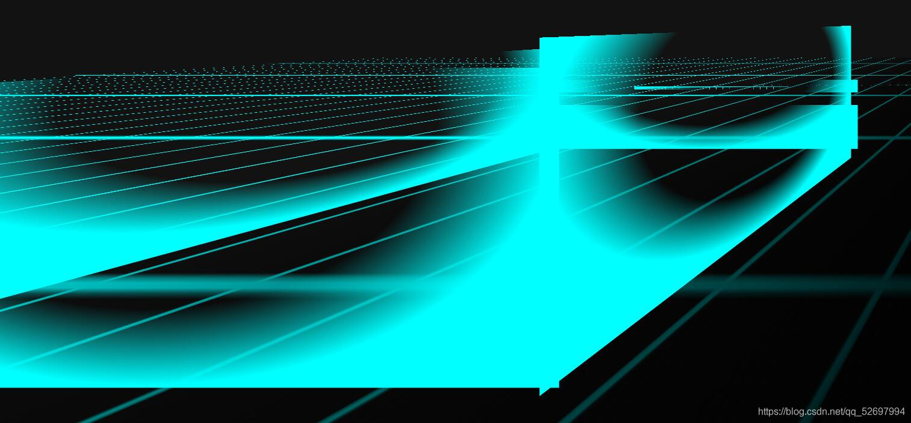
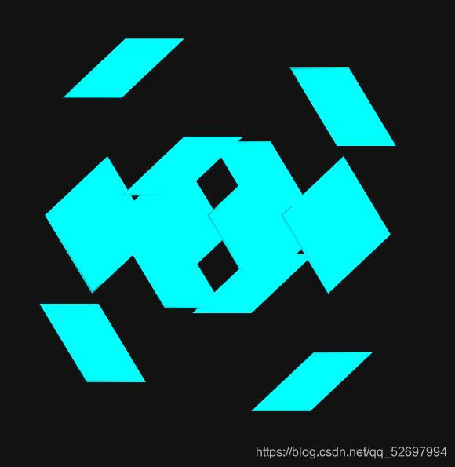
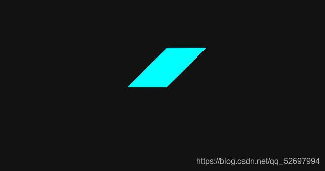
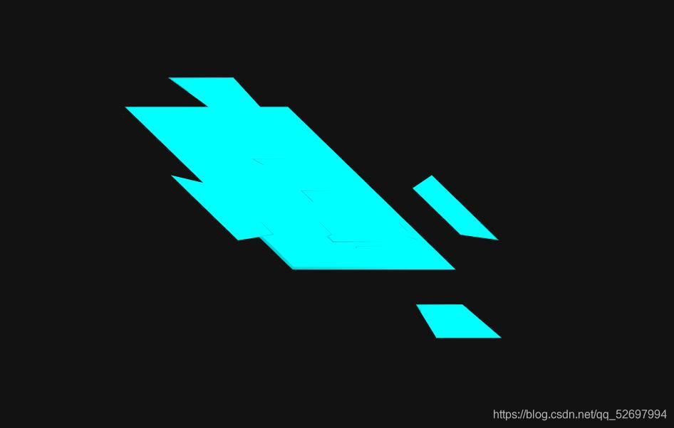

# 总结对3D效果的误解

@[TOC](文章目录)

<hr style=" border:solid; width:100px; height:1px;" color=#000000 size=1">

# 前言
前段时间在家恶补3DMAX...没能抽出太连贯的时间来做Vue(就是这次传值传到一半退了,下次回来一脸懵逼我这是写的个啥),就在收藏夹里扒拉了几个CSS特效看,倒也真是有了一点新的理解.

<hr style=" border:solid; width:100px; height:1px;" color=#000000 size=1">

# 一、perspective-origin
一个可以支持你选择观看角度的属性.
这个属性我是真没见过,查完回来又试验了几次,好歹是弄明白了什么意思:

你去过动物园吧,在栏杆外面看里面的动物? 这个属性就相当于你的脚,支持你改变自己在栏杆(屏幕)所在的这个无线延展的平面上的位置(包括纵向).

这个电脑屏幕就相当于你的可视区域(你就先当自己高度近视吧).

然后动物园里的栏杆你是不能翻过去的,一样这个属性也是只支持你在"栏杆"这个竖平面内改变可视区域的位置,栏杆平面内你左右挪上蹿下跳都没人管你,你就是别翻栏杆就得了.

然后笼子里的动物就在那,跨个批脸看你,你的元素们也是,你在这个平面上做的一切移动只能改变你观看它们的方位,它们一直就在那儿,不会受到影响.
我上个图吧可能好理解一点:


(因为画的很烂每次上个图都很羞耻)
你的眼睛就嵌在平面1里,然后可以通过调整在平面1中的X,Y值来决定从哪个方位看这个立体空间.

我觉得它的值可以和perspective属性的值复合在一起写...
# 二、3D空间 transform属性的一些新理解

以前的话这个属性在2D里还好,到3D空间基本就蒙圈了.

在给transform-style属性赋值preserve-3d之后,在页面纵深方向上的变化就可以合理一点而不是给人"2D空间中的宽高变化"这样的感觉了.

然后进了3D模式就分不清到底这transform是怎么个动法,实际上还是一样,只不过元素的坐标轴是基于自身的,自身位置或者方向发生变化后坐标轴的朝向自然也会跟着改变(这坐标轴总不能跟个指南针似的), 就比如你先把一个div给rotateY(围绕Y轴)了90度,那现在X轴就承担原本Z轴的工作:设定纵深值,而现在Z轴承担原本X轴负责的横向位置设定;
我现在把4个div拼成一个方块,起初它们都是叠在一起的,但在加了rotate属性分离出来后你会发现各个轴控制的已经不是原本的方向.


```html
    <div class="building1">
        <div class="one"></div>
        <div class="two"></div>
        <div class="three"></div>
        <div class="four"></div>
    </div>
```

```css
/* 这数值看着是挺离谱的 */
        .building1 .one {
            top: -2500px;
            height: 4500px;
            width: 2000px;
            transform: rotateY(90deg) translateX(2000px) translateZ(-4000px) translateY(700px);
            z-index: 2;
        }
/* 垂直屏幕的平面-右 */
        .building1 .two {
            top: -2500px;
            height: 5300px;
            width: 10000px;
            transform: translateX(-14200px) translateZ(-4000px)translateY(700px);
            z-index: 1;
        }
/* 平行屏幕的平面-远 */
        .building1 .three {
            top: -3500px;
            height: 6500px;
            width: 10000px;
            transform: translateX(-14200px) translateZ(-1370px) translateY(700px);
            z-index: 1;
        }
/* 平行屏幕的平面-近 */
        .building1 .four {
            top: -2500px;
            height: 4500px;
            width: 2000px;
            transform: translateX(2200px) translateZ(-12200px) translateY(700px);
            z-index: 2;
        }
/* 垂直屏幕的平面-左 */
```
当然具体哪个轴在元素变化后会承担哪个另外轴的工作还得看你怎么个变化法,你要是rotateX围着X轴转那估计变的就是Y轴和Z轴了
<hr style=" border:solid; width:100px; height:1px;" color=#000000 size=1">


# 三、一些不知道算什么类的知识
# 1.遮盖问题
刚开始挪第一个垂直于屏幕的平面时候发现的,这个垂直平面怎么也不能戳开平行于屏幕的这个平面让我看到它;
我估计 视觉效果是变了但实际上所有元素还是在同一个平面上,盖住就是盖住了,怎么变化都会盖住,因为这并不是真的在3D空间里旋转元素.

解决方法:
z-index,被盖住的元素给大值,提到前面来;
或
把被盖住的HTML元素的代码放到压他的元素的代码前面;

# 2.perspective
其实我到现在还是不理解为什么有人说这个属性是3D特效必备,静态3D页面不加这个貌似会崩(会叠罗汉不分层),但是动态3D页面好像是可以不加这个属性的;
这个属性在Z轴方向生效,决定你的元素们嫌弃你的程度(呸, 距离你屏幕的远近)我前面猜,即使使用了3D变换命令,各个元素也都还是在一个平面上的,那么这个属性决定的就是你的屏幕距离这个平面的远近,这么说感觉还蛮合理的...

有时候不设置这个属性会导致这个镶嵌着各个元素的平面跑到你屏幕后面去,众所周知人的后脑勺是不长眼的,你就只能看着一望无际的黑暗....
当然,祈祷你那时候能想起这属性吧...

# 3.transfrom-style:preserve-3d
没有进行transfrom动画的页面你就不要加这个属性了,加了也不生效,这是规定变换过程是以2D还是3D来完成的属性;

这个属性还是蛮重要的,尤其是在需要动态变换效果的3D页面里,你可以不要perspective,但是你不能不要这个,不然会叠罗汉(分不出层)
比如这是body上加了preserve-3d的盒子:

但要是不加:

而将body的transfrom-style:preserve-3d替换为perspective:300px后:

直接变成了个饼,那我估计静态的话是可以直接一个perspective完事的,然后有动态的话得加这个transform-style:preserve-3d,不然纵深方向的动画就只会以平面(即transform-style:flat)的2D模式出现;

所以动态3D页面的话还是加transform-style:preserve-3d和perspective;
不是动态的话就加个perspective完事;

# 总结
当时写前面那篇的时候有些东西还是云里雾里,也就提了一下没细说,怕说错了闹笑话.
目前是这么想的,大伙要是看到有不妥的地方,欢迎在评论区批评指正 :D

