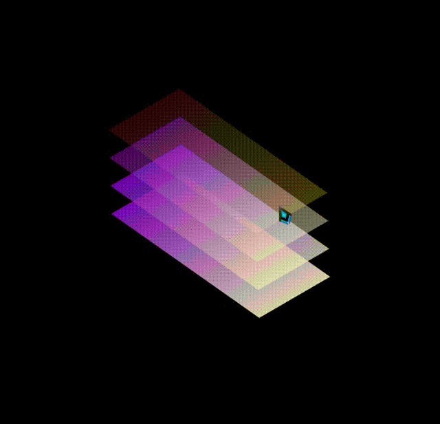

# 让hover效果平滑过渡回初始状态?
@[TOC](文章目录)

<hr style=" border:solid; width:100px; height:1px;" color=#000000 size=1">

# 前言
实现CSS伪类效果结束时的平滑效果.

---

# 一、原因分析

hover中的transition在鼠标划过时被触发,但在鼠标离开后,hover中的CSS样式瞬间消失,导致动画消失并且样式直接回到无hover状态.

<hr style=" border:solid; width:100px; height:1px;" color=#000000 size=1">

# 二、解决方案
因此,如果直接将一个同样的transition样式写入非伪类触发状态下的样式中,那么hover伪类触发结束后,该非触发状态下的transition依然可以接续hover下transition的功能,支撑动画执行完成.

但是由于非伪类触发状态下没有动画指令所以非伪类触发状态下不会有动画效果;

由于非伪类触发状态下的样式会直接应用到触发伪类的状态中,所以transition直接写到非hover状态下的样式,而在hover状态下直接书写动画效果即可.
即不会出现鼠标移出后动画被打断的情况:

```css
div{
  width: 100px;
  height: 100px;
  border:1px solid;
  margin:0px auto;
  margin-top: 200px;
  transition: all 1s linear;
}

div:hover{
  transform: scale(2);
}
```

<hr style=" border:solid; width:100px; height:1px;" color=#000000 size=1">

# 附 整的活

```html
<!DOCTYPE html>
<html lang="en">

<head>
    <meta charset="UTF-8">
    <meta http-equiv="X-UA-Compatible" content="IE=edge">
    <meta name="viewport" content="width=device-width, initial-scale=1.0">
    <title>层叠</title>
    <style>
        body {
            padding: 0;
            margin: 0;
            background-color: black;
            width: 100%;
            height: 100vh;
            align-items: center;
            justify-content: center;
            display: flex;
        }

        #main {
            perspective: 500px;
            position: relative;
            width: 100px;
            height: 200px;
            background: rgba(0, 0, 0, 0);
            transform-style: preserve-3d;
            /* 猜测:规定hover过渡效果的持续时长 */
            transform: rotate(-30deg) skew(25deg);
            /* skew? */
        }

        #main div {
            height: 200px;
            width: 100px;
            transform-origin: 0 50%;
            background: -webkit-linear-gradient(top, #8d01ff, #ffffff);
        }

        #main:hover div:nth-child(1) {
            transform: translate(120px, -120px) rotateY(-165deg);
            z-index: 300;
        }

        #main:hover div:nth-child(2) {
            transform: translate(90px, -90px) rotateY(-170deg);
            z-index: 500;
        }

        #main:hover div:nth-child(3) {
            transform: translate(60px, -60px) rotateY(-175deg);
            z-index: 600;

        }

        #main:hover div:nth-child(4) {
            transform: translate(30px, -30px) rotateY(-180deg);
            z-index: 900;
        }

        /* #main被触发之后nth-child(1)会进行效果 */

        div:nth-child(1) {
            position: absolute;
            transform: translate(30px, -30px);
            transition: all 1s linear 3s;
            opacity: 0.9;
        }

        div:nth-child(2) {
            position: absolute;
            transform: translate(60px, -60px);
            overflow: hidden;
            transition: all 1s linear 2s;
            opacity: 0.75;
        }

        div:nth-child(3) {
            position: absolute;
            transform: translate(90px, -90px);
            transition: all 1s linear 1s;
            overflow: hidden;
            opacity: 0.5;
        }

        div:nth-child(4) {
            position: absolute;
            transform: translate(120px, -120px);
            transition: all 1s linear;
            overflow: hidden;
            opacity: 0.25;
        }
    </style>
</head>

<body>
    <div id="main">
        <div class="paper1">
        </div>
        <div class="paper2">
        </div>
        <div class="paper3">
        </div>
        <div class="paper4">
        </div>
    </div>
</body>

</html>
```

---

# 总结
如果它帮到你, 我很开心.