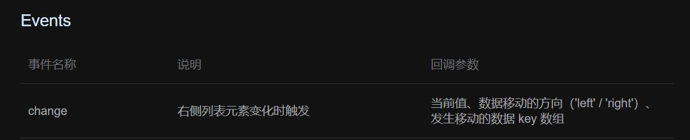
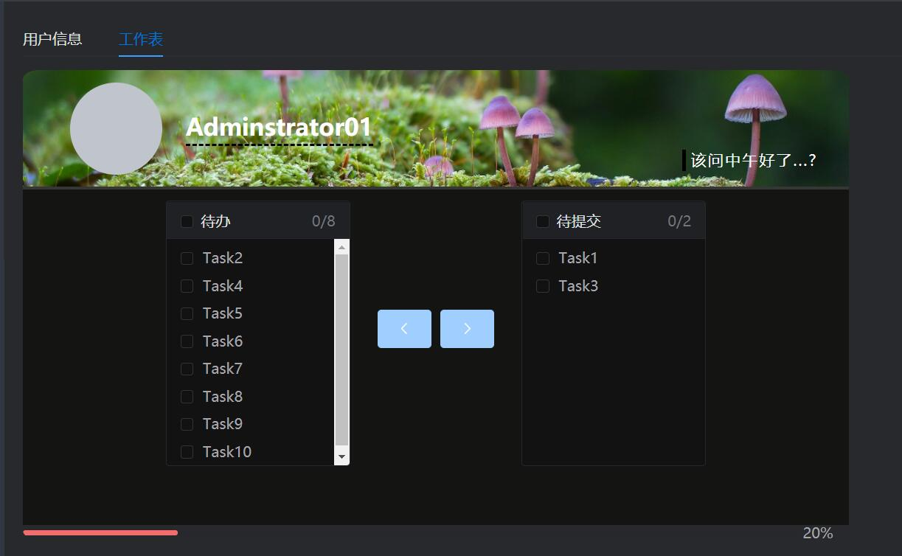
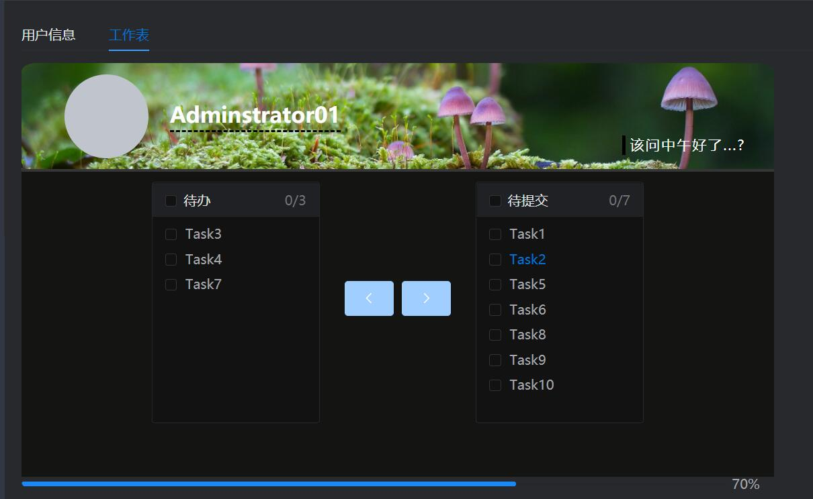

# Transfer与进度条组件绑定

@[TOC](文章目录)

<hr style=" border:solid; width:100px; height:1px;" color=#000000 size=1">

# 前言
最近做的后台管理系统里使用了Element组件Transfer做了一个工作表,然后加了一个进度条来表示工作进度,我希望能将两者绑定起来;

<hr style=" border:solid; width:100px; height:1px;" color=#000000 size=1">

# 一、实现原理
利用Element穿梭框提供的change事件来触发特定方法handleChange(),


向方法内传入参数event来获取:
发生改变的是哪边工作表( 'right' / 'left' );

传入参数tab来获取:
发生改变后关于右侧列表项的数组[ ];

使用公式进行值转换,将成品值赋值给用于决定进度条进度的data()里的this.percentage,来实时改变进度条进度.
# 二、实现流程
为工作表绑定change事件,绑定事件函数handleChange();
为工作表绑定v-model来绑定已经完成的事项,即右边工作表中的事项;
为工作表绑定:data来绑定全部事项,即左右工作表内的所有事项;

```html
                <el-transfer
                  style="text-align: left; display: inline-block"
                  v-model="finishedTask"
                  :props="{ key: 'id', label: 'name' }"
                  :titles="['待办', '待提交']"
                  @change="handleChange"
                  :data="allTask"
                >
                </el-transfer>
```

data()中加入属性"percentage",赋给数字类型值,绑定到进度条组件:

```html
              <el-progress
                :percentage="percentage"
                :color="customColors"
              ></el-progress>
```

data()中加入allTask数组和finishedTask数组,表示左右所有事项和右边已完成事项:

```javascript
//这是10个任务,修改任务数量请连携修改进度条驱动数值;
      allTask: [
        { id: 1, name: "Task1" },
        { id: 2, name: "Task2" },
        { id: 3, name: "Task3" },
        { id: 4, name: "Task4" },
        { id: 5, name: "Task5" },
        { id: 6, name: "Task6" },
        { id: 7, name: "Task7" },
        { id: 8, name: "Task8" },
        { id: 9, name: "Task9" },
        { id: 10, name: "Task10" },
      ],
      finishedTask: [1, 3],
```

在methods中定义increase方法和decrease方法来实现进度条"能走"

```javascript
    increase() {
      this.percentage += 10;
      if (this.percentage > 100) {
      //大于100不再相加
        this.percentage = 100;
      }
    },

    decrease() {
      this.percentage -= 10;
      if (this.percentage < 0) {
      //小于0不再减少
        this.percentage = 0;
      }
    },
```
定义handleChange方法来规定工作表左右比例和进度条进度的绑定规则:

```javascript
     handleChange(tab, event) {
     console.log(tab,event); //输出格式: 'left', array(4)[1,2,3,4];
      this.percentage = (tab.length / this.allTask.length) * 100;
      
      //if (this.percentage == 100) {
      //  this.$message.success(
      //   "工作表已验收, " + this.userName + " , 请注意休息 ."
      // );
      }
    },
```
然后就可以了,最下面是进度条:



# 三、完整代码
我已经减掉那些无关代码了:

```javascript
<template>
                <el-transfer
                  style="text-align: left; display: inline-block"
                  v-model="finishedTask"
                  :props="{ key: 'id', label: 'name' }"
                  :titles="['待办', '待提交']"
                  @change="handleChange"
                  :data="allTask"
                >
                </el-transfer>
                
              <el-progress
                :percentage="percentage"
                :color="customColors"
              ></el-progress>
</template>

<script>
export default {
  name: "Home",
  data() {
    return {
      percentage: 20,
      customColor: "#409eff",
      customColors: [
      //5个阶段的颜色
        { color: "#6f7ad3", percentage: 20 },
        { color: "#f56c6c", percentage: 40 },
        { color: "#e6a23c", percentage: 60 },
        { color: "#1989fa", percentage: 80 },
        { color: "#5cb87a", percentage: 100 },
      ],
      //根据各个一级菜单的id将不同图标写入一级菜单
      allTask: [
      //所有任务
        { id: 1, name: "Task1" },
        { id: 2, name: "Task2" },
        { id: 3, name: "Task3" },
        { id: 4, name: "Task4" },
        { id: 5, name: "Task5" },
        { id: 6, name: "Task6" },
        { id: 7, name: "Task7" },
        { id: 8, name: "Task8" },
        { id: 9, name: "Task9" },
        { id: 10, name: "Task10" },
      ],
      //初始已完成的任务;
      finishedTask: [1, 3],
    };
  },
  methods: {
  //这是规定进度条变色的方法;
    customColorMethod(percentage) {
      if (percentage < 30) {
        return "#909399";
      } else if (percentage < 70) {
        return "#e6a23c";
      } else {
        return "#67c23a";
      }
    },

    increase() {
      this.percentage += 10;
      if (this.percentage > 100) {
        this.percentage = 100;
      }
    },

    decrease() {
      this.percentage -= 10;
      if (this.percentage < 0) {
        this.percentage = 0;
      }
    },

    handleChange(tab, event) {
      this.percentage = (tab.length / this.allTask.length) * 100;
      if (this.percentage == 100) {
        this.$message.success(
          "工作表已验收, " + this.userName + " , 请注意休息 ."
        );
      }
    },
  },
};
</script>

<style lang="less" scoped>
</style>
```

<hr style=" border:solid; width:100px; height:1px;" color=#000000 size=1">

# 总结
_