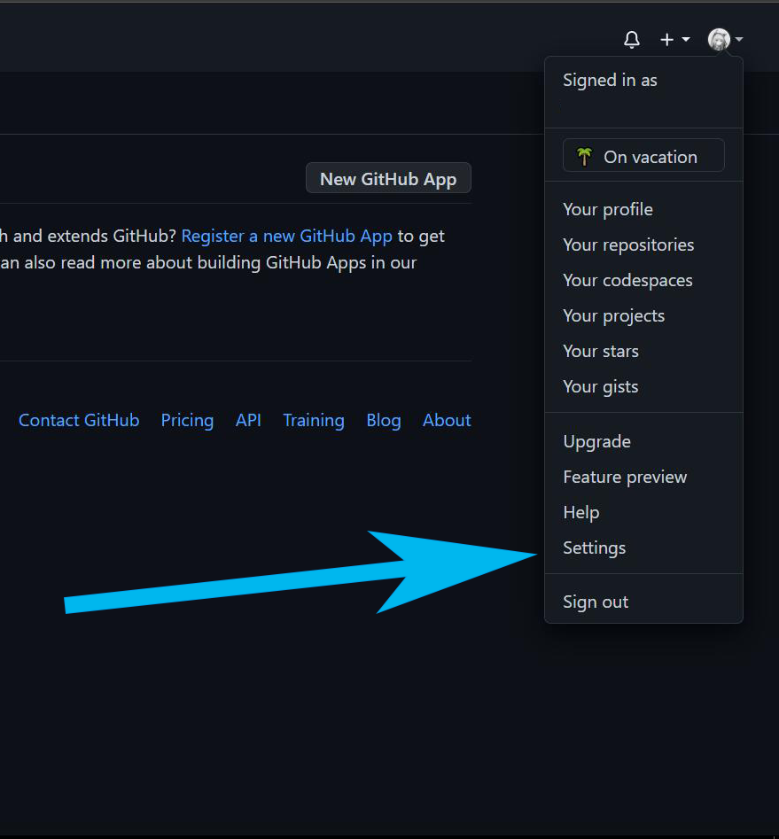
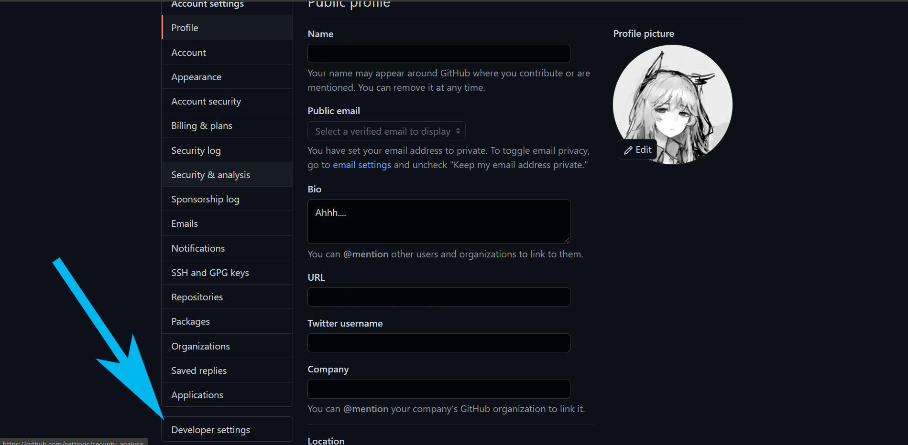
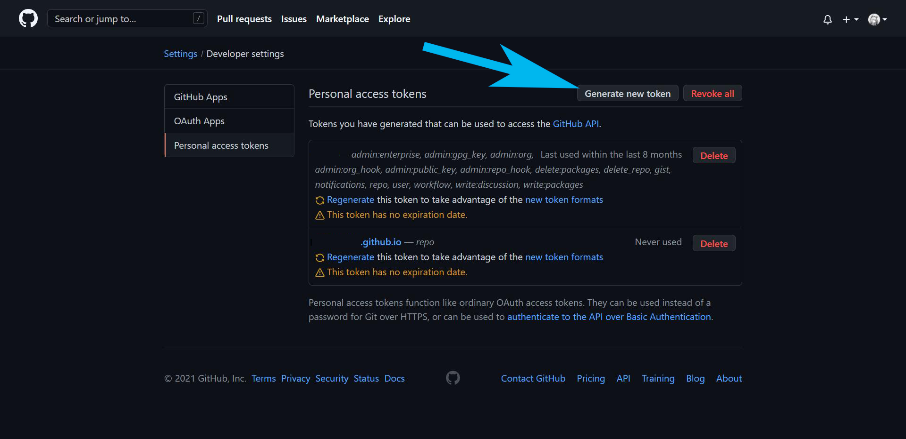
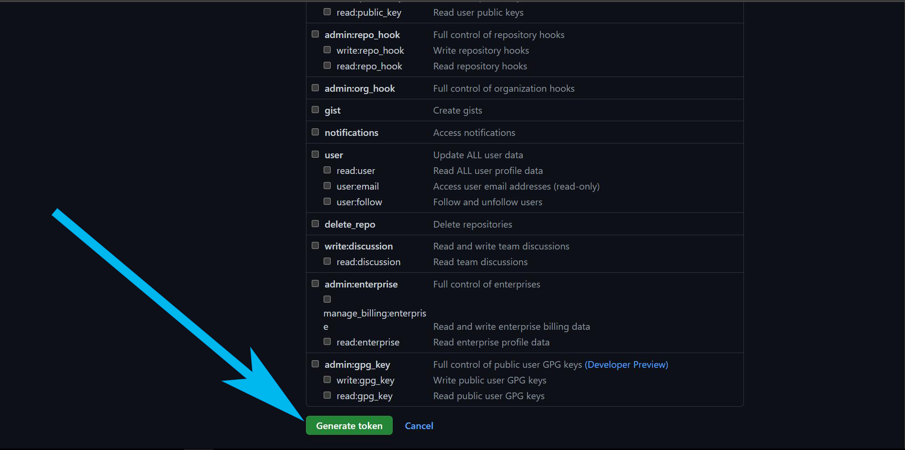

@[TOC](文章目录)

<hr style=" border:solid; width:100px; height:1px;" color=#000000 size=1">

# 前言
有段时间没往库里交代码了,今天打算把这段时间写的都交上去,结果报出了这个:
`remote: Please see https://github.blog/2020-12-15-token-authentication-requirements-for-git-operations/ for more information.`

缺少token.
# 一、获取自己的token
## 1.进入setting界面
登入GitHub,点击右上角头像旁的下拉列表,

## 2.进入'Developer settings'
最近他们更新的时候把原来选项的内容放到"Developer settings"选项里了.

## 3.进入'Generate new token'
生成新的token.


---

## 4.New personal access token页面
Note:

Expiration:使用期限,这个token你打算用多长时间再换?(可以无限期)

select scopes:这下面的内容大概是一个权限列表,说的应该是使用这个token登入者所能享受到的权限;



个人库的话, 上面这些选项你都可以不选, 但是一定, 一定要把repo勾上, 不然这个密钥不会作为你访问github仓库的密钥, 你在尝试远程访问github仓库时输入这个密钥会直接403或者SSL 10054之类的报错.

---

# 二、拿到token后
<strong>妥善保存你的token,后面没有机会看到了</strong>,如果忘记后要修改会比较麻烦.
你的token会显示在绿色区域;


然后在提示输入密码时转而输入密钥即可.

另外一个账户中多个token的存在会导致在使用其一提交时提示无权限:

```javascript
remote: Permission to xxx/xxx.git denied to xxxx.
fatal: unable to access 'https://github.com/xxxx/xxxx.git/': 
The requested URL returned error: 403
```

---

# 三、提交代码
提交还是以前的流程, 差不多吧, 下面跟token就没什么关系了.

---
最後, 在需要輸入GitHub密碼的時候, 你需要使用這個token來代替以前的密碼, (比如把你的博文推上去);

---

# 总结
这两天找了个element的项目来做,下篇大概率会是element使用方面的文(如果接下来两天内没有让我翻车的重大BUG的话)
感谢你读下来,这些是我的个人见解,可能有些浅薄,如果您能指出我的错误,在下感激不尽了.

2022-7-20修改: 规范提交流程
20230323: 生成密钥时一定要勾选repo, 找了好久都没找到问题, 最后发现这个密钥根本没作为库操作的密钥.