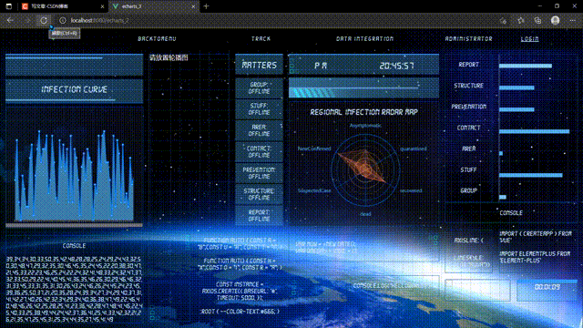
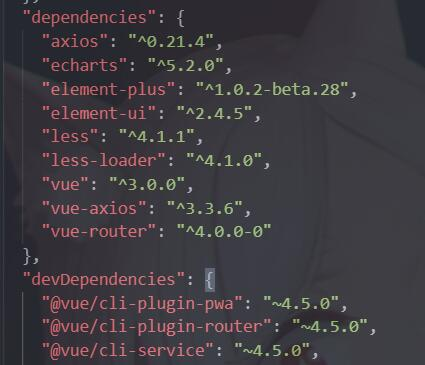
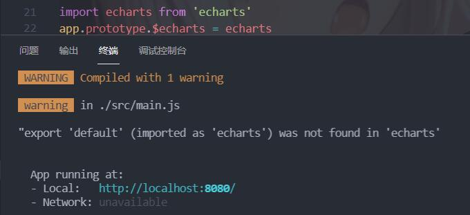

@[TOC](文章目录)

<hr style=" border:solid; width:100px; height:1px;" color=#000000 size=1">

# 前言
最近在做这个项目,这也是驱使我探求Vue3和Echarts结合方法的原因,虽然还没做完,我挑一个页面给你们看看吧.

你可以看到右下角还没有对齐,然后轮播图也还没做,不过这都不重要了,引你进来的目的已经达到了.




# 一、按需引入
这个项目我用的是全局引入,图个方便,没讲究那么多,但我估计大家还是喜欢按需引入吧..

```javascript
import * as echarts from 'echarts';
//只加这句就行了,而且也不用use这个东西
```

```javascript
//组件中
import * as echarts from 'echarts/core';
import { CanvasRenderer } from 'echarts/renderers';

import { BarChart } from 'echarts/charts';
//格式: import { 图表类型 } from 'echarts/charts'

import {
  TitleComponent,
  TooltipComponent,
  GridComponent
} from 'echarts/components';
// 提示框，标题，直角坐标系组件，组件后缀都为 Component

echarts.use([
  TitleComponent,
  TooltipComponent,
  GridComponent,
  BarChart,
  CanvasRenderer
]);
// 注册必须的组件
```
好麻烦,我不想每个组件都来这么一段...
<hr style=" border:solid; width:100px; height:1px;" color=#000000 size=1">

# 二、全局引入
我觉得你们不会愿意看这个的,尤其是在我写了按需引入的方法之后,所以,我就把它放到最后了...
你要知道全局引入就是图个方便,这会让你的项目变的相对更大,因为你把那些用不到的东西也加进来了.

官方推荐的方法就很不错(虽然我当时对官方文档没抱希望没去看), 我在官方推荐方法的基础上做了一些改动,好让它能在这样高版本的环境里正常运作.
这是官方给的方法:
[点击传送到官方推荐方法](https://echarts.apache.org/handbook/zh/basics/import)

在安装echarts后同样在main.js中加这样一句:

```javascript
import * as echarts from 'echarts'
//只加这一句就好,也不需要use这个东西
```

然后在使用的组件里注册echarts实例:

```javascript
//组件中
let echarts = require("echarts/lib/echarts");
```
利用这个实例, 再这样初始化:

```javascript
//组件中
  let mychart = echarts.init(document.getElementById("chart1"));
```

这是我的整个main.js:

```javascript
import { createApp } from 'vue'
import App from './App.vue'
const app = createApp(App)
import * as echarts from 'echarts'
app.mount('#app')
```
<hr style=" border:solid; width:100px; height:1px;" color=#000000 size=1">

# 三、4小时血泪史
# 1.第一个困难
前面说到接口改动了,这样的话我们再用原来的老套路:

```javascript
import echarts from 'echarts'
Vue.prototype.$echarts = echarts
```
是不行的,会报错:
main.js?56d7:6 Uncaught ReferenceError: Vue is not defined.
这个就是我一直报的错误,其实倒也不是因为接口改了的问题,
这个错误是因为当时我不知道Vue3里不能再用Vue.xxx来创建实例,结但是阴差阳错让我找到了这个问题的解决方案.

至于老式的,现在我回来试了一下,Vue替换成app...也不行:

虽然只是一个警告,但页面是渲染不出来的.

# 2.第二次尝试
而另一种报错情况是我根据另一位博主的教程来写的,他改进了第一种错误的写法,建议在main.js中使用:

```javascript
const app = createApp(App).mount('#app')
import * as echarts from 'echarts'
app.$echarts=echarts

```
其实上面这部是对的;
而且这样在使用时应该是可以直接使用"$echarts"来初始化Echarts;
但是下面这步我没看明白,所以当时没有采用.

```javascript
let myChart = this.$root.echarts.init(
  document.getElementById("myChart")
);
```
现在回来看看其实可以直接

```javascript
let myChart = $echarts.init(
  document.getElementById("myChart")
);
```

不过他的答案还是给了我的很大的帮助,让我认识到了在main中添加

```javascript
'import * as echarts from 'echarts'
```

的必要性.
这最终引导我走向了正确的道路.
我尝试了很多次,但是错误基本就是这两个了

<hr style=" border:solid; width:100px; height:1px;" color=#000000 size=1">

# 总结
基本步骤就是这些了,大家引入过程中如果出现困难可以在评论区找到我...
这个项目做完后我打算分享出来,大概不会太久.

它是一个基于Vue3,Cli4+element-Plus+Echarts的项目.

下篇会说一下怎么让一个Echarts表动起来,其实本来打算放这篇说但是实在是有点晚了明天还得早起,只好单开一篇说了.


