# Vue3+CLI4 项目中如何使用Element
@[TOC](文章目录)
<hr style=" border:solid; width:100px; height:1px;" color=#000000 size=1">


# 前言
使用中报错请看第一大节,准备引入请看第二大节.

<hr style=" border:solid; width:100px; height:1px;" color=#000000 size=1">

# 一、解决过程
在安装了Elementui之后向项目里引入官方的组件,终端警告:
`"export default" is (中间这段我忘了) in vue`
然后进入页面也是什么都渲染不出,控制台报错:
`Uncaught TypeError: Cannot read property ‘prototype‘ of undefined` 

我去查了一些解决方法,
他们说建议降CLI或者Vue到更低版本,好家伙,我这楼都盖了一大半了你跟我说要换钢筋?

我去Element的官网查了一下,搜索引擎排在前面的是适配Vue2.0的ElementUI官网,但是可以传送到V3版:
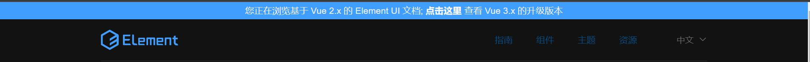
我就过去看了一下,然后发现了一个很明显的区别:
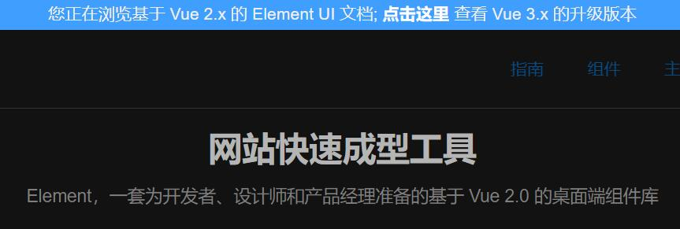
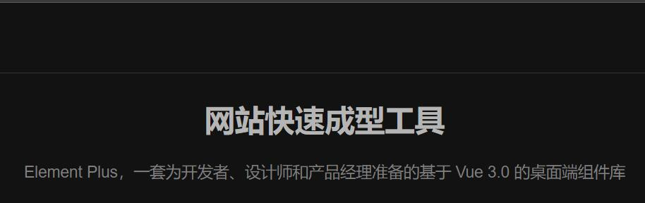
适用于Vue3.0的Element应该是Element-plus,我们应该再安装一个ElementPlus

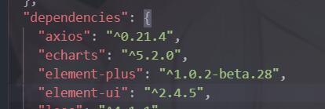

然后我萌生出一个问题:"那安装完之后Element-ui能不能卸掉?"

我试了,可以

ElementUI是专门适用于Vue2.0的,Vue3环境下完全不需要它,伴随着Vue.xxx的引入方式被Vue3.0废弃,依赖这种方式来使用的Element-ui也被淘汰.

卸掉就好了,我之前写的Element组件也没有出现任何问题:
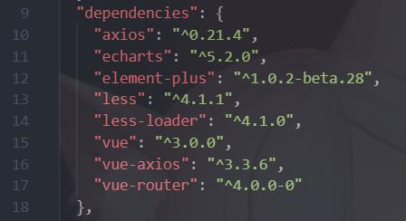
# 二、如何引入

npm安装element-plus,然后...
main.js中加入:

```javascript
import ElementPlus from 'element-plus'
import 'element-plus/dist/index.css'
app.use(ElementPlus).mount('#app')
//样式文件的路径可能会报错,不过问题不大;
//自己去node_modules里找到目标文件路径就好了;
//引入"index.css"是直接引入全部的样式文件，这样做可以避免引入额外的打包工具.
```

然后这就够了,也不用引入组件,你现在可以直接去复制代码粘进来用了,具体为什么请继续往下看:

<hr style=" border:solid; width:100px; height:1px;" color=#000000 size=1">

## 1.关于引入组件
我遇到一个奇怪的点,官方文档和很多大佬都说要引入组件,但是我在以前做Vue2项目的时候,包括现在的Vue3项目,用Element都是不引入组件直接粘过代码来就能用的,我不知道这是否合理,但确实是我遇到的情况,就以这次Vue3项目来示例吧:

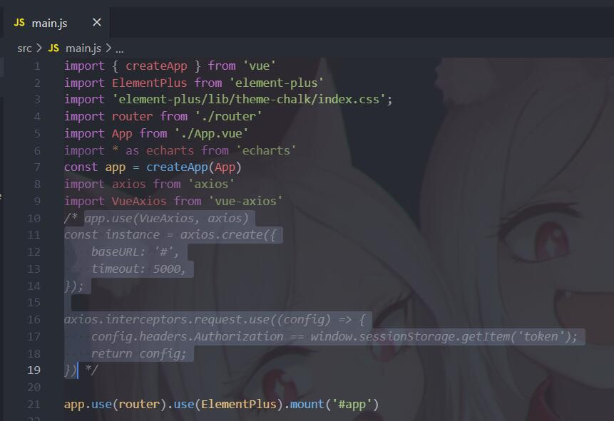
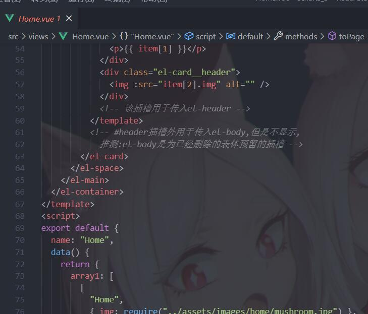

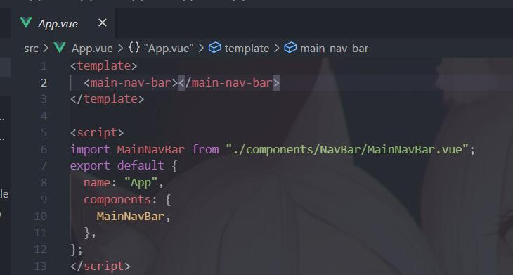

你可以看到我没有在任何地方引入组件,仅仅是在官方网站的组件库里复制代码和样式到我的文件里,就可以正常使用.
最后更离谱一点我把element.js也注释了,但是还是没有任何影响:

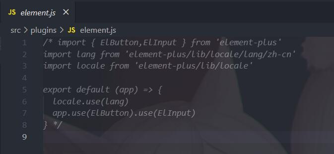
<hr style=" border:solid; width:100px; height:1px;" color=#000000 size=1">

这是我写的一个示例页面,使用了走马灯组件和卡片组件,均未事先引入:
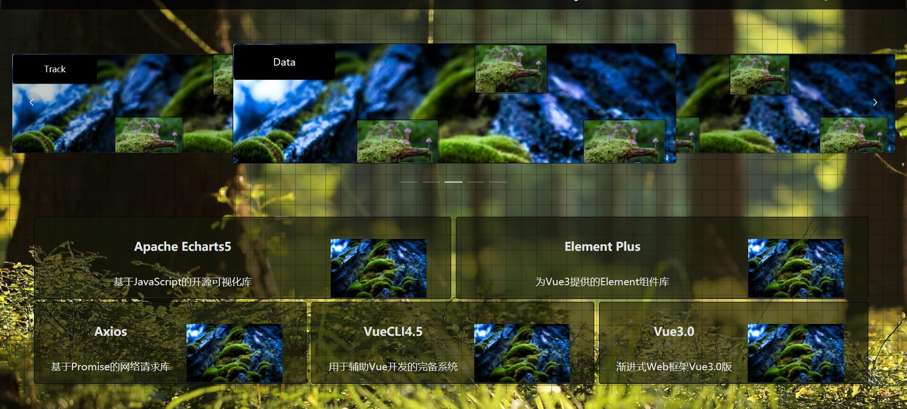
交互,特效,样式,均可正常使用,也没有警告:

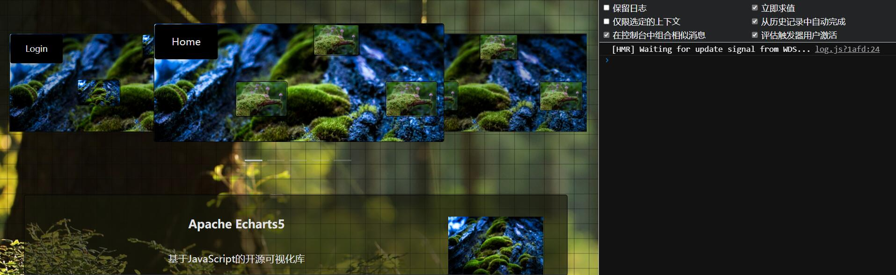

# 总结

好吧,那我就先这样记下来了,我不知道不事先引入有没有什么不好的地方...

如果这样做有什么很大的弊端的话,还恳请您在评论区指导我一下,我会感谢您的.
这篇文章如果为您提供了帮助,我也很荣幸.