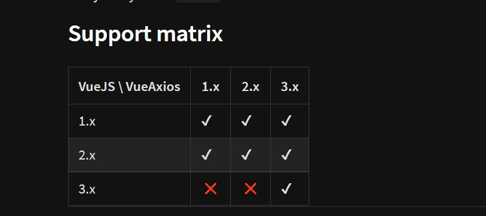
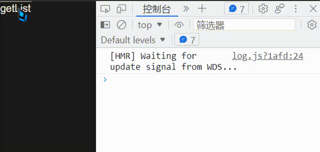

@[TOC](文章目录)


<hr style=" border:solid; width:100px; height:1px;" color=#000000 size=1">

# 前言
我是在cli4.5.x + vue3环境下做的,所以代码看起来可能有些离谱.

这是一个基于vue并进行了轻度封装的axios包,里面整合了vue环境下会用到的一些axios相关.
<hr style=" border:solid; width:100px; height:1px;" color=#000000 size=1">


# 一、安装vue-axios
这东西不能替代axios, axios还是要装的, vue-axios可选装.



```typescript
npm i axios vue-axios --save
```
<hr style=" border:solid; width:100px; height:1px;" color=#000000 size=1">

# 二、使用方法
```typescript
//作者原话,大意是我开发的这个东西好处不大
//它可以将axios与vue实例绑定,这样你使用axios时就不用每次都引入(axios)了
It only has a small benefit 
that it binds axios to the vue instance
so you don't have to import everytime you use axios.
```
axios还是axios不会变, 该怎么请求还是怎么请求的, 但是不论Vue3还是Vue2, 我们都是不能直接在main.js里像引入element之类插件的方式引入axios的.

应该要绑定到原型链, 非得弄个$http什么的才好:

```javascript
//Vue3
import { createApp } from 'vue'
import App from './App.vue'
import router from './router'
import axios from 'axios';

const app = createApp(App)

app
    .use(axios)
    .use(router)

app.mount('#app')
```

可以看到Vue3直接引入会栈溢出, 但引入Vue-axios可以解决这个问题, 实现像引入普通插件一样引入axios:

```javascript
app.use(VueAxios, axios)
```
然而仅仅是这样并不能在全局使用, 只是main.js里可以用了, 我们总不能在main.js里发请求吧...
所以还要provide()到全局, 在需要使用的地方inject注入;

main.js:
```javascript
import { createApp } from 'vue'
import App from './App.vue'
import router from './router'
import axios from 'axios'
import VueAxios from 'vue-axios'

const app = createApp(App)

app.use(VueAxios, axios).use(router) 
//然而只是这样全局并不能用;
app.provide('axios', app.config.globalProperties.axios) 
//这句不写, 组件里无法注入全局axios, 也就无法使用

app.mount('#app')
```
组件:

```html
<button @click="getList">getList</button>
```

```javascript
//<script setup>

import { onMounted } from "vue";
import { inject } from "vue";

const axios = inject("axios");  //注入一下不然不能用

function getList() {
  axios.get("http://x.xxx.xx.xxx:3000/getHottestArticle").then((res) => {
    console.log(res);
  });
}

//</script>
```


<hr style=" border:solid; width:100px; height:1px;" color=#000000 size=1">

其实这样...
每个组件里还要注入一下, 仅考虑简便性的话, 真的感觉没什么必要...

---

# 总结
半年前去看了官方文档, 一头雾水的回来记了这个.
今天是2022-5-12, 去看了官网文档, 一头雾水, 不过好歹是看出点区别来.
官方文档的例子跑不起来...

嘶....似乎总结了一些没用的东西啊!
希望它们对你有帮助吧:(