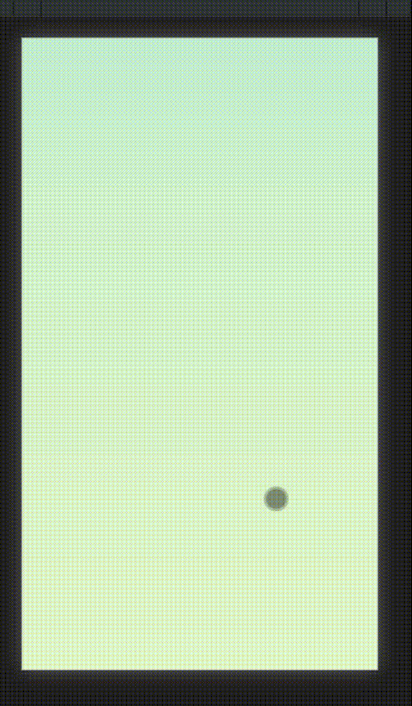
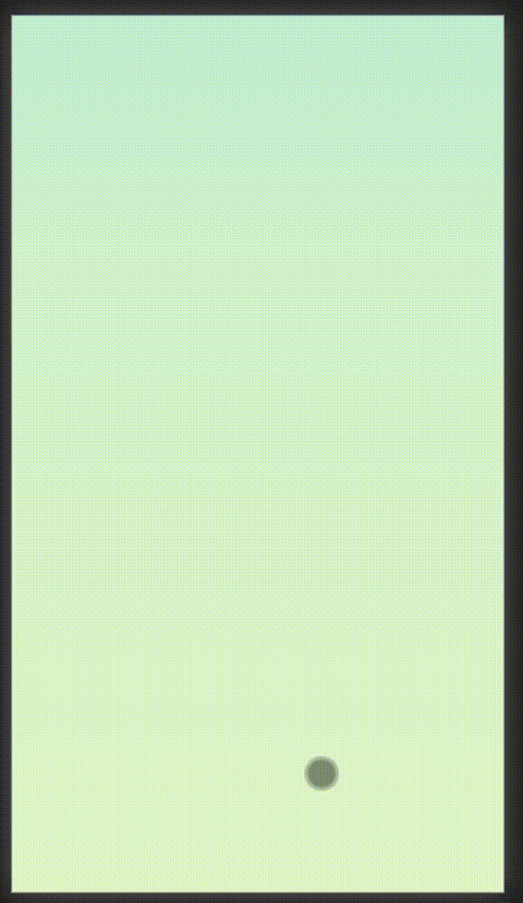

# 纵向滚动导致轮播图异常
@[TOC](文章目录)

<hr style=" border:solid; width:100px; height:1px;" color=#000000 size=1">

# 前言
今天手机端页面,需求是做一个上滑翻页的效果,先写了一个demo,没有什么问题,用touchstart,touchmove和touchend解决了滑动翻页的问题,然后运行起来看着都还不错!

接着就开始下饭了,在照着demo的纵向轮播结构向里面添加了诸多页面内容后,页面出现了一种奇怪的切换动作:慢慢翻还好,只要翻快点不是翻多了看不全就是翻少了多出来一截.


<hr style=" border:solid; width:100px; height:1px;" color=#000000 size=1">

# 一、解决过程
这个轮播图的原理是每次下翻动画结束之后将< ul>的bottom属性加或减一个innerHeight来进行位置修正.所以,在猜测每次翻页后< ul>的最终移动距离在此处不适用之后,就去调了一下每次翻动后修正的距离,发现虽然偶尔可以了但是大概70%的时候还是错位.
有点恼火...猛地一翻,结果轮播图直接从第一张翻到了最后一张,然后回跳到了第二张和第三张之间.

这是demo里没有出现的情况,它不应能一次翻出如此长的距离...

这页面滑动估计是默认行为,想到或许可以去尝试阻止默认行为.
<hr style=" border:solid; width:100px; height:1px;" color=#000000 size=1">

# 二、解决方案
那就去阻止默认行为吧,最后倒也真的解决了.


需要对操控< ul>拖动的代码上做一些改动,要阻止拖动 过程中 默认行为的出现,那必然也要是在过程中做手脚,也就是"touchmove"时间触发阶段:

将代码从:
```javascript
//"roll"就是整个<ul>;
        roll.addEventListener("touchmove", function (e) {
            nowPos = e.touches[0].clientY;
        })
```
改动为:

```javascript
//"roll"就是整个<ul>;
        roll.addEventListener("touchmove", function (e) {
            nowPos = e.touches[0].clientY;
            e.preventDefault(); 
        })
```
在鼠标拖动中每一刻都会执行这个事件监听函数,也就每一刻都会阻止默认行为.

啊...
就这样,加上就好了,没有什么特别绚丽的操作.


<hr style=" border:solid; width:100px; height:1px;" color=#000000 size=1">

# 一份代码模板
原理就是用一个container来作为视口,然后在ul这个胶卷上贴上影像,不断地在container视口拖动

```javascript
        var roll = document.querySelector("你的ul");
        var rollItem = document.getElementsByClassName("ul上的卡片们");
        var startPos = null;  //开始拖动处Y坐标
        var nowPos = null;    //结束拖动时的Y坐标
        var num = 0;          //页码计数,配合innerHeight修正最终位置
        var distance = null;  //纵向拖动最终位移;
        roll.addEventListener("touchstart", function (e) {
            startPos = e.touches[0].clientY;
        })

        roll.addEventListener("touchmove", function (e) {
            nowPos = e.touches[0].clientY;
            e.preventDefault();   //阻止拖动过程中的默认事件;
        })

        roll.addEventListener("touchend", function (e) {
            distance = nowPos - startPos;  //得出拖动方向;
            deal(distance);   //传参拖动方向给处理方法;
        })

        function deal(distance) {
            console.log(distance);  //检查是否接收成功;
            if (distance > 40) { //去敏感化;
                //判定:下翻;
                if (Math.abs(num) != 0) {
                    num++;
                    roll.style.animation = "switchUp 1s";  //下翻动画
                    document.addEventListener("animationend", function () {  //animationend事件在该元素拥有的动画结束后被触发;
                        roll.style.bottom = -innerHeight * num + 'px';  //翻页动画结束,修正页面位置;
                        roll.style.animation = "defau";  //重置动画为无,以确保下次能正常执行动画;
                    });
                }
            } else if (distance < -40) {  //去敏感化;
                //判定:上翻;
                if (Math.abs(num) != (rollItem.length + 1)) {
                    num--;
                    roll.style.animation = "switchDown 1s";
                    roll.addEventListener("animationend", function () {  //animationend事件在该元素拥有的动画结束后被触发;
                        roll.style.bottom = -innerHeight * num + 'px';  //翻页动画结束,修正页面位置;
                        roll.style.animation = "defau";  //重置动画为无,以确保下次能正常执行动画;
                    });
                }
            }
        }
```

# 总结
记一个小BUG,这还是第三次用 e.preventDefault() 方法,十分具有纪念意义 doge)