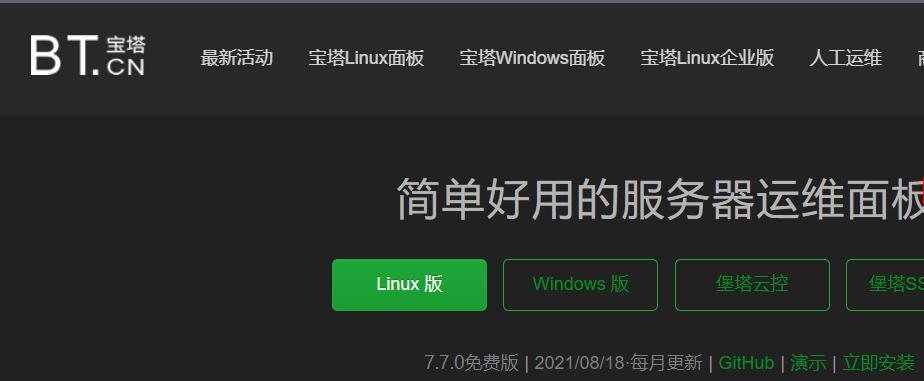
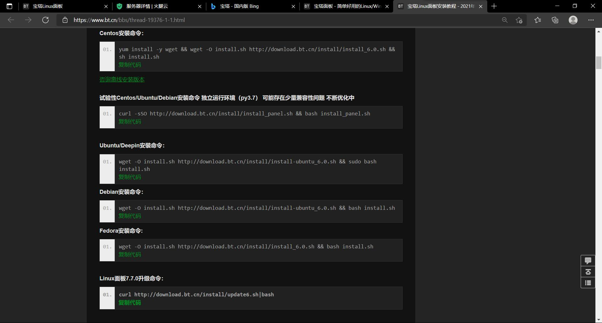
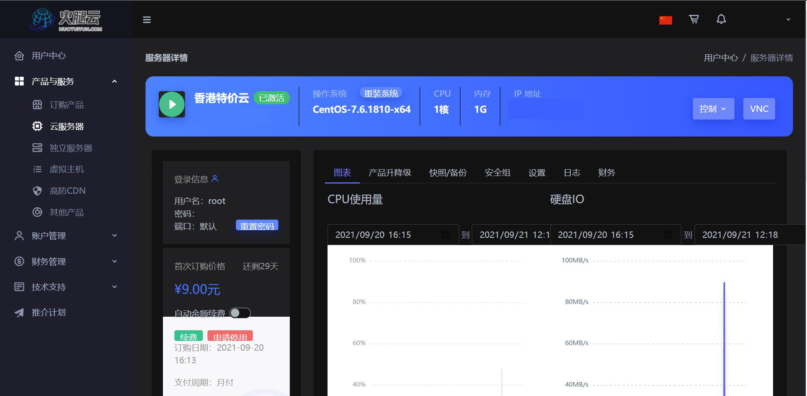
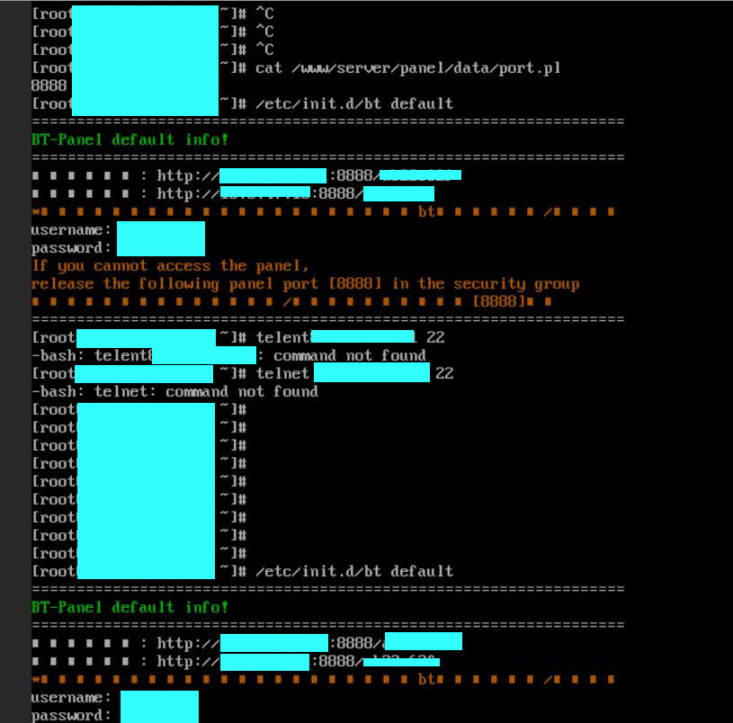
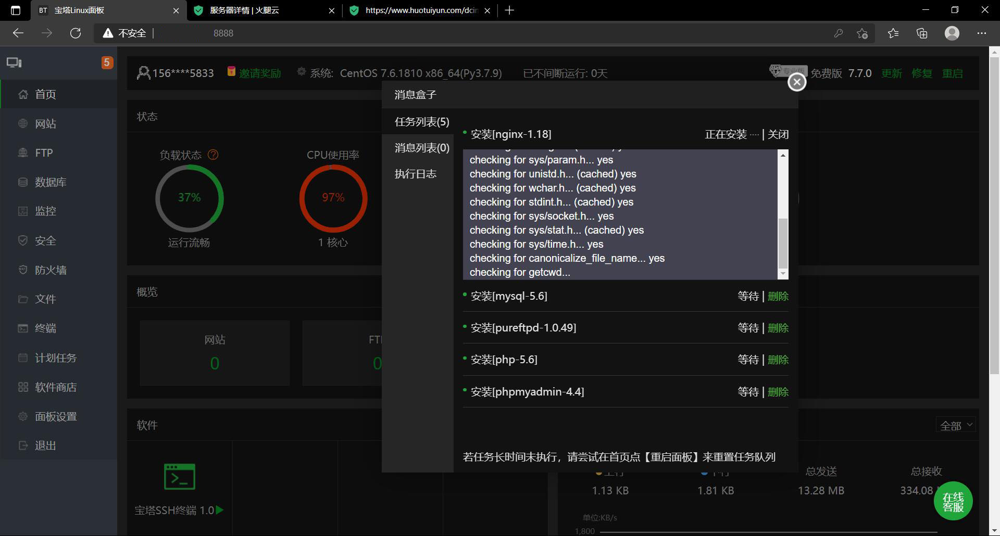
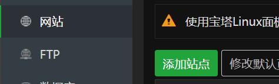
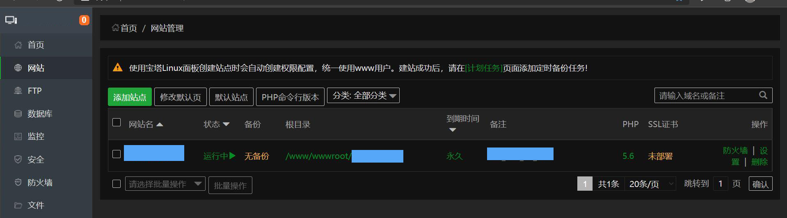
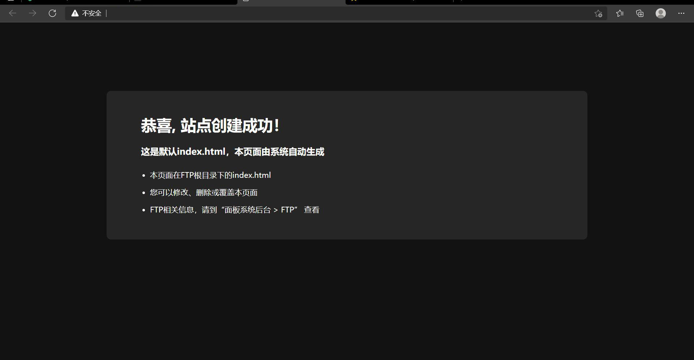

# 无SSH工具, 部署成品网站到火腿云服务器
@[TOC](文章目录)

# 前言
画了9块买了个火腿云服务器来部署我的项目,但是网上几乎查不到火腿云的教程,而且其他教程大多是自建服务器部署网站的教程,看起来体验也不是很好,决定记录一下部署成功的流程.

# 一、准备工作
1.你要去找到宝塔面板的官网,然后找到linux版的区域.

2.一个成品网站,有无均可.

3.一个火腿云的使用权,拥有自己的云服务.
# 二、部署流程
1.进入宝塔面板,选择linux版,点击图右下立即安装:

2.进入如下页面:

3.这些指令需要在火腿云提供的VHC命令行面板内输入,那我们现在要进入自己的火腿云操作面板:

4.点击"VNC":

5.这样就成功进入了命令行面板,<strong>先输入火腿云账号密码登录</strong>,然后输入宝塔官方提供的linux指令来安装宝塔面板linux版,之后会生成一份安全地址 + 用户名 + 密码:
安全地址就是图中http://xxx.

6.浏览器输入安全地址进入,输入生成的用户名密码,登入后输入IP为你的火腿云服务器IP(这部很重要), 登入建立在火腿云IP上的宝塔云面板,选择推荐配置进行安装:

安装完成后关闭任务面板,点击左侧标签栏"网站",点击"添加站点":

在"域名"输入框输入你的服务器IP,选择网站根目录,这时你会发现在D盘下多了一个wwwroot目录,请把你的网站文件夹放入这个文件夹,你可以选择直接将网站目录设置为"wwwroot/以域名命名的文件夹"来进行创建,创建完成后如下:

此时你可以点击上图中最左边蓝块的部分在弹出框中再次点击域名(IP)链接,来进入你的网站,如果你未放置成品网站情况下创建成功,会看到如下网站效果:

# 总结
这是我总结出的一些个人经验,如果这些帮到了您,我很高兴.
如果您发现了文章的不足,还望您的指点..