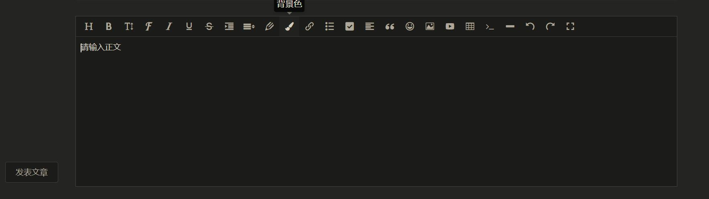
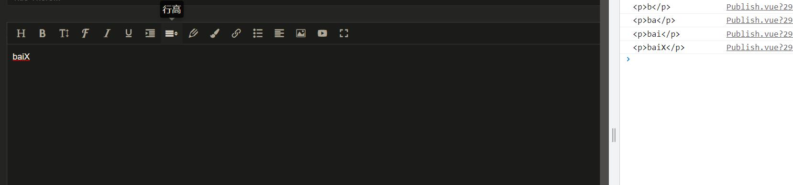
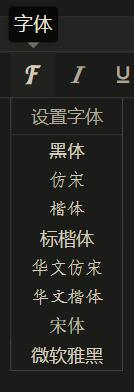

@[TOC](文章目录)

---

# 前言
我花一些时间做了一个博客, 需要一个引入编辑器, 让我好在网页上就能编辑文章.

这里中没有配置图片的上传功能, 如有需要请自行配置.

---


# 一、引入
npm下载:

```javascript
npm i wangeditor -S
```

之后在你要引入的页面:

```javascript
//这里名字无所谓, 就是待会new的时候要用这个名字new
import EWangEditor from "wangeditor";
```

# 二、呈现到页面
这一步主要在Mounted周期进行

```javascript
export default {
  name: "Publish",
  setup() {
    let data = reactive({});
    onMounted(() => {
    //主要在这里
    })
  }
```

## 1.原型
先new一个wangeditor出来, 我们之后针对wangeditor的配置都要以editor.xxx的格式.
然后你一定要.create()一下, 不然是什么都没有的.
```javascript
onMounted(() => {
  let editor = new EWangEditor("#editor");
  editor.create()
});

//这里的"#editor"对应要渲染为编辑器的html元素的id, 就像以前的querySelector()
```

## 2.可视化界面
去html部分建立一个div(建不建都行), 然后在里面放入一个和new wangeditor对象的时候使用相同id的div, 它将被渲染为wangeditor的样子:

```html
<!-- id要为new wangeditor对象时候使用的id -->
<div class="publish_content">
    <div name="editor" id="editor" ref="editor"></div>
</div>
```
这样我们的编辑器就已经有个雏形了, 上面的工具栏可能略有不同, 这个可以手动配, 待会再说.

我们先要能拿到内容, 实现基本编辑功能.

---

## 3.获取内容
我们要去实现获取输入的内容, 设定内容更新频率
你在wangeditor内写入的字符会被wangeditor自动转为HTML, 我们设定的更新频率, 即它每隔多久将你的文字提取并转换为HTML一次.

```javascript
onMounted(() => {
  let editor = new EWangEditor("#editor");
  editor.config.onchangeTimeout = 400; 
  /* 配置检测字符变化的最短时间间隔，默认为 200ms */

editor.config.customAlert = (err) => {  //如果检测到错误的话就打印.
  console.log(err);
};

editor.customConfig = editor.customConfig ? editor.customConfig : editor.config;
//设置customConfig属性

//设置customConfig对编辑器内文字的变化的处理方法
editor.customConfig.onchange = (html) => {  //参数html即已经转化HTML格式的文本
  data.editorContent = html;
  //在data中提前声明editorContent来存储
  console.log(html);  //实时输出更新的html格式
};

editor.create()
}）
```

也可以在旁边做一个能解析html的区域, 实时显示文章成品的样子, 用新的html不断覆盖旧的html就可以.

## 4.配置工具栏
menuItem中每个属性对应一个工具选项, editor.config.xxx对应的数组表示这个工具的可选项, 就拿字体来说:

```javascript
let menuItem = [
        "fontName",
]
editor.config.fontNames = [
        "黑体",
        "仿宋",
        "楷体",
        "标楷体",
        "华文仿宋",
        "华文楷体",
        "宋体",
        "微软雅黑",
      ];
```


那我们来做吧, 下面是onMounted中的所有代码了.
```javascript
onMounted(() => {
  let editor = new EWangEditor("#editor");
  editor.config.uploadImgShowBase64 = true;
  editor.config.onchangeTimeout = 400; 
      
  editor.config.customAlert = (err) => {
    console.log(err);
  };
      
  editor.customConfig = editor.customConfig
    ? editor.customConfig
    : editor.config;

  editor.customConfig.onchange = (html) => {
    data.editorContent = html;
    console.log(html);
  };
//以下为新增
  const menuItem = [  //工具栏里有哪些工具
    "head",
    "bold",
    "fontSize",
    "fontName",
    "italic",
    "underline",
    "indent",
    "lineHeight",
    "foreColor",
    "backColor",
    "link",
    "list",
    "justify",
    "image",
    "video",
  ];

editor.config.menus = [...menuItem]; /* 应用设置好的工具栏 */
     
editor.config.colors = ["#000000", "#eeece0", "#1c487f", "#4d80bf"];  /* 文字颜色、背景色可以选择哪些颜色? */
      
editor.config.fontNames = [ /* 字体工具提供哪些字体? */ 
  "黑体",
  "仿宋",
  "楷体",
  "标楷体",
  "华文仿宋",
  "华文楷体",
  "宋体",
  "微软雅黑",
];

editor.config.height = 500;  //你可能发现这个编辑器是没法用样式调高度的?
//新增至此
editor.create();
});
```

# 总结
如果这篇文章帮到了你, 我很荣幸.