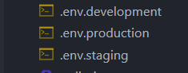

@[TOC](文章目录)

---

# 前言
今天把网站搬到新服务器上了...
然后出了一堆乱子, 其实主要还是忘记换接口, 和后端数据库连接对不上的问题, 刚解决完.
解决的过程里我试了各种方法, 初期没找到正确的原因, 错误的认为是跨域的问题, 想着反正早晚也要搞跨域, 今天刚好有个练手的机会, 练练得了...


---

# 一、vue.config.js
20230302: 我觉得有必要改一下, 以前说的太笼统多少有点误导意味.

proxy下面每个对象表示一个代理, 执行的时候会先进行正则匹配, 举个例子的话, 如果你的请求路径是这样:
```
axios.post('/api/getPassword', data);
```
最好在请求路径前面加一个统一前缀, 放这里指`/api`前缀, 因为代理需要去匹配一个字符串, 如果多个接口都需要请求一个地址并且都需要代理, 那它们最好有一个统一的前缀, 这样你只要配置一个代理就能把这些接口的请求都代理好.
然后前台跑在`127.0.0.1:8080`, 你想去`https:// gk.work/relax`请求, 那么你的代理应该如下:

```
'/api': { // 代理2
  target: `https://gk.work/relax`,
  changeOrigin: true,
  pathRewrite: {
    ['^' + '/api']: ''
  }
}
```

匹配的时候检索到你的请求路径里有`/api`, 会触发代理.

请求路径里`/api`前面会被加上`target`, 请求路径是`/api/getPassWord`, 实际上请求的是`https://gk.work/relax/api/getPassword`.

然后`/api`是可以被替换的, `pathRewrite`下可以配置, 这里`pathRewrite`规定匹配到`/api`就将它替换为空字符串(如果这样写:`['^' + '/api']: '/api'`那么`/api`会被保留, 请求路径仍旧会是`https://gk.work/relax/api/getPassword`), 所以最终请求的是`https://gk.work/relax/getPassword`.

---

# 二、从环境变量配置路径
可以直接写字符串做代理匹配, 如果前面做完能用, 这步可以不做

这里以一个双代理为例, 现在系统里的请求需要向两个地址请求, 一个是`127.0.0.1:8081`, 一个是`https://gk.work/relax/api`, 那么`vue.config.js`里这样写:


```
devServer: {
  proxy: {
    [process.env.VUE_APP_PYTHON_API]: { // 代理1
      target: `http://127.0.0.1:8081`,
      changeOrigin: true,
      pathRewrite: {
        ['^' + process.env.VUE_APP_PYTHON_API]: ''
      }
    },
    [process.env.VUE_APP_BASE_API]: { // 代理2
      target: `https://gk.work/relax`,
      changeOrigin: true,
      pathRewrite: {
        ['^' + process.env.VUE_APP_BASE_API]: '/api'
      }
    }
  }
}
```

然后现在看向标注了`代理1`和`代理2`注释的两行, 这里我没有直接写字符串形式的路径而是使用了Vue环境变量, 其实意思是这样的:
```
'/dev-api': { // 代理2
  target: `https://gk.work/relax`,
  changeOrigin: true,
  pathRewrite: {
    ['^' + process.env.VUE_APP_BASE_API]: '/api'
  }
}
```
只不过我现在用这个环境变量替代了`/dev-api`, 这个环境变量的值是等于`/dev-api`的;
可以在:



里配置, 分别决定三种不同环境下使用的代理地址: 生产, 开发, 模拟, 开发过程中使用的是`.env.development`下的生产环境代理地址, 这三个文件不一定要全都写, 这里展示下`.env.development`的配置:
```
# just a flag
ENV = 'development'

# base api
# process.env.VUE_APP_BASE_API会被替换为/dev-api
VUE_APP_BASE_API = '/dev-api'

# process.env.VUE_APP_PYTHON_API 会被替换为/dev-ann-api
VUE_APP_PYTHON_API = '/dev-ann-api'
```
那么我的请求地址应该这样写:
```
axios.post('/dev-api/getPassword', data);
```
实际上是在请求:`https://gk.work/relax/api/getPassword`, `/dev-api`被替换为`/api`, 然后前面拼接上请求的`target`也就是`https://gk.work/relax/`;
这也是为我说建议给指向同一地址的请求增加一个请求地址的统一前缀, 方便做代理.

---

# 三、请求改造
有必要的话需要做请求地址的改造, 如果一开始你的请求没有统一前缀而你要做代理, 那就给每个请求地址加一个统一前缀, 然后代理的时候就去匹配这个统一前缀.

---

# 总结
--