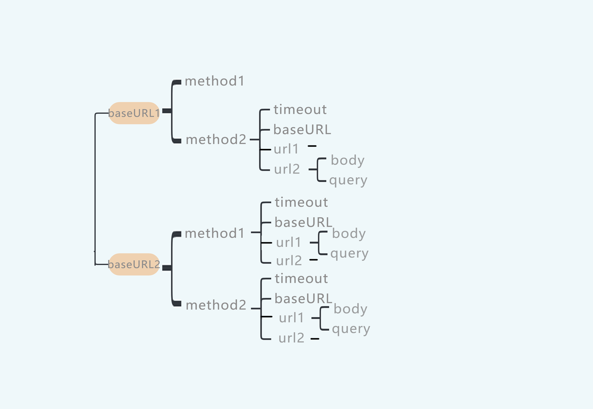

 

---

# 前言
这几天有计划把博客里的axios封装一下, 本来是直接做的请求, 看着实在有点乱;
顺便复健一下axios抽离, 快给忘干净了;

---


# 一、计划一下
分两层来封, 基础层主要针对bseURL封装, 接口层针对每个接口进行封装;

如下图


# 二、基础层
确保后端更改baseURL时, 前端更方便安全的配合;
首先对于每个baseURL建立一组实例, 组内包括基于这个域名以各种method进行请求的实例;
我这里只用了一个域名和get/post两种请求方法, 所以我只需要根据请求方法创建两个实例分别负责post和get请求.
如此不需要在页面传入timeout, method以及baseURL;

```javascript
//request.js
import axios from 'axios'
const baseURL = 'http://localhost:3000/'

export const postService = axios.create({  //baseURL的post请求经由此
    baseURL: baseURL,
    timeout: 5000,
    method: 'post',
})

export const getService = axios.create({   //baseURL的get请求经由此
    baseURL: baseURL,
    timeout: 5000,
    method: 'get',
})
```

---

# 三、接口层
每到一个页面都要做一次请求, 如果每个页面都传一次url就会有点糟糕了, 所以根据接口url再度封装.
确保前端在请求同一接口时不需要重复传入某一参数, 在我这里, 这个需要重复传入的参数只有url.
确保在后端仅更改接口url时, 前端能够更方便安全的配合;
如此不需要在页面传入url;

这里我多做了一步, 把每个页面的请求单独分了js文件, 所以这里是login.js, 放在一起也是一样的.
```javascript
//login.js
import { postService, getService } from "./Service"

export const postData = (data) => {  //后端从body里拿值是这样写的
    return postService({
        url: '/getComments',
        data
    })
}

export const getData = () => {  //不用发数据的请求
    return getService({
        url: '/getHottest',
    })
}

export const doLogin = (userData, elses) => {  //body和query都要传参的写法
    return postService({
        url: '/doLogin',
        userData,
        params: {
            elses
        }
    })
}
```

---

# 使用封装的axios请求
引入封装的最彻底的那层的方法, 这里也就是直接引入接口层的方法;
```html
<button @click="getHottestArticle">getHottest</button>
<button @click="getComments">getComments</button>
<button @click="login">login</button>
```

```javascript
//<script setup>
import { inject } from "vue";
const axios = inject("axios");
import { getData, postData, doLogin } from "./login.js";

const getHottestArticle = () => {
  getData().then((res) => {
    console.log(res);
  });
}

const getComments = () => {
  postData({ article_id: 1 }).then((res) => {
    console.log(res);
  });
}

const login() => {
  doLogin({ username: "xxx", password: xxx }).then((res) => {
    console.log(res);
  });
}

//</script>
```

# 总结
最近开始顺带着学Blender, 只是当个爱好吧.
说不定以后会记录一些Blender相关的技术...?

如果这篇文章帮到你, 我很荣幸.

