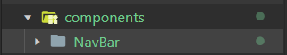
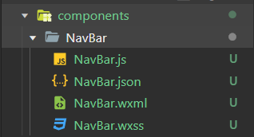
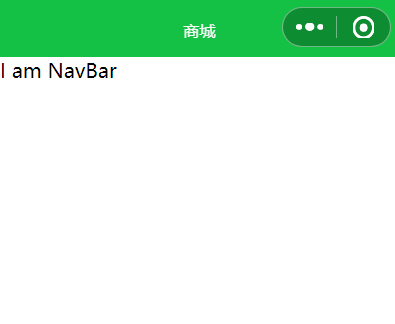

@[TOC](文章目录)

---

# 前言
项目结构方面可以单独建立一个目录来盛放组件, 我比较倾向于这种结构, 就像这样.

也可以...嗯...我在github上看过一些项目, 我发现作者们会把那些组件放在页面目录下, 但这样每个用到的页面都要复制一份, 会不会导致项目体量增大?

---
# 创建组件

创建好```components```之后先在里面新建一个文件夹NavBar作为组件目录, 不要直接```创建components```, 它会把你的组件4个文件直接扔在```components```目录下...


然后右键NavBar点击```建立components```, 这样看起来就会正常一些了...



这还没完, 因为要边做边看效果, 所以我们先把他随便引入到一个空页面, 就custom吧(随便一个就好)

如果你有接触过Vue的话, 不知道还记不记着Vue引入组件是要先使用```componets```来注册组件, 是的...小程序也有这一步, 只不过是在页面的json文件完成的, 待会会说到.

---

# 声明组件
这样还不够, 还要到组件的JSON, 将该页面声明为组件
```"component": true```
该页面是否作为组件? "是的"

```json
//NavBar.json, 请删除本行
{
  "component": true,
  "usingComponents": {}
}
```
---

# 引入组件
`usingComponents`里挂载组件, 另外记得JSON里必须用双引号.

```json
//custom.json, 请删除本行
{
  "usingComponents": { 
    "navbar": "../../components/NavBar/NavBar"
  }
}
```
然后就可以在页面WXML文件里用了:
```html
<!-- custom.wxml -->
<navbar></navbar>
```
NavBar.wxml里随便写点甚麽, 然后去custom.wxml页面:
```<text>I am NavBar</text>```



---