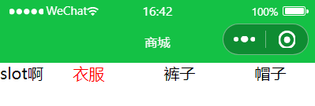
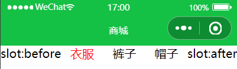
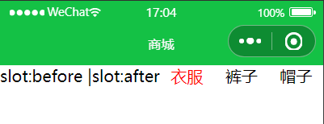
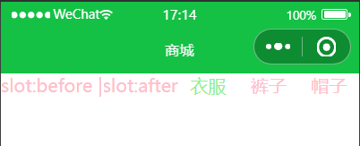
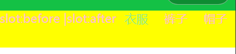
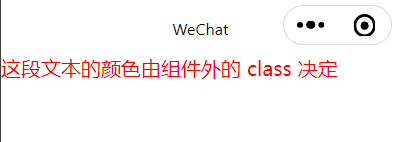
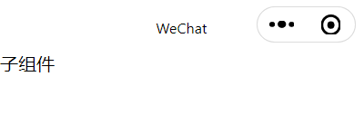

@[TOC](文章目录)

---

# 前言
小程序中, 如果插槽有必要拿到父组件的数据来展示, 直接父传子即可, 和Vue一样的思路

---

# 一、基本插槽
参考Vue的基本插槽, 两者的使用思路相同.
子组件开一个`<slot>`标签表示插槽, 父组件直接在子组件标签之间写入要插入的内容, 这些内容就会自动插入到子组件的第一个基本插槽中, 注意是第一个, 就下面这个例子就可以看出:

```html
<!-- 子组件.wxml -->
<view class="box">
  <slot></slot>  <!-- 基本插槽1 -->
    <view wx:for="{{list}}" 
          wx:key="item" 
    >{{item}}</view>
  <slot></slot>  <!-- 基本插槽2 -->
</view>
```

虽然这里使用了多个插槽, 但是子组件js里加不加这段无所谓, 因为最终是只有一个插槽, 但是多个具名插槽就要加了, 不然所有具名失效:

```javascript
//子组件.js
Component({
  options: {
    multipleSlots: true // 复数插槽: 是
  }
})
```
json里规定该目录下作为组件使用而非页面:

```json
//子组件.json
{
  "component": true,  //作为组件: 是
  "usingComponents": {}
}
```

不加也不会报错, 但所有插槽都是无效的.

之后在父组件里引入子组件:

```json
//父组件.json
{
  "usingComponents": { 
    "navbar": "../../components/NavBar/NavBar"
  }
}
```

```html
<!-- 父组件.wxml -->
<navbar model:list="{{datalist}}">
  <view>
    <text>slot啊</text>
  </view>
</navbar>
```
这个Navbar使用了弹性布局, 如果两个插槽均能成功插入, 那么navbar左右应当各有一个"slot啊". 
自上而下解析, 只有第一个插槽被插入内容:



这点和Vue不同, 在Vue中出现多个基本插槽时, 父组件传入的内容会整体、完好的插入每一个插槽, 我在《[Vue3 插槽使用详解](https://blog.csdn.net/qq_52697994/article/details/118226918)》中做过详细演示.
个人感觉这样不是很好.

---

# 二、具名插槽
和Vue的具名插槽很像(怎么又像...), 至少使用上很像.
使用`name`属性在子组件里给插槽起名, 父组件进行内容插入时使用`slot`属性指定这部分内容要插入哪个插槽:

```html
<!-- 子组件wxml -->
<view class="box">
  <slot name="before"></slot>
  <view wx:for="{{list}}" wx:key="item">{{item}}</view>
  <slot name="after"></slot>
</view>
```

1个以上具名插槽就一定要加这个了:

```javascript
//子组件.js
Component({
  options: {
    multipleSlots: true // 在组件定义时的选项中启用多 slot 支持
  }
})
```

然后到父组件引入试一下:

```html
<navbar model:list="{{datalist}}">
  <view slot="before">
    <text>slot:before</text>
  </view>
  <view slot="after">
    <text>slot:after</text>
  </view>
</navbar>
```
看下效果, 一个在Navbar主体前, 一个在navbar主体后:


emmm...
突然有个疑问, 要是把两个兄弟元素都规定插入同一个插槽, 会出现什么情况? 会按序插入, 还是我想的那样直接覆盖呢...
父组件分两次传给before插槽试一下:

```html
<!-- 父组件.wxml -->
<navbar model:list="{{datalist}}">
  <view slot="before">
    <text>slot:before |</text>
  </view>
  <view slot="before">
    <text>slot:after</text>
  </view>
</navbar>
```

可见并不会覆盖, 而是按照传入的先后顺序依次排列, 相当于一次性传入.

---

# 三、样式
组件现在可以设置自己内部的默认样式了, 按照Vue的思想, 即便向组件插槽内传入内容, 组件的样式也不会影响到插槽内容的样式, 但是现在这种隔离变得更加可控.

## :host
通过wxss选择器:host实现规定当前子组件内的默认样式, 并且可以影响到传入子组件插槽的内容:
举例:
```css
/* 子组件.wxss */
.active {    /* 活跃的navbarItem字体为亮绿色 */
  color: lightgreen;
}

/* 组件内所有文字默认粉色 */
:host {
  color: pink;
}
```
然后我们还是用具名插槽传那俩值, 看下效果, 此时"衣服"选项活跃:


---

## styleIsolation可控化样式隔离
允许直接开发者直接控制父子组件之间的样式分享规则;
直接放在子组件json里使用, 就像这样:

```json
{
  "component": true,
  "usingComponents": {},
  "styleIsolation": "shared"
}
```

| 属性 | 说明 |
|--|--|
| "styleIsolation": "isolated"  | 启用样式隔离, 父子组件互不影响(默认） |
| "styleIsolation": "apply-shared" | 父组件样式将影响子组件, 但子组件不影响父组件 |
| "styleIsolation": "shared" | 分享, 互相影响 |

就拿`"styleIsolation": "shared"`举个例子, 我在父组件的WXSS中, 指定一个子组件元素的样式:

```css
/* 父组件WXSS, 子组件中类名为box的元素 */
.box {
  background-color: yellow;
}
```

```html
<!-- 子组件 -->
<view class="box">
  <slot name="before"></slot>
  <!-- 略 -->
  <slot name="after"></slot>
</view>
```



---

## externalClasses外部样式类
将子组件内部元素的类名暴露, 允许在父组件内传入子组件内部元素类名.
比如子组件里有个长100px宽100px的div, 使用外部样式类可以做到由父组件传入一个类名, 实现父组件类名设置为子组件div的样式.

```javascript
//子组件
Component({
  externalClasses: ['my-class']
})
```

```html
<!-- 子组件 -->
<view class="my-class">这段文本的颜色由组件外的 class 决定</view>
```

```css
/* 父组件样式 */
.red-text {
  color: red;
}
```
```html
<!-- 父组件 -->
<my-component my-class="red-text" />
```


当然也可以看到, 在子组件内部这就是一个普通的类名, 那么是不是也可以在子组件wxss里使用它呢:



在既由外部传入又有自身样式的情况下, 样式类的优先级是未被定义的, 也就是说会出现覆盖情况?那么是个别样式的覆盖还是对于整个样式类的覆盖呢, 我试了一下:
根据结果来看, 其实只要将一个子组件类名指定为`externalClasses`, 它就不可再作为普通类名使用, 而且原因应该也不是产生了样式类覆盖, 因为父组件不给子组件传类名的情况下, 被指定为`externalClasses`的类名也不可以作为普通类名使用, 它根本不生效:

```html
<view class="my-class">子组件</view>
```

```js
//子组件js, 将my-class指定为externalClasses.
Component({
  externalClasses: ['my-class']
})
```

```css
/* 子组件样式 */
.my-class {
  height: 100px;
  width: 100px;
  color: yellow;
  background-color: aqua;
}
```

然后直接来看父组件不传类名的情况:

```html
<!-- 父组件中引入的子组件 -->
<my-component />
```

可以明显看到的是没有颜色, 说明即便父组件不传入类名, my-class也不再能作为普通类名使用了.

---

## 使用页面/父组件的样式
在配置了父子组件存在样式隔离的情况下, 出现子组件需要使用父组件或页面的样式类的需求, 可以使用这个.
通过在类名添加步骤进行一些额外操作来完成:

```html
<!-- 使用引入页面的类 -->
<view class="~blue-text"> 这段文本是蓝色的 </view>
```

```html
<!-- 使用父组件的类 -->
<view class="^red-text"> 这段文本是红色的 </view>
```

# 总结
还好有用过Vue, 学起来比较清晰.
文档最下面还有一个`虚拟化组件节点`, 这个本文没有提到.