@[TOC](文章目录)

---

# 前言
一份Three.js笔记, 还没记完
每节课的案例都单独开了一个目录来写, 现在教程看了一半, 给的我感觉就是——教程是一条线过去的, 虽然中途一切都很顺利, 但回头看看文档的话发现它基本没有进行什么扩展, 比如Object3D里面有很多属性和方法, 但是教程里只讲了案例里用到的一两个, 我自己看了一下文档, 没提到的方法属性中也不乏强实用性的个体.
这样下去, 恐怕看完教程我也只能写一些和教程相似的案例.
我还是希望在这里记录一些学习经验的同时, 依据文档进行扩展, 把用到的属性方法的其他情况都总结出来.

教程方面的知识主要记一个思路.
我之前接触过Blender和3DMAX, 有些东西对我来说不那么难以理解, 我也会尽量使用简单易懂的语言去解释它们.

另外看一下各种相机效果方面的区别.

---

# 一、场景操作
## 1.创建相机
模型完成之后要进行渲染, 渲染完成后我们将会从相机的角度看到渲染后的模型.
不管是Blender还是3DMAX, 都有相机的概念:

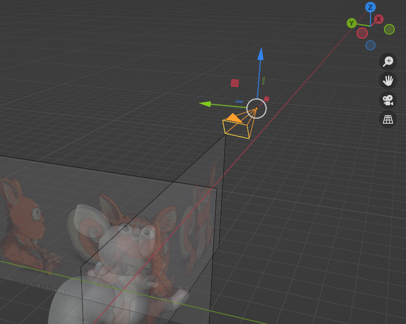
相机前面的锥形区域代表摄像的区域, 当然, 不会这么近视.

### ArrayCamera() 
不是一种相机, 而是一个为提高性能而生的多机位解决方案, 有点像axios.all(), 它接受传入包含多个相机的数组(比如"[camera1, carema2, carema3]"这样的, 预先把相机定义好再传进ArrayCarema生成相机.)

这里引用官方的一个例子:
[Three.js - webgl_camera_array源码](https://github.com/mrdoob/three.js/blob/master/examples/webgl_camera_array.html)

```javascript
let camera, scene, renderer;
let mesh;
const AMOUNT = 6;
```

```javascript
init();
animate();

function init() {

  const ASPECT_RATIO = window.innerWidth / window.innerHeight;
  const WIDTH = ( window.innerWidth / AMOUNT ) * window.devicePixelRatio;
  const HEIGHT = ( window.innerHeight / AMOUNT ) * window.devicePixelRatio;
  const cameras = [];
  
  for ( let y = 0; y < AMOUNT; y ++ ) {
    for ( let x = 0; x < AMOUNT; x ++ ) {
      //构建5个透视相机
      const subcamera = new THREE.PerspectiveCamera( 40, ASPECT_RATIO, 0.1, 10 );
		//规定每个相机的各项属性
		//...略
	    cameras.push( subcamera );
	}
}

camera = new THREE.ArrayCamera( cameras );
```
下面这个是举例渲染器渲染时如何渲染这种ArrayCamera:
```javascript
function animate() {
  mesh.rotation.x += 0.005;  //模型自移动动画-x
  mesh.rotation.z += 0.01;   //模型自移动动画-z
  renderer.render( scene, camera );  //渲染器渲染每个相机
  requestAnimationFrame( animate );
}
```

---
### Camera()
不是一种相机, 这就是一个基础类, 平时也用不上.
camera类会在创建相机时被继承, carema类上的属性有直接继承自Object3D的, 然后在camera的构造函数里又new了一些内matrix4的函数, 这样camera也拥有了一些matrix4的属性, 这样一来相机创建时也会继承这些方法和属性. 
所以我们可能会更多使用到它的一些方法和属性而不是它本身.

---

### CubeCamera()
???????????????

---

### OrthographicCamera()
OrthographicCamera类被调用时会继承camera类, 因此也可以调用camera类的属性和方法, 另外由于是3D对象所以也可以使用Object3D的属性和方法. 
在该模式下相机使用正交投影模式, 无论物体距离相机距离远或者近, 在最终渲染的图片中, 物体的大小都保持不变.

```javascript
const camera = new THREE.OrthographicCamera( 
视锥体左侧长度left, 
视锥体右侧长度right, 
视锥体上边长top, 
视锥体下边长bottom, 
视锥体近端面near, 
视锥体远端面far
);
scene.add( camera ); //将camera加入场景
```

の...近远端面的概念可能有些难以理解, 我引用一下官方的例子:

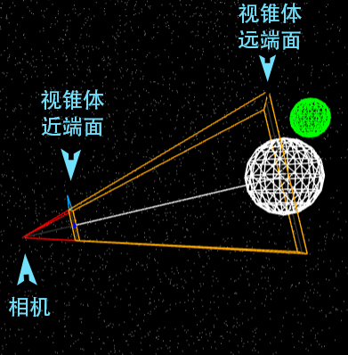

近远端面之间的空间是可见部分, 远于远端面的模型不可见, 近于近端面的模型也是不可见的.
new一个构造函数会得到一个对象, 那么对carema进行操作也理所应当可以改动new OrthographicCamera时传入的参数:

```javascript
const camera = new THREE.OrthographicCamera( 700, 700, 700, 700, 1, 1000 );

scene.add( camera );  //对camera的属性更改不会因为提前渲染相机而不生效.

camera.position.set(1, 10, 0);
camera.bottom = 200
```
具体可以改动哪些属性只要输出一下`camera`查看即可;
`.position`: 设置相机位置, OrthographicCamera的文档并没有标示出这个属性, 但是Three.js有一个`Object3D`的概念, 只要这个东西是一个3D对象那么它就具备Object3D的属性和方法, 相机当然是3D对象, 所以这里我们也可以设置Object3D提供的position属性, 它的值应当为一个`Vector3`格式, 即三维向量.

引用一下官方的例子:
[Three.js - webgl_postprocessing_advanced源码](https://github.com/mrdoob/three.js/blob/master/examples/webgl_postprocessing_advanced.html)

```javascript
let cameraOrtho, cameraPerspective;
```
```javascript
cameraOrtho = new THREE.OrthographicCamera( 
  -halfWidth, 
  halfWidth, 
  halfHeight, 
  -halfHeight, 
  -10000, 
  -10000 
);

cameraOrtho.position.z = 100;

const renderBackground = new RenderPass( sceneBG, cameraOrtho );
```

那我觉得我们说到这了可以再说一下Obeject3D, 它还挺常用的, 经常会遇到需要修改模型的Object3D属性的情况.

### Object3D
Three.js中大部分对象都与Object3D存在类继承关系, Three.js源码里很多方法的封装基于类来实现, 也就意味着由大部分方法所构造的3D对象都具有Object3D类的属性和方法, Object3D类提供了一系列属性和方法来操纵三维空间中的物体.
属性很多, 我不一一罗列了:
[Three.js Object3D中文文档](https://threejs.org/docs/index.html?q=Object3d#api/zh/core/Object3D)

---

### PerspectiveCamera()
PerspectiveCamera类被调用时会继承camera类, 因此也可以调用camera类的属性和方法, 另外由于是3D对象所以也可以使用Object3D的属性和方法.
相机使用透视投影模式, 这一投影模式被用来模拟人眼所看到的景象，是3D场景的渲染中使用最普遍的投影模式.

```javascript
const carema = new THREE.PerspectiveCamera(
相机锥体垂直视野角度fov, 
相机视锥体长宽比aspect,
相机视锥体近端面near, 
相机视锥体远端面far
);

//carema.position.set(0, 0, 10);  //然后我们也可以设置一下相机位置, 参考OrthographicCamera里说到的Object3D

scene.add(carema);  //将相机加入场景
```

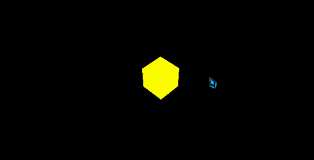
这个示意图是加入物体才看得到黄色方块, 加上相机轨道控制器才可以转动(所以其实转动是在改变相机的位置), 不过就是看这个相机的效果, 就是普通的手机相机效果.

---

### StereoCamera()
双透视摄像机(立体相机)常被用于创建3D Anaglyph(3D立体影像)或者Parallax Barrier(视差屏障), 就是现在大学官网经常用的那种在线逛校园之类的东西, 可以转头四处看, 身临其境一样的.

刚开始挺懵的, 官方没有给出它的具体使用方法, 我去看了一下官方给出的例子, 我发现他们并没有在例子中直接使用stereoCarema, 而似乎是使用了对stereo的某种封装结构:
以下参考该例:
[three.js官网 - webgl_effects_stereo源码](https://github.com/mrdoob/three.js/blob/master/examples/webgl_effects_stereo.html)

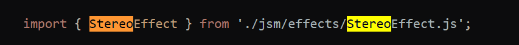
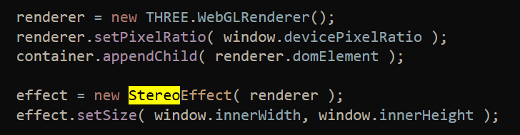
我需要找到和那个stereo相关的东西, 在末尾我发现了这样一个函数, 在末尾调用了effect的render方法:
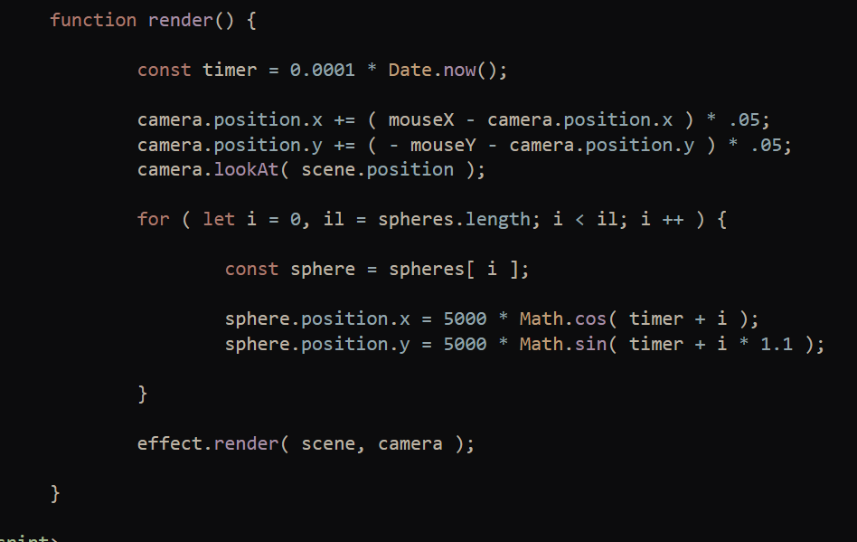

好吧, 我去看了一下这个封装, 如果在使用的时候new封装好的构造函数并传入渲染器, 那么:
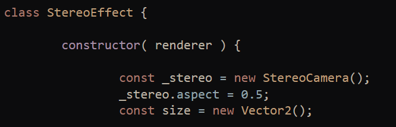

之后还调用setSize方法, 不过这跟我们要说的相机没什么关系:

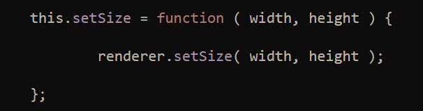

他们在最后调用的那个封装在stereo里的render方法, 也就是这个, 传入了一个PerspectiveCamera和一个场景, 问题主要是这个PerspectiveCamera在里面发生了什么:
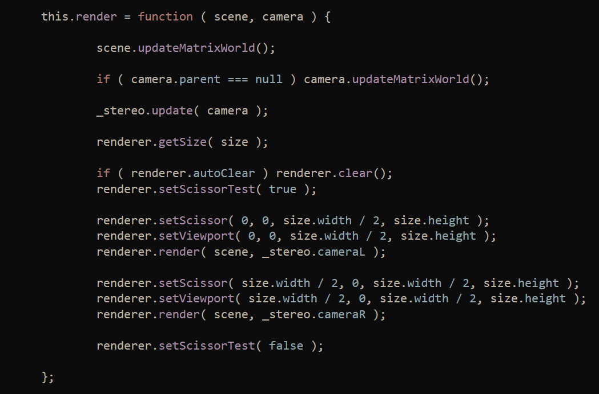

那么可以看到的是在第4行调用了stereoCamera的`update()`并且了传入了一个PerspectiveCamera, 看一眼stereo的`.update()`的说明:

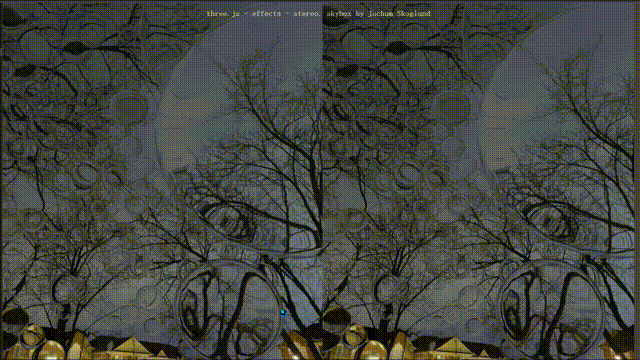
意思应该是stereoCamera()本身也并不能单独使用(亲测不行), 它基于其他相机的普通摄影效果, 将最终效果改造为立体摄影效果, 可以看到, 相比于透视和正交相机, stereo给人身临其境的感觉——以自己为中心对四周的观察.

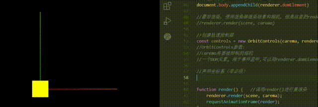

---

## 2.辅助坐标系
辅助坐标系归类于文档中的"辅助对象"下, 这里不一一阐述辅助对象了(有点多);
初始情况下页面中不会显示辅助坐标系, 如果需要的话:

```javascript
const axeHelper = new THREE.AxesHelper('5'); //传入坐标轴长度, Str,num均可 
scene.add(axeHelper);  //将坐标系添加到场景
```
只是加上这两句就好了, 使用方便, 不要顾虑那么多...
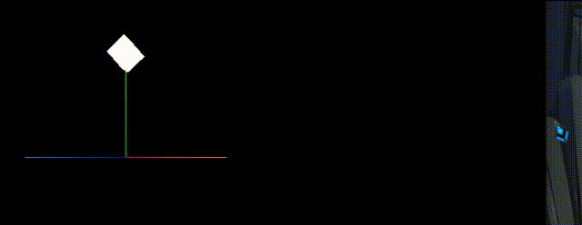
注意Three.js的辅助坐标系和建模软件默认状态下的设置是不一样的, 它的Z轴是浏览器里的Z轴, 是指向用户方向的, 而Y轴(绿色轴)是指向上方.

---

## 3.clock计时
一个针对three.js动画定制的对象, 可以方便的获取持续时长等等动画中常用的时间间隔, 持续时长总时长等, 免去用原生时间对象计算和控制时间的痛苦.

```javascript
const clock = new THREE.Clock();
//const xxx = new THREE.Clock();
```

| 属性 | 说明 |
|--|--|
| autoStart | Boolean, 是否声明后就自动开始计时, 默认true |
| startTime | 存储clock最近一次调用start()的时间, 默认值0 |
| oldTime | 存储最近一次调用`start()`或`getElapsedTime()`或`getDelta()`的时间, 默认值0 |
| elapsedTime | 保存时钟开始计时以来的运行总时长, 默认值0 |
| running | Boolean, 判断时钟是否在运行, 默认值false |

| 方法 | 说明 |
|--|--|
| .start() | 启动clock, 同时将`startTime`和`oldTime`设置为当前时间. 设置`elapsedTime`为0,  running 为`true`. |
| .stop() | 停止时钟. 同时将`oldTime`设置为当前时间. |
| .getElpasedTime | 获取自时钟启动后的秒数, 同时将`oldTime`设置为当前时间.
如果`autoStart`设置为`true`且时钟没有启动, 那么启动时钟。 |
| .getDelta() | 获取最新的`oldTime`到当前的总秒数. 同时将`oldTime`设为当前时间.
如果`autoStart`为`true`且时钟未运行, 则启动时钟. |

---

## 4.画布自适应
默认情况下, 窗口一旦发生尺寸变化, 画布将会维持在窗口最小尺寸时的尺寸, 不会自动改变;
那么需要监听`resize事件`:

```javascript
//创建相机
const carema = new THREE.PerspectiveCamera(75, window.innerWidth / window.innerHeight, 0.1, 1000);
//声明渲染器: 渲染器会渲染出一个画布
const renderer = new THREE.WebGLRenderer();
```

```javascript
window.addEventListener('resize', () => {
  //重新赋值相机锥体视区长宽比
  carema.aspect = window.innerWidth / window.innerHeight;

  //手动更新相机的投影矩阵(重新计算投影矩阵), 注意要在相机对象的投影矩阵相关属性变化后，再重新计算相机投影矩阵值, 否则会造成资源浪费
  carema.updateProjectionMatrix();

  //重新设置渲染器尺寸
  renderer.setSize(window.innerWidth, window.innerHeight);

  //重新设置渲染器像素比
  renderer.setPixelRatio(window.devicePixelRatio);
})
```

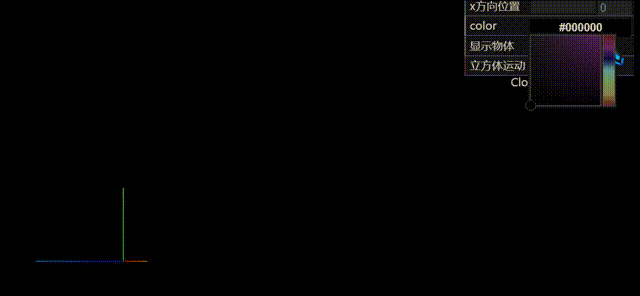

---

## 5.dat.gui可视化面板辅助建模
这东西要是跟CSS那样慢慢调就有点地狱了...
如果有一个可以快捷改变各项属性, 并且即时视觉反馈的插件, 事情会轻松很多吧.

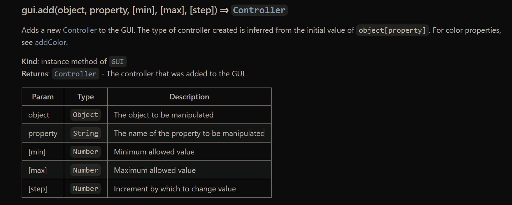
首先npm下载gui引入

```javascript
//导入dat.gui可视化面板辅助操作模型
import * as dat from "dat.gui";
```
基本:用`add()`方法向gui实例上添加需要改变的对象, 第一个参数传入需要操作的对象, 第二个参数传入需要操作的属性;

```js
//cube.position里有xyz三个属性, 只改x;
gui.add(cube.position, "x");
```
然后gui上就会生成这一项, 你可以不为它添加`min()`, `max()`这样的辅助规定;
不加`min`和`max()`拖拽起来会不太舒服, 而且没有值的区域限制.
`step()`规定值每次改变的单位, 它可以以很高频率改变, 但每次仍旧必须是`step()`规定的单位.
这些都属于gui.controller:

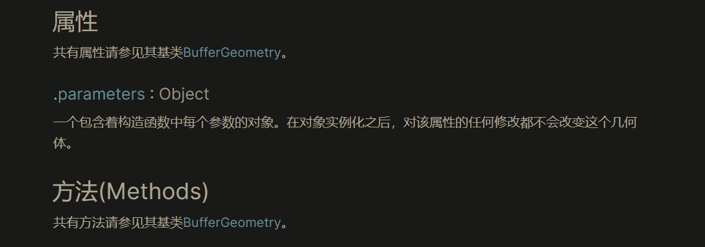
举例:

```javascript
//params备用
const params = {
    color: "#fff",
    fn: () => {
        gsap.to(cube.position, { x: 5, duration: 3, yoyo: true, repeat: -1 })
    }
}
```

```javascript
//创建gui
const gui = new dat.GUI();
//add需要改变的属性到gui里
gui.
    add(cube.position, "x")
    .min(0)
    .max(5)
    .step(0.1)
    .name("x方向位置")
    .onChange((value) => {  //value是当前值
        console.log("值已更改")
    })
    .onFinishChange((value) => {  //value是当前值
        console.log("改变已暂停")
    })
    
gui.addColor(params, 'color').onChange((value) => {
    cube.material.color.set(value);
});

gui.add(cube, "visible").name("显示物体");
gui.add(params, 'fn').name("立方体运动")
```
GUI其他可用方法:
[GUI官方 - API说明](https://github.com/dataarts/dat.gui/blob/HEAD/API.md)

---

## 调用API进入全屏模式

```javascript
//双击进入全屏
window.addEventListener("dblclick", () => {

  const fullScreenElement = document.fullscreenElement;
  if (!fullScreenElement) {
        //渲染器的domeElement就是canvas画布
    renderer.domElement.requestFullscreen();
  } else {
    document.exitFullscreen();
  }
  
})
```

---

# 二、模型操作
## 1.创建模型
使用建模软件建模的时候会先使用提供的基础模型, 经过粗略加工形成基本形状, 再进行精细雕刻.
这里说的创建模型即是创建基础模型.

### Geometry
直接使用已经构建好的类生成模型.
这些模型其实也是基于BufferGeometry构建的, 只是进行了一些封装, 所以可以直接new出来:
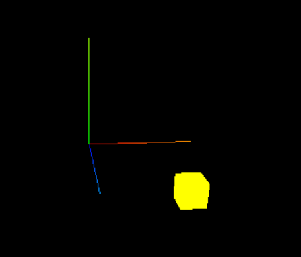

基本模式:

```javascript
//const geometry = new THREE.类( 1, 1 );
const geometry = new THREE.BoxGeometry( 1, 1, 1 );
```
用一个变量来存储你的模型, 这样也方便以后在它上面调用方法或者设置属性:

```javascript
cubeGeometry.parameters = { width: 1, height: 1, depth: 1 };
```
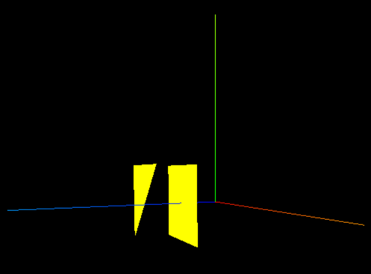

基本就是这个使用模式, 但是Geometry的类太多, 这里不一一列举了...
全部类(生成各种基础形状):
[Three.js官方文档-Geometry](https://threejs.org/docs/index.html#api/zh/geometries/BoxGeometry)

---

### BufferGeometry
是面片、线或点几何体的有效表述. 包括顶点位置，面片索引、法相量、颜色值、UV 坐标(辅助将二维贴图适用到三维模型)和自定义缓存属性值. 使用 BufferGeometry 可以有效减少向 GPU(需要用GPU来渲染) 传输上述数据所需的开销(提升性能).

先说一下BufferAttribute吧, 待会要用到:
这个类用于存储与BufferGeometry相关联的属性(例如顶点位置向量, 面片索引, 法向量, 颜色值, UV坐标以及任何自定义 attribute ). 利用 BufferAttribute可以更高效的向GPU传递数据.

```javascript
BufferAttribute( 
  类型化数组, 
  整数, 
  normalized(可选): Boolean 
)
//必须是类型化数组TypedArray, 用于实例化缓存。
```

声明两个BufferGeometry实例:
```javascript
const geometry = new THREE.BufferGeometry();
const geometry2 = new THREE.BufferGeometry();
```
BufferGeometry是不能共用的, 所以我们要两组类型化数组:
```javascript
const vertices = new Float32Array([
    //每三个值作为一个顶点, 矩形的话俩三角形拼合
    -1.0, -1.0, 1.0,
    1.0, -1.0, 1.0,
    1.0, 1.0, 1.0,
    1.0, 1.0, 1.0,
    -1.0, 1.0, 1.0,
    -1.0, -1.0, 1.0,
]);

geometry.setAttribute(
  'position', 
  new THREE.BufferAttribute(vertices, 3)
);

const vertices2 = new Float32Array([
    //每三个值作为一个顶点, 矩形的话俩三角形拼合
    -1.0, -1.0, 3.0,
    1.0, -1.0, 3.0,
    1.0, 1.0, 3.0,
    1.0, 1.0, 3.0,
    -1.0, 1.0, 3.0,
    -1.0, -1.0, 3.0,
    //数据没必要排的这么整齐,我只是看着不舒服
]);

geometry2.setAttribute(
  'position', 
  new THREE.BufferAttribute(vertices2, 3)
  //这里纯使用三角形构建, 所以三个点解析为一个面
);
```
```javascript
const mesh = new THREE.Mesh(geometry, material);
const mesh2 = new THREE.Mesh(geometry2, material);

scene.add(mesh, mesh2);
```

但是两个模型不一定就要两个`BufferGeometry`, 一个`BufferGeometry`可以生成一个模型, 这个模型虽说是一体但它不一定得是连接的, 比如常见的人物建模上使用的一些浮空装饰, 它们和人物是在同一个模型上的, 举个例子:

```javascript
const geometry = new THREE.BufferGeometry();
```

```javascript
const vertices = new Float32Array([
    //每三个值作为一个顶点, 矩形的话俩三角形拼合
    -1.0, -1.0, 1.0,
    1.0, -1.0, 1.0,
    1.0, 1.0, 1.0,
    1.0, 1.0, 1.0,
    -1.0, 1.0, 1.0,
    -1.0, -1.0, 1.0,

    1.0, 1.0, 2.0,
    -1.0, 1.0, 2.0,
    -1.0, -1.0, 2.0,
]);

//创建缓冲区数据对象
geometry.setAttribute('position', new THREE.BufferAttribute(vertices, 3));  
```
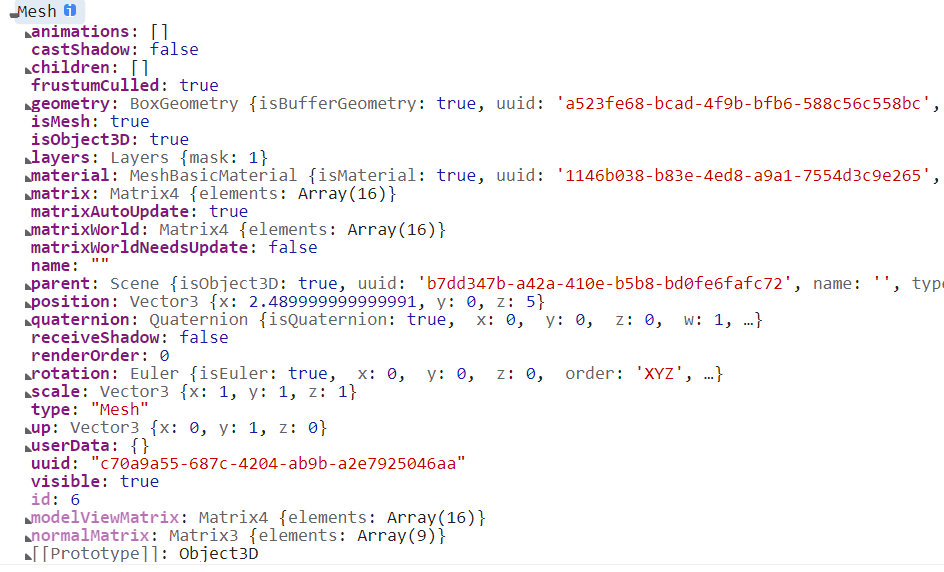

注意一下在构建模型的时候尽量多使用三角形而避免其他多边形, 建模的时候会有一个"布线"的操作, 这个操作的结果直接决定了后续对模型进行精细调整时的方便程度, 也决定了后续程序的计算量, 对布满三角形的模型外表面进行调整将会省力很多, 因为一个三角形必是一个平面而四边形可能有个点凹下去什么的形成一些奇怪的形状增加计算量.

---

## 2.创建材质
我们需要材质和模型才能在世界里创建物体.
创建材质和Geometry一样提供了很多可选项, 这里也不再一一罗列, 主要是记一下使用方法:

```javascript
//创建材质, 传入配置对象
const cubeMaterial = new THREE.MeshBasicMaterial({ xxx: xxx, xxx: xxx });
```
然后用一个变量来存储你的材质, 方便后面调用方法和设置属性, 比如Color吧:

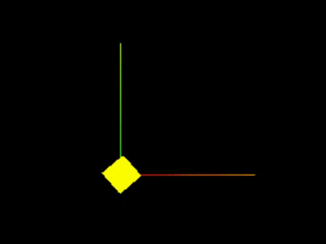
那就是这样:

```javascript
cubeMaterial.color.set("lightgreen");
```
基本是两种模式, 直接赋值到属性, 或者使用set方法, 另外在new材质实例的时候可以直接传入对象, 里面规定好需要的属性, 这样生成出来就是你想要的样子, 我觉得这种后续再改变模型的方式或许可以用来做一些交互之类的...

---

## 3.渲染模型到浏览器
其实这个地方没太看明白, 感觉是把模型和材质结合起来, 然后渲染到屏幕上, 看起来确实是这样的...

```javascript
Mesh( geometry : BufferGeometry, material : Material )

//Mesh( 模型, 材质 );
//const cube = new THREE.Mesh(cubeGeometry, cubeMaterial);

//然后一定记着, 将创建完毕的物体加入场景
scene.add(cube);
```
同样的, 也是最好用一个变量来存储渲染后的模型, 我们输出一下cube看看:

渲染好的模型上有很多可操作的属性, 比如这里设置一下`position`:
这些属性基本都继承自carema, object3D, Vector3这些基类, 所以不知道怎么设置的话可以去这些基类的文档查找.

```javascript
cube.position.set(0, 0, 5);
//Object3D方法: .position
//值必须是一个Vector3值所以使用Vector3的.set()方法设置;
//Vector3D方法: .set()设置向量的xyz分量
```

之后就是渲染器(renderer), 负责把模型渲染到页面, 常用的是WebGLRenderer:

```javascript
//声明构造器(渲染器): WebGLRenderer, 渲染器会渲染出一个画布
const renderer = new THREE.WebGLRenderer();

//设置渲染尺寸, 这个也就是在屏幕的多大范围内可以看到模型, 超出部分看不到, 这里用了整个页面
renderer.setSize(window.innerWidth, window.innerHeight);

//将渲染完的canvas内容添加到body, renderer.domElement就是渲染好的canvas画布.
document.body.appendChild(renderer.domElement)

```

---

## 4.模型的位置|旋转|缩放操作
可以直接设置

```javascript
//用vector3的.set()方法
//模型.属性.set(vector3值);
cube.scale.set(2, 3, 3);
cube.position.set(0, 5, 5);
cube.rotation.set(0, 2, 4);
```
也可以封装一个方法来调用渲染, 在每次渲染完之后自己调用自己不断地进行重渲染, 这样模型只要有变化就可以立刻被渲染出来, 但是这样不断重渲染, 性能大概难以保证, 简单模型这样做还是可以的:

```javascript
let ass = 1;
function render() {   //调用render()进行重渲染
    ass += 0.1;
    cube.rotation.set(0, ass, 4)
    renderer.render(scene, carema);  //然后render内部再调用render;
    requestAnimationFrame(render);  //在下次重绘之前调用render来更新动画, 这样不至于那么卡顿;
}
render();
```


## 5.gsap动画库


---

# 总结
现在gsap动画库只是接触了几个小案例, 不太敢写, 怕写错了.
后面还是得补, 可能会单独开篇gsap.