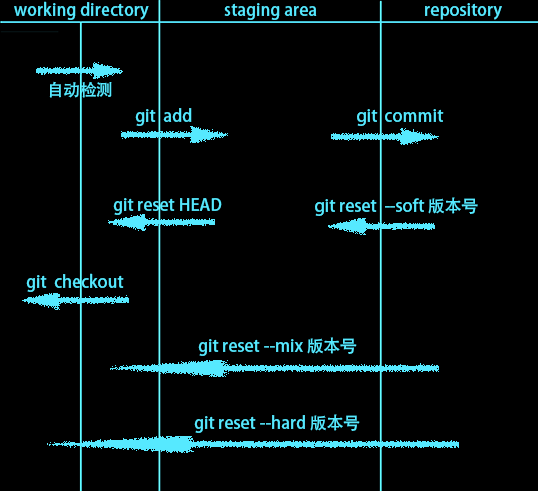
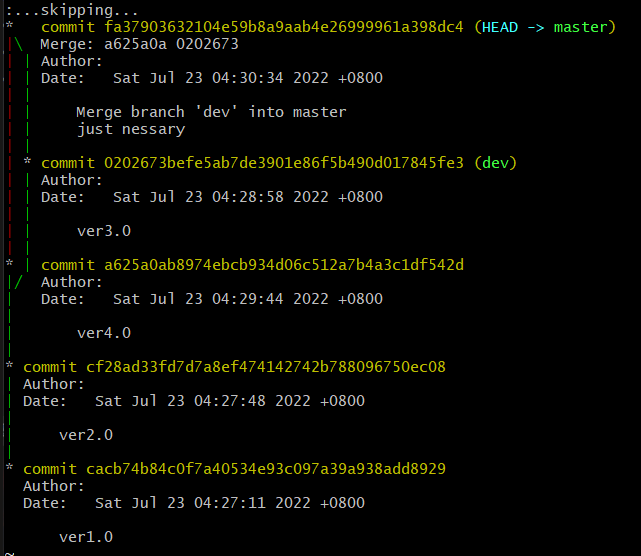
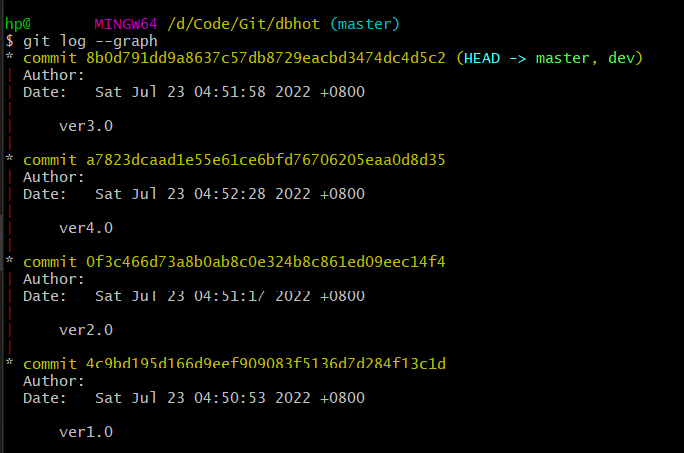

@[TOC](文章目录)

---

# 前言
系统的学了一下Git, 以及和github的配合使用.

---

# 一、版本控制-历史

## 1.原始时代
首先出现的是最原始的模式...也就是现在剪视频那种, 大半个盘的素材和副本, 存档.

---
## 2.集中式版本控制
所有使用者从一个服务端存取, 只有一个文件, 能够区分不同版本, 本地也不再需要一堆版本, 最具有代表性的是SVN, 但这套结构有一个显而易见的缺点, 无法容错, 任何一段, 或者中央服务端挂掉, 结构就面临崩溃.

---

## 3.分布式版本控制
所有版本在每台本地电脑和云端都存储一份, 任何一点挂掉都不会影响整个结构运行, 本地产出先向本地存储同步, 本地存储再向云端同步.

---

# 二、git-本地版本控制
进入项目目录

## 1.git初始化
git初始化, 类似于提名, 点名允许git管理这个目录, git会在这里扎根, 生成.git隐藏目录.
```javascript
git init
```

---

## 2.检测目录状态
检测当前目录下的文件状态, 红名输出未进行管制的文件和目录.
```javascript
git status
```

---

## 3.文件纳入管制
将该文件纳入管制, 已纳入管理的文件在`git status`时显示为绿名.
```javascript
git add 文件名.后缀
```

将所有文件纳入管理:
```javascript
git add .
```

---

## 4.生成版本
以当前本地项目情况作为一个版本生成
```javascript
git commit -m '版本描述'
```

---

## 5.版本日志
展示本地最近的所有版本和版本号:
```javascript
git log
```

呈现所有历史版本:
```javascript
git reflog
```

以图行化方式呈现版本变更:
```javascript
git log --graph
```

图形化, 并且只显示哈希值版本号和提交记录
```javascript
git log --graph --pretty=format : "%h %s"

```

---

## VSCode
VSCode会在文件列表里给文件加后缀, 已控制但改动的为M, 未控制的为U, 已控制的无标识.

---

## 附1-新增文件
在当前目录下新增文件:

```javascript
touch '文件名.后缀'
```

---

## 附2-新增目录
在当前目录下新增目录:
```javascript
mkdir 目录名
```

---

# 三、概念-git三个区域
工作区右半的内容是git status红名文件存在的区域.
中央暂存区是绿名文件存在的区域.


---

# 四、回滚版本
比如需要撤回一个功能, 就会需要这样做, 先`git log`或者`git reflog`拿到我们想要回滚到的版本的版本号:
```javascript
git reset --hard 版本号
```
git 会处理好目录下的增删改, 和各个文件的内容.

---

# 五、分支与合并
以下所有操作基于本地
新版本中, 相比旧版本未改动的内容会指向旧版本, 而不是再copy一遍生成新版, 这样生成版本速度会更快.

基于这个特性, 可以在一个原型版上开发分支, 分支1由一人负责开发功能a, 分支2由一人负责开发功能b, 两分支都指向原型, 最后分支合并, 成为兼具ab功能的版本, 但合并时也可能会出现代码冲突成为ab兼不具的版本...

或者一个功能做到一半被叫去修旧版的BUG, 然后就可以在旧版上新建分支修BUG而不是直接在新功能做到一半的基础上修.

主线默认就叫master, 分支名在创建分支的时候可以自定义(dev什么的)
各个分支之间相互独立, 切换到某一分支下进行操作, 不会影响其他分支

---
## 1.查看所有分支
查看所有分支, 当前所处的分支以绿色标明
```javascript
git branch
```

---

## 2.创建分支
创建以"分支名"命名的新的分支, 新创建的分支与当前所在的分支指向相同
```javascript
git branch 分支名
```

---

## 3.切换到某分支
切换到"分支名"对应的分支下
```javascript
git checkout 分支名
```

---

## 4.合并分支
常说的, "拉过来", 拉取这一分支的代码与当前所在的分支进行合并
```javascript
git merge 分支名
```

合并完如果冲突, git会提示
`
CONFLICT (content): Merge conflict in xxxxx
Automatic merge failed; fix conflicts and then commit the result.
`
那么此时需要到文件里去解决git标记出的冲突部分, 此外冲突解决后因为发生了变动, 也还需要`git add`和`git commit.`

---

## 5.删除分支
有些分支(比如BUG修复分支), 修复完并入后就没用了, 需要删除:
```javascript
git branch -d 分支名
```


---

# 六、github 和 Git
github和git也不能说没关系吧, 没有直接的关系.
github是代码托管仓库, git分布式存储的云端部分可以借助Github来进行, 前面也是只说到了Git的本地存储和版本控制嘛.

github仓库提供的网址即远程仓库地址, 可以推送代码到这个地址.

## 1.提交
先给仓库添加`token`, 不然无法提交, 具体方法:
[github改为token验证后, 如何提交代码?](https://blog.csdn.net/qq_52697994/article/details/120104850)

为一个仓库地址起别名, 额, 目前不知道这个别名有什么意义, 似乎用来避免后续步骤反复书写仓库地址的繁琐.
```javascript
git remote add 仓库地址别名 仓库地址
```
这句是必须执行的, 后面两句任选.

---

提交, 并设置默认仓库:
这种方法的话, 后续提交可以直接```git push```:
```javascript
git push -u 仓库地址别名 分支名
```

每次自己决定提交到何处:
```javascript
git push 仓库地址别名 分支名
```
push到云端的分支结构也会与本地相同.

---
## 2.下拉
到了一个方便的地方, 当然是...继续加班...

本地没有该项目的任何部分, 直接下拉整个仓库:
```javascript
git clone  仓库地址
```
拉下之后你就可以在本地目录看到它们.

---

或者本地有进度, 但是不如云端的进度快, 那么只是下拉部分代码来更新本地内容:
```javascript
git pull 仓库地址别名 分支名
```

---

# 七、rebase 变基
## 1.利用rebase简化仓库结构
多次提交后仓库内容十分的多, 但上级其实只需要最终版.

将当前版本号与指定版本号对应的两个版本, 和两者之间的版本, 合并
```javascript
git rebase -i 版本号
```
或

共几个版本需要合并就传几:
```javascript
git rebase -i HEAD-需要合并的版本数
```

使用以上两命令申请合并后会出现以下格式:
```
pick 版本号 版本
pick 版本号 版本
pick 版本号 版本
pick 版本号 版本
...
```
将需要合并的版本前面的```pick```改成`s`即可
配置完后esc, 输入`:wq` , Enter执行.

注意本地rebase合并时不要去合并云端已经存在的版本, 不然交上去之后原版和合并版都存在, 云端仓库反倒结构更不清晰.

---

## 2.rebase将分支并入主线
rebase 也可以将分支强行并入master, 比如此时ver2.0上有一ver3.0分支还未合并, 但此时ver2.0后边主线已又添加了ver4.0, 此时如果选择直接并入, 那么将会是这样:


如果使用rebase:



具体操作:
先切换到要合并的分支, 执行:
```javascript
git rebase 主线名
```
然后`git checkout 主线名`切换回主线, 再`git merge 要合并的分支` ;
即可.

---

# 总结
--