@[TOC](文章目录)

---

# 前言
换办公室了, Win11, 配一波全局Node.

---

# 1. 主要配置
装完Node先cmd看一下有没有自动配到全局, 执行`node`命令如果结果如下就不需要再配置全局node:
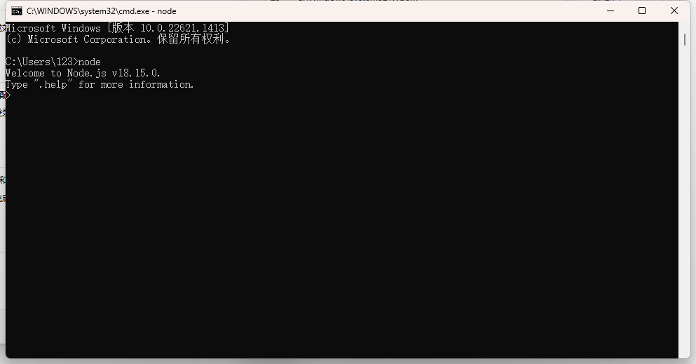

---

老样子从桌面`此电脑`开始, 右键`此电脑`:

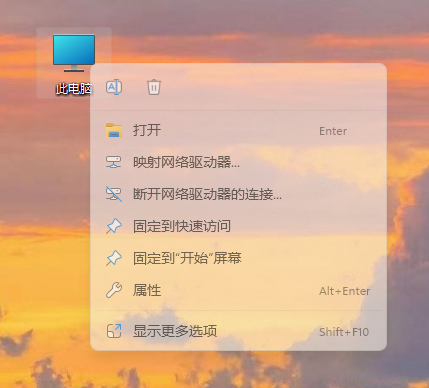

---

然后点击`属性`, 进入`系统信息`面板:

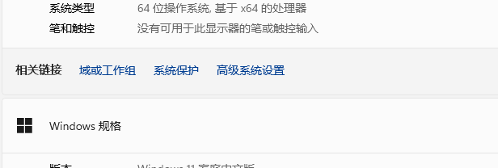

---

点击`高级系统设置`:

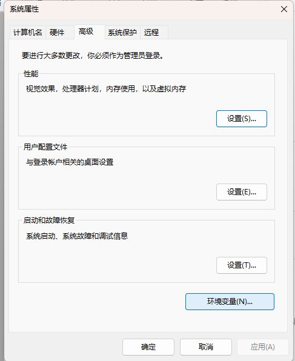

---

进入环境变量, 选中系统变量path, 点击编辑: 

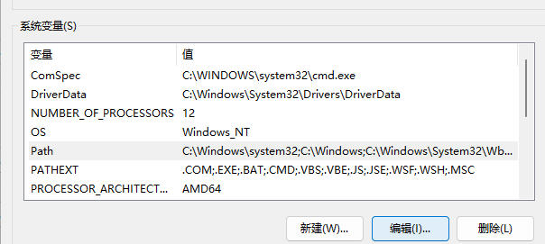

---

先检查一下有没有Node相关的路径, 有的话改一下.
没有的话新建一个路径引导到Node根目录:

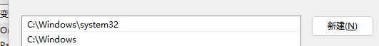

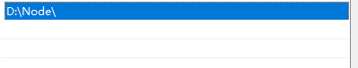

配完之后测试一下第一步`cmd`, 如果可以, 到这就能用了.

---
# 二.额外配置
还可以规定一下安装的全局包的存储位置, 全局安装的包会被安装到这里.
或者配置Node的缓存目录.

## 1.全局模块目录
这个目录需要自己建立, 可以自定义一个路径.
打开cmd, 如果你刚才输入了node, 那你是在node命令模式下, 要先`CTRL+ D`退出.
输入:
```
npm config set prefix "全局模块目录路径"
// 示例 npm config set prefix "D:\Node\node_global"
```
将该目录设置为全局模块存储目录.
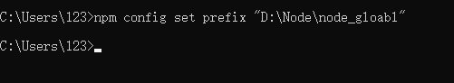

---
## 2.Node缓存目录
同上, 目录自建, 输入命令:
```
npm config set cache "Node缓存目录"
// 示例 npm config set cache "D:\Node\node_cache"
```

---

## 3.修改已存在全局路径
Node对以上两项, 有默认的存取路径, 此时需要修改:
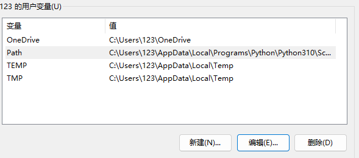
此时不再从系统变量Path而是用户变量Path, 选中后编辑.

---

找到那个导向npm的路径, npm全名`node package manager`, 系统路径不会采用这个名字.

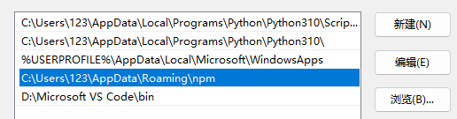

---

下载的全局模块已经在cmd里配置过是放到`node_global`, 但是此处取用路径不配置无法于全局使用.


---

然后去系统变量一侧, 新建变量`NODE_PATH`, 引导至Node根目录下的`node-modules`:

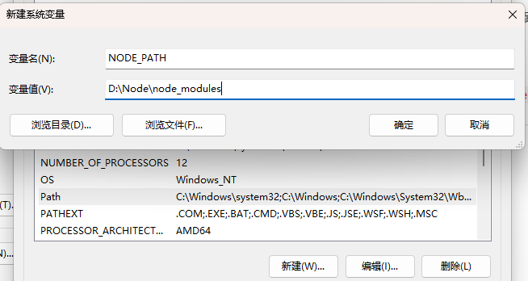

---

逝一下:
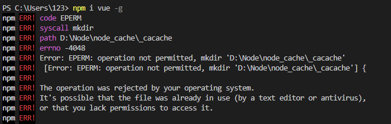
崩掉: `Lack permissions.缺乏权限.`

---

右键Node根目录, 进入属性, 编辑四项权限, 给到完全控制:
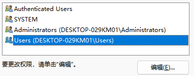

---

此时不再reject:

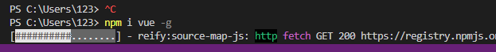


---

# 总结
--
---