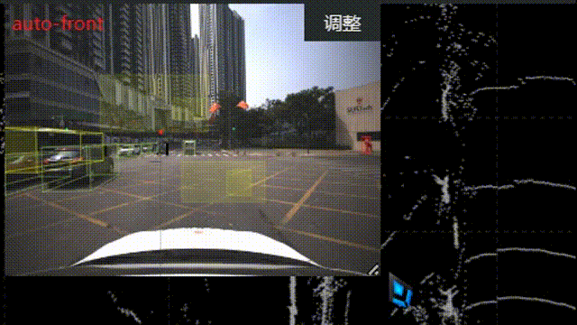
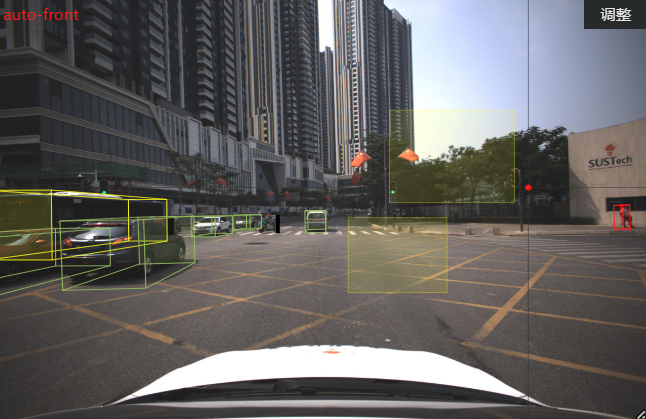
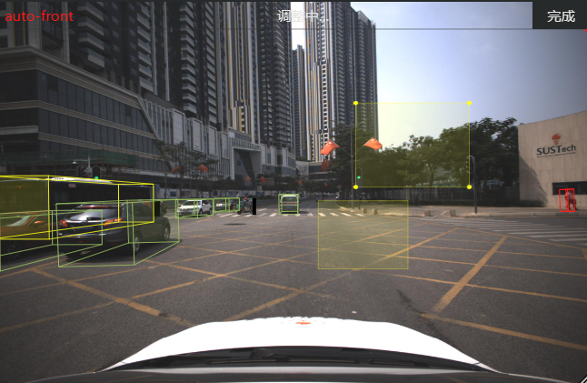
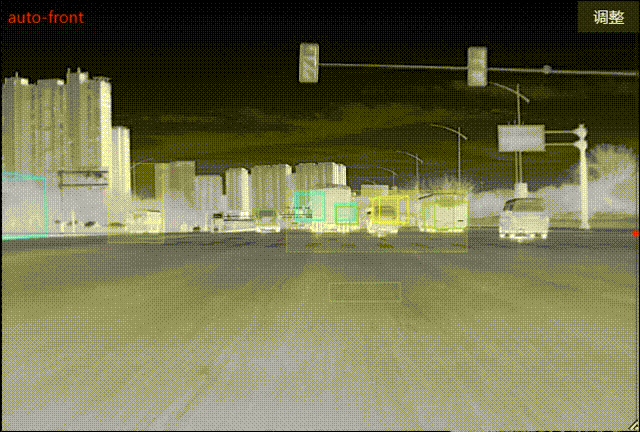
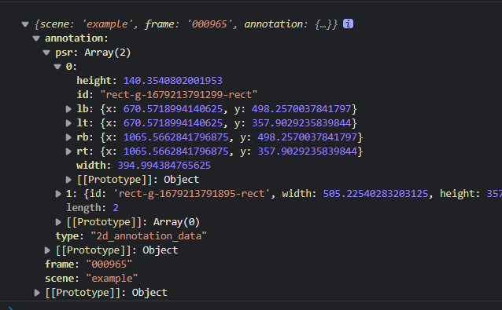

@[TOC](文章目录)

---

# 前言
我们的数据标注系统已经有3D标注的功能且可以通过前端的计算将点云上的3D模型用svg画到2D照片上, 但甲方提出2D照片上的标注位置偶尔存在误差, 希望增加手动2D标注的功能进行修正.

把它嵌到项目的途中遇到了麻烦, 这里是一些思路和解决办法, 代码可跑.

参考: [180行代码，基于D3.js手把手教你实现图片标注功能](https://juejin.cn/post/6879991831245881352#heading-8)
代码有改动.


---


## 0.复原示例
数据标注系统基于原生JavaScript和Three.js, 用于放置参考图的区域`id`为`image-wrapper`, 这个区域是可以缩放的, 自由改变图片比例大小, 同样, 标注也应该跟着图片的变化做出改变. 



系统中有一个专门的类集成了`image-wrapper`的一系列操作方法和变量(实际上这个系统中对每个dom模块都进行了这种操作, 不然原生JavaScript会很乱的吧?), 这个新功能也将通过在这个类中进行dom事件注册和书写方法来完成.
先把功能在html文件里复现出来, 因为原例是基于Vue实现, 所以我理所当然的遇到了一堆`this`指向上的问题, 不过作者思路清晰, 我没有遇到太多其他麻烦.
我当然是选择在类中复现它的, 先把前面加了this的变量都写好, 这在Vue里是应该放在`data`的部分.

```html
<div id="container5"></div>
```

```javascript
class ImageContext {
  isDrag = false; // 当前是否为拖拽(移动)模式
  start = false; // 当前是否正在拖放添加矩形
  startDom = null; // 当前正在添加(鼠标未弹起)的矩形id
  rectData = null; // 鼠标坐标, 数组[x, y]
  topDot = null; // 拖拽模式下鼠标拖拽顶点的斜对顶点
}
```
我就不重复类外框了, 下面的函数都是写在类里的.

---

## 1.初始化
个人认为D3.js在链式编程这块很像JQuery, 按照原例, 初始化阶段需要在容器里添加一个svg画布, 然后在画布的底上先放上图片, 但是我们系统里的图片已经写在dom里.
这里我犯了一个错误, 这是系统里dom部分:
```html
<div class="image-wrapper" id="image-board">
  <svg id="maincanvas-svg" viewbox="0 0 2048 1536" preserveAspectRatio="none">
    <image id="svg-image" x="0" y="0" width="2048" height="1536" preserveAspectRatio="none" xlink:href="" />
      <g id="svg-boxes"></g>
      <g id="svg-points"></g>
  </svg>
  <header id="header">
    <div id="header-title"></div>
    <div id="header-state"></div>
    <div id="header-action"></div>
  </header>
</div>
```
你可以看到image已经放在svg里面了, 但我们最初的方案是不动这层svg, 在这层svg上再盖一层svg,也就是变成这样:
```html
<div class="image-wrapper" id="image-board">
  <svg id="maincanvas-svg" viewbox="0 0 2048 1536" preserveAspectRatio="none">
    <image id="svg-image" x="0" y="0" width="2048" height="1536" preserveAspectRatio="none" xlink:href="" />
      <g id="svg-boxes"></g>
      <g id="svg-points"></g>
  </svg>
   <svg id="custom-svg" viewbox="0 0 2048 1536" preserveAspectRatio="none">
      <g id="custom-svg-boxes"></g>
  </svg>
  <header id="header">
    <div id="header-title"></div>
    <div id="header-state"></div>
    <div id="header-action"></div>
  </header>
</div>
```

这个方案最终是可行的, 毋庸置疑, 但是实现起来的确恶心, 我们以`custom-svg`作为容器把这套代码实现后, 这套代码在初始化阶段生成的光标出现了, 光标没有问题, 在我处理完svg的viewbox和this问题后, 发现画出来的图形并不能随着图片的缩放自动改变位置和尺寸, 如果图片缩小, 我的标注会被原封不动的遮盖, 图片缩图片的, 上面这张svg画布就好像不动一样.
现在想想我觉得在`image-wrapper`缩小的时候手动改变上面svg画布的大小该是可以的, 两张svg尺寸相同, viewbox相同, 该是没有问题.

不过我想到一个更好的办法, 我了解到g标签在svg中只是起到分组作用, 这有点像Vue的`template`, 然后svg内部的image会跟随svg的尺寸变化而变化.
那直接不让这套标注代码生成新的svg, 在这个旧的svg上画不就好了? 单独开一个group让它不要影响其他已有标注, 于是dom代码原封不动:

```html
<div class="image-wrapper" id="image-board">
  <svg id="maincanvas-svg" viewbox="0 0 2048 1536" preserveAspectRatio="none">
    <image id="svg-image" x="0" y="0" width="2048" height="1536" preserveAspectRatio="none" xlink:href="" />
      <g id="svg-boxes"></g>
      <g id="svg-points"></g>
  </svg>
  <header id="header">
    <div id="header-title"></div>
    <div id="header-state"></div>
    <div id="header-action"></div>
  </header>
</div>
```
我都快忘了我们在做初始化了, 你可以看到我选用的svg画布是已有的而并没有选择生成, act是一个div, 这个功能有移动标注的模式, 有关这个模式的启动与退出, 听取数据标注基地同事的意见(他们担心我们给出的最初方案, 点击其他位置自动退出移动模式会让误触带来的麻烦增加)之后我们决定用按钮来控制编辑模式和移动模式的切换, act按钮就是负责这个功能.

初始化主要是事件的注册, `createDrag()`负责移动模式(拖拽模式)下svg内图像对鼠标拖动事件的反应, 这个模式的事件单独放在了这个函数里, 等下会说到.

然后就是常规的标注操作了, 这部分的事件直接注册到svg画布上即可, 但注意是原生JavaScript环境, 这里的事件处理函数如果直接调用是无法获取到类中的`this`的, 他们的`this`会指向事件的触发处(你也可以叫它触发者, 只是我觉得触发者该是鼠标), 也就是一个dom元素, 此处会是`maincanvas-svg`画布, 然后你从`this`里获取到的一切都是`undefined`.
所以你加一个箭头函数把需要调用的函数放进去, 箭头函数内部的`this`不会取到事件对象, 这样函数调用后相当于在箭头函数里被拆开了, 而箭头函数里的`this`指向类的`this`,  你就可以正常在事件函数里访问类的`this`.

```javascript
annotate_pic_init() { // 图片标注相关
  const svg = d3.select('#maincanvas-svg');
  const act = d3.select('#header-action');
  act.text('调整');

  this.createDrag(); // 注册drag模式
  svg.on('mousemove', (e) => { this.annotate_pic_mouse_move(e) });
  svg.on('mousedown', (e) => { this.annotate_pic_mouse_down(e) });
  svg.on('mouseup', (e) => { this.annotate_pic_mouse_up(e) });
  act.on('click', () => { this.annotate_pic_finish() });

  // 初始化星标
  const positionXY = svg.append('g').attr('class', 'line-g');
  svg.append('g').attr('id', 'rect-g'); // 标注组
  positionXY.append('line') // 十字星标横线
            .attr('id', 'line-x')
            .attr('x1', 0)
            .attr('y1', 0)
            .attr('x2', 2048) // svg画布的viewbox的width, 下面会说为何
            .attr('y2', 0)
            .attr('stroke', 'white')
            .attr('stroke-width', 0);
  positionXY.append('line') // 十字星标纵线
            .attr('id', 'line-y')
            .attr('x1', 0)
            .attr('y1', 0)
            .attr('x2', 0)
            .attr('y2', 1536) // svg画布的viewbox的height, 下面会说为何
            .attr('stroke', 'white')
            .attr('stroke-width', 0);
  positionXY.append('circle') // 十字星标中心点
            .attr('id', 'line-circle')
            .attr('cx', -10)
            .attr('cy', -10)
            .attr('r', 5)
            .attr('fill', 'red');
}
```

或者...其实你也可以选择直接调用, 但是事件处理函数就要这么写了, 总要有地方是箭头函数的, 不是你就是我:

```javascript
 svg.on('mousemove', this.annotate_pic_mouse_move );
 
 annotate_pic_mouse_move = (e) => { /* xxx*/ }
```
事件注册完之后, 这个标注面板上应该有一个十字星标跟随你的鼠标, 现在需要把它创建出来, 也就是最后那段svg操作, 前两句是画线, `(x1, y1)`是起始点, `(x2, y2)`是终点, 属性名不是乱起的, 这4个属性名必须是这样, D3的`append()`你可以看作原生`appendChild()`, `attr()`看作`setAttribute()`, 最后两线相交, 相交处画一个圆点, 十字星标完成.

---

## 2.注册标注拖拽事件
用于调整现存的标注.
即上面的`createDrag()` 看似很长其实主要功能有2, 首先给`this.Drag()`赋值, 这个函数可以给传入的参数注册移动所需的事件, 三个, 拖拽开始`start`, 拖拽`drag`和`end`, 画出来的每一个标注svg图像都要走一次这个函数来预备后续的移动操作:
```javascript
createDrag() {
  let color, widget;
  const that = this;
  this.Drag = d3.drag()
    .on('start', function () { // 开始拖动
      color = d3.select(this).attr('fill');
      widget = d3.select(this).attr('fill', 'lime');
      const id = widget._groups[0][0].parentNode.id; // 获取父元素id
      if (widget._groups[0][0].localName === 'circle') {
        // 获取矩形信息
        const cxy = [
          (+d3.select(`#${id}-rect`).attr('x')), 
          (+d3.select(`#${id}-rect`).attr('y')),
          (+d3.select(`#${id}-rect`).attr('width')), 
          (+d3.select(`#${id}-rect`).attr('height'))
        ];
        const dot = [(+d3.select(this).attr('cx')), (+d3.select(this).attr('cy'))];
        // 判断拖拽点对角的那个顶点topDot
        if (dot[0] > cxy[0]) {
          if (dot[1] > cxy[1]) {
            this.topDot = [cxy[0], cxy[1]] // 右下
          } else {
            this.topDot = [cxy[0], cxy[1] + cxy[3]] // 右上
          }
        } else {
          if (dot[1] > cxy[1]) {
            this.topDot = [dot[0] + cxy[2], cxy[1]] // 左下
          } else {
            this.topDot = [cxy[0] + cxy[2], cxy[1] + cxy[3]] // 左上
          }
        }
      }
  })
    .on('drag', function (e) { // 开始拖动
      const dot = [
        (+e.sourceEvent.offsetX) * that.getRate().rateX, 
        (+e.sourceEvent.offsetY) * that.getRate().rateY
      ]
      if (widget._groups[0][0].localName === 'circle') {
        // 判断新点相对于旧点的信息, 确定新点坐标
        let top
        if (dot[0] >= this.topDot[0]) {
          if (dot[1] >= this.topDot[1]) {
            top = this.topDot; // 右下
          } else {
            top = [this.topDot[0], dot[1]]; // 右上
          }
        } else {
          if (dot[1] >= this.topDot[1]) {
            top = [dot[0], this.topDot[1]]; // 左下
          } else {
            top = dot; // 左上
          }
        }
      const id = widget.attr('parent'); // 获取父元素的id
      // 更新矩形数据
      d3.select(`#${id}-rect`)
        .attr('x', top[0])
        .attr('y', top[1])
        .attr('width', Math.abs(this.topDot[0] - dot[0]))
        .attr('height', Math.abs(dot[1] - this.topDot[1]));
      d3.select(`#${id}`).selectAll('circle').remove(); // 移除顶点圆
      const rect = d3.select(`#${id}-rect`);
      const circles = [ // 获取顶点坐标
        [(+rect.attr('x')), (+rect.attr('y'))], // 左上
        [(+rect.attr('x')), (+rect.attr('y')) + (+rect.attr('height'))], // 左下
        [(+rect.attr('x')) + (+rect.attr('width')), (+rect.attr('y'))], // 右上
        [(+rect.attr('x')) + (+rect.attr('width')), (+rect.attr('y')) + (+rect.attr('height'))]
      ];
      d3.select(`#${id}`)
        .selectAll('circle')
        .data(circles)
        .enter()
        .append('circle')
        .attr('cx', d => d[0])
        .attr('cy', d => d[1])
        .attr('r', 10)
        .attr('fill', 'yellow')
        .attr('parent', id)
        .on('mouseenter', function () { // 为该id的矩形顶点上增加4个圆点, 并为圆点注册拖拽事件
          that.Drag(d3.select(this));
        })
      }
    })
    .on('end', function () {
        widget.attr('fill', color);
        widget = null;
      })
}
```

---

## 3.注册鼠标落下事件
这是直接注册在画布上的事件, 鼠标落下时有两种情况, 在`this.isDrag`为`false`时说明当前模式为绘制模式, 那么应当向svg画布上添加一个g作为一组(其实没有这个组也行)然后往组里加一个svg矩形`rect`, 先加上, 然后需要去控制它的尺寸跟随鼠标变化, 这个部分其实是在`mousemove`事件处理函数完成的, 先不说
来说下`this.isDrag`为`true`时的情况, 这说明现在的模式是移动模式. 那么应当允许在用户鼠标进入矩形范围后在矩形四角添加放大的圆点用于拖拽控制矩形顶点位置, 那么需要两个`mouseenter`事件处理函数, 首先鼠标进入矩形范围得有一个吧? 然后鼠标进入之后显示出来的顶点圆需要有一个鼠标进入事件.

在完成此处时我们遇到另外一个问题， svg画板在进行初始化时会将星标加入`#rect-g`这个group, 这个组本应自动覆盖整个svg画布(因为它的两条线已经非常长了完全可以将g撑至极限大小), 但是出乎意料的这个盛放星标的group只是占据了画布左上的一角, 这样就麻烦了, 无论鼠标怎么在画布上移动, 星标都始终无法超出自己的group.

后来发现问题出在星标的长宽, 如果星标的宽等于svg画布的`viewbox`的第三个值即x, 星标的高等于第四个值, 并且svg是以100%的形式占据容器, 那么星标的group是可以刚好覆盖整个svg画布的.

之后这个问题被解决, 星标可以移动至svg画布的任意位置了, 但是跟不上鼠标, 具体情况是:
如果星标和鼠标都从画布左上角触发向右下角位移, 那么星标是逐渐落后于鼠标的, 而且二者距离会越来越远, 虽然我们的画布可以通过缩放以避开该问题, 达到在任意位移绘制的目的, 但这毕竟是很不合理的设计, 而且这如果上线之后说解决不了也很丢人......

解决见鼠标移动事件.

鼠标落下:
```javascript
annotate_pic_mouse_down(e) {
  if (!this.isDrag) { // 不是在拖拽模式
    const that = this; // 这个事件处理函数内部对矩形和圆点的事件注册无法访问class的this
    const id = new Date().getTime() + ''; // 获取一个不重复的id,给矩形分配一个id
    const xy = [ // 获取鼠标按下的坐标
      (+e.offsetX) * this.getRate().rateX, 
      (+e.offsetY) * this.getRate().rateY
    ];
    d3.select('#rect-g')
      .append('g')
      .attr('id', `rect-g-${id}`)
      .append('rect')
      .attr('id', `rect-g-${id}-rect`)
      .attr('x', xy[0])
      .attr('y', xy[1])
      .attr('stroke', 'yellow')
      .attr('fill', 'yellow')
      .attr('fill-opacity', 0.1)
      .on('mouseenter', function () { // 鼠标进入矩形范围的事件监听
        if (that.isDrag) { // 如果此时在移动状态那么获取一系列数据, 并且创建圆点为原点添加事件监听
          d3.select(this).attr('cursor', 'pointer');
          const ver = [
            (+d3.select(this).attr('x')), 
            (+d3.select(this).attr('y'))
          ]; // 顶点坐标
          const wh = [
            (+d3.select(this).attr('width')), 
            (+d3.select(this).attr('height'))
          ]; // 矩形宽高
          const dots = [ // 四个圆点坐标
            ver, 
            [ver[0] + wh[0], ver[1]], 
            [ver[0] + wh[0], ver[1] + wh[1]], 
            [ver[0], ver[1] + wh[1]]
          ];
          const id = d3.select(this)._groups[0][0].parentNode.id; // 矩形父容器的id
          d3.select(`#${id}`)
            .selectAll('circle')
            .data(dots)
            .enter()
            .append('circle')
            .attr('cx', d => d[0])
            .attr('cy', d => d[1])
            .attr('r', 8)
            .attr('fill', 'yellow')
            .attr('parent', id)
            .on('mouseenter', function () { // 鼠标进入圆点的事件监听, 将圆点处理为可拖拽
              that.Drag(d3.select(this));
            })
        }
      })
      // 这是鼠标离开标注物体的处理函数, 但是本例用按钮控制模式
      // so直接在退出模式时去除全部顶点即可, 此为对单个标注的顶点的去除
      /* d3.select(`#rect-g-${id}-rect`).on('mouseleave', function () { 
           if (!that.isDrag) {
             const ver = [
               (+d3.select(this).attr('x')), 
               (+d3.select(this).attr('y'))
             ];
             const wh = [
               (+d3.select(this).attr('width')), 
               (+d3.select(this).attr('height'))
             ];
             const dots = [
               ver, 
               [ver[0] + wh[0], ver[1]], 
               [ver[0] + wh[0], ver[1] + wh[1]], 
               [ver[0], ver[1] + wh[1]]
             ];
             const id = d3.select(this)._groups[0][0].parentNode.id; // 矩形父容器的id
             d3.select(`#${id}`).selectAll('circle').remove();
           }
         }) */
    this.rectData = xy; // 鼠标按下坐标
    this.start = true; // 开始添加绘制矩形
    this.startDom = `rect-g-${id}-rect`; // 当前矩形id
  }
}
```

---

## 4.注册鼠标移动事件&星标位置修正
鼠标移动的同时需要不断对星标的位置参数进行更新以确保它能跟得上鼠标.

关于星标鼠标不同步的问题, 我们最初方案中对星标的定位是直接给出鼠标位置, 这个在demo里是没有任何问题的, 但是观察到demo内的svg是没有添加viewbox属性的, 其次, demo的画布不支持缩放.
那么问题无非是这两点中的一点或者这两点, 我们尝试先排除画布缩放的问题, 因为不论画布如何缩放, 这种情况是没有改观的, 星标永远是落后于鼠标的.

最初完全是盲目的在算, 我们希望能取出一个表达式来转换鼠标位置, 先是在固定画布尺寸下取了几个点, 然后对鼠标的位置和星标位置分别作变化曲线, 然后最后发现当前尺寸下值的倍数差距基本是x轴差3.2倍, y轴差2.8倍, 这并没有解决问题但是把我们引向了一条正确的道路, 我们开始在svg画布的`viewbox`方向上寻找原因, 并且我们认为每个尺寸下都有一个固定的值, 只要鼠标位置乘以它就可以转换为正确位置, 这个确实. 
我们的`viewbox`是`0 0 2048 1536`,  然后最终表达式一定会是鼠标位置增大(因为星标落后于鼠标实际位置), 所以必须是乘以一个大于1的数, 那么既和`viewbox`有关系又和画布尺寸有关, 首先想到的是画布尺寸如果是未经viewbox影响的状态, 鼠标绝对是可以正常定位的, viewbox是如何影响了画布尺寸先不说, 但是viewbox绝对是导致了星标判定到的画布尺寸过大.
那么可以想到的是每份像素都被`viewbox`扩大了, 横向2048份每份不再是1像素, 纵向1536份同.
那么鼠标位置不能再代表像素而是只能代表份数了, 份数乘以每份距离应当能得到正确距离:
为了方便后期修改, 采用了调函数的方式来获取距离, 你可以看到这篇文章的代码里经常有需要定位的地方乘以了这个函数的返回值.

```javascript
getRate() {
  const boardData = getDomInfo(document.querySelector('#image-board'));
  const rates = {
    rateX: 2048 / boardData.width,
    rateY: 1536 / boardData.height
  }
  return rates;
}
```

鼠标移动:

```javascript
annotate_pic_mouse_move(e) {
  if (!this.isDrag) {
    const xy = [(+e.offsetX), (+e.offsetY)];
    const xy0 = xy[0] * this.getRate().rateX;
    const xy1 = xy[1] * this.getRate().rateY;

    // 更新星标
    d3.select('#line-x')
      .attr('x1', 0)
      .attr('y1', xy1)
      .attr('x2', 2048)
      .attr('y2', xy1)
      .attr('stroke', 'white')
      .attr('stroke-width', 2);
    d3.select('#line-y')
      .attr('x1', xy0)
      .attr('y1', 0)
      .attr('x2', xy0)
      .attr('y2', 1536)
      .attr('stroke', 'white')
      .attr('stroke-width', 2);
     d3.select('#line-circle')
       .attr('cx', xy0)
       .attr('r', 10)
       .attr('cy', xy1)
       .attr('fill', 'red');

       if (this.start) {
         let top
         if (xy0 >= this.rectData[0]) { // 判断当前矩形顶点坐标
           if (xy1 >= this.rectData[1]) {
             top = this.rectData; // 右下
           } else {
             top = [this.rectData[0], xy1]; // 右上
           }
         } else {
           if (xy1 >= this.rectData[1]) {
             top = [xy0, this.rectData[1]]; // 左下
           } else {
             top = xy; // 左上
           }
         }
      // 动态修改矩形的属性值startDom是在mousedown中记录的矩形的id
      d3.select(`#${this.startDom}`)
        .attr('x', top[0]).attr('y', top[1])
        .attr('width', Math.abs(this.rectData[0] - xy0))
        .attr('height', Math.abs(xy1 - this.rectData[1]));
    }
  }
}
```

---

## 5. 鼠标弹起事件
如果在标注状态下那么
```javascript
annotate_pic_mouse_up() {
  if (!this.isDrag) {
    this.start = false; // 添加矩形动作取消
    this.startDom = '';
    this.rectData = [];
  }
}
```

---

## 6.标注模式切换
我们在右上角做了一个按钮.
如果当前在标注模式那么显示 '调整', 点击进入拖拽模式:



反之如果已经在拖拽模式, 右上角则显示 '完成', 点击会回到标注模式并且清除标注顶点放大:



效果如下:



按钮每次受到点击都会触发`annotate_pic_finish`:
```javascript
annotate_pic_finish() {
  const act = d3.select('#header-action');
  const sta = d3.select('#header-state');
  if (!this.isDrag) {
    act.text('完成');
    sta.text('调整中...');
  } else { // 完成
    act.text('调整');
    sta.text('');
    this.annotate_pic_save(); // 网络请求函数, 略
    d3.selectAll('#rect-g > g > circle').remove(); // 选取标注存放组rect-g, 内部所有组的所有circel全部移除
  }
  this.isDrag = !this.isDrag; // 标志: 退出拖拽模式
}
```

## 补-清空标注
直接移除容器`rect-g`内的所有g标签.
```javascript
annotate_pic_clear() { // 切帧清除全部标注
  d3.selectAll('#rect-g > g').remove();
}
```

## 补-保存标注
收集标注信息保存下来.
我们系统里有场景和帧的概念, 一个场景包含多帧, 每帧的图片不同, 标注也不应相同.
```javascript
annotate_pic_save() { // mouseup调一次
  const scene = document.querySelector('#scene-selector').value;
  const frame = document.querySelector('#frame-selector').value;
  const allRect = d3.selectAll("#rect-g > g > rect")._groups[0]; // 选取全部矩形标注
  const data = {
    type: '2d_annotation_data',
    psr: []
  }
  for (let i = 0; i < allRect.length; i++) {
    const temObj = {
      id: allRect[i].id,
      width: allRect[i].width.animVal.value,
      height: allRect[i].height.animVal.value,
      lt: {
        x: allRect[i].x.animVal.value,
        y: allRect[i].y.animVal.value
      },
      lb: {
        x: allRect[i].x.animVal.value,
        y: allRect[i].y.animVal.value + allRect[i].height.animVal.value
      },
      rt: {
        x: allRect[i].x.animVal.value + allRect[i].width.animVal.value,
        y: allRect[i].y.animVal.value
      },
      rb: {
        x: allRect[i].x.animVal.value + allRect[i].width.animVal.value,
        y: allRect[i].y.animVal.value + allRect[i].height.animVal.value
      }
    }
    data.psr.push(temObj);
  };
  // 全部标注
  const params = {
    scene: scene,
    frame: frame,
    annotation: data
  }
}
```


---

# 总结
--