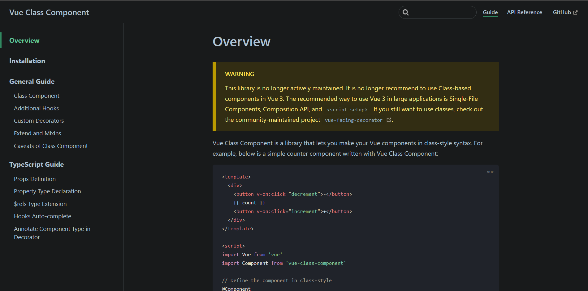
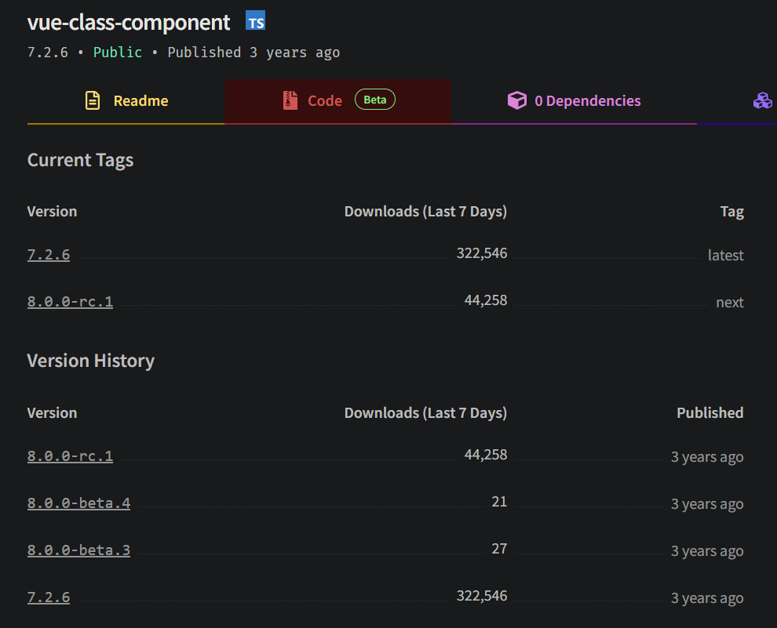

@[TOC](文章目录)

---

# 前言
参考Vue3官网.
本篇以组合式API为例, 但不包含setup语法糖式写法.

原本打算结合class-component, Vue3不推荐就不用了: [OverView|Vue Class Component](https://class-component.vuejs.org/).
而且是不再推荐基于类的组件写法, 推荐单文件组件, 组合式 API和setup语法糖.



而且这个库也好久没更新了: [vue-class-component npm](https://www.npmjs.com/package/vue-class-component?activeTab=versions)



---

# 1.reactive
可以选择使用多个reactive来保存状态.
但reactive只接受对象类型, 分开写势必要面临非对象类型数据的响应式处理问题.

你尽可以把它塞到一个对象里, 就像这样:
```typescript
type asd = number;
const a = reactive<{ a: asd }>({ a: 1 });
console.log(a.a);
```
个人推荐用ref处理, 接受非对象类型:
```typescript
type Count = number;
const count = ref<Count>(0);
```

不管怎么写都得给reactive下的每个属性规定类型, 这些类型之间可以互相引用
分开写的话就不需要组合一个约束整个reactive的接口, 约束每个值就可以了:
```typescript
setup() {
  interface Book {
    title: string;
  }
  interface Info {
    id: number;
    book: Book
  }

  const book = reactive<Book>({ title: "Vue" }); // 在赋值时指定类型
  const info: Info = reactive({ id: 2, book: book }); // 在创建变量时指定类型
 
  const addToDo = function (todo: Info): void { // 函数要注明参数和返回值类型
  };
}
```

合起来写的情况下需要给reactive定义接口:
```typescript
setup() {
  type Finished = number;
  type Still = number;
  interface Info {
    id: number;
    title: string;
    isCompleted: boolean;
  }

  interface react {
    finished: Finished;
    still: Still;
    todos: Info[];
  }

  const state = reactive<react>({
    finished: 0,
    still: 3,
    todos: [
      { id: 1, title: "task0", isCompleted: false },
      { id: 2, title: "task1", isCompleted: true }
    ],
  });
}
```

也可以选择不给reactive定义接口, 那就得挨个定义reactive内属性的类型, 我不知道这样写是否规范:
```typescript
setup() {
  type Finished = number;
  type Still = number;
  interface Info {
    id: number;
    title: string;
    isCompleted: boolean;
  }

  const state = reactive({
    finished: <Finished> 0,
    still: <Still> 3,
    todos: <Info[]> [
      { id: 1, title: "task0", isCompleted: false },
      { id: 2, title: "task1", isCompleted: true }
    ],
  });
}
```

---

# 2.ref
 对于非对象类型数据, 依然推荐使用ref处理:
  ```typescript
  export default defineComponent({
   setup() {
     let still = ref<Still>(3);
     let finished = ref<Finished>(0);
     let todos = ref<TaskInfo[]>([
       { id: 0, title: "task0", isCompleted: false },
       { id: 1, title: "task1", isCompleted: true },
     ]);
    }
 });
```

可以选择引入Vue自带的Ref类型, 这并不会影响其他地方对该值的接收, 比如`const a: Ref<string> = ref('3');` `a.value`依然可以作为`string`类型的参数.
 ```typescript
 import type { Ref } from 'vue';
 
 export default defineComponent({
   setup() {
     let still: Ref<Still> = ref(3);
     let finished: Ref<Finished> = ref(0);
     let todos: Ref<TaskInfo[]> = ref([
       { id: 0, title: "task0", isCompleted: false },
       { id: 1, title: "task1", isCompleted: true },
     ]);
  }
 });
```

---
# 3.props
很遗憾在不使用setup语法糖的情况下Composition API的props并不能接受一个接口, 如下方式不被允许:
```typescript
interface Book {
  page: number;
  id: number
}
interface propsInterface { 
  book: Book,
  a: Function
}

export default defineComponent({
  props: <propsInterface> { // 此处标红, <propsInterface>不能加在此处
    book: {
      type: Object,
      require: true
    }
    a: {
      type: Function,
      require: true
    }
  },
  setup(props) {
    // props.xxx;
  }
})

```
所以就不要接口了, 用文档推荐的方法, 简单类型的type直接写, 复杂类型在类型后面加`as PropType<???>`来做进一步的描述:
```typescript
interface Title {
  a: number;
  s: string;
}

export default defineComponent({
  name: "Item",
  props: {
    id: {
      type: Number,
      require: true,
    },
    title: {
      type: Object as PropType<Title>,
      require: true,
    },
    isCompleted: {
      type: Boolean,
      require: true,
    },
    deleteToDo: {
      type: Function as PropType<(id: number) => void>, // 进一步描述函数
      require: true,
    },
    finish: {
      type: Function as PropType<(id: number, complete: boolean) => void>, // 进一步描述对象
      require: true,
    }
  }
})
```

---

# 4.computed
参考文档用例:
```typescript
setup(props) {
  const getId = computed<number>(() => { // 计算属性
    return props.id;
  });
  
  const isCompleted = computed<boolean>({ // 可写计算属性
    get(): boolean {
      return props.isCompleted;
    },
    set(): void {
      props.finish!(props.id!, props.isCompleted);
    },
  });
  
  return {
    getId,
    isCompleted,
  };
}
```

---

# 5.emit
type.ts:
```typescript
export type Answer = string;
```
子组件: 
```html
<template>
  <div class="todo-header">
    <input
      type="text"
      @keyup.enter="pressEnter"
      @keyup.esc="pressESC"
    />
  </div>
</template>
```
```typescript
emits: ["enter", "esc"],
setup() {
  const pressEnter = function () {
     const hq: Answer = "press Enter";
     emit("enter", hq);
  };

  const pressESC = function () {
    const nq: Answer = "press ESC";
    emit("esc", nq);
  };

  return {
    pressEnter,
    pressESC,
  };
}
```
父组件:
```html
<template>
  <div>
    <Header @esc="pressESC" @enter="pressEnter" />
  </div>
</template>
```
```typescript
setup() {
  const pressEnter = function (answer: Answer): void {
    console.log(answer);
  };

  const pressESC = function (answer: Answer): void {
    console.log(answer);
  };

  return {
    pressEnter,
    pressESC,
  };
}
```

---

# 6.watch
```html
<template>
  <div>
    <p>Counter: {{ counter }}</p>
    <button @click="incrementCounter">Increment</button>
  </div>
</template>
```
```typescript
setup() {
  interface Counter = number;
  const counter = ref<Counter>(0);

  const incrementCounter = (): void => {
    counter.value++;
  };

  // 使用 watch 函数观察 counter 的变化
  watch(counter, (newValue, oldValue) => {
    console.log(`counter changed from ${oldValue} to ${newValue}`);
  }, { deep: true });

  return {
    counter,
    incrementCounter,
  };
}
```

---

# 总结
如果有漏掉的部分, 以后会补充.