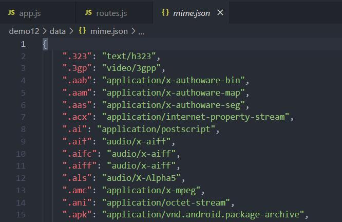

@[TOC](文章目录)

<hr style=" border:solid; width:100px; height:1px;" color=#000000 size=1">

# 前言
目的是实现form.ejs页面的数据能被接收并呈现,然后URL改变时页面能够正常跳转
URL中有扩展名的时候交给静态web解决, 没有扩展名交给路由解决
routes.js模块中封装了static()方法来确保文档类型正确, 顺便做静态web.
app.js模块负责服务器和路由;
views目录中存放所有页面

先解决routes.js吧,到时候我们直接把它的方法调到app.js中用就好了.
<hr style=" border:solid; width:100px; height:1px;" color=#000000 size=1">

# 一、routes.js
## 引入模块
文件模块fs和核心模块path;
要用到它们中的方法;
```javascript
const fs = require('fs');
const path = require('path');
```
## getFileMime()方法
这个方法能够接收传入的文件扩展名, 然后在mime.json中查找相应字符串(像"text/html"这种格式的)并返回, 而我们会在封装static()方法时用到这种字符串来界定响应头.
如你所见, 这里存着各种扩展名对应的contentType;


嗯...然后我们开始吧,先封装getFileMime处理好mime.json的数据, 准备给static用.

```javascript
function getFileMime(extname) {
    let data = fs.readFileSync('./data/mime.json');
    let mimeObj = JSON.parse(data.toString());
    return mimeObj[extname];
}
```
接收extname, 这个参数会由调用getFileMime()的static()方法从app.js接收并提供, 我们现在还不用担心, 只要知道他是一个".后缀名"(比如".html")格式的参数即可.

调用文件模块的readFileSync同步读取路径对应的JSON文件(没读完之前需要阻塞),然后将读取结果即mime.json中所有的内容存入变量data.

readFileSync()读取出来的是16进制的buffer数据, 我们用toString()将其转换为字符串,再用JSON.parse()转换为对象, 这样就将mime.json以原本的格式弄出来了.
```javascript
//同上段,为了方便浏览
function getFileMime(extname) {
    let data = fs.readFileSync('./data/mime.json');
    let mimeObj = JSON.parse(data.toString());
    return mimeObj[extname];
}
```
然后把mimeObj[extname]返回, 因为参数extname前缀都有个".", 直接"mimeObj.extname"会翻车, 所以用了"mimeObj[extname]";
这最后一部就是根据传入的扩展名将对应的ContentType返回;

## static()方法
我们需要导出这个方法, 它得在app.js中被调用接收参数;
因为代码太长所以每句说明都写在其下;

```javascript
exports.static = function (req, res, staticPath) {
    const { url } = req;
    //这个req来自app.js中的服务器,是当前页面发送的所有请求信息;
    const { host } = req.headers;
    //host, 从req对象中取出的headers属性分派给本地的host属性;
    const myURL = new URL(url, `http://${host}`);
    //根据上面两条生成本次请求的完整URL并且解析, 结果赋值给myURL;
    let pathname = myURL.pathname;
    //从myURL中取出pathname段,也就是当前URL里的域名后的文件路径终点;
    let extname = path.extname(pathname);
    //使用path模块中的extname()方法拆出路径最终指向的页面文件的扩展名赋值给extname;
    if (extname) {  
    //如果有扩展名让静态web处理,也就是在本处处理, 否则交给路由;
        if (pathname != '/favicon.ico') {
            try {
                let data = fs.readFileSync('./' + staticPath + pathname);
               //然后用户到了你这页面,你总不能让人家看个空白页,得把文件内容呈现渲染出来;
               //那就读取这个路径对应文件的内容赋值给data准备交付渲染;
                if (data) {
                //如果data存在(即读取完成);
                    let mime = getFileMime(extname);
                    //传入文件后缀拿到Content-Type供writeHead用;
                    res.writeHead(200, { 'Content-Type': '' + mime + ';charset="utf-8"' });
                    //然后规定一下文件类型防止浏览器解析出错;
                    res.end(data);
                    //end()将文件内容写入页面, 这步传字符串会直接在页面呈现字符串;
                }
            } catch (error) {
            //上接try, 如果try失败了,本处抓错误输出;
                console.log(error)
            }
        }
    }
}

```
到这为止routes.js就写完了, 但它只能负责页面的正确文件解析方式和静态web, 和给routes提供参数req;
另外刚才提到没有扩展名的URL我们需要交付路由进行处置,这些也要在app.js中完成, 会有一个类似于Vue路由表的结构.
<hr style=" border:solid; width:100px; height:1px;" color=#000000 size=1">

# 二、app.js
我们的服务器建立在此处, 获取到用户在客户端发送的请求信息req和相应res,利用这两个参数, 我们就可以判定他到了哪个页面, 现在该发点甚麽给他那边来生成页面;
## 引入模块
我们需要使用这些模块中的方法;
```javascript
const http = require('http');
const path = require('path');
const routes = require('./module/routes');
const ejs = require('ejs');
```

## 主体
```javascript
http.createServer(function (req, res) {

    routes.static(req, res, 'static');  
    //向routes模块的static方法传参req, res, 静态路径static
    //这个静态路径应该就是集中存放网页文件的文件夹,比如wwwroot这种.
    const { url } = req;
    const { host } = req.headers;
    const myURL = new URL(url, `http://${host}`);
    //拿到截止到port的,这次请求URL,比如http://127.0.0.1:3000;
    //并且交付new URL进行解析;
    let pathname = myURL.pathname;
    //拿到解析结果里的pathname,文件路径终点;
    let extname = path.extname(pathname);
    //path模块方法!!尝试!!拿到文件后缀名
    console.log(req.method);
    //打印本次触发的方式, GET主要用于客户端获取数据;
    //POST主要用于客户端向服务端发送数据
    if (!extname) {
    //这块就是路由了,用于处理不带扩展名的URL;
    //检测后缀名不存在为"是",执行后续操作:
        if (pathname == '/news') {
        //检测路径终点是否为/new页面
            const { url } = req;
            const { host } = req.headers;
            const myURL = new URL(url, `http://${host}`);
            //如果是news的话再次拿取截止到port的URL并解析;
            let searchParams = myURL.searchParams;
            //拿取解析结果中的searchParams属性赋值给searchParams;
            //这里拿哪个属性随意,就是证明一下能拿到,输出一下.
            console.log(searchParams);
            res.writeHead(200, {'Content-Type':'text/html;charset="utf-8"'});
            //news页面文件是个html文件,这个我们就不用实时检测文件类型了;
            res.end(searchParams);
            //end()将searchParams写到页面上;
        } else if (pathname == '/login') {
        //如果pathname得到的路径终点指向login页面,执行如下:
            ejs.renderFile('./views/form.ejs', {}, (err, data) => {
            //ejs方法renderFile()将目标路径文件的内容渲染;
            //完成后执行一次在该页面的回调;
                res.writeHead(200, { 'Content-Type': 'text/html;charset="utf-8"' });
                //login也是个html文件, 同样直接界定文件类型为text/html;
                res.end(data);
                //回调函数将渲染后的页面内容end()到页面上;
            })
        } else if (pathname == '/doLogin') {
          //又或者path指向的路径终点为doLogin(这个页面是在login页点击提交才会到的)
            let postData = '';
            //声明postData为空;
            req.on('data', (chunk) => {
            //post的请求以流的形式进行, 服务器也是分块接收;
            //所以要监听两个阶段点判断是不是传输完成;
            //当流将数据移交给消费者时，会触发'data'事件
                postData += chunk;
            //用变量chunk接收拿到的数据, 然后填入postData中;
            })

            req.on('end', () => {
            //流中没有更多数据可供消费时，触发'end'事件
             console.log(postData);
             res.end(postData);
             //end()将存储着数据的postData呈现到页面;
            })

        } else {
        //全都不是直接404, 鬼知道他怎么跑到这个地方来的
            res.writeHead(404, { 'Content-Type': 'text/html;charset="utf-8"' });
            res.end("页面扔下你走了...");
        }
    }

}).listen(3000);
//在3000端口监听;

```

# 总结
就是记录个流程, 更好的方法当然是有的.