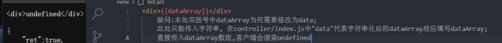
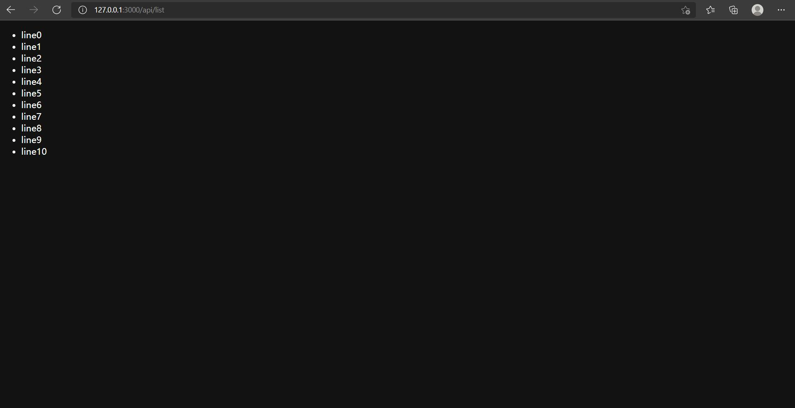

@[TOC](文章目录)

<hr style=" border:solid; width:100px; height:1px;" color=#000000 size=1">

# 一、总体思路
写好前端页面, 然后在前端common.js文件用ajax向后端发送请求;

在server.js中配置art-template模板的取用路径, 相关options;配置body-parser以正确解析前端发来的数据;

然后做后端路由, 先在"controller/index"中配置各条路由活跃后需触发的方法(即自定义路由中间件), 然后在"router/index"挂载到express的路由对象router:

准备后端数据.

配置art模板文件.

抽离路由中间件(当然, 不抽离也是可以的);

<hr style=" border:solid; width:100px; height:1px;" color=#000000 size=1">

# 二、前端在common.js发送请求
art-template既能在Node.js环境下运行,也能在浏览器环境下运行
art-template提供给前端使用的三种渲染方法:

| 语法 | 说明 |
|--|--|
| template(filename, data);  | 基于模板名渲染模板, 但参数不需要template对象; |
| template.compile(source, options);  | 将模板源代码编译为函数 |
| template.render(source, data, options);  | 将模板源代码编译成函数并立即执行 |

因为浏览器不支持文件系统, 所以template三个渲染方法都不支持传入文件路径.
因为这是在前端, 我们不能直接用require()方法, 需要去art-template官网拿到template-web.js从html页面< script src>引入才能在前端正常使用art-template;

当然, 也只能使用它们提供给前端的方法.

```javascript

$.ajax({
  url: '/api/list',
  success(result) {
    let templateStr = `
      <ul>
        {{each data}}
          <li>{{$value}}</li>
        {{/each}}
      </ul>
    `
    //用到art-template API提供的循环语法

    let html = template.render(templateStr, {
        //"template"是客户端的template对象
      data: result.data
    })
    $('#list').html(html)
  }
})

```

# 三、server.js相关配置
在server.js中进行art-template和body-parser相关的配置.

## 1.引入依赖
```javascript
const express = require('express');
const app = express();
const bodyParser = require('body-parser')
const router = require('./router/index');
const path = require('path');
```

<hr style=" border:solid; width:100px; height:1px;" color=#000000 size=1">

## 2.body-parser相关配置
body-parser插件可以在中间件中对传入的请求体进行解析, 顾名思义的话, body指的是请求的"身体body", 而"parser"的中文在计算机领域原本就有语法分析程序,句法分析程序之意.

但其实"parser"指的是一种过程, 一般是将某种数据从一种结构转换为另一种数据结构的过程.
```javascript
app.use(bodyParser.urlencoded({ extended: false }))
//当前bodyParser专门用于接收前端发来的表单数据;
//bodyParser已经弃用;

app.use(bodyParser.json());  //用以解析json字符串, 不写后端只能拿到空对象;

app.use(express.static('./public'));
//express内置中间件express.static()用于访问静态资源文件夹public
```
<hr style=" border:solid; width:100px; height:1px;" color=#000000 size=1">

## 3.art-template相关配置
art-template是一种简约轻快的模板引擎, 采用作用域声明的技术来优化模板的渲染速度, 而且针对NodeJS环境和浏览器环境能够提供不同的方法, 是协助express访问模板文件的工具插件.

我们需要用art文件作为模板来生成html文件(在art模板中对HTML代码完成数据库查询和填充后写入html文件发给前端), 需要它提供的各种方法(art类型不是art-template的伴生物).

在server.js中需要完成:
确立使用何种模板引擎对art模板进行渲染.
需要规定art-template寻找模板的默认路径, 这样路由一旦触发, art-template会去固定的一个目录下寻找这个页面对应的art模板.
规定何种类型的文件才能选为express框架模板文件;

由官方提供的, 在express框架中使用art-template的方法如下:
```javascript
app.engine('art', require('express-art-template'));
//当渲染后缀为参数1的模板时, 所使用的模板引擎是参数2.

app.set('view options', {
    debug: process.env.NODE_ENV !== 'production',
    escape:false
})
//做一些其他配置, 详细配置项我放到下面的表格里了;

app.set('views', path.join(__dirname, 'view'));
//确立res.render()查找express框架模板的路径.

app.set('view engine', 'art');
//设置express框架模板文件的默认后缀为art;
```

art-template全配置项参考表:
| 属性 | 说明 |
|--|--|
| filename | 模板名 |
| rules | 模板语法规则列表 |
| escape | 是否开启对模板输出语句自动编码功能。为 false 则关闭编码输出功能 |
| debug | 启动模板引擎调试模式。如果为 true: {cache:false, minimize:false, compileDebug:true} |
| bail | 如果为 true，编译错误与运行时错误都会抛出异常 |
| cache | 是否开启缓存 |
| minimize | 是否开启压缩。它会运行 htmlMinifier，将页面 HTML、CSS、CSS 进行压缩输出;如果模板包含没有闭合的 HTML 标签，请不要打开 minimize，否则可能被 htmlMinifier 修复或过滤 |
| compileDebug | 是否编译调试版 |
| resolveFilename | 模板路径转换器 |
| include | 子模板编译适配器 |
| htmlMinifier | HTML 压缩器。仅在 NodeJS 环境下有效 |
| htmlMinifierOptions | HTML 压缩器配置。参见 https://github.com/kangax/html-minifier |
| onerror | 错误事件。仅在 bail 为 false 时生效 |
| loader | 模板文件加载器 |
| caches | 缓存中心适配器（依赖 filename 字段） |
| root | 模板根目录。如果 filename 字段不是本地路径，则在 root 查找模板 |
| extname | 默认后缀名。如果没有后缀名，则会自动添加 extname |
| ignore | 忽略的变量。被模板编译器忽略的模板变量列表 |
| imports | 导入的模板变量 |

Node中，全局变量process表示的是当前的node进程, NODE_ENV是由用户自定义的变量, 初始不存在于process.env中.
process.env属性返回的是一个包含用户环境信息的对象, 可以作为区分开发环境或正式环境的依据, 推测此处设置debug属性目的为关闭环境配置中的生产模式以方便调试;

<hr style=" border:solid; width:100px; height:1px;" color=#000000 size=1">

## 4.挂载router到"/"
将主路由router挂载到所有路径, 只要url发生改变立刻开始执行路由匹配;
```javascript

app.use('/', router);
```

<hr style=" border:solid; width:100px; height:1px;" color=#000000 size=1">

# 三、准备后端数据
仅仅是对数据准备这一步做的抽离, 准备好的数据要暴露出去然后在中间件中引入.

```javascript
//list.js
let dataArray = [];

for (let i = 0; i <= 10; i++) {
    dataArray.push('line' + i);
}

module.exports = {    //在路由中间件中导入使用
    dataArray
}
```
<hr style=" border:solid; width:100px; height:1px;" color=#000000 size=1">

# 四、art文件配置
里面可以写html, 将html部分拆解嵌入模板引擎(php, ejs, jsp, asp ,这里用了art)文件中,然后可以将数据库里的数据嵌入页面里, 对数据进行填充和查询然后发送回客户端.
不管你是不是把它写到对象里或者其他甚麽地方, art文件中只要是双括号里的变量都可以被res.render()传入值.
但是注意只能传字符串, 传数组之类的会undefined:



art文件默认不提供格式化和代码规范检索功能, 但因为我们要做html模板所以...
额, 我是说如果你也用VSCode的话...
在编辑器右下角将语言类型设置为html, 我们就可以写的更舒服一点.

```html
<!--list-html.art-->
<!DOCTYPE html>
<html lang="en">

<head>
    <meta charset="UTF-8">
    <meta name="viewport" content="width=device-width, initial-scale=1.0">
    <title>list-html</title>
</head>

<body>
    <ul>
    <!-- 用art-template提供的each方法遍历生成文字为dataArray数组元素的li -->
    <!-- data是路由中间件中传入的数组dataArray -->
        {{each data}} 
        <li>{{$value}}</li>
        {{/each}}
    </ul>

</body>

</html>
```
因为这些代码在后面要写入html文档渲染后发送到前端, 所以要写HTML, 不过这里我没有牵扯到数据库而是直接在list.js中准备好数据在这里引入.
<hr style=" border:solid; width:100px; height:1px;" color=#000000 size=1">

# 四、controller/index.js完成路由中间件
我们是要做后端渲染, 基本原理就是在后端将页面渲染完成后再将页面发送给前端, 后端渲染这一步就是在中间件完成的.

前面已经规定好了art-template会去views目录下寻找模板, 那我们只要规定对于哪个页面需要发送哪个模板就好了.
因为是art-template去找模板, 那找到模板后发送前端的时候也应该用art-template提供的方法res.render(),它可以承担res.send()的功能.

所以后端路由的最终目的是根据前端URL的改变决定返回哪个art模板生成的html文件. 

```javascript
const template = require('art-template');
const path = require('path');
const fs = require('fs');
const listModel = require('../model/list');


const list = (req, res, next) => {

    res.set('Content-Type', 'application/json;charset=utf-8');

    let html = template(path.resolve(__dirname, '../view/list-html.art'), {
        //因为这里用Node绝对路径无法正确获取art模板的位置(controller..\view\list-html.art'), 所以需要引入path模块获取路径
        data: listModel.dataArray
        //将listModel对象中的dataArray属性赋值给list-html.art中的data
    })

    fs.writeFileSync(path.join(__dirname, '../public/list.html'), html)
    //同步向list.html文件内写入"html"的值,也就是渲染后的art模板内容.
    res.send(html);

}

exports.list = list;
//暴露中间件到router引入
```
template()是art-template提供给express的三大渲染方法之一.
data在赋值时会直接到"views"目录下寻找模板list-html.art文件来进行渲染, 然后将渲染结果赋值到变量html.
<hr style=" border:solid; width:100px; height:1px;" color=#000000 size=1">

# 二、挂载路由中间件到router
这个模块和art-template没什么关系了...
在router/index中完成, 以下是该文件内全部代码:
先导入依赖模块和路由中间件, 然后定义将路由挂载到router并定义只有get请求才能触发这个中间件.
```javascript
const express = require('express');
const router = express.Router();

const { list } = require('../controller/index');

//定义只有get请求才能触发这条路由;
router.get('/api/list', list);
//router.请求方法('路径', 中间件);

module.exports = router;
//将挂载好了支路由的主路由router暴露;
```

<hr style=" border:solid; width:100px; height:1px;" color=#000000 size=1">

# 后记
最终被发到前端的是html文件的内容, 参考路由中间件中:

```javascript
//后端代码
    let html = template(path.resolve(__dirname, '../view/list-html.art'), {
        data: listModel.dataArray
    })
    fs.writeFileSync(path.join(__dirname, '../public/list.html'), html)
```

前端可以在请求成功的应对方法中(也就是这里ajax里success()中的代码)规定请求成功后要进行的操作:

```javascript
//common.js中的前端代码,请求成功后要执行的操作
let templateStr = `
    <ul>
      {{each data}}
        <li>{{$value}}</li>
      {{/each}}
    </ul>
  `
  //用到art-template API提供的循环语法

let html = template.render(templateStr, {
      //"template"是客户端的template对象
    data: result.data
  })
  $('#list').html(html)
```

最终效果:


# 总结
基本理了一下路子...
还有些待完善的内容, 会在后续更新里附带添+加.

2021.11.17完善: 完成了对art文件的渲染和发送, 现在art模板可以在前端呈现了, 现在也不需要再使用art提供的res.render()方法来渲染模板, 不需要server.js中的app.set来规定art路径了,你可以直接在路由中间件中规定本次寻找art模板的路径了.

这是我根据本阶段的学习得出的一些经验, 如果它对你有帮助, 我很荣幸.
当然, 如果您发现了这篇文章的不足还请指点, 我会马上修正.