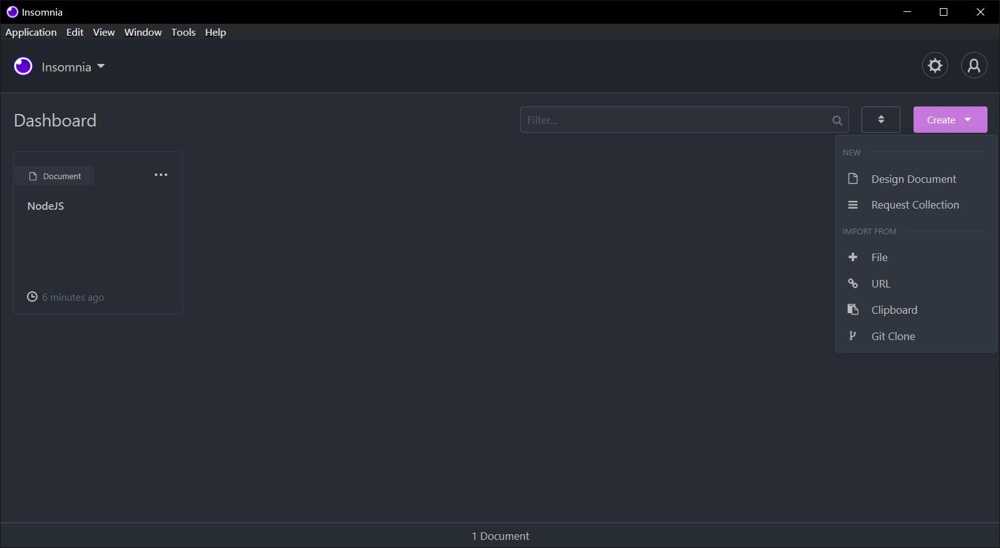
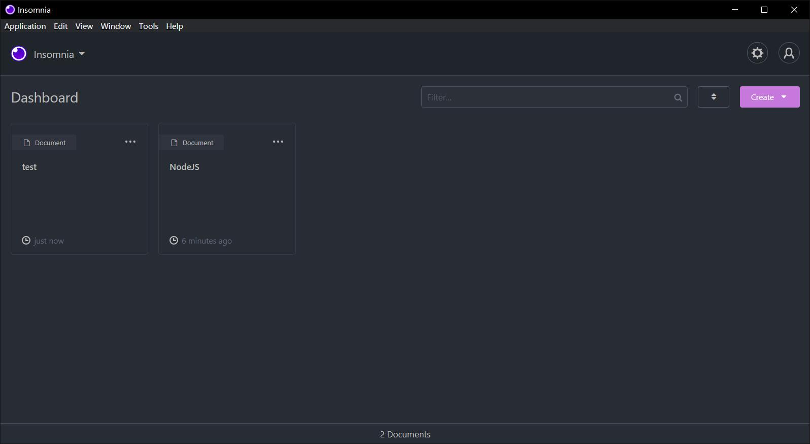
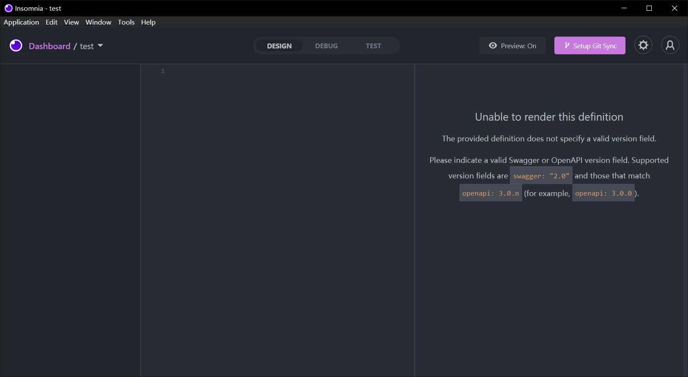
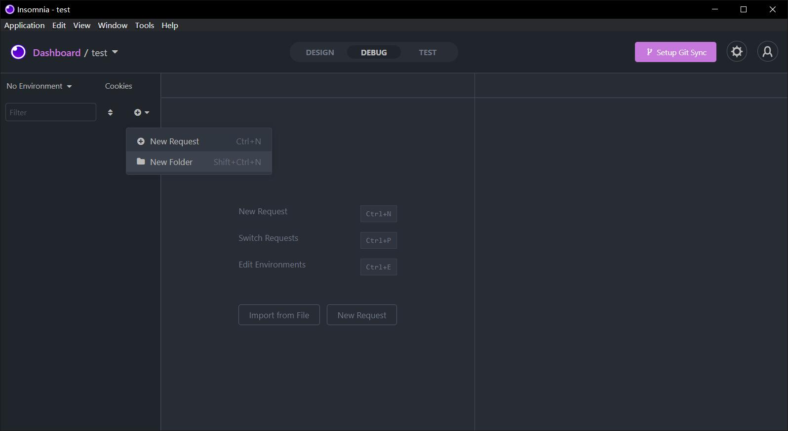
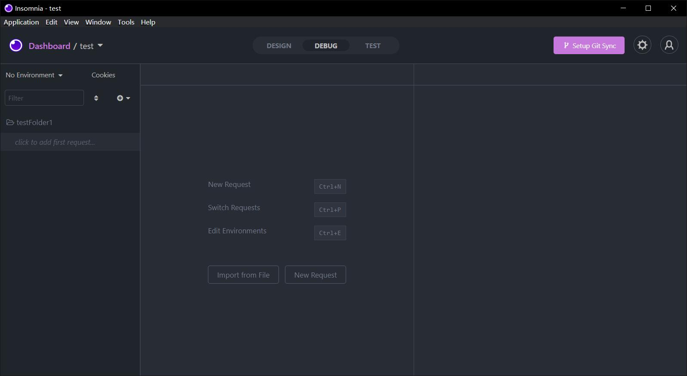
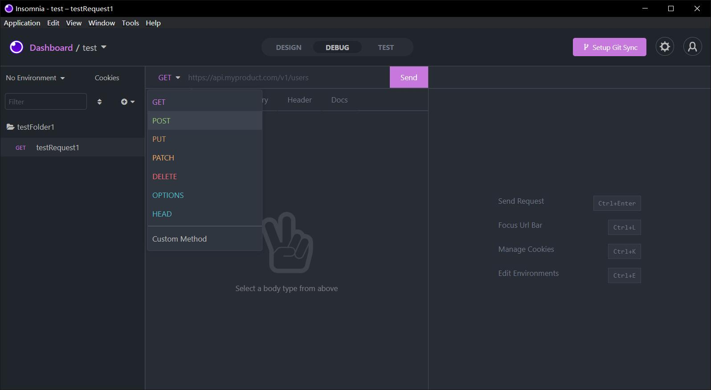
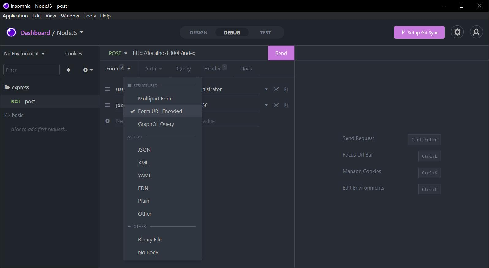
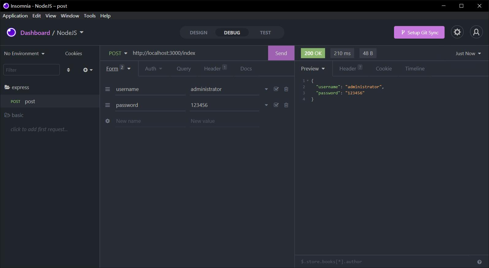

@[TOC](文章目录)

# 新建Document
启动Insomnia进入项目仪表盘, 点击右上角"create"按钮, 点击Design Document, 命名设计文档为"test"



创建完成后在仪表盘可以看到"test"文档,
<hr style=" border:solid; width:100px; height:1px;" color=#000000 size=1">

# 进入Ducument
点击进入test文档:
<hr style=" border:solid; width:100px; height:1px;" color=#000000 size=1">

# 调整模式
将上方模式调整至"DEBUG"模式,点击左侧边栏的小加号, "New Folder"创建一个新的文件夹;
<hr style=" border:solid; width:100px; height:1px;" color=#000000 size=1">

# 创建请求
创建完毕后如下, 点击"click to add first request"来创建第一个请求,


你可以自定义本次请求的名称和请求方式, 这要根据你在代码里规定的路由来决定, 比如:

```javascript
//在Insomnia中用GET请求方法向"api/list"页面发送请求;
router.get('/api/list', list);
```

当然, 请求方式搞错了也没有关系啦, 方式可以随时更换, 也相当方便...
就像下面这样:

<strong>记得在请求方式左边的输入框里规定你要向哪个URL发送请求.</strong>
<hr style=" border:solid; width:100px; height:1px;" color=#000000 size=1">

# 请求相关
这里的"Form"项在初始状态下是"body", 在选择"Form URL Encoded"后将会变为Form
"Form URL Encoded"用于模拟前端发来的表单数据.


然后你可以在这里定义一些数据, 它们会被以JSON格式返回, 这样你的代码里要依赖body-parser并添加:

```javascript
app.use(bodyParser.json());
```

来进行对JSON的解析, 否则只能返回一个空对象.

<hr style=" border:solid; width:100px; height:1px;" color=#000000 size=1">

# 总结
记录一点小经验;
如果它帮到了你,我很高兴: )