@[TOC](文章目录)

<hr style=" border:solid; width:100px; height:1px;" color=#000000 size=1">

# 前言

<hr style=" border:solid; width:100px; height:1px;" color=#000000 size=1">

# 一、数据库操作

## 1.查询并显示当前存在的数据库
db是数据库英文"database"的首字母简写.
而"所有的数据库", 应当为复数加"s".

```sql
show dbs
```
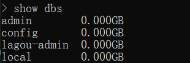
<hr style=" border:solid; width:100px; height:1px;" color=#000000 size=1">

## 2.切换并开始操作某数据库
值得一提的是, 在MongoDB中直接use不存在的数据库会默认创建, 比如这里test库并不存在, 但依然正常的执行了.

```sql
use 数据库名
```
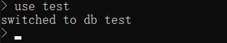
数据库名不可加引号.
<hr style=" border:solid; width:100px; height:1px;" color=#000000 size=1">

## 3.删除数据库
使用use切换到某个数据库后, 直接执行这一句将该库删除.

```sql
db.dropDatabase()
```

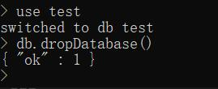

不要传参数.
<hr style=" border:solid; width:100px; height:1px;" color=#000000 size=1">

# 二、集合操作
MongoDB中集合的概念, 就像是MySQL中的"数据表".

## 1.创建一个集合
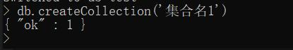
上图反例, 不要创建以中文命名的集合.
<hr style=" border:solid; width:100px; height:1px;" color=#000000 size=1">

## 2.拿到所有集合名并显示
执行结果有几个集合名即说明有几个集合.

```sql
db.getCollectionNames()
```
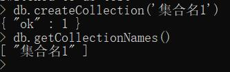
不要传参数.
<hr style=" border:solid; width:100px; height:1px;" color=#000000 size=1">

## 3.依据名称选取并显示某集合
示例翻了个小车, 不要用中文命名集合...
```sql
db.getCollection('xxx')
```
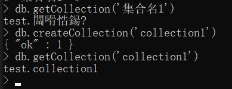

<hr style=" border:solid; width:100px; height:1px;" color=#000000 size=1">

# 三、文档操作
## 1.向集合中存入一条记录
相当于SQL里横向的一行
```sql
db.集合名.insert([{属性名1:'属性值1',属性名2:'属性值2',属性名3:'属性值3'}])  
```

<hr style=" border:solid; width:100px; height:1px;" color=#000000 size=1">

## 2.向集合中存入多条记录
一次性存入多行,只需要在insert的数组中分为多个对象即可, 一个对象代表集合中的一行.
```sql
db.集合名.insert([{属性名1:'属性值1'},db.集合名.insert([{属性名1:'属性值1',属性名2:'属性值2',属性名3:'属性值3'}])])
```
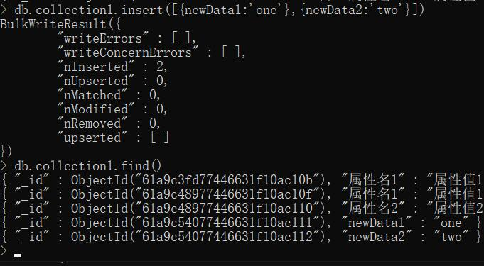
db.collection1.find()见下.
<hr style=" border:solid; width:100px; height:1px;" color=#000000 size=1">

## 3.查询并展示某集合中的所有数据

```sql
db.集合名.find()
```
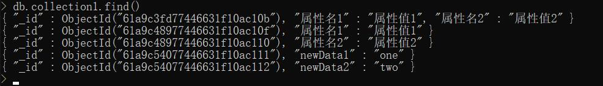
<hr style=" border:solid; width:100px; height:1px;" color=#000000 size=1">

## 4.条件查询
其实主要是以正则表达式的形式来对查找条件进行规定的.
我准备了一些简单的案例在这段, 相信看完后你能够理解...

基本格式: `db.数据库名.find(xxx)`
条件查询:
| 语句 | 释义 |
|--|--|
| `略.find({属性名:"属性值"});` | 查询带有这条数据的记录; |
| `略.find({属性名:{$gt:??}})` | 查询属性值比??大的属性所在的记录 |
| `略.find({属性名:{$lt:??}})` | 查询属性值比??小的属性所在的记录 |
| `略.find({属性名:{$gte:??}})` | 查询属性值大于等于??的属性所在的记录 |
| `略.find({属性名:{$lte:??}}) ` | 查询属性值小于等于??的属性所在的记录 |
| `db.集合名.find({name:/??/})` | 查询name属性值中含有"??"的数据所在的记录 |
| `db.集合名.find({name:/^??/})` | 查询name属性值以"??"开头的所有记录 |
| `db.集合名.find({name:/??$/})` | 查询name属性值以"??"结尾的所有记录 |
现在我写入了4条人物信息数据用于演示:
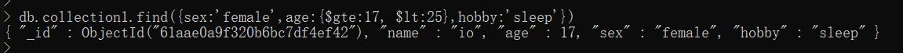

<hr style=" border:solid; width:100px; height:1px;" color=#000000 size=1">


```sql
db.collection1.find({sex:'female',age:{$gte:17, $lt:25},hobby:'sleep'})
```
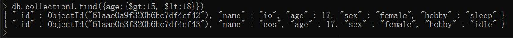
<hr style=" border:solid; width:100px; height:1px;" color=#000000 size=1">

```sql
db.collection1.find({age:{$gt:15, $lt:18}})
```
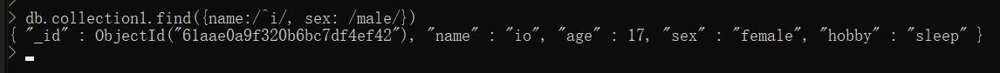
<hr style=" border:solid; width:100px; height:1px;" color=#000000 size=1">

```sql
db.collection1.find({name:/^i/, sex: /male/})
```
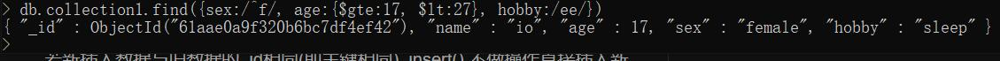
<hr style=" border:solid; width:100px; height:1px;" color=#000000 size=1">

```sql
db.baoguo.find({sex:/^f/, age:{$gte:17, $lt:27}, hobby:/ee/})
```
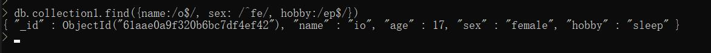
<hr style=" border:solid; width:100px; height:1px;" color=#000000 size=1">

```sql
db.collection1.find({name:/o$/, sex: /^fe/, hobby:/ep$/})
```
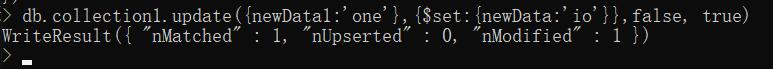
<hr style=" border:solid; width:100px; height:1px;" color=#000000 size=1">

## 5.更新式存入 
同样能实现插入数据, 其与insert()的区别是: 
若新插入数据与旧数据的_id相同(即主键相同), insert() 不做操作直接插入新的记录, 而save() 则更改旧的记录为新记录.

```sql
db.集合名.save({属性名1:'属性值1',属性名2:'属性值2',属性名3:'属性值3'})
```
<hr style=" border:solid; width:100px; height:1px;" color=#000000 size=1">

## 6.更新某条记录内的数据
选取 [满足某些条件的记录] 进行更新.
有两种更新方法, 一种是直接替换某数据为新的数据, 另一种是在旧数据基础上拼加新的数据.
`$set`
`$inc`

`$set`: 直接更新旧数据
```sql
//这是直接更新旧数据的写法;
db.集合名.update({name:25}, {$set:{name:"io"}, false, true);
                   条件           修改为
```
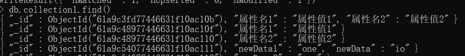
值得一提的是, 在你选择`$set`这种方法后, 如果选择更新的数据是先前不具有的, 会直接添加而不是报错.
比如上图执行结束后在下图最后一条记录中新添加了`"newData": "io"`.
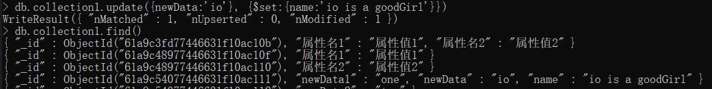
这里如果`$set`newData1的话, 先前的"one"会被替换为"io".
再比如:
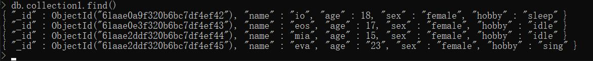

<hr style=" border:solid; width:100px; height:1px;" color=#000000 size=1">


`$inc`: 在旧数据基础上加新的数据, 全称increament

```sql
//这是在旧数据基础上加的写法;
> db.collection1.update({条件属性:'属性值'},{$inc:{待修改属性: 待加值}},false, true)
                            条件           修改为
```
现在我写入了4条人物信息数据用于演示:
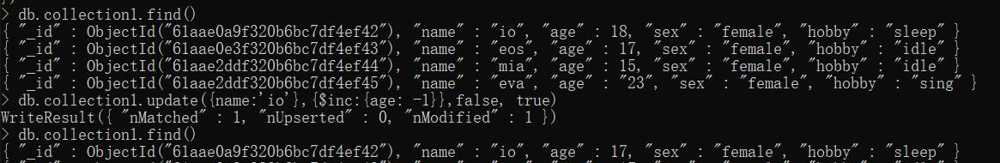
我们来让io再小一岁:

```sql
db.collection1.update({name:'io'},{$inc:{age: -1}},false, true)
//寻找name为io的记录, 向其age属性加-1
```
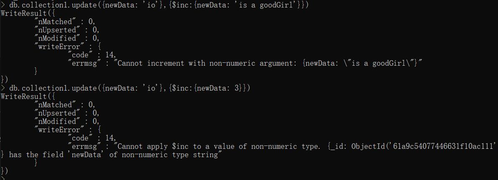
<hr style=" border:solid; width:100px; height:1px;" color=#000000 size=1">

注意这个方法只能往数字类型上拼接数字类型, 否则会报错.
向字符串值拼接数字和字符串:
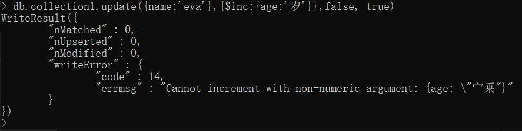
向数字值拼接字符串:
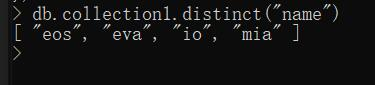
<hr style=" border:solid; width:100px; height:1px;" color=#000000 size=1">

## 7.查询并显示去重后的数据
去重查找, 如果有多条满足查找条件的记录,则仅显示每种找到的第一个.

```sql
db.集合名.distinct("数据名")
```
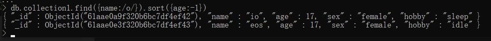
<hr style=" border:solid; width:100px; height:1px;" color=#000000 size=1">

## 8.将记录进行排序

| 语句 | 释义 |
|--|--|
| db.集合名.find(查找条件).sort({age:1}) | 将所有数据依据年龄升序排列 |
| db.集合名.find(查找条件).sort({age:-1}) | 将所有数据依据年龄降序排列 |
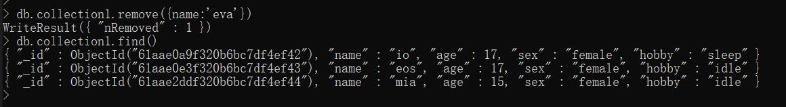
你也可以规定仅仅将哪些数据进行筛选排序.
```sql
db.collection1.find({name:/o/}).sort({age:-1})
```
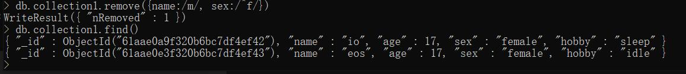
<hr style=" border:solid; width:100px; height:1px;" color=#000000 size=1">

## 9.删除记录
删除单条记录, 

```sql
 db.collection1.remove({属性名:属性值})
```

其删除条件也可以使用正则表达式来规定:

<hr style=" border:solid; width:100px; height:1px;" color=#000000 size=1">

# 总结
操作MongoDB时记下的一点东西...
帮到你的话,我很高兴:)


