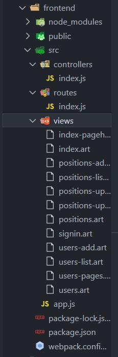
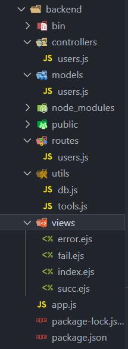
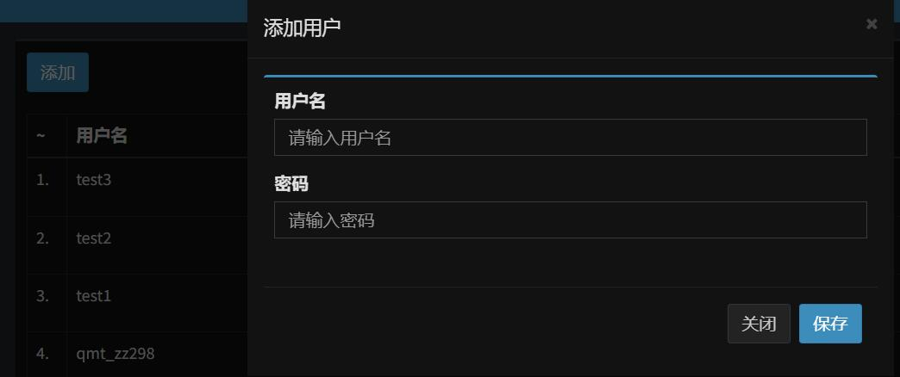
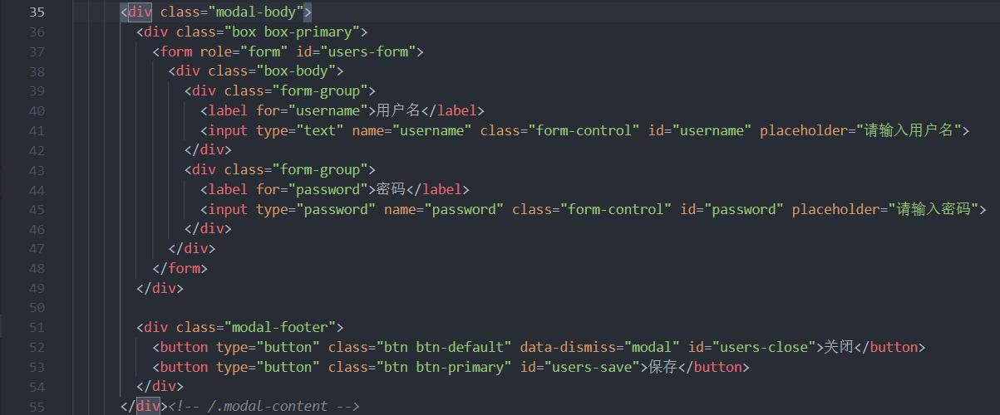

@[TOC](文章目录)

<hr style=" border:solid; width:100px; height:1px;" color=#000000 size=1">

# 前言
最近一直在忙着练这个项目, 所以...没有写甚麽东西, 哈哈.
现在这个管理项目已经有了基本的模样, 实现了用户注册功能和用户列表翻动(这个下篇说), 我打算暂时打住先捋一捋思路.

页面基本样貌的实现就先不记录了, 我使用的是bootstrap.
记录一下用户注册功能的实现吧， 列表翻动。。。以后再说 doge)

<hr style=" border:solid; width:100px; height:1px;" color=#000000 size=1">

# 一、项目结构
数据库: noSQL数据库 MongoDB

前端:

| 目录 | 方法 |
|--|--|
| controllers | 存放前端路由中间件(包含各种请求方法); |
| routes | 负责完成路由系统, 依据URL改变来变化页面; |
| views | 存放页面中各个模块的模板, 和页面的模板; |
| app.js | 完成各类插件配置(该部分不是重点); |

<hr style=" border:solid; width:100px; height:1px;" color=#000000 size=1">

后端:



| 目录名 | 作用 |
|--|--|
| controllers | 存放抽离出的后端路由中间件, 对前端路由中间件中做出的请求进行回应; |
| models | 负责存放一些方法, 会在controllers中调用的那种, 简化中间件代码.|
| public | 静态资源目录  |
| routes | 负责完成后端路由, 对相应前端路由做出的请求进行回应. |
| utils | 负责与数据库链接, 进行数据库操作,包含且不限于用户信息出入库. |
| views | 存放一些ejs页面模板, 由controllers中的中间件负责决定渲染. |
<hr style=" border:solid; width:100px; height:1px;" color=#000000 size=1">

# 二、用户注册功能的实现
## 1.前端-注册入口
现在点击"添加"按钮可以弹出用户名密码输入框, 需要实现 输入后点击"保存"将该用户添加至用户列表的功能.



现在先来完成前端部分吧, 样式和HTML就不说了, 因为涉及到元素id, 我截个图看下:


这段代码构成了注册用户的下拉表单.
<hr style=" border:solid; width:100px; height:1px;" color=#000000 size=1">

## 2.前端-路由中间件测试
在这份bootstrap中已经对应好的逻辑是： 点击下拉注册表单中的"保存"按钮, 导致前端路由中间件"signup"触发（对，它不是由路由驱动的）, 向后端发送用户注册信息, 然后在后端加密存储.

我们要先保证客户端的URL跳转到"/signup"后能够触发前端路由中间件"signup", 现在先来测试一下:

```javascript
// frontend/src/controllers/index

const _signup = () => {
  console.log("signup");
}
```
在controllers中完成中间件"signup", 并不需要暴露, 只要在中间件index(这是生成页面必需的中间件)中为其注册点击事件即可:

```javascript
// frontend/src/controllers/index

const index = (router) => {
  return (req, res, next) => {
    res.render(htmlIndex);  //触发Index后渲染主页的模板到页面
    
    $(window, '.wrapper').resize();  //在index的中间件中执行resize()优先得到执行;
    
    $('#content').html(usersTpl());  //渲染#content元素为usersTpl模块
    
    $('#users-save').on('click', _signup);  //为"保存"按钮注册点击事件
  }
}

export { signin, index };
```
signup方法不由路由直接进行触发
`$('#users-save').on('click', _signup);`

<hr style=" border:solid; width:100px; height:1px;" color=#000000 size=1">

## 3.前端-请求发送
现在点击已经添加可以触发signup方法了, 在signup中完成请求, 向后端发送用户注册信息即可.

如果在点击保存之后, 注册框停在原地不动,用户会感觉反馈不足, 我们应该让它自己收上去, 表示
"我已经弄完了, 你可以做点别的了."
这步只需要调用"关闭"按钮的回调函数即可.

```javascript
// frontend/src/controllers/index

const _signup = () => {
  const $btnClose = $('#users-close');
  const data = $('#users-form').serialize();  //疑问:serialize?

  $.ajax({    //向接口发送post请求
    url: '/api/users/signup',
    type: 'post',
    data,
    success(res) {
      console.log(res);
    }
  })
  
  $btnClose.click();  //回调关闭按钮的函数
}
```
就先向这个接口发送请求吧`/api/users/signup.`
<hr style=" border:solid; width:100px; height:1px;" color=#000000 size=1">

## 4.后端-请求接收
后端对前端请求的监听是通过后端路由来实现的, 在前端向接口发送请求时, 后端在这个接口URL上注册路由方法, 大致是通过这种方法来进行:
`前端监听users的URL, 后端监听frontEnd的URL.`

```javascript
// backend/routes/users

var express = require('express');
var router = express.Router();
const { signup, list } = require('../controllers/users.js');

router.post('/signup', signup);  //这里的signup是后端路由中间件

//其他路由中间件暂略;
module.exports = router;
```
这样前端向
`/api/users/signup`接口
发送请求就可以触发后端的signup方法.
<hr style=" border:solid; width:100px; height:1px;" color=#000000 size=1">

## 5.后端-请求处理&数据库操作
到这里前端向接口发送请求, 后端已经能够正确的进行接收, 但是我前端发请求是要请您老去帮我办点事儿, 你这仅仅是接收请求是不行的, 我们要在signup中进行一些操作.

数据库操作我们不在signup中完成, 有关数据库的操作集中封装成方法存放在`backend/model/users`中, 在signup中调用这些方法并传参需要入库的数据即可, 本处注册用户只用到了一个findUser():

```javascript
// backend/model/users  集中封存数据库方法

const { Users } = require('../utils/db');  //db.js见下段代码

const findUser = (username) => {
    return Users.findOne({ username });    //model.findOne(), 数据库去重查找
    //findOne()只能传入对象
}
```

```javascript
// backend/utils/db  链接, 操作数据库

const mongoose = require('mongoose');

mongoose.connect('mongodb://localhost/lagou-admin',{
    useNewUrlParser: true,
    useUnifiedTopology: true
});

let db = mongoose.connection;
db.on('error', console.error.bind(console, 'connection error:'));

//构建users的model
let usersSchema = mongoose.Schema({
    username: String,
    password:String,
});

let Users = mongoose.model('users', usersSchema);

exports.Users = Users
```
好吧, 现在你也知道findUser()在数据库里会干点什么了, 我们来看signup吧.

请求是一个复杂的过程, 数据库的检索需要时间, 用户信息必须要进行加密, 这也需要时间, 但JavaScript是一门单线程的语言, 我们应该用异步来优化这个方案.
用`async-await`来完成吧...

要将用户注册信息入库, 必然要先获取到信息的, 传入req, res, next三个参数来完成接收, 发送等操作.

在后端为用户信息加密的主要目的是防止内部人员泄密用户数据, so, 在入库之前就要加密, 在拿到数据之后直接加密, 其他操作都先放一放(向加密方法hash()传参即可返回加密后数据, 有关hash()的详情我放到文末了, 再扯下去这signup就没法说了).

```javascript
//backend/controllers/users

const usersModel = require('../models/users');
const { hash } = require('../utils/tools');

const signup = async (req, res, next) => {
    res.set('content-type', 'application/json;charset=utf-8');
    const { username, password } = req.body

    //密码传输过程中需要加密;
    const bcryptPassword = await hash(password);    //密码加密使用的是bcrypt,所以取名为...

    let findResult = await usersModel.findUser(username);   //看看数据库里是否已经存在该用户.
    //findUser, model/users.js中的方法,令数据库去重查找该用户并返回.

    if (findResult) {
        //用户名已存在
        res.render('fail.ejs', {    //发送注册失败页面:用户名已存在
            data: JSON.stringify({
                message: '用户名已存在',
            })
        })
    } else {
        //数据库中无该用户, 帮其注册, 这里不异步,不然注册失败后也发个成功的页面过去就不好了.
        let result = await usersModel.signup({    
            //向models/users中signup传参用户名密码以入库.
            username,
            password: bcryptPassword    //将bcrypt加密后的用户信息入库;
        })

        res.render('succ.ejs', {  //等到注册完成再发送页面: 注册成功
            data: JSON.stringify({
                message: '注册成功',
            })
        });
    }
}

```
好吧, 那我们来看看这个hash()加密, 这是用bcrypt插件实现的:

```javascript
//backend/utils/tools

const bcrypt = require('bcrypt');

exports.hash = (myPlaintextPassword) => {  //接收待加密数据
    return new Promise((resolve, reject) => {   //bcrypt.hash()本不返回Promise对象, 需要自己封装.
        bcrypt.hash(myPlaintextPassword, 10, function (err, hash) {
            if (err) {
                reject(err);
            }
            resolve(hash);
        })
    })
}
```

<hr style=" border:solid; width:100px; height:1px;" color=#000000 size=1">


# 总结
如果这篇文章对您有帮助，我很高兴。当然，如果您发现了我的错误，可以在评论区写下您的看法。

因为快要期末还成绩稀烂不得不复习来避免挂科的屑.

下一篇打算记一下用户列表的翻动请求实现。

