@[TOC](文章目录)

---

# 前言

白嫖的服务器到期了...
被迫再做一次, 也好, 上次摸摸索索的, 也没正儿八经的记录一下过程.

基本思路就是通过SSH工具和服务器建立连接, 然后在服务器上安装宝塔面板, 在浏览器上用可视化面板操作服务器进行网站部署.

---

# 一、搞到一个使用权
无论用白嫖还是什么别的方法, 先拿到一个能用的ECS实例.
然后去控制台查看ECS实例.
点击进入ECS实例:
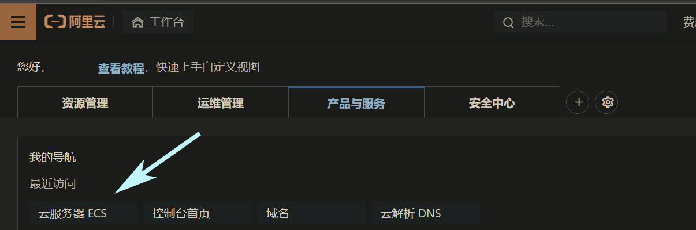
再次点击实例名进入:
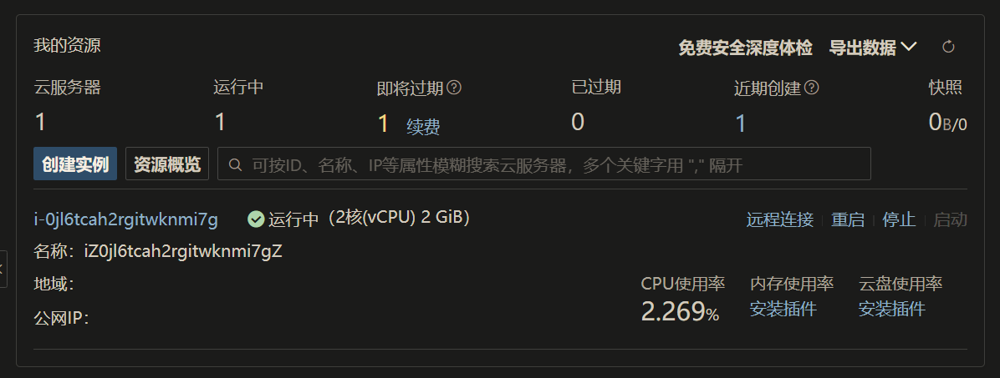
来到如下页面, 我这边是基于CentOS系统做的, 系统不同大概会有一些奇怪的后果(?);
感觉有必要换的话, 在基本信息那一行停止实例, 然后点击更换操作系统, 在"镜像"那一栏更换为"CentOS8.5"即可.

然后注意这个公网IP, 待会我们要用SSH工具和这个IP连接到服务器.
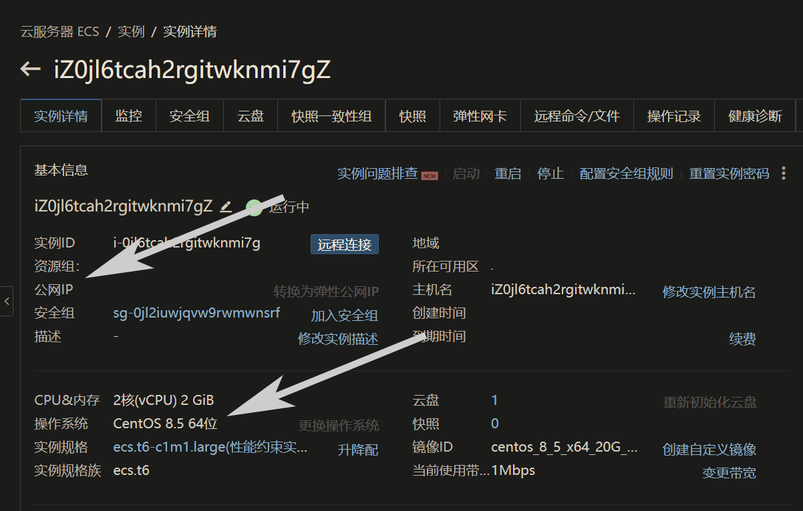

---

# 二、远程连接
这里你有两种选择, 第一种是使用SSH工具在cmd进行远程连接, 第二种是使用平台自带的VNC;

## SSH工具远程连接
这里我用的是openSSH, 安装完毕之后进入cmd:

```javascript
ssh root@<ECS服务器的公网IP>
```
连接的时候如果出现:

```javascript
The authenticity of host 'xxx.xxx.xxx.xxx' can't be established.
xxxxx key fingerprint is xxxxx:xxxxxxxxxxxxxxxxxxxxxxxxxxxxxxxxxxx.
This key is not known by any other names
Are you sure you want to continue connecting (yes/no/[fingerprint])?
```
一般是key发生变化导致的, 比如这次连接的服务器和以前连接的不一样.
直接"yes"继续执行即可.

然后输入你的服务器密码:
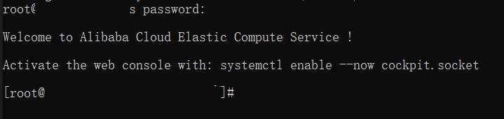
出现

```javascript
Welcome to Alibaba Cloud Elastic Compute Service !
```

提示就是连接成功了.

---

## VNC远程连接
懒得去搞资源的话, 各大平台一般都提供VNC连接服务, 阿里云也不例外 点击远程连接进入VNC面板, 然后初次登录VNC的话在控制台找到实例点击“远程连接”：
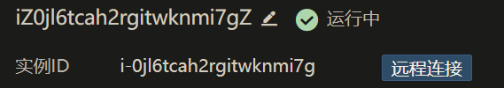
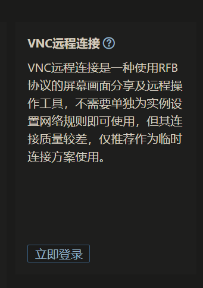
这边建议初始登录先重置密码.
然后进入VNC界面会提示你连接到实例, 大家的实例账号默认都是"root", 密码的话要到实例页面重置一下:
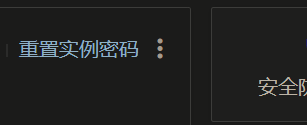
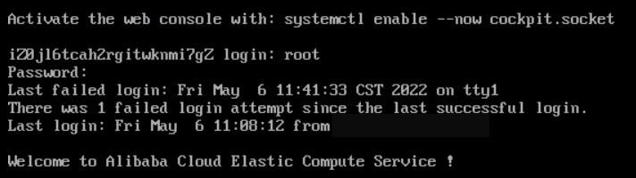
看到

```javascript
Welcome to Alibaba Cloud Elastic Compute Service 
```
VNC连接就算成功了.

---

# 三、安装可视化面板
那到了现在, 不论是SSH还是VNC就都到了这一步:
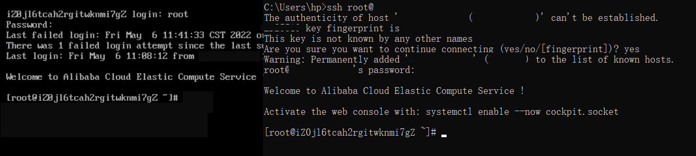
下面的步骤都一样了, 我们可以放在一起说, 
那我们选用宝塔面板, 
先进入宝塔官网Linux面板安装页:
```javascript
https://www.bt.cn/new/download.html
```
然后我们选用的是centOS(这个要具体根据你的服务器系统选择), 那就装CentOS版:
那么直接在命令行输入:
```javascript
yum install -y wget && wget -O install.sh http://download.bt.cn/install/install_6.0.sh && sh install.sh ed8484bec
```
回车,执行.

就以VNC为例:
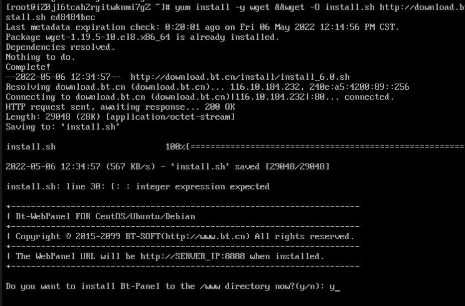
阿里的VNC面板操作搁置时间太长会黑屏, 刷新一下页面就好, 进度会自动保存.

然后一路对对对是是是, 我们来到这里:
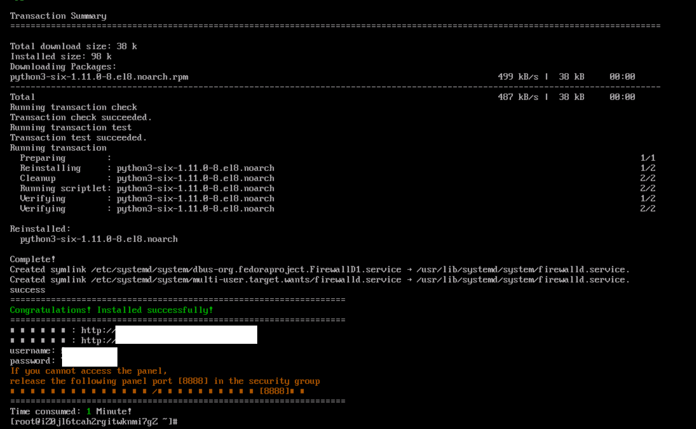
然后现在记录下两个白条遮盖部分的内容;

---

# 四、进入可视化面板
一般是不能直接通过服务器IP+端口进去的, 因为服务器不会默认开放8888端口, 而宝塔面板默认跑在8888端口(其实首次的话直接这样也不能进入, 入口会有加密).
那么需要去服务器的安全组里开放8888端口:
aside里找到安全组, 进入- 配置规则, 然后手动添加, 输入如下(描述随意);
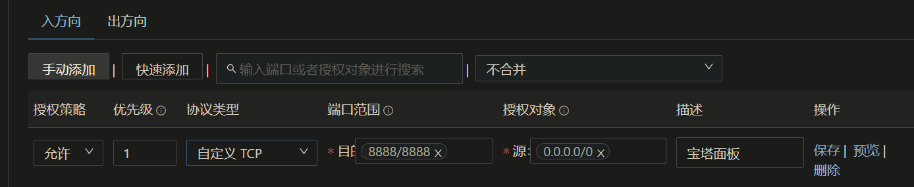
然后通过宝塔安装完毕后给的两个网址(就是前面让记下来的遮挡区字符), 进入宝塔面板登录;
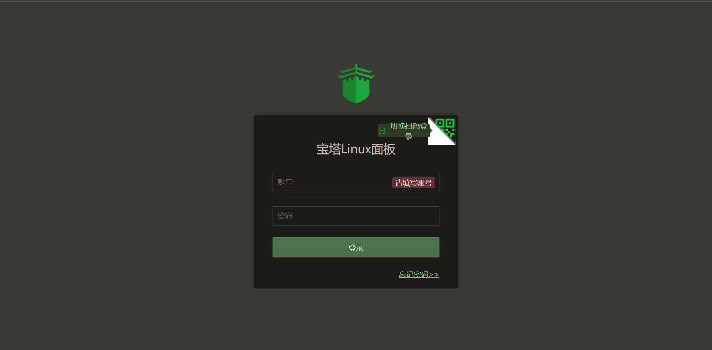
然后第一次登陆的密码账号也给你了(在第二个遮挡区);

不要直接到浏览器进入<服务器公网IP>:8888不然会被挡在外面:
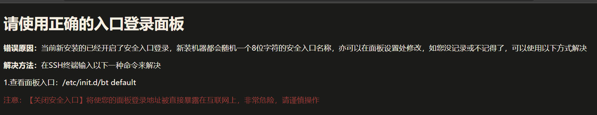

---

## 面板收尾工作
先别急着部署网站, 先去VNC/cmd执行:

```javascript
bt  //安装完宝塔才能执行这个命令.
```
然后VNC那边不知道出了什么岔子(看着像是不能识别中文啊...):
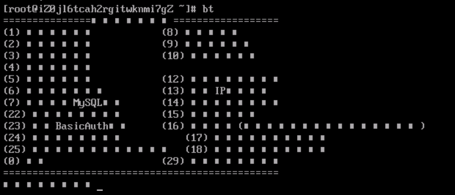
无所谓了, 我用cmd把命令展示出来, 这样用VNC的朋友, 你可以对比着cmd的命令来执行, 反正位置和序号都是一样的:
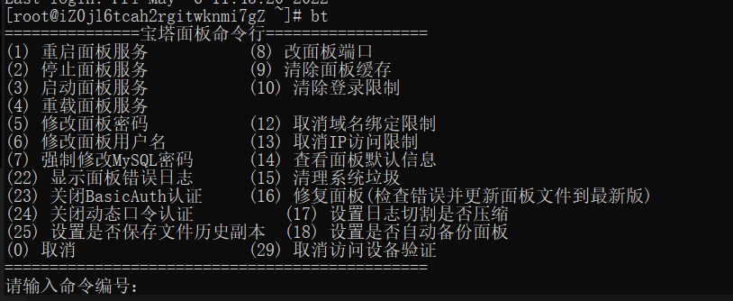
然后我们要先执行一下5号修改面板账号密码, 不然每次都要用那个特别难记的初始账号密码登录:
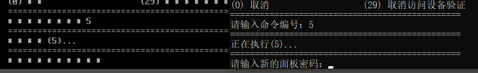
执行完毕之后记得再次bt启动宝塔命令面板, 是这样的, 因为执行完会自动退出:
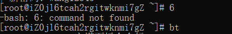
然后执行6号命令修改用户名.

之后执行第11号<看不见的命令>: 取消面板登录限制, 以后可以直接通过服务器公网IP+端口的方式登入.
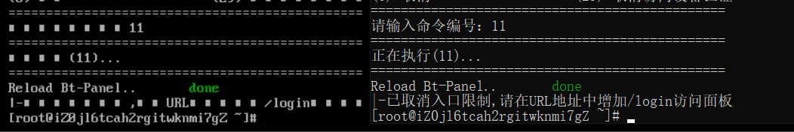
这样就好了.

---

# 五、部署网站
然后进入宝塔面板一路过过过, 什么都不要.
来到这里你已经基本宣告成功了, 只要你的网站文档没有什么会导致服务器那边崩掉的问题)
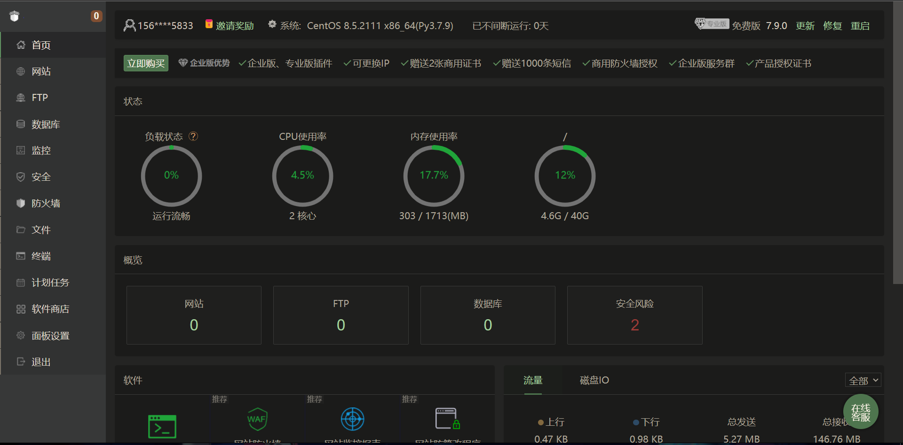
然后直接去软件商店安装Nginx服务器和Mysql数据库, 如果你的后端文档基于Node, 你还要再安装PM2, PM2和Node.js有冲突, 这里我选择了PM2.
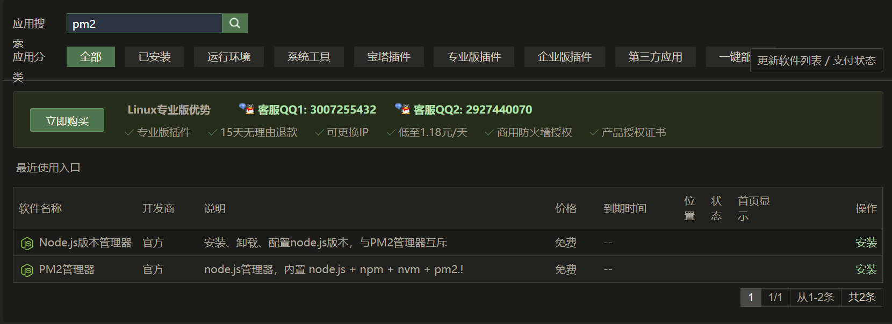
全都急速安装就好.
```javascript
//麻了, 这mysql一点都不急速啊...
```

---

## 部署前端文档
然后先去“网站”建立站点，生成网站基本目录结构。
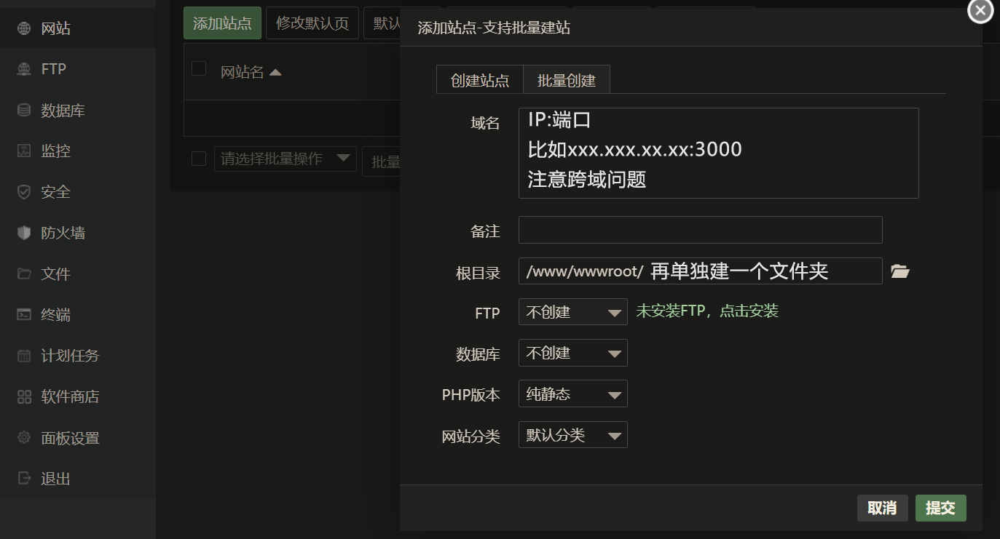
记得选定端口之后去阿里云服务器安全组开放端口；

之后来配置前端目录， 在wwwroot下你新建的文件夹里放入打包完的前端文档（就是vue的dist）
网站目录设置为：
```
/www/wwwroot/flawx
```
运行目录必须精确到你打包的前端文档, 也就是FlawX文件夹里的dist文件夹
```
/dist
```
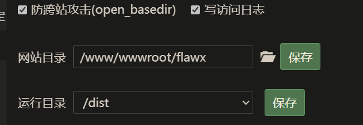

如果安全组配置完了, 那现在应该可以看到前端页面.

---

## 部署后端文档
这里先说一下, 你一定要保证你的后端文档里面包含了所有的依赖, 保证它是一个能独立运行的整体, 也就是说里面应该有个node_modules, 这样是最好的.
虽然PM2提供一键下载依赖, 但是就这几次部署的经验和网上的案例看来, 容易翻车, 我们还是靠自己好:
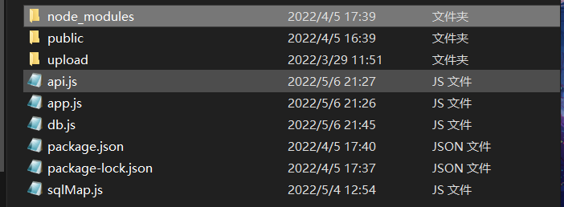
那么开始;
先去文件里把后端文档放好, 放哪里其实都行, 只要PM2部署的时候你能把路径引导过去就好;
但是部署的很乱...就很难看你说对吧, 也不好维护.
我推荐放在wwwroot下, 和前端文档放在一起.
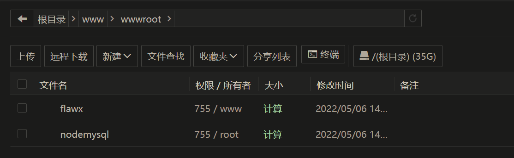
然后去到软件商店搜索PM2点击设置进入, 开一个后端项目:
设置后端文档启动文件和运行目录:
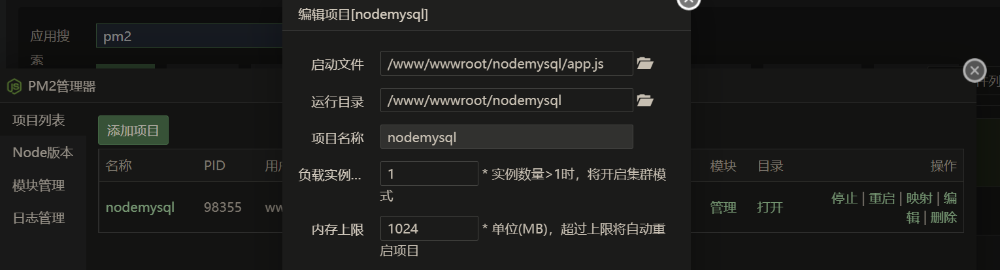
启动文件就是跑node项目时"node xxx.js"的xxx.js文件, 精确到这个文件.
运行目录精确到启动文件的所在文件夹

如果你后端文档里像我一样带了node_modules, 就不用一键补全依赖了.
没有的话你一定要补全, 不然绝对是没法跑的...

然后...跑起来之前我要说的是, 后端和前端绝对别放一个端口.
不在一个端口不一定跨域但是在一个端口后端必崩.

这样后端就跑起来了.
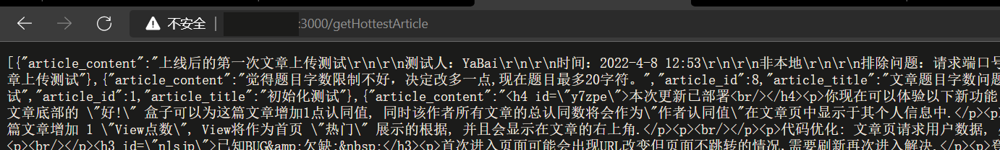

---

## 导入数据库
最简单的一步...
去到"数据库""新建数据库"然后导入本地的数据库文件, 数据库的用户名密码都和你本地的数据库一致就好, 不一样的话貌似不能用.
但是

数据库名, 用户名, 密码 一定要严格按照你后端文档里数据库连接的配置来, 一旦搞错那不是拿不到数据的问题, 那整个后端文档都是不能运作的...
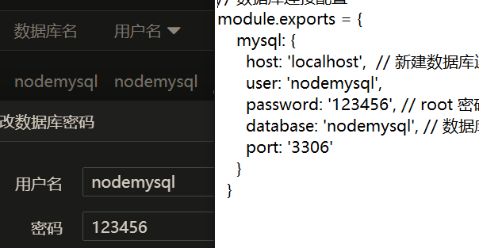
这也是直到晚上才写到这的原因(捂脸)

---

# 六、常见翻车解决方法
前端页面没了
1.绝大多数情况是你"网站"里路径搞错了.
2.检查一下"网站-网站实例-设置-网站目录":
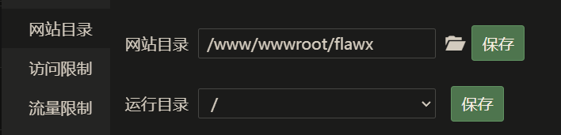
3.检查一下本地前端能不能展现;

后端请求不到, 在页面单独打开是空白或者"xx.xx.xx.xx未发送数据"或者直接not_get
1.检查数据库连接, 检查后端数据库连接配置是否与当前数据库配置一致;
2.服务器不会有问题的, 别想了;
3.检查一下PM2里后端文档的运行情况, 报错情况;
4.前端在本地请求一下后端, 如果能请求到就不是后端的问题.
5.实在不行重新部署一下后端;

---

# 总结
之前在各个云前后部署过4次, 吃了好多亏, 今天有时间了记录一下, 将来翻车也能回来看看...
最后,希望它能帮到你 :)