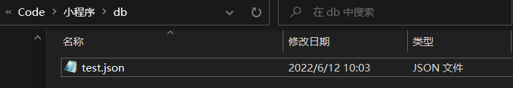
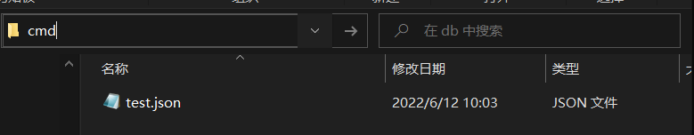
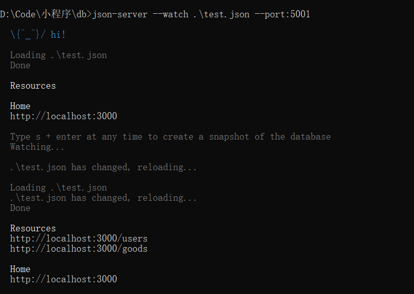
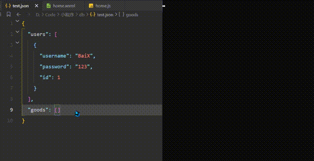
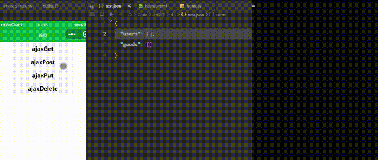
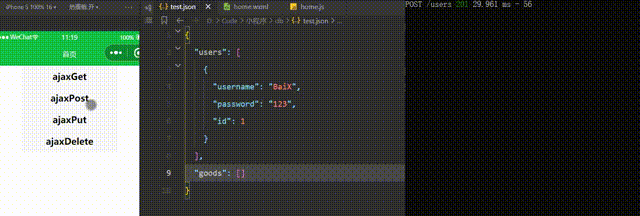
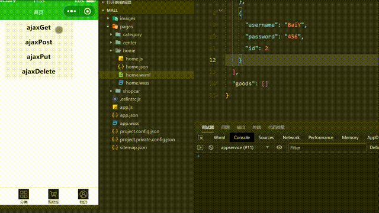
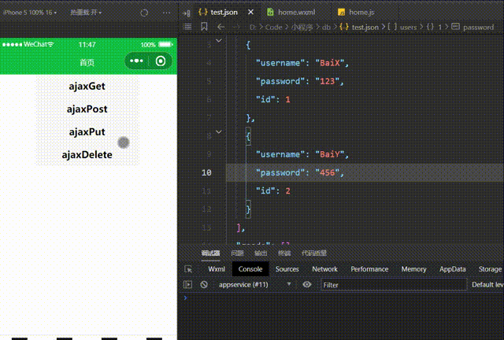
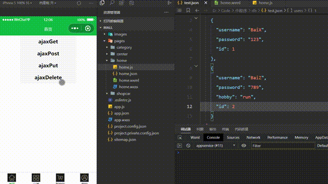

@[TOC](文章目录)

---

# 前言
只要一个json文件就能实现一套接口.

记得刚开始学前端那会, 最愁的就是网络请求, 想练手或者跟着教程做也很难有机会, 教程的接口不是挂了就是要自己搭.

今天学小程序的时候接触到了这么个东西, 似乎可以快速方便地搭建接口, 记录一下吧.

---


# 一、json-server前置准备
建个json文件, 然后输个命令就行了.
## 1.安装
全局安装json-server.
```javascript
npm i json-server -g
```
之后选取一个文件夹作为后端目录, 并且在里面创建一个json文件, 作为接口文档, 大概相当于node接口的app.js吧:


---

## 2.json-server监听文件
在接口文件目录下呼出命令行面板.



```javascript
json-server --watch ./test.json
```
```javascript
json-server --watch 要监听的文件的路径
```
讲道理, 其实这里在后面添加"--port:端口号"是可以修改后端运行的端口号的, 但是我试了一下怎么跑都在3000端口, 我就没写.
另外我说一句
`这个后端实际跑在的端口要根据下面命令行输出的Home句段来决定.`



比如我制定了后端要跑在5001端口, 实际上还是跑到了3000端口.
Home应该是接口域名.

刚构建好的时候可能就没有`Resources`这一项, 看起来这像是根据接口文件里的内容生成的api, 因为我后端文档里已经写了:

```json
{
  "users": [],
  "goods": []
}
```
所以针对生成了两个接口:

 1. http://localhost:3000/users
 2. http://localhost:3000/goods

---

## 3.构建接口
那么现在json-server已经开始监听并且可以根据前端的请求来实时的操作这个后端文档了.
后端文档里进行的添加删除项也会导致接口数量的增减, 就像我删掉了goods项, goods接口就没了:

额, 我好像已经做了一次接口测试, 那我现在把数据删掉, 还是用最初的接口文档:

```json
{
  "users": [],
  "goods": []
}
```

---

# 二、使用json-server
增删改查, 不用依赖数据库和后端语言;
以下按钮全部添加点击事件, 对应触发函数进行请求.

## 1.增加 发送数据

那么到前端做请求, 把前端数据存入后端Json, 存数据使用json-server的POST方法(POST也能查, 但是即便不传数据也会存个空对象, 所以POST只用来存就好了), 这是微信小程序请求写法:

```javascript
handlePost() {
  wx.request({
    url: 'http://localhost:3000/users',
    method: 'POST',
    data: {
      username: "BaiX",
      password: "123"
    },
    success: (res) => {
      console.log(res)
    }
  })
},
```
来看一下json文件里的变化:



然后你可以看到前端请求一旦发送, json文件就会受到并添加数据.
这时候换一组数据再进行请求:



它甚至还有个PRIMARY_KEY主键, 虽然可能不如数据库强大, 但是做个项目练手是绰绰有余了.

---

## 2.查找数据
然后请求方(前端)也可以在URL加入数据, 使用GET法(GET不传数据不会存储任何东西进后端, 拿来查比较合适)来进行查找:

```javascript
  handleGet() {
    wx.request({
      url: 'http://localhost:3000/users?id=2',  //查找id为2的记录
      method: 'GET',                            //方法换成GET
      success: (res) => {
        console.log(res)
      }
    })
  },
```
看一下json文件:



---

## 3.更新数据
### 更新整条记录
使用PUT方法, 在URL里告诉它要覆盖谁, 请求发过去记录会被覆盖, 这并不像数据库会出现记录项对不上加不进去的情况, 这是JSON, 所以随便写个对象他都给你覆盖进去, 比如原来各条记录都没有`hobby`字段, 我这次就非要加个hobby进去, 他也不会说甚麽:

```javascript
  handlePut() {
    wx.request({
      url: 'http://localhost:3000/users/2',
      method: 'PUT',
      data: {
        username: "BaiZ",
        password: "789",
        hobby: "run"
      },
      success: (res) => {
        console.log(res)
      }
    })
  },
```

看一下json文件:



---

### 更新一条记录中的某项
然后局部更新数据, 比如更新记录里的某一项, 使用`Patch`:
但是小程序不支持Patch请求, 我就写一写不演示了:

```javascript
handlePatch() {
  wx.request({
    url: 'http://localhost:3000/users/2',
    method: 'PATCH',
    data: {
      username: "BaiX",
    },
    success: (res) => {
      console.log(res)
    }
  })
},
```

---

## 4.删除数据
额, 差点忘了这个, 光急着去吃饭了, 这个用DELETE方法, 也挺好记的, delete删除嘛.
跟前面一样.

```javascript
handleDelete() {
  wx.request({
    url: 'http://localhost:3000/users/2',  //传入id
    method: 'DELETE',
    success: (res) => {
      console.log(res)
    }
  })
}
```
看一下json文件:



---

# 总结
然后这东西, 我学网络请求的时候没遇到...
就硬生生摸爬滚打过来的...