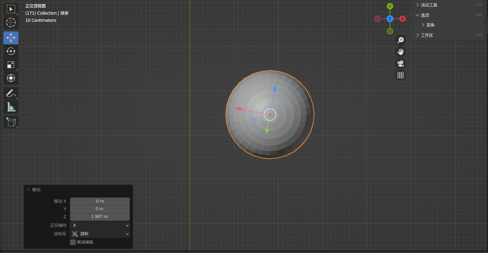
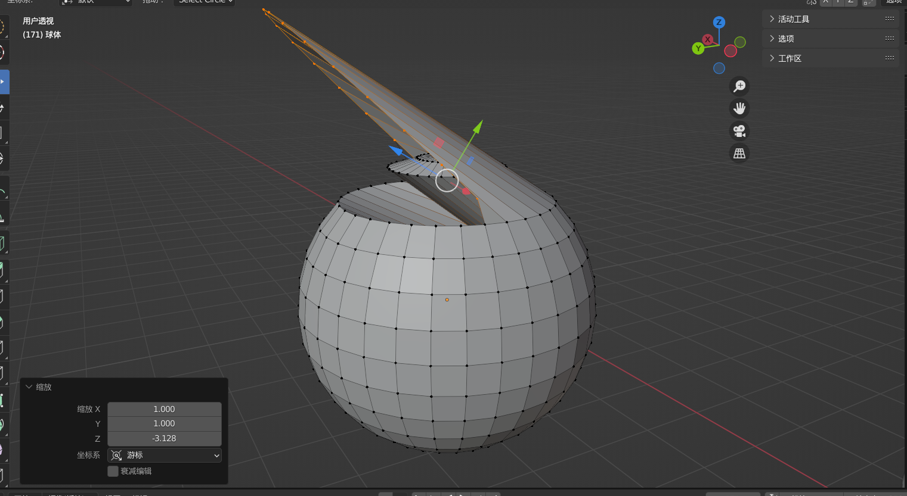
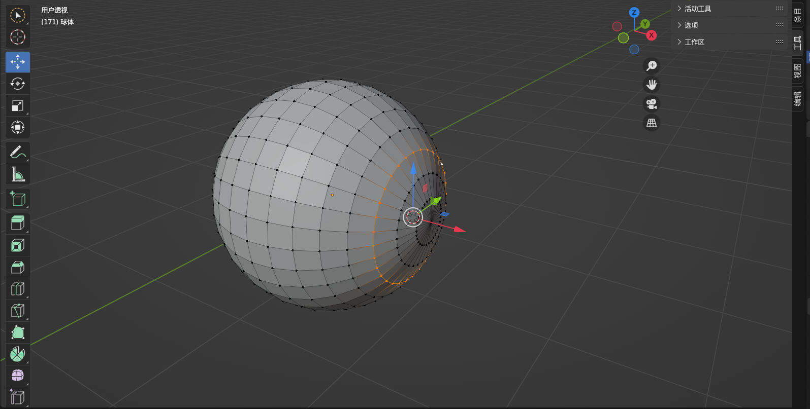
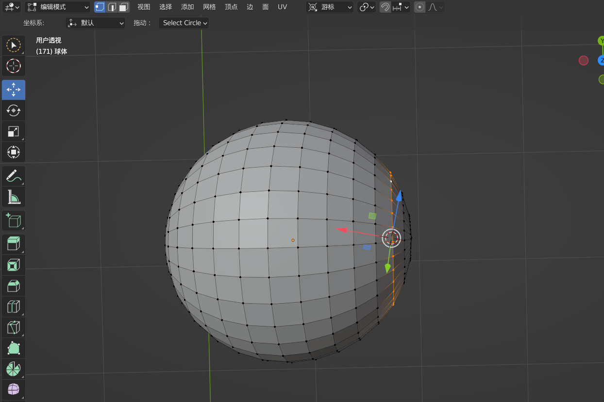
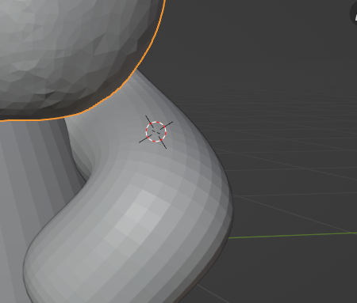
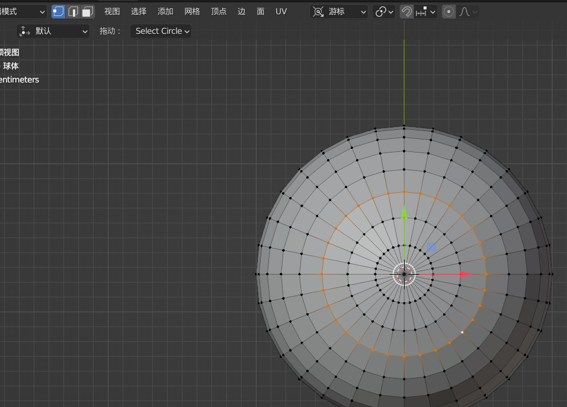

# 问题描述
不知道是不是个BUG, 因为了解不多, 不过好在解决了.
在跟着教程制作眼球时出现的问题, 使用吸附功能将游标吸附到选中项后, 问题还没有出现, 但在将坐标系切换至以游标为基准后, 坐标系指向了一个奇怪的方向:

然后我拽出来的眼球成了这样:

一开始看见它这鸟样我还觉得挺好笑的, 我查查改改半小时之后我彻底笑不出来了.

shiftS把游标对齐到选中项:

然后切换坐标系为游标:

还是没变化...

---

# 原因分析：
每次都进行了shiftS吸附这一步, 我想当然的以为不管3D游标是从世界中心过来还是别处过来, 最终结果都一样, 它都在同一点.
退出文件重进之后从上次保存点可以看到3D游标是在Monster的左手臂而非世界原点:

这时候如果先shiftC重置到世界原点, shiftS后游标坐标系就不会歪;
而直接从手臂这一点shiftS到眼球, 进入游标坐标系会出现偏离:

---

# 解决方案：
从世界原点shiftS吸附和从别处shiftS吸附, 最终结果看起来一样(3D游标都会在同一位置), 但进入游标坐标系会出现偏差.

先将3D游标重置到世界原点再进行吸附可以解决.
